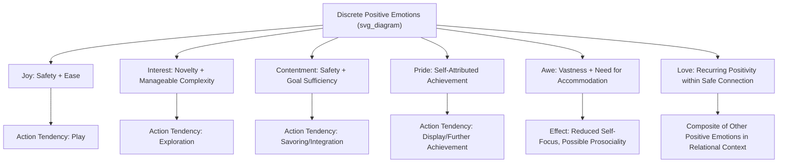

## Discrete Positive Emotions: Joy, Awe, Interest, Contentment, Pride, Love

### Overview

While broaden-and-build theory treats positive emotions as a functional family sharing a common broadening mechanism, discrete emotion research examines each positive emotion as a distinct state with its own eliciting conditions, appraisal patterns, action tendencies, and downstream consequences. This chapter surveys six well-studied discrete positive emotions, drawing primarily on Barbara Fredrickson's taxonomic work alongside broader affective science.

### The Discrete Emotions Approach vs. Dimensional Models

#### Why Study Positive Emotions as Distinct Categories

**Key Points**

- Dimensional models of affect (e.g., simple valence-arousal circumplex models) treat positive emotion as a single continuum varying mainly in intensity and activation level. Discrete emotion theorists argue this obscures functionally important differences — joy and contentment, for instance, share positive valence but differ substantially in arousal level, eliciting context, and associated cognitive-behavioral tendencies.
- [Inference] The discrete-emotions approach is generally considered complementary to, rather than a wholesale replacement for, dimensional models — many researchers use dimensional measures for broad screening purposes while reserving discrete-emotion analysis for more fine-grained theoretical and intervention-design questions.

### Joy

#### Eliciting Conditions and Appraisal Pattern

Joy is typically elicited by conditions of safety combined with a sense of ease or the receipt of unexpected good fortune — appraised as low-effort, low-obstacle circumstances that permit spontaneous, playful engagement.

**Key Points**

- The proposed action tendency associated with joy is an urge toward play, encompassing physical, social, and intellectual/creative play — a broader and less specific tendency than the narrow, targeted action tendencies associated with negative emotions like fear.
- [Inference] Joy is frequently used as something close to a prototype or default example when illustrating broaden-and-build mechanisms generally, given the relatively strong experimental evidence connecting induced joy to broadened attention and increased playful/exploratory behavioral report, though this prototype status is a matter of research convention rather than joy having a uniquely privileged theoretical status among positive emotions.

### Interest

#### Eliciting Conditions and Appraisal Pattern

Interest arises under conditions of novelty combined with a sense of manageable complexity or coping potential — stimuli that are new or uncertain but not so overwhelming as to provoke anxiety instead.

**Key Points**

- The proposed action tendency is exploration: interest motivates approach toward, investigation of, and engagement with the eliciting stimulus, building knowledge and skill over time (the intellectual-resource pathway in broaden-and-build terms).
- Interest is theoretically and empirically connected to intrinsic motivation research within Self-Determination Theory, and to curiosity research in educational and developmental psychology, though these literatures developed with somewhat different theoretical vocabularies and emphases even where they converge on similar underlying phenomena.

### Contentment

#### Eliciting Conditions and Appraisal Pattern

Contentment arises under conditions of safety and goal attainment or sufficiency — a state in which immediate needs are met and no urgent obstacle or opportunity demands active engagement.

**Key Points**

- The proposed action tendency, distinct from joy's playful energy, is a quieter urge toward savoring current circumstances and integrating recent experience into a broader, coherent understanding of self and world — a lower-arousal, more reflective positive state.
- Contentment has featured prominently in undoing-hypothesis research (cardiovascular recovery from stress) precisely because of its lower-arousal profile, which is theoretically well-suited to promoting physiological calming and recovery relative to higher-arousal positive states like joy or excitement.

### Pride

#### Eliciting Conditions and Appraisal Pattern

Pride arises following a self-attributed positive achievement or outcome, particularly one that is appraised as reflecting personal effort, ability, or valued personal qualities.

**Key Points**

- Some researchers distinguish two subtypes: "authentic" pride, linked to attributions of effort and specific behavior, and "hubristic" pride, linked to attributions about global, stable personal qualities or superiority — proposed to have different downstream social and motivational consequences, with authentic pride more consistently associated with prosocial and continued-effort outcomes. [Unverified: the precise boundary and measurement distinctness of authentic versus hubristic pride remains a subject of ongoing psychometric investigation rather than uniformly settled.]
- The proposed action tendency involves sharing or displaying the achievement to others and motivation toward further achievement — a status-relevant, socially-oriented action tendency distinguishing pride from the more solitary or exploratory action tendencies of interest or contentment.

### Awe

#### Eliciting Conditions and Appraisal Pattern

Awe arises in response to stimuli appraised as vast in scale (physically, conceptually, or socially) that require an update or accommodation of one's existing mental frameworks to comprehend — a definition developed influentially by Keltner and Haidt (2003) involving two core appraisal components: perceived vastness and a need for cognitive accommodation.

**Key Points**

- Awe is theoretically distinctive among positive emotions for its association with a proposed "small self" effect — experimentally induced awe has been associated in multiple studies with reduced self-focus and increased feelings of connection to something larger than oneself, with some studies also finding associations with increased prosocial behavior and generosity following awe induction. [Unverified: specific effect sizes for awe-induced prosociality vary across studies and should not be treated as a single fixed, universally replicated magnitude.]
- Awe occupies an ambiguous position relative to the strictly positive-emotion category, since awe experiences can include elements of fear or threat when the vast stimulus is also appraised as potentially dangerous (e.g., a powerful storm), leading some researchers to treat awe as capable of mixed or ambivalent valence depending on the specific eliciting context, rather than as uniformly positively-valenced in all instances. [Inference on the degree to which this ambivalence is the norm versus the exception across awe-eliciting contexts.]

### Love

#### Eliciting Conditions and Appraisal Pattern

Love, in Fredrickson's broaden-and-build taxonomy, is treated somewhat distinctively as a composite or "meta-emotion" arising from the momentary co-occurrence of other positive emotions (such as joy, interest, or contentment) within the specific context of a safe, close relationship, rather than as a single unitary discrete emotion with one specific eliciting appraisal pattern.

**Key Points**

- This treatment differs from broader affective science and evolutionary psychology literatures, which often treat romantic love, parental love, and platonic affection as distinct, evolutionarily separable systems with different underlying neurobiological substrates (e.g., attachment-system versus mating-system distinctions), rather than as variations of a single composite positive-emotion state.
- [Inference] Fredrickson's specific "micro-moments of positivity resonance" framing of love — treating love as recurring brief episodes of shared positive emotion between connected individuals rather than as a single continuous trait-like bond — represents one particular theoretical position within a broader and more varied literature on love, and should not be taken as the singular authoritative definition of love within affective science as a whole.

### Comparative Structure

### Cross-Cutting Empirical Themes

#### Physiological and Neural Correlates

**Key Points**

- Distinct discrete positive emotions have been associated with at least partially distinguishable physiological and neural signatures in various studies (e.g., awe's association with reduced sympathetic arousal in some paradigms despite its high perceptual intensity, contrasted with joy's more straightforward positive-arousal profile), though the field has not achieved full consensus on a complete, non-overlapping physiological "fingerprint" for each discrete positive emotion. [Unverified: the degree of physiological distinctiveness across discrete positive emotions remains an active area of affective neuroscience research with mixed findings across specific measures and paradigms.]

#### Cultural Variation in Discrete Emotion Experience and Expression

**Key Points**

- While basic categories like joy and interest show relatively broad cross-cultural recognition in facial-expression research (itself a debated research tradition, as discussed in the evolutionary-function chapter), the specific eliciting triggers, display norms, and social meanings attached to emotions like pride vary considerably across individualist and collectivist cultural contexts — for example, public individual pride display carries different social valence across different cultural norms regarding self-promotion versus modesty. [Inference on the precise mechanisms underlying this variation, though the existence of substantial cross-cultural variation in display norms is well-documented.]

### Applications: Discrete-Emotion-Targeted Interventions

**Example**

Rather than generically targeting "positive emotion," some interventions are designed around specific discrete emotions matched to a particular goal: awe-based interventions (e.g., guided exposure to vast natural environments, or awe-inducing virtual reality content) have been studied specifically for their proposed small-self and prosociality effects, distinct from a generic joy- or contentment-based intervention that would not be expected to produce the same self-transcendent outcome profile. [Inference: the differential effectiveness of matching specific discrete emotions to specific intervention goals, relative to using any generalized positive-emotion induction, has not been extensively isolated across all discrete-emotion pairings in controlled research.]

### Critiques and Open Questions

**Key Points**

- **Boundary-drawing among discrete categories**: The number and precise boundaries of "distinct" positive emotions vary across theoretical taxonomies — Fredrickson's list of ten positive emotions (including joy, gratitude, serenity/contentment, interest, hope, pride, amusement, inspiration, awe, and love) is one influential taxonomy, but is not the only proposed categorization scheme in affective science, and the degree to which each proposed category represents a genuinely distinct discrete state versus a culturally-labeled variant of a smaller number of underlying dimensions remains debated. [Inference]
- **Love's anomalous theoretical status**: As noted above, treating love as a composite of other positive emotions (Fredrickson's approach) versus as its own distinct evolved system (more common in evolutionary and attachment psychology) represents a genuine unresolved theoretical tension rather than a matter of settled consensus.
- **Awe's mixed-valence complication**: Awe's capacity to co-occur with fear or threat appraisal complicates its straightforward classification as a positive emotion in all contexts, a complication not shared by the other five emotions surveyed in this chapter, which are more consistently positively valenced across their eliciting contexts.

### Conclusion

Discrete positive emotion research reveals that joy, interest, contentment, pride, awe, and love are not interchangeable instances of a single generic "positive affect" but distinct states with characteristic eliciting conditions, appraisal patterns, and action tendencies — playful exploration for joy, information-seeking for interest, savoring integration for contentment, status-relevant display for pride, self-transcendent accommodation for awe, and (on Fredrickson's account) relationally-embedded composite positivity for love. This granularity matters both theoretically, for refining broaden-and-build and evolutionary-functional accounts of positive emotion, and practically, for designing interventions matched to specific desired outcomes rather than relying on a single undifferentiated positive-emotion induction.

**Related Topics**

- Broaden-and-build theory of positive emotions
- The function and evolutionary significance of positive emotions
- Awe research and self-transcendent experiences
- Attachment theory and the psychology of love and bonding
- Authentic versus hubristic pride and status-signaling emotions
- Cross-cultural research on emotional expression and recognition
- Gratitude interventions and savoring practices
- The positivity ratio debate and its critiques