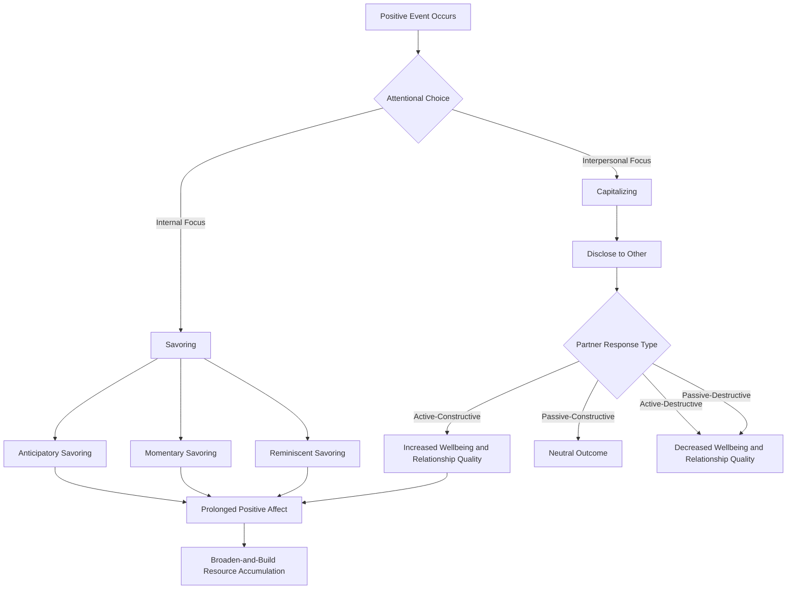

## Savoring and Capitalizing on Positive Experiences

### Definitions

**Savoring** is the capacity to attend to, appreciate, and enhance positive experiences in one's life. Fred Bryant, who developed the primary theoretical model of savoring, defines it as the process through which people generate, intensify, and prolong positive emotion through conscious attention to pleasurable experiences (Bryant & Veroff, 2007).

**Capitalizing** refers to the interpersonal process of sharing positive events with others to extract additional subjective value from them. This construct was developed by Shelly Gable and colleagues and is distinct from savoring in that it is inherently social — it requires disclosure of a positive event to another person and depends on that person's responsiveness (Gable, Reis, Impett, & Asher, 2004).

Both constructs fall under the broader umbrella of positive emotion regulation strategies, as opposed to negative emotion regulation (e.g., coping), which dominated psychological research prior to the positive psychology movement.

---

### Theoretical Foundations

#### Bryant's Savoring Model

Bryant's model conceptualizes savoring along several dimensions:

- **Temporal orientation**: Savoring can occur in three temporal modes:
  - *Anticipation* — savoring a positive event before it occurs
  - *Momentary savoring (being in the moment)* — savoring an experience as it happens
  - *Reminiscence* — savoring a positive experience after it has occurred, through memory
- **Focus of attention**: Savoring can be self-focused, other-focused (sharing joy through a partner's pleasure), or focused on the environment/stimulus itself.

Bryant and Veroff (2007) identified savoring strategies including: sharing with others, memory-building, self-congratulation, comparing, sensory-perceptual sharpening, absorption, behavioral expression, and temporal awareness (recognizing the transience of an experience, which can heighten its perceived value).

#### The Broaden-and-Build Theory Connection

Barbara Fredrickson's broaden-and-build theory (2001) provides the mechanistic backdrop for why savoring matters: positive emotions broaden momentary thought-action repertoires and, over time, build durable psychological, social, and physical resources. Savoring is one deliberate mechanism by which individuals can extend the duration of a positive emotional state, thereby increasing the "dosage" of broadening available to build resources. [Inference] The proposed link between savoring frequency and long-term resource accumulation is theoretically coherent but is difficult to establish causally in longitudinal designs due to confounds with trait positive affect.

#### Gable's Capitalization Model and the Perceived Partner Responsiveness Framework

Gable's research established that how a listener responds to shared good news matters more for relationship and wellbeing outcomes than the fact of disclosure itself. She proposed a 2×2 typology of responses:

| Response Type | Engagement | Valence |
| --- | --- | --- |
| Active-Constructive | High | Positive |
| Passive-Constructive | Low | Positive |
| Active-Destructive | High | Negative |
| Passive-Destructive | Low | Negative |

Active-constructive responding (ACR) — enthusiastic, elaborative engagement with the good news — is associated with increased relationship satisfaction, trust, and intimacy, whereas the other three response types are neutral-to-detrimental (Gable, Reis, Impett, & Asher, 2004; Gable, Gonzaga, & Strachman, 2006).

---

### Mechanisms of Action

**Key Points**

- Savoring works partly by **prolonging attentional engagement** with a positive stimulus, delaying hedonic adaptation.
- Capitalizing works partly through **social validation and meaning-making**: articulating an event verbally can crystallize its significance, and a partner's enthusiastic response provides external confirmation of the event's value.
- Both processes appear to operate, in part, by **counteracting habituation**. Positive affect is subject to hedonic adaptation faster than negative affect in many paradigms [Inference: the relative adaptation rate between positive and negative affect is an active empirical debate and may be domain-specific], so deliberate attentional and social strategies are theorized to slow this decline.
- Neurobiologically, sharing positive news with a responsive other is associated with reward-related neural activation (e.g., ventral striatum) in some fMRI studies, though this evidence base is smaller and less replicated than the behavioral literature. [Unverified] specifics of neural mechanisms should be treated as suggestive rather than established.

---

### Empirical Evidence

- Langston (1994) coined the term "capitalization" and found that sharing positive events with others predicted daily wellbeing above and beyond the effect of the positive event itself.
- Gable et al. (2004) demonstrated in couples that active-constructive responding to a partner's capitalization attempt predicted relationship quality and stability over time, using both self-report and observational (video-coded) methods.
- Quoidbach, Berry, Hansenne, and Mikolajczak (2010) found that savoring strategies were positively associated with happiness, while dampening strategies (the tendency to downplay positive events) were negatively associated with happiness and positively associated with depressive symptoms.
- Bryant (2003) found that a general disposition toward savoring the moment predicted happiness independent of the frequency or intensity of positive events themselves — suggesting the *skill of savoring*, not just event frequency, matters for wellbeing.

---

### Practical Interventions and Techniques

#### Savoring Techniques

1. **Savoring walk** — a structured walk in which the person deliberately notices and lingers on pleasant sensory details.
2. **Positive mental time travel** — deliberately anticipating an upcoming pleasant event in vivid detail.
3. **Memory building** — taking photos, keeping mementos, or writing about positive experiences to support later reminiscence.
4. **Sensory-focused mindfulness** — slowing consumption (e.g., eating) to fully register sensory pleasure.
5. **Temporal awareness / "last time" exercise** — imagining an experience will not recur, which several studies suggest heightens appreciation, though effects can vary by individual and context. [Inference] the intensifying effect of scarcity framing is well-documented in some samples but not universal.

#### Capitalization Techniques

1. **Active-constructive responding training** — explicitly practicing enthusiastic, elaborative, question-asking responses when a partner, friend, or colleague shares good news.
2. **"Three Good Things" with a sharing component** — extending the classic gratitude exercise (Seligman, Steen, Park, & Peterson, 2005) by requiring the good things to be verbally shared with another person, not just journaled privately.
3. **Gratitude and capitalization pairing** — combining expression of gratitude with capitalization when the positive event involves another person's action.

**Example**

A person receives a job offer. Savoring strategies might include pausing to consciously feel the pride and relief before telling anyone (momentary savoring), or replaying the moment of the phone call later that week (reminiscence). Capitalizing would involve calling a close friend to share the news; the friend's response — "That's amazing! Tell me everything, what did they say, how are you feeling?" (active-constructive) versus "Oh nice. Anyway, did you catch the game last night?" (passive-destructive, topic-shifting) — determines much of the incremental wellbeing and relational benefit derived from disclosure.

---

### Distinguishing Savoring from Related Constructs

| Construct | Focus | Social Requirement | Key Researcher(s) |
| --- | --- | --- | --- |
| Savoring | Attention to/enhancement of positive experience | Not required (can be solitary) | Bryant, Veroff |
| Capitalizing | Sharing positive events for interpersonal benefit | Required | Gable |
| Gratitude | Recognition of a benefit received, often attributed to another | Not required | Emmons, McCullough |
| Mindfulness | Present-moment, non-judgmental awareness (valence-neutral) | Not required | Kabat-Zinn |
| Positive rumination | Repetitive focus on positive content | Not required | Related to savoring but can become maladaptive if excessive |

A common conceptual error is treating savoring and mindfulness as interchangeable; mindfulness is valence-neutral (applicable to any experience), whereas savoring is explicitly oriented toward enhancing *positive* affect.

---

### Barriers and Dampening Factors

- **Dampening**: cognitive or behavioral responses that reduce positive affect, such as distraction, fault-finding, or fear that positive events invite negative consequences (e.g., superstitious "jinxing" beliefs). Dampening is negatively correlated with wellbeing and is more common among individuals with elevated depressive symptoms (Feldman, Joormann, & Johnson, 2008).
- **Fear of Positive Emotion (FOPE)**: some individuals, particularly those with certain anxiety or mood profiles, report deliberately suppressing positive emotion due to beliefs it will be short-lived or lead to disappointment. [Inference] this construct's clinical relevance is still being actively researched and may not generalize across cultural contexts.
- **Cultural variation**: some collectivist cultural contexts show more muted savoring of individual achievement in favor of relational or communal framing; cross-cultural savoring research is comparatively thin, so claims here should be treated cautiously. [Unverified]

---

### Process Flow Diagram

---

### Conceptual Diagram (SVG)

<svg xmlns="http://www.w3.org/2000/svg" viewBox="0 0 640 300" font-family="sans-serif">
<text x="320" y="24" text-anchor="middle" font-size="16" font-weight="bold">Savoring vs. Capitalizing Pathways (svg_diagram)</text>
<rect x="20" y="60" width="180" height="50" rx="8" fill="#FDE9C8" stroke="#B8860B" />
<text x="110" y="90" text-anchor="middle" font-size="13">Positive Event</text>
<line x1="200" y1="85" x2="260" y2="55" stroke="#555" stroke-width="1.5" />
<line x1="200" y1="85" x2="260" y2="115" stroke="#555" stroke-width="1.5" />
<rect x="260" y="20" width="180" height="50" rx="8" fill="#D6EAF8" stroke="#2E86C1" />
<text x="350" y="50" text-anchor="middle" font-size="13">Savoring (internal)</text>
<rect x="260" y="100" width="180" height="50" rx="8" fill="#D5F5E3" stroke="#28B463" />
<text x="350" y="130" text-anchor="middle" font-size="13">Capitalizing (social)</text>
<line x1="440" y1="45" x2="500" y2="80" stroke="#555" stroke-width="1.5" />
<line x1="440" y1="125" x2="500" y2="90" stroke="#555" stroke-width="1.5" />
<rect x="500" y="60" width="120" height="50" rx="8" fill="#F9E79F" stroke="#B7950B" />
<text x="560" y="90" text-anchor="middle" font-size="12">Prolonged Positive Affect</text>
<line x1="560" y1="110" x2="560" y2="150" stroke="#555" stroke-width="1.5" />
<rect x="470" y="150" width="180" height="50" rx="8" fill="#F5CBA7" stroke="#AF601A" />
<text x="560" y="180" text-anchor="middle" font-size="12">Resource Building</text>
</svg>

---

### Assessment Instruments

- **Savoring Beliefs Inventory (SBI)** (Bryant, 2003) — measures perceived capacity to savor across anticipating, savoring the moment, and reminiscing.
- **Ways of Savoring Checklist (WOSC)** (Bryant & Veroff, 2007) — measures specific savoring strategies used in response to a positive event.
- **Responses to Positive Affect Questionnaire (RPA)** (Feldman, Joormann, & Johnson, 2008) — includes subscales for self-focused positive rumination, dampening, and emotion-focused engagement.
- **Capitalization Attempts and Responses measures** — typically study-specific coded interaction paradigms or self-report scales assessing perceived partner responsiveness following disclosure of a positive event (based on Gable et al., 2004 methodology).

---

### Applications

- **Clinical**: Savoring-based interventions have been incorporated into positive psychotherapy and are being explored as adjuncts for anhedonia in depression, given that reduced capacity to savor is a documented feature of some depressive presentations.
- **Organizational**: Encouraging active-constructive responding among managers and teams when colleagues share achievements, as a low-cost way to strengthen workplace relational quality.
- **Couples/Relationship interventions**: ACR training is used in some couples therapy modalities as a supplement to conflict-resolution-focused approaches, based on the premise that relationship quality is built as much through shared positive moments as through resolved negative ones (Gable & Gosnell, 2011).
- **Educational settings**: Brief savoring exercises (e.g., end-of-day reflection on a positive moment) have been used in school-based wellbeing curricula, generally as one component within broader programs rather than as standalone interventions.

---

### Common Misconceptions

- Savoring is not the same as simple enjoyment; it requires *metacognitive awareness* of the positive experience and deliberate attentional engagement.
- Capitalizing is not merely "bragging" — the interpersonal-process literature frames it as a relationship-building behavior, distinct from self-presentation motives, though the two can co-occur.
- More savoring is not unconditionally better — excessive or compulsive savoring/reminiscence of past positive events can, in some cases, function similarly to positive rumination and may correlate with reduced present-moment engagement. [Inference] the boundary between adaptive savoring and maladaptive positive rumination is not sharply defined in the current literature.

---

**Related Topics**

- Broaden-and-build theory of positive emotions (Fredrickson)
- Hedonic adaptation and the hedonic treadmill
- Gratitude interventions and journaling
- Active-constructive responding training protocols
- Positive rumination vs. adaptive savoring
- Perceived partner responsiveness in close relationships
- Fear of positive emotion / affect phobia
- Mindfulness-based positive psychology interventions