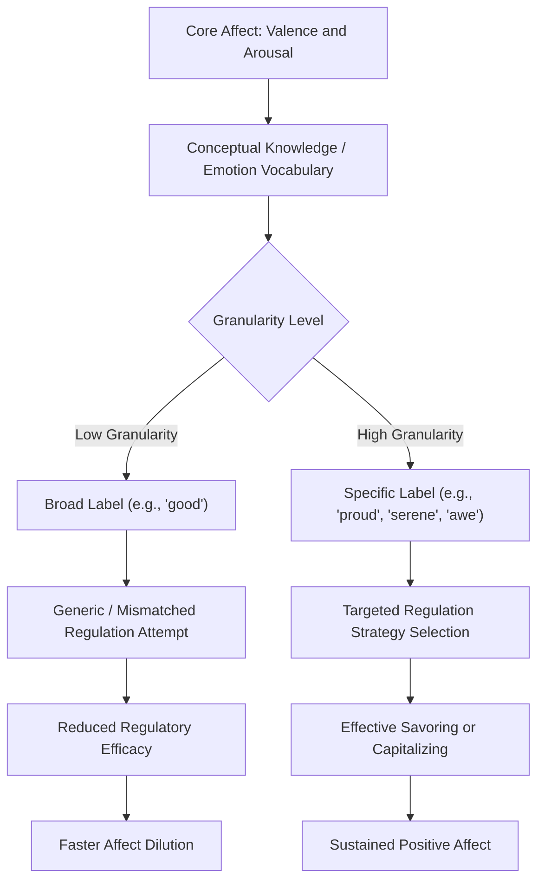

## Emotional Granularity and the Regulation of Positive Affect

### Definitions

**Emotional granularity** (also termed *emotion differentiation*) refers to the capacity to construct and identify one's emotional experiences with a high degree of precision and specificity, rather than in broad, undifferentiated categories (Barrett, 2004; Barrett, Gross, Christensen, & Benvenuto, 2001). A person high in granularity might distinguish between feeling "content," "relieved," "proud," and "serene" as distinct positive states; a person low in granularity may label all of these simply as "good" or "happy."

Granularity is typically operationalized and measured separately for negative emotions (**negative emotion differentiation**, NED) and positive emotions (**positive emotion differentiation**, PED), as the two do not always correlate strongly within individuals.

**Regulation of positive affect** refers to the cognitive and behavioral processes used to initiate, maintain, enhance, or dampen positive emotional states — overlapping conceptually with savoring and dampening constructs but framed here through the broader lens of emotion regulation theory (Gross, 1998).

---

### Theoretical Background

#### Constructionist Theory of Emotion

Granularity is closely tied to Lisa Feldman Barrett's theory of constructed emotion, which holds that discrete emotion categories are not hardwired but are constructed from core affect (a continuous space of valence and arousal) via conceptual knowledge. Under this framework, granularity reflects the richness of an individual's emotion concept repertoire and their skill at applying it to interoceptive and contextual information. [Inference] The constructionist account of emotion is one of several competing theoretical frameworks in affective science (alongside basic emotion theory); granularity findings are broadly compatible with multiple frameworks even though the theoretical language above draws specifically from constructionism.

#### The Affect-as-Information and Regulatory Flexibility Perspectives

Higher granularity is theorized to support better emotion regulation via two mechanisms:

1. **Diagnostic precision** — a specific label (e.g., "disappointed" rather than "bad") provides more actionable information about the situational cause, enabling a more targeted regulation strategy.
2. **Regulatory flexibility** — differentiated positive states may afford access to a wider repertoire of amplification strategies (e.g., knowing that "pride" responds well to self-congratulatory savoring, while "relief" responds well to reflection on the resolved threat).

---

### Measurement

#### Experience Sampling Method (ESM) Approach

Granularity is most commonly measured using ESM/ecological momentary assessment (EMA):

- Participants rate the extent to which they feel a set of discrete emotion words (e.g., happy, proud, relaxed, excited, content) multiple times per day over 1–4 weeks.
- **Intraclass correlation (ICC)** is computed across the discrete positive emotion ratings within each person, across all sampled timepoints.
- Granularity score is derived as $1 - ICC$, or in earlier work, as the average pairwise within-person correlation across emotion terms.
- A *lower* average correlation among emotion ratings indicates *higher* granularity (i.e., the emotions are varying somewhat independently rather than moving in lockstep, indicating differentiated experience).

$$\text{Granularity}_i = 1 - ICC_i$$

where $ICC_i$ is the intraclass correlation for participant $i$'s discrete emotion ratings across all sampling occasions.

[Inference] Some methodological critiques (e.g., Erbas, Ceulemans, Lee, Ceulemans, & Kuppens, 2014) argue that ICC-based granularity indices can be confounded with mean emotion intensity and variability, so subsequent studies have used multilevel modeling approaches designed to statistically separate granularity from these confounds; findings using older vs. newer indices are not always directly comparable.

#### Other Methods

- **Free-response labeling tasks** in lab settings, coded for specificity.
- **Emotion vocabulary/word-sorting tasks**.
- **Semantic differential ratings** correlated across positive-emotion adjectives.

---

### Empirical Findings

- Barrett et al. (2001) found that individuals higher in negative emotion granularity showed more differentiated neuroendocrine and behavioral coping responses to stress.
- Tugade, Fredrickson, and Barrett (2004) linked emotional granularity to resilience: people who could distinguish among negative emotional states more precisely, and who could also experience positive and negative emotions simultaneously (emotional complexity), recovered from stress more effectively — connecting granularity to the broader resilience literature.
- Kashdan, Barrett, and McKnight (2015) proposed and reviewed evidence that low granularity is associated with poorer emotion regulation, greater alcohol consumption in response to negative affect, and increased psychopathology risk, framing granularity as a form of "psychological flexibility" precursor.
- Research specifically on **positive** emotion differentiation is comparatively newer and smaller in volume than negative emotion differentiation research. Some studies (e.g., Starr, Hershenberg, Shaw, Li, & Santee, 2020, in adolescent samples) suggest positive emotion differentiation may buffer against depressive symptoms independently of negative emotion differentiation. [Unverified] the relative independence and unique predictive value of PED versus NED is still being clarified across different samples and age groups, and effect sizes reported vary across studies.

---

### Mechanisms Linking Granularity to Positive Affect Regulation

**Key Points**

- **Precision enables targeted savoring**: identifying a state as "awe" rather than generic "happiness" cues a different set of savoring behaviors (e.g., absorption, perspective-taking) than identifying a state as "amusement" (which might cue sharing/laughter-based behaviors).
- **Reduced misregulation**: vague positive-affect labeling may lead to regulation strategies mismatched to the actual underlying state or its cause, reducing regulatory efficacy.
- **Supports capitalization quality**: more differentiated emotional language likely allows for richer disclosure during capitalizing interactions (see companion topic on capitalizing on positive experiences), potentially eliciting more attuned active-constructive responses from listeners. [Inference] this specific link between granularity and capitalization quality is a plausible extension of the granularity literature rather than a directly tested finding in the reviewed sources.
- **Buffering against affect dilution**: some theorists propose that undifferentiated positive affect ("everything is just 'good'") is more susceptible to hedonic adaptation because it lacks the specificity needed to sustain distinct appraisal-based engagement.

---

### Interventions to Build Granularity

1. **Expanding emotion vocabulary** — structured exercises (e.g., "emotion wheel" tools) that introduce and practice discriminating among a wider range of positive-affect terms (serene, elated, gratified, invigorated, tender, etc.).
2. **Labeling practice via journaling** — prompting individuals to identify the most precise word for a positive experience rather than defaulting to "good" or "happy," sometimes paired with contextual detail (what preceded it, bodily sensations).
3. **Mindfulness-based interoceptive training** — improving the ability to notice bodily/affective signals is theorized to be a precursor to more precise labeling, since granularity depends partly on interoceptive input.
4. **Psychoeducation on the constructionist model** — teaching that emotions are constructed (not simply "detected") can itself increase people's willingness to differentiate and construct more specific categories.
5. **App/ESM-based self-monitoring** — repeated self-report using differentiated emotion scales has been used both as a measurement tool and, in some designs, as an intervention component, since repeated practice with fine-grained labeling may itself increase granularity over time. [Inference] Whether self-monitoring functions as a genuine skill-building intervention versus simply better capturing an already stable trait is not fully resolved in the literature.

**Example**

Two individuals report feeling "great" after a successful work presentation.

- Individual A (low granularity): labels the feeling as "happy" and moves on; the feeling fades within the hour with no clear behavioral follow-through.
- Individual B (high granularity): identifies the feeling more specifically as "proud" (self-focused, related to competence) intermixed with "relieved" (related to the resolved threat of public speaking anxiety). Because the labels are specific, Individual B engages in targeted responses: savoring pride through brief self-acknowledgment, and processing relief by reflecting on preparation strategies that worked — extending and better utilizing the positive affect episode.

---

### Granularity Assessment and Regulation Pathway

---

### Granularity Spectrum Diagram (SVG)

<svg xmlns="http://www.w3.org/2000/svg" viewBox="0 0 640 220" font-family="sans-serif">
<text x="320" y="24" text-anchor="middle" font-size="16" font-weight="bold">Emotional Granularity Spectrum (svg_diagram)</text>
<line x1="60" y1="120" x2="580" y2="120" stroke="#888" stroke-width="2" />
<polygon points="580,120 570,114 570,126" fill="#888" />
<circle cx="100" cy="120" r="8" fill="#E74C3C" />
<text x="100" y="150" text-anchor="middle" font-size="12">"Good"</text>
<text x="100" y="90" text-anchor="middle" font-size="11" fill="#555">Low Granularity</text>
<circle cx="260" cy="120" r="8" fill="#F39C12" />
<text x="260" y="150" text-anchor="middle" font-size="12">"Happy"</text>
<circle cx="420" cy="120" r="8" fill="#27AE60" />
<text x="420" y="150" text-anchor="middle" font-size="12">"Proud" / "Content"</text>
<circle cx="560" cy="120" r="8" fill="#1F618D" />
<text x="560" y="150" text-anchor="middle" font-size="12">"Serene, Grateful, Awed"</text>
<text x="560" y="90" text-anchor="middle" font-size="11" fill="#555">High Granularity</text>
</svg>

---

### Individual Differences and Moderators

- **Alexithymia** (difficulty identifying and describing emotions) is associated with markedly reduced granularity and is studied as a clinically relevant extreme of low differentiation.
- **Age and development**: emotional granularity tends to increase from childhood through adulthood as emotion vocabulary and conceptual knowledge develop, though findings on trajectories in older adulthood are mixed. [Unverified] direction of change in very late adulthood.
- **Culture and language**: languages vary in the granularity of their emotion lexicons (e.g., some languages have single words for blended or culturally specific positive states without direct English equivalents, such as the German *Gemütlichkeit* or Portuguese *saudade*-adjacent constructs), which may influence measured granularity in cross-cultural comparisons; this is an area with a comparatively small direct evidence base. [Speculation] the causal direction (language shaping granularity vs. granularity shaping language use) is unresolved and likely bidirectional.
- **Psychopathology**: reduced granularity (both positive and negative) has been associated with depression and anxiety in various studies, consistent with broader emotion-regulation-deficit models of psychopathology.

---

### Distinguishing Granularity from Related Constructs

| Construct | Definition | Relationship to Granularity |
| --- | --- | --- |
| Emotional intelligence | Broad ability to perceive, use, understand, and manage emotions | Granularity is a plausible sub-component of the "understanding emotions" branch |
| Alexithymia | Marked difficulty identifying/describing emotions | Represents the low extreme of the granularity continuum |
| Emotional complexity | Capacity to experience positive and negative emotions simultaneously (poignancy) | Related but conceptually distinct; complexity concerns co-occurrence, granularity concerns differentiation |
| Interoceptive awareness | Sensitivity to internal bodily states | Theorized precursor/input to granularity, not equivalent to it |

---

### Applications

- **Clinical practice**: Emotion-focused and dialectical behavior therapies incorporate emotion labeling and vocabulary-building exercises consistent with granularity-enhancement goals, particularly for affect regulation difficulties.
- **Workplace wellbeing programs**: Some programs incorporate emotion-vocabulary tools (e.g., emotion wheels) into check-in practices to support more precise self-report and, in principle, better-targeted self-regulation.
- **Positive psychology coaching**: Practitioners may use granularity-building exercises as a complement to savoring interventions, on the premise that precise labeling improves the effectiveness of subsequent savoring strategies.

---

**Related Topics**

- Savoring and capitalizing on positive experiences
- Barrett's constructionist theory of emotion
- Broaden-and-build theory and emotional complexity
- Alexithymia and emotion regulation deficits
- Experience sampling methodology in affective science
- Interoceptive awareness training
- Emotion regulation strategies (reappraisal, suppression, acceptance)