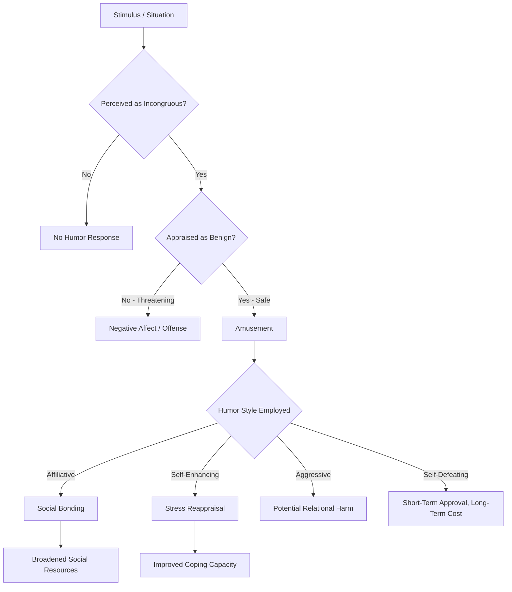

## Humor, Playfulness, and Positive Emotion

### Definitions

**Humor** is a multidimensional construct broadly defined as the cognitive-affective process of perceiving, creating, or appreciating incongruity in a manner that elicits amusement, often accompanied by laughter. Within positive psychology, humor is classified as a character strength under the virtue of *transcendence* in the VIA (Values in Action) Classification (Peterson & Seligman, 2004).

**Playfulness** is a broader dispositional or state-based tendency to approach situations in a lighthearted, spontaneous, and non-serious manner, characterized by a willingness to reframe ordinary contexts in imaginative or unconventional ways (Proyer, 2017). Playfulness need not involve humor or laughter and can manifest in problem-solving, social interaction, or solitary activity.

Both constructs are studied as generators and correlates of positive emotion, distinct from, but overlapping with, the discrete emotion of **amusement** (one of Fredrickson's ten forms of positive emotion in the broaden-and-build framework).

---

### Theoretical Frameworks

#### Incongruity-Resolution Theory

The dominant cognitive theory of humor holds that amusement arises from the perception of an incongruity (a violation of expectation) followed by cognitive resolution of that incongruity in a way that is interpreted as non-threatening (Suls, 1972). Humor that presents incongruity without resolution, or with a resolution perceived as threatening, tends not to produce amusement.

#### Benign Violation Theory

McGraw and Warren (2010) proposed that humor occurs at the intersection of a situation being simultaneously appraised as a **violation** (of norms, expectations, or wellbeing) and **benign** (safe, non-threatening). This theory accounts for individual and contextual variability in what is found funny — the same violation can be benign for one observer and threatening (hence unfunny) for another, depending on psychological distance, relevant norms, and context.

$$\text{Humor Response} = f(\text{Violation Appraisal} \cap \text{Benign Appraisal})$$

#### Character Strengths Framework (VIA)

Within Peterson and Seligman's classification, humor/playfulness is defined as encompassing liking to laugh and tease, bringing smiles to other people, and seeing the light side of situations. It is grouped under transcendence alongside appreciation of beauty, gratitude, hope, and spirituality — strengths that connect the individual to something larger than the self.

#### Structural Models of Playfulness

Proyer's (2017) OLIVER model identifies four adult playfulness facets:

- **Other-directed playfulness**: using play to initiate/foster social relationships (e.g., teasing, pranking benignly).
- **Lighthearted playfulness**: a spontaneous, carefree, improvisational orientation to life.
- **Intellectual playfulness**: enjoyment of playing with ideas and complex problems for their own sake.
- **Whimsical playfulness**: interest in and curiosity about unusual, strange, or "odd" aspects of the world.

---

### Humor Styles Model

Martin, Puhlik-Doris, Larsen, Gray, and Weir (2003) proposed the Humor Styles Questionnaire (HSQ), distinguishing four humor styles along two orthogonal dimensions (adaptive/maladaptive × self/other-directed):

| Style | Direction | Function | Wellbeing Association |
| --- | --- | --- | --- |
| Affiliative | Other-directed | Building relationships, reducing tension benignly | Positive |
| Self-enhancing | Self-directed | Maintaining a humorous outlook on adversity | Positive |
| Aggressive | Other-directed | Disparaging or manipulating others through humor | Negative |
| Self-defeating | Self-directed | Excessive self-disparagement to gain approval | Negative |

Affiliative and self-enhancing styles show consistent positive associations with wellbeing, relationship satisfaction, and resilience, whereas aggressive and self-defeating styles are associated with poorer wellbeing outcomes and, in some studies, with greater interpersonal conflict or depressive symptoms (Martin et al., 2003; Kuiper, 2012).

---

### Mechanisms Linking Humor/Playfulness to Positive Emotion

**Key Points**

- **Direct elicitation of amusement**: humor is among the most reliable experimental inductors of positive affect in laboratory mood-induction paradigms.
- **Broaden-and-build contribution**: amusement, as a discrete positive emotion, is proposed by Fredrickson to broaden thought-action repertoires (e.g., toward playful, exploratory, socially affiliative action tendencies) and build resources (social bonds, creative capacity) over time.
- **Cognitive reappraisal function**: self-enhancing humor operates as an emotion regulation strategy, allowing reframing of stressors in a less threatening light — functioning similarly to positive cognitive reappraisal.
- **Social bonding**: shared laughter is associated with endorphin release in some experimental paradigms (Dunbar et al., 2012) and is theorized to strengthen affiliative bonds, partly via synchronized positive affect experienced in groups.
- **Physiological correlates**: laughter has been associated with transient changes in cardiovascular and immune markers in some studies, though effect sizes are often small and mechanisms are not fully established. [Unverified] causal, dose-response relationships between laughter and specific health outcomes remain an active and contested research area; claims of strong direct health benefits from humor should be treated cautiously.

---

### Empirical Evidence

- Proyer, Ruch, and colleagues (Proyer, 2013; Proyer & Ruch, 2011) found that trait playfulness in adults correlates positively with life satisfaction, positive affect, and the ability to reframe stressors, and negatively with boredom proneness.
- Kuiper (2012) reviewed evidence that self-enhancing and affiliative humor styles are associated with better stress-buffering and coping outcomes, while aggressive and self-defeating styles show weaker or reversed associations.
- Ruch and colleagues have found that humor (as a character strength) shows a moderate positive correlation with life satisfaction across VIA studies, though it is generally not among the strengths most strongly correlated with life satisfaction (that position is usually held by hope, zest, gratitude, and love, per Park, Peterson, & Seligman, 2004).
- Proyer, Gander, Wellenzohn, and Ruch (2014) tested a playfulness-based intervention and found modest short-term increases in life satisfaction and decreases in depressive symptoms among participants who engaged in playfulness-boosting exercises, relative to controls. [Inference] as with many single-study positive psychology intervention findings, replication and long-term follow-up data are more limited than for larger, more established interventions like gratitude journaling.

---

### Interventions and Practical Applications

1. **Three Funny Things exercise** — a humor-focused parallel to the "Three Good Things" gratitude exercise; participants record three humorous or amusing events from their day.
2. **Playful reframing practice** — deliberately generating alternative, lighthearted interpretations of mundane or mildly stressful situations.
3. **Humor Styles Questionnaire feedback and coaching** — used in coaching/therapy contexts to help clients shift from maladaptive (aggressive/self-defeating) toward adaptive (affiliative/self-enhancing) humor use.
4. **Structured play interventions** — scheduling unstructured, non-goal-directed play activities, drawing on the OLIVER playfulness dimensions, particularly for adults who report low trait playfulness.
5. **Improvisation (improv) training** — used in some organizational and clinical settings to build spontaneity, other-directed playfulness, and tolerance for uncertainty; evidence base is smaller and more applied/qualitative than for structured self-report interventions. [Unverified] rigorous RCT evidence specifically isolating improv training's effect on wellbeing outcomes is limited.

**Example**

An employee facing a stalled project might apply *self-enhancing humor* by privately reframing the situation ("Well, at least my error rate for this project can only go down from here") — reducing the threat appraisal without denying the problem. In a team meeting, the same employee might use *affiliative humor* ("Looks like we've officially invented a new failure mode — someone give it a name") to diffuse group tension and reinforce cohesion, provided the humor does not target or disparage a specific team member (which would shift it toward aggressive humor).

---

### Humor Appraisal Process Flow

---

### Humor Styles Quadrant (SVG)

<svg xmlns="http://www.w3.org/2000/svg" viewBox="0 0 500 420" font-family="sans-serif">
<text x="250" y="24" text-anchor="middle" font-size="16" font-weight="bold">Humor Styles Model (svg_diagram)</text>
<line x1="250" y1="50" x2="250" y2="390" stroke="#888" stroke-width="1.5" />
<line x1="60" y1="220" x2="440" y2="220" stroke="#888" stroke-width="1.5" />

<text x="250" y="45" text-anchor="middle" font-size="11" fill="#555">Other-Directed</text>

<text x="250" y="405" text-anchor="middle" font-size="11" fill="#555">Self-Directed</text>

<text x="55" y="215" text-anchor="end" font-size="11" fill="#555">Maladaptive</text>

<text x="445" y="215" text-anchor="start" font-size="11" fill="#555">Adaptive</text>

<rect x="260" y="60" width="170" height="150" rx="6" fill="#D5F5E3" stroke="#28B463" />
<text x="345" y="140" text-anchor="middle" font-size="13" font-weight="bold">Affiliative</text>
<text x="345" y="160" text-anchor="middle" font-size="10">Builds relationships</text>
<rect x="70" y="60" width="170" height="150" rx="6" fill="#FADBD8" stroke="#C0392B" />
<text x="155" y="140" text-anchor="middle" font-size="13" font-weight="bold">Aggressive</text>
<text x="155" y="160" text-anchor="middle" font-size="10">Disparages others</text>
<rect x="260" y="230" width="170" height="150" rx="6" fill="#D5F5E3" stroke="#28B463" />
<text x="345" y="310" text-anchor="middle" font-size="13" font-weight="bold">Self-Enhancing</text>
<text x="345" y="330" text-anchor="middle" font-size="10">Adaptive reframing</text>
<rect x="70" y="230" width="170" height="150" rx="6" fill="#FADBD8" stroke="#C0392B" />
<text x="155" y="310" text-anchor="middle" font-size="13" font-weight="bold">Self-Defeating</text>
<text x="155" y="330" text-anchor="middle" font-size="10">Excessive self-disparagement</text>
</svg>

---

### Individual and Contextual Moderators

- **Age**: playfulness is often assumed to decline with age, but Proyer's research indicates substantial individual variation, with many adults retaining high trait playfulness; playfulness in adulthood is increasingly studied as a stable personality-adjacent trait rather than a strictly childhood phenomenon.
- **Culture**: appraisal of what counts as a "benign violation" is culturally and contextually variable; humor that is affiliative in one cultural context may be appraised as an aggressive violation in another. Cross-cultural humor research remains comparatively limited relative to Western samples. [Unverified] generalizability across non-WEIRD (Western, Educated, Industrialized, Rich, Democratic) populations.
- **Relationship closeness**: psychological distance moderates benign violation appraisal — jokes about sensitive topics are more likely to be appraised as benign among close relational partners than strangers.
- **Clinical considerations**: excessive reliance on self-defeating humor is studied as a risk marker in some populations and should not be encouraged as a coping strategy in therapeutic contexts; practitioners typically aim to shift clients toward self-enhancing rather than self-defeating humor.

---

### Distinguishing Related Constructs

| Construct | Core Feature | Overlap with Humor/Playfulness |
| --- | --- | --- |
| Amusement | Discrete positive emotion | Typical outcome of successful humor appreciation |
| Wit | Cognitive ability to generate clever, humorous responses | A skill/ability component sometimes subsumed under humor as character strength |
| Playfulness | Broad dispositional orientation to non-seriousness | Can occur without humor or laughter (e.g., intellectual play) |
| Zest | Approaching life with energy and enthusiasm | Distinct VIA strength; can co-occur with playfulness but is not synonymous |

---

**Related Topics**

- Broaden-and-build theory and the ten forms of positive emotion
- VIA Classification of character strengths (transcendence virtues)
- Savoring and capitalizing on positive experiences
- Emotion regulation via cognitive reappraisal
- Social bonding and positive emotional contagion
- Playfulness interventions in organizational settings
- Cross-cultural variation in humor appraisal