## The VIA Classification of 24 Character Strengths and Six Virtues

### Definitions

The **VIA Classification** (Values in Action Classification of Strengths) is a taxonomy of positive character traits developed by Christopher Peterson and Martin Seligman (2004) as a positive-psychology counterpart to diagnostic classification systems such as the DSM. It organizes **24 character strengths** into **6 broader virtues**, intended to represent psychological ingredients that define a "good person" across cultures and historical periods.

A **character strength** is defined as a positive trait reflected in thoughts, feelings, and behaviors that is morally valued in its own right (not merely instrumentally), and whose expression does not diminish other people.

A **virtue** is a broader, more abstract core characteristic valued by moral philosophers and religious thinkers, under which multiple related strengths are grouped. Virtues are considered the higher-order organizing categories; strengths are the measurable, psychologically distinct routes to displaying a virtue.

---

### Historical and Methodological Background

Peterson and Seligman derived the classification through an extensive review of virtue concepts across major religious and philosophical traditions (including Confucianism, Buddhism, Hinduism, ancient Greek philosophy, Judeo-Christian thought, and Islam), seeking traits with broad cross-cultural and historical endorsement. This project, funded initially by the Mayerson Foundation and later associated with the VIA Institute on Character, was explicitly framed as the positive-psychology analogue to the DSM, sometimes informally referred to as the "un-DSM" or "Manual of the Sanities."

Peterson and Seligman proposed **ten criteria** for a candidate trait to qualify as a character strength, including:

1. Contributes to fulfillment and the good life
2. Morally valued in its own right
3. Does not diminish others when displayed
4. Has a contrasting "opposite" (a corresponding character weakness)
5. Is trait-like (relatively stable across time and situations)
6. Is distinct from other strengths in the classification
7. Is embodied in consensually recognized paragons
8. Has recognized child prodigies
9. May have selective absence (some individuals conspicuously lack it)
10. Is supported by societal institutions and rituals that cultivate it

[Inference] Not every one of the 24 strengths satisfies all ten criteria equally well; the criteria functioned more as a guiding heuristic during classification development than as a strict inclusion test applied uniformly.

---

### The Six Virtues and Twenty-Four Strengths

| Virtue | Definition (Core Theme) | Associated Strengths |
| --- | --- | --- |
| **Wisdom and Knowledge** | Cognitive strengths involving the acquisition and use of knowledge | Creativity, Curiosity, Judgment (Critical Thinking), Love of Learning, Perspective |
| **Courage** | Emotional strengths involving exercise of will to accomplish goals in the face of opposition | Bravery, Perseverance, Honesty, Zest |
| **Humanity** | Interpersonal strengths involving tending and befriending others | Love, Kindness, Social Intelligence |
| **Justice** | Civic strengths underlying healthy community life | Teamwork, Fairness, Leadership |
| **Temperance** | Strengths that protect against excess | Forgiveness, Humility, Prudence, Self-Regulation |
| **Transcendence** | Strengths that forge connections to the larger universe and provide meaning | Appreciation of Beauty and Excellence, Gratitude, Hope, Humor, Spirituality |

Note the count: 5 + 4 + 3 + 3 + 4 + 5 = 24 strengths across 6 virtues.

---

### Definitions of Each Strength

**Wisdom and Knowledge**

- *Creativity*: thinking of novel and productive ways to conceptualize and do things.
- *Curiosity*: taking an interest in ongoing experience for its own sake; exploration and openness to novelty.
- *Judgment (Critical Thinking)*: thinking things through and examining them from all sides; not jumping to conclusions.
- *Love of Learning*: mastering new skills, topics, and bodies of knowledge, whether independently or formally.
- *Perspective (Wisdom)*: being able to provide wise counsel to others; having ways of looking at the world that make sense to oneself and others.

**Courage**

- *Bravery*: not shrinking from threat, challenge, difficulty, or pain; acting on convictions even when unpopular.
- *Perseverance*: finishing what one starts; persisting in a course of action despite obstacles.
- *Honesty*: speaking the truth and presenting oneself in a genuine, authentic way; taking responsibility for one's feelings and actions.
- *Zest*: approaching life with excitement and energy; not doing things halfway or halfheartedly.

**Humanity**

- *Love*: valuing close relations with others, particularly those involving mutual sharing and caring.
- *Kindness*: doing favors and good deeds for others; helping and taking care of them.
- *Social Intelligence*: being aware of the motives and feelings of oneself and others; knowing what makes other people tick.

**Justice**

- *Teamwork (Citizenship)*: working well as a member of a group or team; being loyal to the group.
- *Fairness*: treating all people according to notions of fairness and justice; not letting personal feelings bias decisions about others.
- *Leadership*: encouraging a group of which one is a member to get things done, while maintaining good relations within the group.

**Temperance**

- *Forgiveness*: forgiving those who have done wrong; accepting others' shortcomings; giving people a second chance.
- *Humility*: letting one's accomplishments speak for themselves; not regarding oneself as more special than one is.
- *Prudence*: being careful about one's choices; not taking undue risks; not saying or doing things that might later be regretted.
- *Self-Regulation*: regulating what one feels and does; being disciplined; controlling one's appetites and emotions.

**Transcendence**

- *Appreciation of Beauty and Excellence*: noticing and appreciating beauty, excellence, and/or skilled performance in various domains of life.
- *Gratitude*: being aware of and thankful for good things that happen; taking time to express thanks.
- *Hope*: expecting the best in the future and working to achieve it; believing that a good future is something that can be brought about.
- *Humor*: liking to laugh and tease; bringing smiles to other people; seeing the light side.
- *Spirituality*: having coherent beliefs about the higher purpose and meaning of the universe; knowing where one fits within the larger scheme.

---

### Measurement Instruments

- **VIA Inventory of Strengths (VIA-IS)**: the primary self-report instrument, originally 240 items (10 per strength) on a 5-point Likert scale; shorter forms (e.g., VIA-72, VIA-96) have since been developed and validated.
- **VIA Youth Survey**: adapted version for adolescents aged 10–17.
- **VIA-Structured Interview** and **peer-report/informant versions**: used in some research to reduce reliance on single-method self-report data and address common-method bias concerns.
- **Signature Strengths**: typically operationalized as an individual's top 5 (sometimes top 3–7 depending on study) highest-ranked strengths on the VIA-IS, theorized to be strengths that feel authentic, energizing, and are used across multiple life domains.

[Inference] The exact cutoff for what counts as a "signature" strength (top 3, top 5, or top 7) varies across studies and practitioner materials; there is no single universally fixed operational definition.

---

### Empirical Findings

- Park, Peterson, and Seligman (2004) found in a large cross-national sample that **hope, zest, gratitude, love, and curiosity** were most robustly and consistently associated with life satisfaction, while strengths such as modesty/humility showed weaker or more mixed associations.
- Cross-cultural studies (e.g., Park, Peterson, & Seligman, 2006) found substantial similarity in the rank-ordering of strength endorsement across many countries, with kindness, fairness, honesty, gratitude, and judgment commonly rated among the most valued, lending some support to claims of cross-cultural universality — though methodological critiques note that near-universal self-report endorsement patterns could partly reflect shared measurement/socially-desirable-responding artifacts rather than purely substantive convergence. [Inference] the strength of the universality claim is debated; convergence in rank-ordering does not by itself establish that the underlying six-virtue *structure* is the objectively "correct" or only valid taxonomy.
- **Signature strengths interventions**: Seligman, Steen, Park, and Peterson (2005) found that using one's top strengths in a new way each day for one week produced increases in happiness and decreases in depressive symptoms that persisted at 6-month follow-up in some conditions — one of the more replicated positive psychology interventions, though effect sizes across replications vary.
- **Factor structure critiques**: Multiple factor-analytic studies (e.g., Ng, Cao, Marsh, Tay, & Seligman, 2017; Brdar & Kashdan, 2010) have found that the empirical factor structure of the VIA-IS does not always cleanly reproduce the theorized six-virtue structure, with some studies finding better fit for 3-, 4-, or 5-factor solutions. [Inference] This is a genuinely contested area — the six-virtue framework is best understood as a theoretically and practically useful organizing structure rather than a factor-analytically confirmed model in all datasets.

---

### VIA Classification Hierarchy Diagram

```mermaid
flowchart TD
    A[VIA Classification] --> B[Wisdom and Knowledge]
    A --> C[Courage]
    A --> D[Humanity]
    A --> E[Justice]
    A --> F[Temperance]
    A --> G[Transcendence]

    B --> B1[Creativity]
    B --> B2[Curiosity]
    B --> B3[Judgment]
    B --> B4[Love of Learning]
    B --> B5[Perspective]

    C --> C1[Bravery]
    C --> C2[Perseverance]
    C --> C3[Honesty]
    C --> C4[Zest]

    D --> D1[Love]
    D --> D2[Kindness]
    D --> D3[Social Intelligence]

    E --> E1[Teamwork]
    E --> E2[Fairness]
    E --> E3[Leadership]

    F --> F1[Forgiveness]
    F --> F2[Humility]
    F --> F3[Prudence]
    F --> F4[Self-Regulation]

    G --> G1[Appreciation of Beauty]
    G --> G2[Gratitude]
    G --> G3[Hope]
    G --> G4[Humor]
    G --> G5[Spirituality]
```

---

### Six Virtues Overview (SVG)

<svg xmlns="http://www.w3.org/2000/svg" viewBox="0 0 640 360" font-family="sans-serif">
<text x="320" y="24" text-anchor="middle" font-size="16" font-weight="bold">Six Core Virtues of the VIA Classification (svg_diagram)</text>
<circle cx="320" cy="190" r="55" fill="#F4D03F" stroke="#B7950B" />
<text x="320" y="185" text-anchor="middle" font-size="12" font-weight="bold">VIA</text>
<text x="320" y="200" text-anchor="middle" font-size="11">Classification</text>
<circle cx="150" cy="90" r="60" fill="#D6EAF8" stroke="#2E86C1" />
<text x="150" y="86" text-anchor="middle" font-size="11" font-weight="bold">Wisdom &amp;</text>
<text x="150" y="100" text-anchor="middle" font-size="11" font-weight="bold">Knowledge</text>
<circle cx="490" cy="90" r="60" fill="#FADBD8" stroke="#C0392B" />
<text x="490" y="94" text-anchor="middle" font-size="12" font-weight="bold">Courage</text>
<circle cx="90" cy="240" r="60" fill="#D5F5E3" stroke="#28B463" />
<text x="90" y="244" text-anchor="middle" font-size="12" font-weight="bold">Humanity</text>
<circle cx="550" cy="240" r="60" fill="#E8DAEF" stroke="#7D3C98" />
<text x="550" y="244" text-anchor="middle" font-size="12" font-weight="bold">Justice</text>
<circle cx="220" cy="320" r="55" fill="#FDEBD0" stroke="#CA6F1E" />
<text x="220" y="316" text-anchor="middle" font-size="11" font-weight="bold">Temperance</text>
<circle cx="420" cy="320" r="55" fill="#D1F2EB" stroke="#148F77" />
<text x="420" y="316" text-anchor="middle" font-size="11" font-weight="bold">Transcendence</text>
</svg>

---

### Applications

**Key Points**

- **Individual coaching/therapy**: signature strengths identification and deliberate application ("use a signature strength in a new way") is one of the most widely disseminated positive psychology exercises.
- **Organizational development**: strengths-based team-building applies the classification to job-crafting and role alignment, matching tasks to employees' top strengths.
- **Education**: character strength curricula (e.g., in some school-based social-emotional learning programs) draw on the VIA framework to structure explicit character education content.
- **Clinical positive psychotherapy (PPT)**: Seligman's positive psychotherapy protocol for depression incorporates signature strengths identification as a core early-session component (Rashid & Seligman, 2018).

---

### Critiques and Limitations

- **Cultural universality overstated?**: while cross-national rank-order similarity has been found, critics argue the classification's derivation drew disproportionately from Western philosophical and religious traditions, and some non-Western strength concepts may not map cleanly onto the 24-strength list. [Unverified] the extent of residual Western-centric bias after cross-cultural validation efforts is debated among researchers.
- **Redundancy and overlap**: some strengths show high inter-correlations (e.g., zest and hope; kindness and love), raising questions about whether all 24 are fully empirically distinct constructs as originally intended.
- **Measurement limitations**: near-total reliance on self-report in the primary VIA-IS raises common-method variance and social-desirability concerns, particularly for strengths like humility.
- **Absence of a "weakness" or negative pole framework**: unlike the DSM's symptom-severity structure, the VIA Classification does not include a parallel, equally developed classification of character weaknesses, which some scholars have noted as an asymmetry, though this was a deliberate design choice reflecting the classification's positive-psychology orientation.

---

**Related Topics**

- Signature strengths identification and application exercises
- Positive psychotherapy (Seligman & Rashid)
- Strengths-based organizational development and job crafting
- Cross-cultural psychology of virtue and character
- Humor, playfulness, and positive emotion
- Gratitude interventions
- Hope theory (Snyder)
- Factor-analytic critiques of the VIA-IS structure