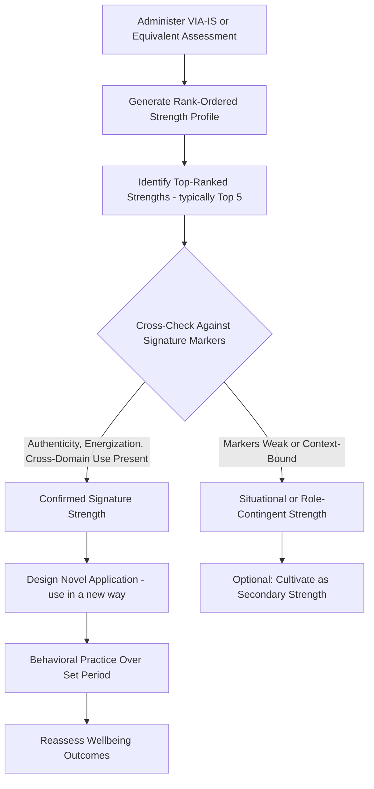

## Identifying and Measuring Signature Strengths

### Definitions

**Signature strengths** are the subset of an individual's character strengths (from the VIA Classification's 24 strengths) that are most essential to their identity — strengths that feel authentic and effortless to use, are intrinsically motivating, and are expressed across a wide range of life domains (Peterson & Seligman, 2004). They are conceptually distinct from **lesser strengths** (strengths present but not central to identity) and from strengths that are situationally deployed but not characteristic of the person overall.

Peterson and Seligman proposed several markers of a signature strength, including: a sense of ownership and authenticity ("this is the real me"), a feeling of excitement while displaying it (particularly initially), a sense of yearning to act in accordance with it, rapid learning when first practicing behaviors associated with it, a feeling of inevitability in using it, invigoration rather than exhaustion when using it, and the creation and pursuit of personal projects that revolve around it.

---

### Theoretical Rationale

The signature strengths construct sits within the broader **strengths-based practice** paradigm in positive psychology, which holds that human flourishing is better supported by identifying and cultivating what a person does well than by focusing primarily on correcting deficits (a contrast with more deficit/pathology-oriented traditional clinical models). The theoretical premise is that using signature strengths — as opposed to strengths a person merely has but does not identify with — produces greater engagement, meaning, and positive affect, consistent with **self-determination theory's** concept of autonomous, intrinsically motivated action (Deci & Ryan, 2000), since signature strength use is described as freely chosen and volitional rather than externally imposed.

[Inference] The specific mechanism connecting signature strength use to wellbeing outcomes (e.g., whether it operates primarily through autonomy satisfaction, competence satisfaction, or authenticity/identity-congruence) is theorized rather than definitively isolated in the empirical literature; multiple mechanisms likely operate simultaneously and are not always separated in study designs.

---

### Measurement Instruments

#### VIA Inventory of Strengths (VIA-IS)

- The primary self-report instrument for identifying strength profiles; originally 240 items (10 per strength), rated on a 5-point Likert scale from "very much unlike me" to "very much like me."
- Produces a **rank-ordered profile** of all 24 strengths rather than a categorical diagnosis; there is no "cutoff score" for possessing or lacking a given strength — rankings are relative to the individual's own profile (ipsative), not compared against population norms in the primary output.
- **Signature strengths** are typically operationalized as the top-ranked strengths in this individual profile, most commonly the **top 5**, though some studies and practitioner materials use top 3 or top 7. [Inference] There is no single universally agreed-upon numeric cutoff in the empirical literature; the "top 5" convention is a widely used heuristic rather than a psychometrically derived threshold.

#### Shorter Forms

- **VIA-96** and **VIA-72**: abbreviated versions developed to reduce respondent burden while maintaining acceptable reliability for most subscales, validated via item-response theory and classical test theory approaches in subsequent psychometric work.
- **VIA Youth Survey**: a 96-item version adapted in reading level and content for respondents aged 10–17.

#### Complementary/Alternative Assessment Approaches

- **Structured interview methods**: open-ended interview protocols asking respondents to describe times they felt "most like themselves," which are then coded for strength content — used to reduce reliance on a single self-report method and capture strengths that may not map neatly onto pre-specified items.
- **Peer-nomination and 360-degree strength assessments**: informants (colleagues, family members) rate or nominate strengths they observe in the target individual, used in some organizational and coaching applications to triangulate against self-report.
- **Behavioral/naturalistic coding**: in some research and coaching contexts, practitioners review narrative accounts of peak or "flow" experiences and code them for strength content, based on the premise that signature strengths are more likely to appear spontaneously in self-selected, high-engagement activities.
- **Reflected best-self exercises**: adapted from organizational behavior research (Roberts et al., 2005), in which the individual collects stories from others about times they were "at their best," subsequently analyzed for recurring strength themes.

---

### Practical Identification Process

**Key Points**

- Reliance on a single self-report instrument (typically the VIA-IS) is standard in most research and much coaching practice, but best practice in applied/coaching settings often triangulates with at least one additional method (interview, peer input, or narrative review) to address self-report limitations such as social desirability bias and limited self-insight.
- Signature strengths identification is typically followed by an **application phase** — deliberately using a given strength "in a new way" in daily life, which is the component most directly linked to wellbeing outcomes in intervention research (see Empirical Findings below), rather than mere identification/awareness alone.
- Distinguishing a **true signature strength** from a **situationally high-scoring strength** typically involves checking the score against the qualitative markers (authenticity, energization, cross-domain use, yearning) rather than relying on rank position alone, since self-report rankings can be influenced by recent context or mood at the time of testing.

**Example**

An individual completes the VIA-IS and receives "Fairness" as their #2-ranked strength. Follow-up reflection reveals this strength is expressed almost exclusively in their professional role as a manager mediating disputes, feels effortful rather than energizing, and is not something they report yearning to exercise outside of work obligations. This pattern suggests Fairness, despite its high rank, may function more as a *role-contingent* strength than a true signature strength for this individual — illustrating why practitioners are cautioned against treating raw rank order as automatically equivalent to signature status.

---

### Signature Strengths Identification and Application Pathway

---

### Empirical Findings

- Seligman, Steen, Park, and Peterson (2005) conducted a widely cited randomized study in which the "Using Signature Strengths in a New Way" exercise (identify top strengths, then use one in a novel way each day for a week) produced increases in happiness and reductions in depressive symptoms, with effects persisting at 6-month follow-up in some conditions — one of the more replicated single-exercise positive psychology interventions.
- Govindji and Linley (2007) found that strengths use (using one's signature strengths generally, not restricted to novel applications) was positively associated with self-esteem and subjective wellbeing, and that this association held after controlling for strengths knowledge alone — suggesting *application*, not mere identification, drives outcomes.
- Harzer and Ruch (2012, 2013) found in workplace samples that the number of signature strengths applied in one's job, and the degree of person-job fit for those strengths, predicted work-related wellbeing outcomes such as job satisfaction and perceived calling, more strongly than overall job characteristics alone in some models.
- Littman-Ovadia and Steger (2010) reported associations between signature strength use and meaning in life and work engagement. [Inference] much of this literature is correlational or based on short-term intervention designs; causal claims about long-term strengths-use effects on sustained wellbeing rest on a comparatively thin base of long-duration RCTs.

---

### Signature Strengths Markers (SVG)

<svg xmlns="http://www.w3.org/2000/svg" viewBox="0 0 640 320" font-family="sans-serif">
<text x="320" y="24" text-anchor="middle" font-size="16" font-weight="bold">Markers of a Signature Strength (svg_diagram)</text>
<circle cx="320" cy="170" r="60" fill="#F4D03F" stroke="#B7950B" />
<text x="320" y="166" text-anchor="middle" font-size="11" font-weight="bold">Signature</text>
<text x="320" y="180" text-anchor="middle" font-size="11" font-weight="bold">Strength</text>
<circle cx="150" cy="90" r="55" fill="#D6EAF8" stroke="#2E86C1" />
<text x="150" y="86" text-anchor="middle" font-size="10" font-weight="bold">Authenticity</text>
<text x="150" y="100" text-anchor="middle" font-size="9">"real me"</text>
<circle cx="490" cy="90" r="55" fill="#D5F5E3" stroke="#28B463" />
<text x="490" y="86" text-anchor="middle" font-size="10" font-weight="bold">Energization</text>
<text x="490" y="100" text-anchor="middle" font-size="9">invigorating, not draining</text>
<circle cx="130" cy="260" r="55" fill="#FADBD8" stroke="#C0392B" />
<text x="130" y="256" text-anchor="middle" font-size="10" font-weight="bold">Yearning</text>
<text x="130" y="270" text-anchor="middle" font-size="9">desire to use it</text>
<circle cx="510" cy="260" r="55" fill="#E8DAEF" stroke="#7D3C98" />
<text x="510" y="256" text-anchor="middle" font-size="10" font-weight="bold">Cross-Domain</text>
<text x="510" y="270" text-anchor="middle" font-size="9">used across contexts</text>
</svg>

---

### Distinguishing Signature Strengths from Related Constructs

| Construct | Definition | Distinction |
| --- | --- | --- |
| Signature strength | Top-ranked, identity-central character strength | Defined by both rank AND qualitative markers (authenticity, energization) |
| Lesser strength | Present in profile but not central to identity | Ranked lower; may still be used skillfully but without the same intrinsic pull |
| Talent | Innate ability, often domain-specific (e.g., musical talent) | Not necessarily morally valued; can exist independent of character strengths |
| Skill/Competency | Learned, trainable capability | Strengths are trait-like and motivational; skills are more purely capability-based |
| Value | What a person considers important | Values can exist without corresponding behavioral enactment; strengths imply capacity for action |

---

### Applications

- **Coaching and organizational development**: Signature strengths assessment is used in job-crafting interventions, where employees redesign aspects of their role to better incorporate top strengths, associated in some studies with increased engagement and perceived calling.
- **Positive psychotherapy (PPT)**: Identification of signature strengths is typically an early-session component in Rashid and Seligman's positive psychotherapy protocol, used as a resource to build alongside standard symptom-focused work rather than as a replacement for it.
- **Education**: Some school-based programs incorporate signature strengths identification (often via the VIA Youth Survey) into social-emotional learning curricula, pairing identification with strength-application projects.
- **Team composition and leadership development**: Aggregate signature-strengths profiles are sometimes used in team-building exercises to visualize complementary strength distributions across team members, though this application is more common in applied/consulting contexts than in peer-reviewed efficacy research. [Unverified] rigorous evidence isolating team-composition-strength-matching effects on team performance outcomes is limited relative to individual-level strengths-use research.

---

### Limitations and Cautions

- **Self-report and social desirability bias**: as with the broader VIA-IS, signature strengths identification via self-report is subject to common self-assessment biases and may not fully align with observed behavior.
- **Rank instability**: strength rankings can shift somewhat across repeated administrations depending on mood state, recent life events, or context at the time of testing, which is part of why practitioners recommend cross-checking rank with qualitative markers rather than treating a single assessment as definitive.
- **Overemphasis risk**: some critics caution that a strengths-only focus, if applied uncritically, could lead individuals or practitioners to neglect legitimate areas needing deliberate skill development or address performance gaps — most contemporary strengths-based frameworks (including Peterson and Seligman's own writing) explicitly frame strengths work as a complement to, not a replacement for, addressing weaknesses or deficits.
- **Cultural and contextual variability**: what counts as an authentic, energizing expression of a given strength may vary by cultural context and occupational norms, and cross-cultural validation of the specific "signature strengths markers" (as opposed to the strengths themselves) is less extensively studied. [Unverified] generalizability of the specific markers across diverse cultural and occupational samples.

---

**Related Topics**

- The VIA Classification of 24 character strengths and six virtues
- Strengths-based job crafting
- Positive psychotherapy (Rashid & Seligman)
- Self-determination theory and autonomous motivation
- Reflected best-self exercises in organizational behavior
- Person-job fit and calling at work
- Flow and optimal experience