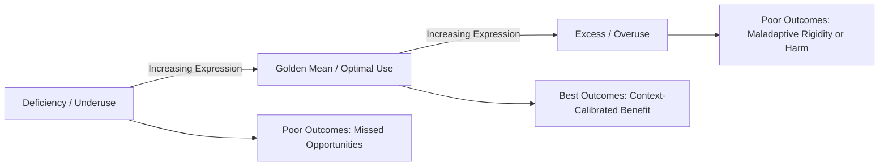

## Strengths Overuse, Underuse, and the Golden Mean

### Definitions

The **strengths overuse/underuse model** holds that character strengths, despite being positively valenced traits, do not produce beneficial outcomes unconditionally — their expression must be calibrated to situational demands, and both excessive and insufficient expression are associated with worse outcomes than optimal, context-appropriate expression (Grant & Schwartz, 2011; Niemiec, 2019).

- **Overuse**: applying a strength excessively, rigidly, or in contexts where it is not well-suited, such that it produces negative consequences (e.g., excessive honesty becoming tactlessness; excessive bravery becoming recklessness).
- **Underuse**: failing to deploy a strength when a situation calls for it, or suppressing/neglecting a strength one possesses, leading to missed opportunities or poor outcomes (e.g., a person high in fairness failing to advocate against an injustice they witness).
- **Optimal use (the "golden mean")**: the situationally calibrated middle expression of a strength, drawing directly on Aristotle's doctrine of the mean, wherein virtue lies between two vice-extremes — a deficiency and an excess.

---

### Theoretical Foundations

#### Aristotelian Doctrine of the Mean

Peterson and Seligman explicitly drew on Aristotle's *Nicomachean Ethics* concept of virtue as a mean between extremes when framing the VIA Classification. For example, courage (as a virtue) lies between cowardice (deficiency) and recklessness (excess); Aristotle's original framework is one of the philosophical sources cited in the VIA Classification's theoretical foundations (Peterson & Seligman, 2004).

#### Grant and Schwartz's Inverted-U Model

Grant and Schwartz (2011) formalized the overuse/underuse concept for contemporary positive psychology, proposing that the relationship between the amount/intensity of a positive trait's expression and beneficial outcomes typically follows an **inverted U-shaped curve** rather than a simple linear "more is better" relationship. They argued that positive psychology research had historically underemphasized this nonlinearity by focusing predominantly on the beneficial (linear, "more is better") end of trait expression, without adequately studying the excess end.

$$\text{Outcome} = f(\text{Strength Expression}), \quad \text{where } f \text{ is typically concave (inverted-U), not monotonically increasing}$$

[Inference] Not all strengths necessarily follow a symmetric or even clearly inverted-U functional form in empirical data; the inverted-U is best understood as a generalizable theoretical heuristic rather than a precisely fitted mathematical function validated across all 24 VIA strengths individually.

#### Niemiec's Strengths Overuse/Underuse/Optimal Framework

Ryan Niemiec, drawing on both the VIA Classification and clinical/coaching practice, extended this into an applied framework widely used in strengths-based coaching, mapping each of the 24 strengths onto its own **specific overuse and underuse manifestation**, rather than treating overuse/underuse abstractly (Niemiec, 2019).

---

### Illustrative Examples Across Strengths

| Strength | Underuse | Optimal (Golden Mean) | Overuse |
| --- | --- | --- | --- |
| Honesty | Deception, withholding relevant truths | Candid, contextually sensitive truthfulness | Bluntness, "brutal honesty" causing unnecessary harm |
| Bravery | Cowardice, avoidance of legitimate risk | Courageous action calibrated to actual risk/benefit | Recklessness, foolhardiness |
| Kindness | Indifference, withholding help when appropriate | Considerate, situationally attuned helping | Enabling, self-neglecting overgiving |
| Judgment (Critical Thinking) | Uncritical acceptance, gullibility | Balanced, evidence-weighing analysis | Overanalysis, cynicism, paralysis by analysis |
| Humility | Self-effacement to the point of invisibility | Accurate self-appraisal, letting accomplishments speak | False modesty, self-deprecation |
| Zest | Passivity, lethargy | Enthusiastic engagement | Hyperactivity, inability to be still or rest |
| Self-Regulation | Impulsivity, lack of discipline | Disciplined, flexible self-management | Rigidity, over-control, inhibited spontaneity |
| Fairness | Favoritism, bias | Even-handed, contextually just treatment | Excessive rule-rigidity, inability to make reasonable exceptions |

---

### Mechanisms Underlying Overuse and Underuse

**Key Points**

- **Context-insensitivity** is the central mechanism proposed for overuse: a strength that is adaptive in one context (e.g., bravery in an emergency) is misapplied to a context where it is maladaptive (e.g., unnecessary confrontation in a low-stakes disagreement) because the individual defaults to a habitual strength expression regardless of situational cues.
- **Identity fusion with a signature strength** may increase overuse risk: strengths that are highly central to identity (signature strengths) may be applied reflexively and with less situational calibration precisely because their use feels "automatic" or "inevitable" — a documented marker of signature strengths that, in this framework, is reframed as a potential vulnerability as well as a benefit.
- **Underuse often reflects situational suppression or environmental constraint** rather than trait absence — for example, an employee high in creativity may underuse that strength in a highly rigid, low-autonomy workplace that does not permit creative expression, illustrating that underuse is not always purely dispositional.
- **Strength interaction effects**: overuse of one strength can sometimes be mitigated by an appropriately calibrated co-occurring strength (e.g., bravery moderated by prudence, or honesty moderated by social intelligence/tact) — a concept sometimes termed **strength synergy** or **balancing strengths** in the applied literature. [Inference] the specific pairings proposed as effective "balancing" combinations are largely derived from clinical/coaching case observation rather than from controlled experimental designs isolating strength-interaction effects.

---

### Golden Mean Model (Inverted-U) Diagram

---

### Inverted-U Curve (SVG)

<svg xmlns="http://www.w3.org/2000/svg" viewBox="0 0 640 320" font-family="sans-serif">
<text x="320" y="24" text-anchor="middle" font-size="16" font-weight="bold">Strength Expression vs. Outcome (svg_diagram)</text>
<line x1="60" y1="270" x2="580" y2="270" stroke="#555" stroke-width="1.5" />
<line x1="60" y1="270" x2="60" y2="50" stroke="#555" stroke-width="1.5" />
<text x="320" y="300" text-anchor="middle" font-size="12">Degree of Strength Expression</text>
<text x="30" y="160" text-anchor="middle" font-size="12" transform="rotate(-90 30 160)">Outcome Quality</text>
<path d="M 80 250 Q 320 40 560 250" fill="none" stroke="#2E86C1" stroke-width="3" />
<circle cx="120" cy="235" r="6" fill="#C0392B" />
<text x="120" y="255" text-anchor="middle" font-size="11">Underuse</text>
<circle cx="320" cy="60" r="7" fill="#28B463" />
<text x="320" y="45" text-anchor="middle" font-size="11" font-weight="bold">Golden Mean</text>
<circle cx="520" cy="235" r="6" fill="#C0392B" />
<text x="520" y="255" text-anchor="middle" font-size="11">Overuse</text>
</svg>

---

### Empirical Evidence

- Grant and Schwartz (2011) provided a theoretical/review synthesis (rather than a single primary dataset) arguing across multiple trait domains (not limited to VIA strengths) that unqualified "more is better" framing in positive psychology research risked overlooking documented costs of excess — for example, citing evidence in adjacent literatures that excessive conscientiousness has been linked in some studies to rigidity and reduced adaptability, and that excessive optimism has been linked to underestimation of risk in certain decision contexts.
- Freidlin, Littman-Ovadia, and Niemiec (2017) conducted one of the more direct empirical tests, developing the **Strengths Balance Scale** and finding that balanced (optimal) strengths use — rather than raw strengths use alone — was a more consistent predictor of wellbeing outcomes, providing empirical support for distinguishing "use" from "balanced/optimal use."
- Littman-Ovadia, Lazar-Butbul, and Benjamin (2014) and related applied studies on strengths-based career counseling have incorporated overuse/underuse psychoeducation into intervention protocols, though direct outcome studies isolating the overuse/underuse framing's incremental effect (beyond general strengths-use interventions) remain comparatively limited. [Unverified] the overuse/underuse construct, while theoretically well-developed and increasingly used in applied coaching materials, has a smaller dedicated primary-research base than the core strengths-identification-and-use literature.

---

### Practical Applications and Calibration Strategies

1. **Strengths overuse/underuse self-assessment**: some coaching protocols and instruments (e.g., items derived from the Strengths Balance Scale) ask individuals to reflect on whether a top strength has recently produced negative consequences via excess, or whether a situation called for a strength they did not deploy.
2. **Situational strength-matching exercises**: practitioners work with clients to map which strengths are well-suited to specific recurring situations (e.g., "bravery is well-calibrated in X context but overused in Y context") rather than applying a signature strength uniformly.
3. **Balancing-strength pairing**: deliberately pairing an overused strength with a complementary strength to moderate its expression (e.g., pairing bravery with prudence before acting; pairing honesty with social intelligence when delivering difficult feedback).
4. **Feedback-informed recalibration**: incorporating external feedback (from peers, supervisors, or family) specifically about instances of strength overuse, since individuals may have limited self-insight into when a signature strength — precisely because it feels "natural" — has become miscalibrated to context.

**Example**

A manager with "Fairness" as a top signature strength insists on applying identical performance-review criteria to every team member regardless of vastly different role demands or extenuating circumstances, producing team resentment (overuse: rigid rule-application misapplied as impartiality). A coaching intervention might involve pairing Fairness with Social Intelligence and Judgment — prompting the manager to ask, in each specific case, whether strict uniformity or contextually sensitive equity better serves the underlying value the strength is meant to express.

---

### Distinguishing Overuse/Underuse from Related Constructs

| Construct | Focus | Distinction from Overuse/Underuse Model |
| --- | --- | --- |
| Character weakness | Absence or deficiency of a positive trait | Roughly maps to chronic "underuse," but does not capture the excess/overuse end |
| Trait rigidity | General inflexibility in behavior across contexts | A plausible mechanism contributing to overuse, not synonymous with it |
| Person-situation fit | Match between individual traits and environmental demands | Overuse/underuse can be understood as a specific instance of poor person-situation calibration |
| Aristotelian vice | Deficiency or excess relative to virtue | The direct philosophical ancestor of the overuse/underuse model; largely conceptually equivalent at the theoretical level |

---

**Related Topics**

- The VIA Classification of 24 character strengths and six virtues
- Identifying and measuring signature strengths
- Aristotelian virtue ethics and the doctrine of the mean
- Strengths-based coaching and job crafting
- Context sensitivity and psychological flexibility
- Strengths Balance Scale (Freidlin, Littman-Ovadia, & Niemiec)