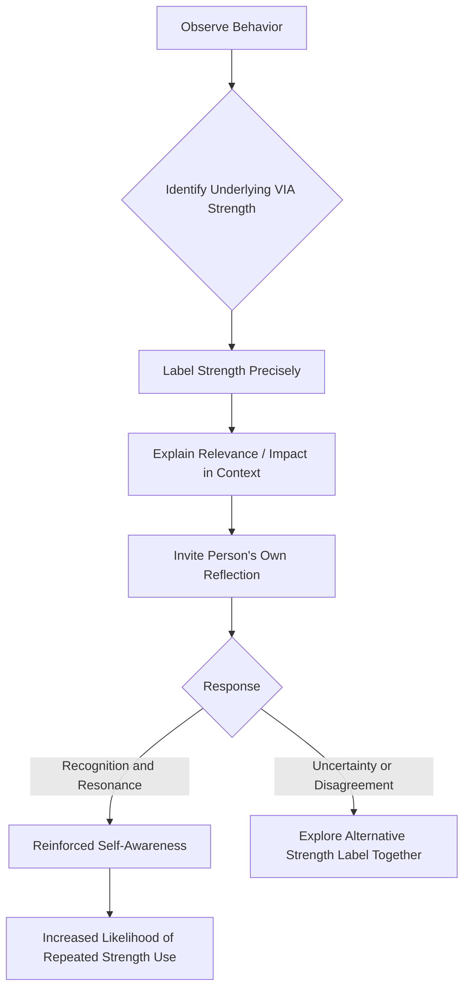

## Strengths-Based Interventions and Strengths-Spotting

### Definitions

**Strengths-based interventions** are structured psychological or organizational practices designed to build wellbeing, performance, or resilience by identifying and deliberately deploying an individual's character strengths, rather than by focusing primarily on correcting deficits or weaknesses (Peterson & Seligman, 2004; Niemiec, 2018).

**Strengths-spotting** is a specific relational/observational skill and practice: the ability to notice, name, and reflect back character strengths as they are being expressed by another person (or oneself) in real time, typically in everyday interactions rather than formal assessment settings (Niemiec, 2018). It is considered a foundational micro-skill underlying many strengths-based coaching, educational, and therapeutic applications.

---

### Theoretical Rationale

Strengths-based approaches are grounded in the broader positive psychology premise that flourishing is not simply the absence of dysfunction but a distinct, positively defined state requiring its own set of building conditions (Seligman & Csikszentmihalyi, 2000). Strengths-spotting specifically draws on principles from **positive psychotherapy**, **appreciative inquiry** in organizational development (Cooperrider & Srivastva, 1987), and **self-determination theory**, on the premise that having one's strengths recognized by others supports autonomy and competence need satisfaction and reinforces authentic self-concept.

[Inference] The precise mechanism by which external strengths-spotting translates into internalized wellbeing benefit for the recipient (e.g., via increased self-awareness, social validation, or relational trust) is theorized but not fully disentangled in controlled research; multiple pathways likely operate together.

---

### Strengths-Spotting: Core Skill Components

Niemiec's applied framework (2018) breaks strengths-spotting into distinguishable component skills:

1. **Strength recognition/identification** — accurately perceiving which of the 24 VIA strengths is being expressed in a given behavior or statement.
2. **Labeling** — naming the specific strength using precise VIA terminology (e.g., "That took real perseverance" rather than a vague "good job").
3. **Explaining relevance/impact** — connecting the labeled strength to its specific effect in context (why it mattered, what it enabled).
4. **Inviting reflection** — prompting the other person to notice and reflect on their own strength use, deepening self-awareness rather than the spotter simply asserting an observation.

**Key Points**

- Strengths-spotting is distinguished from generic praise or compliments by its **specificity**: generic praise ("great job") does not build a differentiated sense of which particular strength was operative, whereas precise strength-labeling is theorized to support more targeted self-understanding and repeatable behavior.
- Effective strengths-spotting is typically evidence-based in the moment — tied to an observed behavior — rather than a general trait assertion detached from a concrete instance.
- Strengths-spotting can be applied to **oneself** (self-spotting, a component of reflective practice) as well as to others.

---

### Categories of Strengths-Based Interventions

#### Individual-Level Interventions

- **Signature strengths identification and novel use** (Seligman et al., 2005) — identifying top strengths via the VIA-IS, then deliberately applying one in a new way daily over a set period (commonly one week in the original study design).
- **Strengths-based positive psychotherapy (PPT)** (Rashid & Seligman, 2018) — a structured, typically 14-session protocol incorporating signature strengths work alongside more traditional therapeutic content, used as an adjunct or alternative approach for depression and related concerns.
- **Strengths gym/strengths practice logs** — structured worksheets or journaling exercises in which individuals track specific instances of strength use and reflect on outcomes.

#### Relational/Educational Interventions

- **Strengths-spotting practice in classrooms** — teachers trained to notice and label strengths in student behavior in real time, used within some school-based social-emotional learning curricula.
- **Strengths-based parenting** — parents trained in strengths-spotting to recognize and reinforce character strengths in children's everyday behavior, associated in some studies with more positive parent-child relationship quality. [Unverified] the direct causal contribution of strengths-spotting specifically (versus general positive parenting practices more broadly) is difficult to isolate in most existing study designs.

#### Organizational Interventions

- **Strengths-based job crafting** — employees redesign elements of their role to better align tasks with top strengths (Harzer & Ruch, 2012, 2013).
- **Appreciative inquiry-based team development** — structured organizational change processes that begin from identifying "what is working" (including strengths) rather than starting from a deficit/problem analysis.
- **Strengths-based performance conversations** — feedback and performance-review structures oriented around building on demonstrated strengths, sometimes combined with (rather than replacing) standard developmental-gap feedback.

---

### Strengths-Spotting Skill Sequence

---

### Strengths-Based Intervention Landscape (SVG)

<svg xmlns="http://www.w3.org/2000/svg" viewBox="0 0 640 320" font-family="sans-serif">
<text x="320" y="24" text-anchor="middle" font-size="16" font-weight="bold">Levels of Strengths-Based Practice (svg_diagram)</text>
<rect x="40" y="60" width="170" height="200" rx="10" fill="#D6EAF8" stroke="#2E86C1" />
<text x="125" y="90" text-anchor="middle" font-size="13" font-weight="bold">Individual</text>
<text x="125" y="130" text-anchor="middle" font-size="10">Signature strengths</text>
<text x="125" y="150" text-anchor="middle" font-size="10">identification</text>
<text x="125" y="180" text-anchor="middle" font-size="10">Novel-use exercise</text>
<text x="125" y="210" text-anchor="middle" font-size="10">Positive</text>
<text x="125" y="228" text-anchor="middle" font-size="10">psychotherapy</text>
<rect x="235" y="60" width="170" height="200" rx="10" fill="#D5F5E3" stroke="#28B463" />
<text x="320" y="90" text-anchor="middle" font-size="13" font-weight="bold">Relational</text>
<text x="320" y="130" text-anchor="middle" font-size="10">Strengths-spotting</text>
<text x="320" y="160" text-anchor="middle" font-size="10">Strengths-based</text>
<text x="320" y="178" text-anchor="middle" font-size="10">parenting</text>
<text x="320" y="210" text-anchor="middle" font-size="10">Classroom strength</text>
<text x="320" y="228" text-anchor="middle" font-size="10">recognition</text>
<rect x="430" y="60" width="170" height="200" rx="10" fill="#FDEBD0" stroke="#CA6F1E" />
<text x="515" y="90" text-anchor="middle" font-size="13" font-weight="bold">Organizational</text>
<text x="515" y="130" text-anchor="middle" font-size="10">Job crafting</text>
<text x="515" y="160" text-anchor="middle" font-size="10">Appreciative</text>
<text x="515" y="178" text-anchor="middle" font-size="10">inquiry</text>
<text x="515" y="210" text-anchor="middle" font-size="10">Strengths-based</text>
<text x="515" y="228" text-anchor="middle" font-size="10">performance reviews</text>
</svg>

---

### Empirical Evidence

- Seligman, Steen, Park, and Peterson (2005) found the signature strengths novel-use exercise produced happiness increases and depressive symptom decreases that in some conditions persisted at 6-month follow-up, remaining one of the more replicated single-exercise positive interventions.
- Proctor, Maltby, and Linley (2011) found that a strengths-based intervention program for adolescents was associated with increased life satisfaction, with effects moderated by the extent to which participants perceived the strengths as central to their identity — consistent with the broader emphasis on genuine (not merely nominal) strengths engagement.
- Meta-analyses of strengths-based interventions broadly (e.g., Schutte & Malouff, 2019; Ghielen, van Woerkom, & Meyers, 2018) have found small-to-moderate positive effects on wellbeing outcomes across varied intervention formats, with **effect sizes typically modest and heterogeneous** across studies. [Inference] heterogeneity in intervention content, duration, and outcome measures across the strengths-intervention literature makes precise, generalizable effect-size estimates difficult; published meta-analytic estimates should be treated as approximate rather than definitive.
- Direct controlled research specifically isolating **strengths-spotting** (as a discrete relational skill, separate from broader strengths-use interventions) is comparatively sparse; most support for strengths-spotting's value comes from its integration within larger validated protocols (e.g., PPT) and from applied/practitioner literature rather than dedicated randomized trials testing strengths-spotting alone. [Unverified] the incremental, isolated effect of strengths-spotting as a standalone technique.

---

### Practical Guidance for Strengths-Spotting

**Example**

A team lead notices a colleague voluntarily stayed late to help a struggling teammate meet a deadline, without being asked and without seeking credit. Effective strengths-spotting would involve specifically naming this as an instance of Kindness and Teamwork ("What you did for Sam yesterday — staying late without being asked — that's real kindness and teamwork in action"), briefly noting its impact ("It meant the whole deliverable came in on time and Sam didn't have to carry that alone"), and then inviting reflection ("Is that something you find yourself doing often?") — rather than offering only generic praise ("Nice job helping out").

Common pitfalls in strengths-spotting practice include:

- **Over-labeling**: naming a strength in every interaction to the point of diluting authenticity or feeling performative.
- **Mislabeling**: assigning an imprecise or incorrect strength label, which can undermine trust in the practice if done repeatedly or without openness to correction.
- **One-way delivery**: stating an observation without inviting the other person's own reflection, which reduces the practice to praise-giving rather than strengths development.

---

### Distinguishing Strengths-Spotting from Related Practices

| Practice | Core Feature | Distinction |
| --- | --- | --- |
| Strengths-spotting | Real-time identification and labeling of a specific VIA strength in observed behavior | Precise, strength-language-based, typically dialogic |
| General praise/compliments | Positive evaluative feedback | Lacks specific strength-language precision; can be vague ("good job") |
| Appreciative inquiry | Organizational change methodology starting from "what works" | Broader systemic/process-level application; strengths-spotting can be one micro-technique within it |
| 360-degree feedback | Multi-rater performance/behavior feedback | Typically broader in scope (competencies, behaviors) and not restricted to VIA strength vocabulary |
| Positive reinforcement (behaviorism) | Reward following a desired behavior to increase its frequency | Strengths-spotting is compatible with reinforcement principles but is distinguished by its emphasis on identity-relevant labeling and reflection, not merely behavior-frequency shaping |

---

### Applications Across Settings

- **Clinical/coaching**: incorporated into positive psychotherapy and strengths-based coaching models as both an assessment-adjacent and ongoing relational practice throughout the working relationship.
- **Education**: teacher training programs in some school systems include strengths-spotting modules aimed at shifting classroom feedback culture toward strength-specific recognition.
- **Workplace/leadership development**: manager training programs sometimes incorporate strengths-spotting as a feedback-delivery skill, intended to complement (not replace) standard developmental feedback on performance gaps.
- **Family/parenting programs**: some parenting-skills curricula include strengths-spotting components aimed at shifting parent-child interaction patterns toward more specific positive recognition.

---

### Limitations and Cautions

- **Risk of superficial application**: without adequate training, strengths-spotting can devolve into generic positivity or flattery that lacks the specificity theorized to drive its benefits.
- **Cultural and contextual sensitivity**: direct, explicit verbal praise/strength-labeling norms vary across cultures; the specific communication style assumed in most strengths-spotting training materials draws predominantly from Western (especially U.S.) interpersonal and organizational norms. [Unverified] cross-cultural adaptation and effectiveness data for strengths-spotting specifically are limited.
- **Evidence base imbalance**: the broader strengths-identification-and-use literature is considerably larger and more rigorously tested than the strengths-spotting literature specifically, which relies more heavily on applied/practitioner sources and integration within larger validated protocols than on dedicated controlled trials.

---

**Related Topics**

- The VIA Classification of 24 character strengths and six virtues
- Identifying and measuring signature strengths
- Strengths overuse, underuse, and the golden mean
- Positive psychotherapy (Rashid & Seligman)
- Appreciative inquiry in organizational development
- Strengths-based job crafting
- Self-determination theory (autonomy, competence, relatedness)