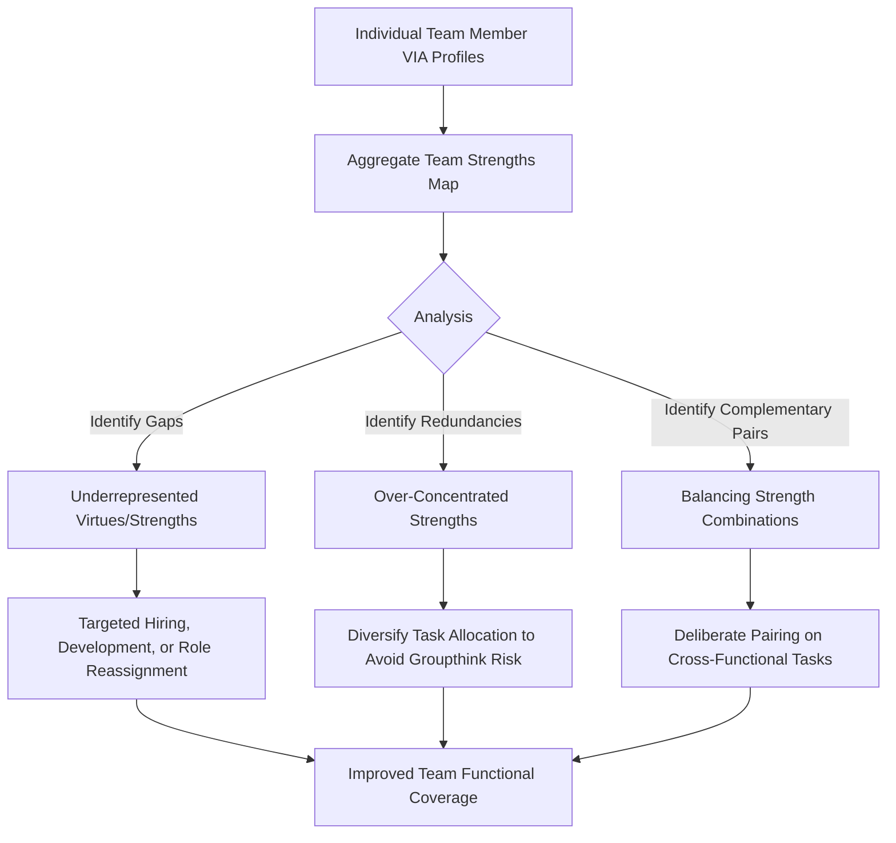

## Character Strengths in Leadership, Teams, and Relationships

### Definitions

This topic examines the application of the VIA Classification of character strengths (Peterson & Seligman, 2004) to three interconnected social domains: **leadership** (the exercise of influence and direction within a group toward shared goals), **teams** (collective units whose effectiveness depends on the aggregation and interaction of members' individual strengths), and **close relationships** (dyadic bonds, romantic or otherwise, in which strengths use and recognition shape relational quality). Across all three domains, the guiding premise is that strengths operate not only intrapersonally but as a currency of interpersonal and collective functioning.

---

### Theoretical Frameworks

#### Strengths-Based Leadership

Strengths-based leadership models (e.g., Rath & Conchie, 2008, drawing on Gallup's StrengthsFinder tradition, and VIA-aligned frameworks such as Niemiec, 2018) propose that effective leadership derives less from a fixed universal leadership trait profile and more from **leaders' self-awareness of their own strengths, complemented by deliberate attention to team members' differing strengths**. This contrasts with earlier "great man" or universal trait models of leadership by emphasizing fit and complementarity over a single ideal leader profile.

[Inference] The VIA-specific leadership literature draws partly on adjacent strengths frameworks (e.g., Gallup's CliftonStrengths) that use a different, non-overlapping strengths taxonomy; findings from these adjacent literatures are conceptually related but not directly interchangeable with VIA-specific findings, since the underlying strength constructs and measurement instruments differ.

#### Strengths Complementarity in Teams

Team-level strengths research draws on **person-team fit** and **functional diversity** theories, proposing that teams composed of members with complementary (rather than uniform) strength profiles may perform better on complex tasks requiring varied competencies (e.g., a team benefiting from members high in Creativity, others high in Prudence, and others high in Teamwork/Leadership). This is theoretically related to but distinct from general cognitive/demographic diversity research in organizational behavior.

#### Strengths in Relationship Science

Relationship-focused strengths research draws on **Gable's capitalization framework** (active-constructive responding) and **positive relationship science** more broadly, proposing that partners' mutual recognition, appreciation, and support of each other's character strengths functions as a relationship-maintenance mechanism analogous to (and overlapping with) capitalization processes for positive events.

---

### Character Strengths and Leadership

**Key Points**

- **Perspective, Fairness, and Leadership (as a specific VIA strength) itself** are among the strengths most directly implicated in the VIA's own definitions of effective group influence, though effective leadership in practice draws on strengths across all six virtues depending on context.
- **Signature strengths awareness in leaders** is proposed to support more authentic leadership style, consistent with **authentic leadership theory** (Avolio & Gardner, 2005), which emphasizes self-awareness and consistency between values and action as core leadership components.
- **Leader strengths-spotting of followers**: leaders trained in strengths-spotting (see companion topic) are theorized to support follower engagement and perceived support, by recognizing and reinforcing specific strengths in team members' contributions rather than offering only generic feedback.
- **Contextual/situational strength calibration**: effective leaders are theorized to need to modulate strength expression to context (see companion topic on overuse/underuse) — for example, calibrating Bravery (decisive action under uncertainty) against Prudence (careful risk assessment) depending on the stakes of a given decision.

**Example**

A project lead high in signature strengths of Zest and Creativity may excel at launching new initiatives and generating team enthusiasm, but if the team also requires sustained, detail-oriented execution, the leader may need to either develop complementary discipline (Self-Regulation, Prudence) or deliberately delegate execution-heavy phases to team members whose signature strengths better match that demand — illustrating strengths complementarity in practice rather than expecting one leader to embody all needed strengths personally.

---

### Character Strengths and Teams

#### Strengths Diversity and Team Composition

Research on team-level strengths (e.g., studies applying VIA profiles to work teams, such as some of Harzer and Ruch's organizational work) suggests that:

- Aggregate team strengths profiles can be mapped to identify **coverage gaps** (virtues or strengths underrepresented across all members) and **redundancies** (strengths over-concentrated in the team).
- **Person-role strength fit** — matching team members' signature strengths to role demands — is associated in workplace studies with job satisfaction and engagement outcomes (Harzer & Ruch, 2012, 2013), extending naturally to team-role allocation decisions.
- Strengths-spotting exercises are used in team-building interventions to increase mutual awareness of teammates' strengths, theorized to support more effective delegation and mutual appreciation, though dedicated controlled trials isolating this specific application's incremental effect on team performance are comparatively limited. [Unverified] most evidence for team-level strengths applications comes from applied/consulting case reports and adjacent organizational-fit research rather than large-sample controlled team-performance studies specifically using the VIA framework.

#### Team Strengths Mapping Model

---

### Character Strengths and Relationships

**Key Points**

- **Perceived partner strength recognition**: partners who feel their character strengths are noticed and valued by the other report higher relationship satisfaction in some studies (Kashdan et al., 2018), paralleling the perceived-partner-responsiveness literature from capitalization research (Gable et al., 2004).
- **Strengths-based conflict navigation**: some couples-focused strengths applications involve identifying which strengths are underused or overused during conflict (e.g., Honesty overused as bluntness during an argument; Forgiveness underused after a rupture) as a structured way to reframe recurring conflict patterns.
- **Complementary vs. similar strengths in romantic pairing**: findings are mixed regarding whether relationship satisfaction is better predicted by partners sharing similar signature strengths or by strength complementarity; [Unverified] this remains an open empirical question without a clearly dominant finding across the literature, and effects likely depend on which specific strengths and relationship domains are examined.
- **Love and Kindness (VIA strengths)** are the most directly relationship-relevant strengths under the Humanity virtue, but relationship quality in the applied literature is generally treated as drawing on strengths across the full classification (e.g., Forgiveness and Self-Regulation during conflict; Gratitude in day-to-day appreciation; Humor in shared positive experience).

**Example**

A couple experiencing recurring conflict identifies, through a strengths-based reflection exercise, that one partner's Honesty is being expressed in overuse form (blunt, unfiltered criticism during disagreements) while the other partner's Forgiveness is being underused (holding onto resentment rather than genuinely resetting after resolution). A strengths-based intervention might involve the first partner pairing Honesty with Social Intelligence (delivering truths more attuned to timing and impact) while the second partner practices deliberate Forgiveness exercises following resolved conflicts.

---

### Cross-Domain Strengths Application Overview (SVG)

<svg xmlns="http://www.w3.org/2000/svg" viewBox="0 0 640 340" font-family="sans-serif">
<text x="320" y="24" text-anchor="middle" font-size="16" font-weight="bold">Character Strengths Across Social Domains (svg_diagram)</text>
<circle cx="320" cy="180" r="55" fill="#F4D03F" stroke="#B7950B" />
<text x="320" y="176" text-anchor="middle" font-size="11" font-weight="bold">Character</text>
<text x="320" y="190" text-anchor="middle" font-size="11" font-weight="bold">Strengths</text>
<rect x="60" y="60" width="160" height="90" rx="10" fill="#D6EAF8" stroke="#2E86C1" />
<text x="140" y="90" text-anchor="middle" font-size="12" font-weight="bold">Leadership</text>
<text x="140" y="112" text-anchor="middle" font-size="9">Self-awareness,</text>
<text x="140" y="128" text-anchor="middle" font-size="9">Follower strengths-spotting</text>
<rect x="420" y="60" width="160" height="90" rx="10" fill="#D5F5E3" stroke="#28B463" />
<text x="500" y="90" text-anchor="middle" font-size="12" font-weight="bold">Teams</text>
<text x="500" y="112" text-anchor="middle" font-size="9">Complementary</text>
<text x="500" y="128" text-anchor="middle" font-size="9">profiles, role fit</text>
<rect x="240" y="240" width="160" height="90" rx="10" fill="#FADBD8" stroke="#C0392B" />
<text x="320" y="270" text-anchor="middle" font-size="12" font-weight="bold">Relationships</text>
<text x="320" y="292" text-anchor="middle" font-size="9">Strength recognition,</text>
<text x="320" y="308" text-anchor="middle" font-size="9">conflict navigation</text>
</svg>

---

### Empirical Evidence

- Harzer and Ruch (2012, 2013) found that the number of signature strengths applicable in a person's job, and perceived person-job fit for those strengths, predicted work-related wellbeing including engagement and perceived calling — findings with direct relevance for both leadership role-design and team role allocation.
- Kashdan, Blalock, Young, Machell, Feingold, Adams, and Peterson (2018) examined couples and found that greater use of signature strengths and perceived strengths recognition by a partner were associated with better relationship functioning, contributing to the empirical base for strengths-based relationship applications.
- Littman-Ovadia and Davidovitch (2010) found associations between manager strengths-related behaviors (e.g., encouraging strengths use among subordinates) and employee attitudes such as job satisfaction, contributing to the strengths-based leadership literature, though as with much of this domain, most available studies are correlational rather than experimental. [Inference] causal directionality (whether strengths-supportive leadership causes better employee outcomes, or whether already-thriving teams simply enable more visible strengths-supportive leadership behavior) is difficult to establish from correlational designs alone.
- Direct experimental/intervention research specifically testing team-composition strengths-matching or couples-strengths-conflict protocols against active control conditions is comparatively limited relative to individual-level signature strengths intervention research; much of the applied guidance in this domain (team strengths-mapping tools, couples strengths exercises) is grounded more in practitioner experience and theoretical extension from individual-level findings than in dedicated large-sample RCTs. [Unverified] the leadership, team, and relationship-specific literatures are smaller and less consolidated than the core individual-level VIA and signature-strengths research base.

---

### Distinguishing Constructs Across Domains

| Domain | Primary Strengths Emphasis | Key Related Framework |
| --- | --- | --- |
| Leadership | Perspective, Fairness, Leadership, self-awareness of signature strengths | Authentic leadership theory |
| Teams | Complementarity and coverage across the full 24-strength profile | Person-team fit, functional diversity |
| Relationships | Love, Kindness, Forgiveness, mutual strengths recognition | Capitalization and perceived partner responsiveness |

---

### Applications

- **Leadership development programs**: incorporating VIA profiling and strengths-spotting training into executive coaching and management training curricula.
- **Team-building workshops**: using aggregate strengths mapping to facilitate team discussions about role allocation, delegation, and mutual appreciation.
- **Couples counseling and relationship education programs**: incorporating strengths-recognition exercises and strengths-based conflict reframing as a complement to standard communication-skills-based approaches.
- **Human resources and talent management**: some organizations use strengths profiling (VIA or adjacent frameworks) in succession planning and team formation, though this application is more consulting-practice-driven than validated through peer-reviewed organizational outcome research specifically using the VIA instrument. [Unverified] efficacy of formal HR strengths-matching programs at scale.

---

### Limitations and Cautions

- **Evidence asymmetry**: the individual-level signature strengths literature is considerably more developed than the leadership-, team-, and relationship-specific extensions, which rely more heavily on theoretical extrapolation and applied practice than dedicated controlled research.
- **Adjacent-framework conflation risk**: much popular "strengths-based leadership" material draws on non-VIA frameworks (e.g., Gallup's CliftonStrengths); care should be taken not to conflate findings across differing strengths taxonomies, as they are not empirically interchangeable.
- **Overreliance on self-report profiling for high-stakes decisions**: using VIA or similar profiles for hiring, promotion, or team-formation decisions in a deterministic way is generally cautioned against in the professional literature, given the instrument's self-report nature, context-sensitivity of strength expression, and comparatively thin validation for these specific high-stakes organizational applications.

---

**Related Topics**

- The VIA Classification of 24 character strengths and six virtues
- Identifying and measuring signature strengths
- Strengths overuse, underuse, and the golden mean
- Strengths-based interventions and strengths-spotting
- Savoring and capitalizing on positive experiences
- Authentic leadership theory
- Person-team fit and functional diversity in organizations