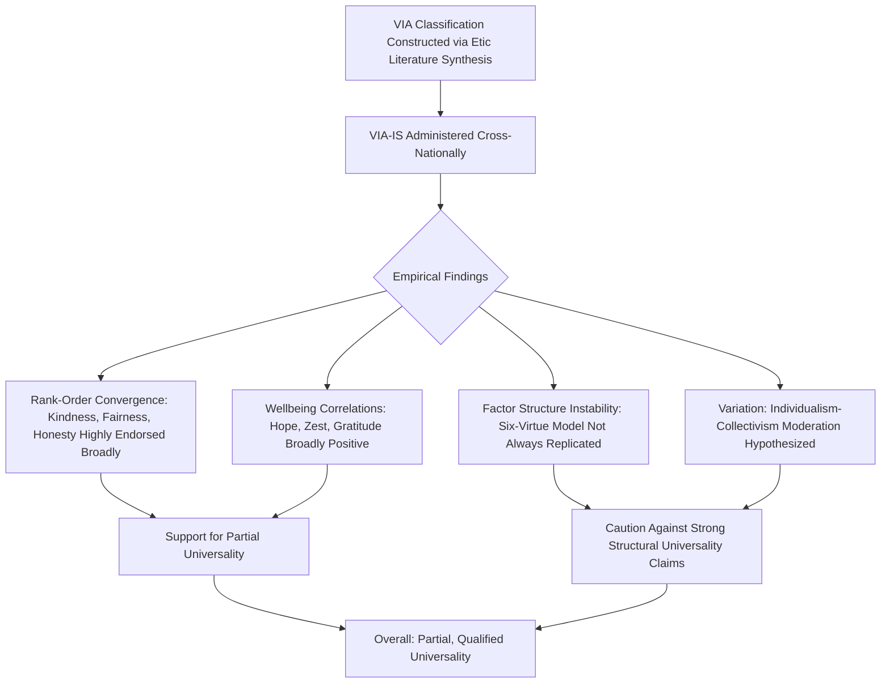

## Cross-Cultural Universality of Character Strengths

### Definitions

**Cross-cultural universality of character strengths** refers to the empirical and theoretical question of whether the 24 character strengths in the VIA Classification (Peterson & Seligman, 2004) represent psychological constructs that are recognized, valued, and structured similarly across diverse cultural, linguistic, and national contexts, or whether the classification reflects culturally specific (particularly Western) values that do not generalize universally.

This question sits within the broader cross-cultural psychology debate between **universalist** positions (positing that core psychological constructs, particularly those tied to morality and virtue, show substantial pan-human consistency) and **cultural relativist/constructionist** positions (positing that psychological constructs, especially value-laden ones like virtue, are substantially shaped by and specific to cultural context).

---

### Theoretical Background

#### The Universalist Claim in VIA's Original Design

Peterson and Seligman explicitly designed the VIA Classification with universality as an aspiration: the 24 strengths were selected partly through a review of virtue concepts across multiple major religious and philosophical traditions (Confucianism, Buddhism, Hinduism, ancient Greek philosophy, Judeo-Christian traditions, Islam), seeking traits with broad historical and cross-cultural endorsement as one of their ten proposed inclusion criteria (see companion topic on the VIA Classification).

#### Etic vs. Emic Approaches

Cross-cultural psychology distinguishes:

- **Etic approaches**: applying a construct or measurement instrument developed in one cultural context to other cultures and comparing results, assuming the underlying construct is comparable across contexts.
- **Emic approaches**: deriving constructs from within a specific cultural context on its own terms, without assuming applicability elsewhere.

The VIA Classification was constructed largely via an initial **etic-oriented, top-down** literature synthesis (drawing on the target of finding "convergent" virtues across traditions) followed by empirical **etic testing** (administering the resulting instrument, the VIA-IS, across many countries and comparing patterns) — rather than beginning from a from ground-up emic study of specific individual cultures' own virtue concepts. [Inference] This methodological starting point is a notable factor for interpreting the universality evidence: cross-national similarity found using an instrument built from this synthesis process is not, by itself, equivalent to independent confirmation that non-Western cultures would generate an identical 24-strength taxonomy if constructed emically from within those traditions alone.

---

### Empirical Evidence for Cross-Cultural Similarity

#### Rank-Order Convergence Studies

- Park, Peterson, and Seligman (2006) administered the VIA-IS across 54 nations and found that certain strengths — **kindness, fairness, honesty, judgment, and gratitude** — were consistently among the most highly endorsed across the large majority of countries sampled, while strengths such as **modesty/humility, self-regulation, and prudence** tended to be more variably or lower ranked.
- Similar patterns of relative rank-order consistency across countries have been reported in subsequent large cross-national VIA-IS datasets, which is often cited as the primary quantitative evidence for cross-cultural universality claims.
- McGrath (2015) conducted large-scale psychometric analyses across international VIA-IS data and found general support for the reliability of most strength subscales across diverse samples, alongside some structural variation in how strengths clustered into higher-order factors.

#### Character Strengths and Life Satisfaction Across Cultures

- Multiple cross-national studies (building on Park, Peterson, & Seligman, 2004) have found that **hope, zest, gratitude, love, and curiosity** show relatively consistent positive associations with life satisfaction across different national samples, lending some support to claims of a shared "engagement" cluster of strengths linked to wellbeing across cultures. [Inference] "relatively consistent" here reflects convergence in the *direction* and general *magnitude range* of associations across many but not all studied countries; associations are not perfectly uniform, and some country-specific studies report weaker or non-significant associations for certain strengths.

---

### Evidence and Arguments for Cultural Variation

**Key Points**

- **Factor structure instability**: Multiple factor-analytic studies (Ng, Cao, Marsh, Tay, & Seligman, 2017; Brdar & Kashdan, 2010; McGrath, 2014) have found that the theorized six-virtue higher-order structure does not consistently replicate across samples, with some studies finding better statistical fit for 3-, 4-, or 5-factor solutions — and this instability appears in Western samples as well as cross-culturally, suggesting the six-virtue grouping may function more as a useful organizing heuristic than an empirically confirmed universal structure.
- **Differential emphasis and behavioral expression**: even where a strength concept is recognized across cultures, its socially valued *behavioral expression* may differ substantially — for example, humility may be behaviorally expressed and valued differently in more collectivist versus individualist cultural contexts, even if both contexts recognize an underlying "humility" concept.
- **Missing or poorly-translated culturally specific virtue concepts**: critics have noted that certain culturally specific virtue-adjacent concepts (e.g., specific relational, communal, or spiritually embedded virtue concepts found in some non-Western traditions) may not map cleanly onto any single one of the 24 VIA strengths, raising the possibility that the classification is not fully exhaustive of humanly recognized virtue concepts. [Unverified] the extent of genuinely "missing" virtue concepts, versus concepts that simply combine or subdivide existing VIA strengths differently, is difficult to establish definitively and is debated among cross-cultural virtue researchers.
- **Individualism-collectivism moderation**: some research suggests that strengths emphasizing individual achievement/expression (e.g., leadership, bravery, creativity) may be relatively more valorized in individualist cultural contexts, while strengths emphasizing relational harmony (e.g., fairness, teamwork, forgiveness) may show relatively stronger endorsement or association with wellbeing in more collectivist contexts — though findings across specific studies are mixed and not fully consistent. [Unverified] this moderation pattern is a plausible and partially supported hypothesis rather than a firmly established, uniformly replicated finding.

---

### Methodological Critiques

- **Response style confounds**: cross-national comparisons of self-report Likert-scale data are vulnerable to differing culturally-patterned response styles (e.g., variation in acquiescence bias or extreme-response-style tendencies across cultures), which can inflate or obscure genuine cross-cultural similarity or difference in raw score comparisons. [Inference] much of the cross-national VIA literature relies on rank-order comparisons partly to mitigate (though not fully eliminate) this confound, since rank-order comparisons are somewhat more robust to uniform response-style shifts than raw mean-score comparisons.
- **Translation and construct equivalence**: the VIA-IS has been translated into dozens of languages; translation quality and true semantic/conceptual equivalence (as opposed to surface linguistic translation) varies across versions, and formal measurement invariance testing (statistically confirming that the instrument measures the same construct with the same structure across language groups) has not been uniformly conducted or reported for every translated version. [Unverified] the proportion of VIA-IS translations that have undergone rigorous measurement invariance testing versus simple forward-backward translation procedures.
- **Sampling bias**: many cross-national VIA-IS studies rely on convenience samples (often internet-based, self-selected respondents, sometimes skewing toward more educated, urban, and Western-media-exposed populations within each country), which limits generalizability claims about "national" character strength profiles.

---

### Cross-Cultural Evidence Synthesis Diagram

---

### Universalism–Relativism Spectrum (SVG)

<svg xmlns="http://www.w3.org/2000/svg" viewBox="0 0 640 220" font-family="sans-serif">
<text x="320" y="24" text-anchor="middle" font-size="16" font-weight="bold">Positioning the VIA Universality Evidence (svg_diagram)</text>
<line x1="60" y1="120" x2="580" y2="120" stroke="#888" stroke-width="2" />
<polygon points="60,120 70,114 70,126" fill="#888" />
<polygon points="580,120 570,114 570,126" fill="#888" />

<text x="60" y="150" text-anchor="start" font-size="12" font-weight="bold">Strict Universalism</text>

<text x="580" y="150" text-anchor="end" font-size="12" font-weight="bold">Strict Relativism</text>

<circle cx="320" cy="120" r="10" fill="#2E86C1" />
<text x="320" y="90" text-anchor="middle" font-size="12" font-weight="bold">VIA Evidence:</text>
<text x="320" y="105" text-anchor="middle" font-size="11">Partial / Qualified</text>
<text x="320" y="170" text-anchor="middle" font-size="10">Rank-order convergence,</text>
<text x="320" y="185" text-anchor="middle" font-size="10">but structural and expression variation</text>
</svg>

---

### Distinguishing Related Claims

| Claim | What It Asserts | Evidentiary Status |
| --- | --- | --- |
| Recognition universality | Most cultures recognize some concept of each of the 24 strengths | Moderate support; strongest for widely-shared strengths (kindness, fairness, honesty) |
| Ranking universality | Relative importance/endorsement ordering is similar across cultures | Moderate support from large cross-national rank-order studies |
| Structural universality | The six-virtue higher-order grouping replicates factor-analytically across cultures | Weak/inconsistent support; contested even within single-culture samples |
| Behavioral expression universality | The same strength is enacted through identical behaviors across cultures | Weak support; behavioral expression is more clearly culturally variable |
| Wellbeing-correlate universality | The same strengths (e.g., hope, zest) predict wellbeing similarly across cultures | Moderate support for a subset of strengths, with some cross-national variability |

---

### Applications and Implications

- **Cross-cultural coaching and clinical practice**: practitioners using the VIA framework internationally are generally advised to treat the 24-strength list as a useful starting vocabulary rather than an exhaustive or perfectly calibrated cultural fit, remaining open to culturally specific virtue concepts a client may raise that do not map neatly onto a single VIA strength.
- **International organizational applications**: multinational organizations using strengths-based frameworks for team development or leadership training should anticipate that strength valorization and expression norms (e.g., around humility, directness/honesty, or individual achievement recognition) may vary meaningfully by cultural context, and wholesale transfer of Western-normed strengths-based practices may require adaptation.
- **Instrument development implications**: ongoing psychometric work continues to refine shorter, more cross-culturally robust VIA-IS versions and to conduct more rigorous measurement invariance testing, reflecting an evolving rather than fully settled evidence base.

---

**Related Topics**

- The VIA Classification of 24 character strengths and six virtues
- Identifying and measuring signature strengths
- Individualism-collectivism in cross-cultural psychology
- Measurement invariance and cross-cultural instrument validation
- Character strengths in leadership, teams, and relationships
- Cultural variation in wellbeing and life satisfaction constructs