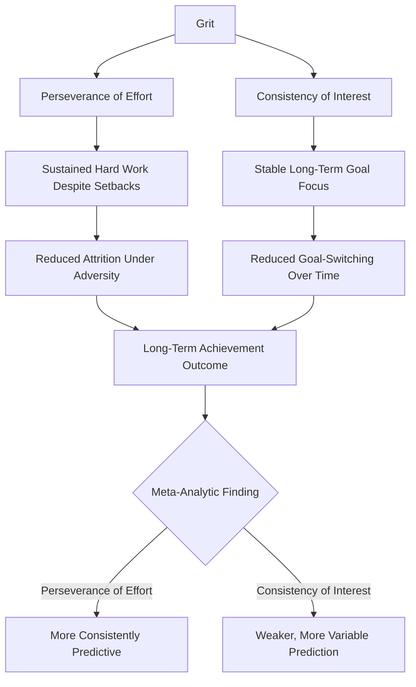

## Grit: Perseverance and Passion for Long-Term Goals

### Definitions

**Grit** is defined by Angela Duckworth as trait-level perseverance and passion for long-term goals — the tendency to sustain effort and interest toward challenging, long-horizon objectives despite failure, adversity, and plateaus in progress (Duckworth, Peterson, Matthews, & Kelly, 2007). Grit is explicitly conceptualized as involving two distinguishable components:

1. **Perseverance of effort**: sustained hard work and effort maintenance in the face of setbacks and difficulty.
2. **Consistency of interest**: maintaining focus on the same overarching goals or interests over extended periods (years, not weeks), rather than repeatedly shifting to new pursuits.

Grit is distinguished from raw intensity or short-term motivation by its emphasis on **stamina** — the capacity to maintain direction and effort over multi-year time horizons, potentially spanning a "marathon, not a sprint" framing of achievement.

---

### Theoretical Positioning

#### Relationship to the VIA Classification

Grit shares substantial conceptual overlap with, but is not identical to, the VIA character strength of **Perseverance** (under the Courage virtue). Duckworth's grit construct is generally treated as somewhat narrower and more specifically goal-directed (oriented toward a singular overarching long-term aim) than the VIA Perseverance strength, which is defined more broadly as finishing what one starts across varied tasks and contexts. [Inference] The precise conceptual boundary between grit and VIA Perseverance is debated; some researchers treat grit as essentially an elaborated, more narrowly operationalized version of the same underlying construct, while Duckworth's own formulation emphasizes the added "consistency of interest" component as a distinguishing feature not explicitly captured in the VIA Perseverance definition.

#### Relationship to Conscientiousness

Grit shows substantial empirical overlap with the Big Five personality trait of **Conscientiousness**, particularly its industriousness facet. Some researchers (e.g., Credé, Tynan, & Harms, 2017, in a meta-analysis) have argued that grit's incremental predictive validity beyond conscientiousness is limited once conscientiousness is statistically controlled, raising questions about whether grit constitutes a genuinely distinct construct or is largely redundant with an already well-established personality dimension. [Inference] This is an actively contested point in the literature: Duckworth and colleagues have responded that grit's specific "consistency of interest" dimension and its predictive utility in domain-specific, high-adversity contexts (e.g., military training attrition) offer value beyond general conscientiousness measures, but the debate over grit's incremental/discriminant validity remains unresolved rather than settled in either direction.

---

### Measurement

#### Grit Scale (Grit-O) and Short Grit Scale (Grit-S)

- **Original Grit Scale (Grit-O)**: 12 items (Duckworth et al., 2007), split evenly between the two subscales (Consistency of Interest and Perseverance of Effort), rated on a 5-point Likert scale.
- **Short Grit Scale (Grit-S)**: an 8-item refined version (Duckworth & Quinn, 2009) developed to improve psychometric properties (fit indices, item loadings) while reducing respondent burden; it is now more commonly used in research than the original 12-item version.
- Both scales produce a **total grit score** (average across all items) as well as separate subscale scores for Consistency of Interest and Perseverance of Effort, which show only moderate intercorrelation in most samples — a finding that has itself fueled debate about whether the two subscales should be treated as a single unified construct or examined separately, since they sometimes show different (or even divergent) predictive patterns across outcome studies. [Inference] The degree to which the two subscales function as a coherent single higher-order factor versus two more loosely related constructs varies somewhat across published factor-analytic studies.

---

### Empirical Findings

- Duckworth, Peterson, Matthews, and Kelly (2007) found that grit predicted educational attainment among adults, and predicted retention (avoiding attrition) among cadets at the U.S. Military Academy (West Point) during the demanding initial summer training period ("Beast Barracks"), and among National Spelling Bee finalists, where grit predicted the number of practice hours engaged in and final competition performance, generally outperforming or supplementing IQ-based predictions in these specific attrition/performance contexts.
- Subsequent replication and meta-analytic work (notably Credé, Tynan, & Harms, 2017) found a **weaker overall grit-performance relationship** than some earlier individual studies suggested, with the meta-analysis reporting the perseverance-of-effort subscale as more consistently predictive of performance/retention outcomes than the consistency-of-interest subscale, and with substantial overlap with conscientiousness once statistically accounted for. [Inference] This meta-analytic finding represents a meaningful empirical correction to some of the stronger claims found in earlier popular and academic treatments of grit; effect sizes for grit's predictive validity are generally described in more recent literature as small-to-moderate rather than large, and are context-dependent.
- Grit has been studied across varied domains including academic achievement, athletic performance, military attrition, and workplace retention, with predictive strength varying considerably by domain and outcome measure. [Unverified] grit's predictive utility appears to be domain- and context-dependent rather than uniformly strong across all achievement settings; claims of grit as a universally powerful predictor of success should be treated cautiously given the mixed subsequent replication record.

---

### Mechanisms Proposed to Underlie Grit's Effects

**Key Points**

- **Deliberate practice engagement**: grit is theorized to support sustained engagement in deliberate practice (effortful, feedback-guided skill refinement) over the extended timeframes typically required for expertise development (Ericsson's deliberate practice framework is often cited alongside grit research, though the two constructs originate from separate research traditions).
- **Resilience to setback-induced goal abandonment**: high perseverance-of-effort is theorized to reduce the likelihood that a single failure or plateau leads to premature goal abandonment, a mechanism conceptually related to broader resilience research.
- **Reduced "shiny object" goal-switching**: the consistency-of-interest component is theorized to protect against the diffusion of effort across too many simultaneously pursued goals, allowing deeper cumulative investment in a narrower set of pursuits. [Inference] whether consistency-of-interest functions primarily through this resource-concentration mechanism, or through other pathways (e.g., identity-goal alignment), is not definitively established.

---

### Grit Component Structure

---

### Grit vs. Conscientiousness Overlap (SVG)

<svg xmlns="http://www.w3.org/2000/svg" viewBox="0 0 500 300" font-family="sans-serif">
<text x="250" y="24" text-anchor="middle" font-size="16" font-weight="bold">Grit and Conscientiousness Overlap (svg_diagram)</text>
<circle cx="200" cy="170" r="110" fill="#D6EAF8" stroke="#2E86C1" fill-opacity="0.6" />
<circle cx="300" cy="170" r="110" fill="#D5F5E3" stroke="#28B463" fill-opacity="0.6" />

<text x="140" y="120" text-anchor="middle" font-size="12" font-weight="bold">Conscientiousness</text>

<text x="140" y="140" text-anchor="middle" font-size="10">Organization,</text>

<text x="140" y="155" text-anchor="middle" font-size="10">dutifulness,</text>

<text x="140" y="170" text-anchor="middle" font-size="10">self-discipline</text>

<text x="360" y="120" text-anchor="middle" font-size="12" font-weight="bold">Grit</text>

<text x="360" y="140" text-anchor="middle" font-size="10">Consistency</text>

<text x="360" y="155" text-anchor="middle" font-size="10">of interest over</text>

<text x="360" y="170" text-anchor="middle" font-size="10">years</text>

<text x="250" y="180" text-anchor="middle" font-size="10" font-weight="bold">Shared:</text>

<text x="250" y="196" text-anchor="middle" font-size="9">Perseverance of</text>

<text x="250" y="210" text-anchor="middle" font-size="9">effort / industriousness</text>

</svg>

---

### Interventions and Practical Applications

1. **Growth mindset pairing**: grit-building programs are frequently paired with Dweck's growth mindset framework, on the premise that believing ability is developable supports sustained effort in the face of setbacks — a common pairing in educational intervention design, though the two constructs originate from distinct research programs.
2. **Goal hierarchy and "grand goal" alignment exercises**: some applied programs have individuals map how daily/weekly tasks connect to a single overarching long-term goal, intended to reinforce the consistency-of-interest component.
3. **Deliberate practice structuring**: incorporating structured, feedback-rich practice routines within a chosen long-term pursuit, drawing on complementary expertise-development literature.
4. **School-based grit curricula**: implemented in some K-12 settings, though large-scale outcome evaluations have shown mixed results, and some researchers have specifically cautioned against treating grit interventions as a substitute for addressing structural/resource barriers to student achievement. [Unverified] the durability and magnitude of school-based grit intervention effects on academic outcomes remain contested, with some studies showing minimal or non-significant effects at scale.

**Example**

A graduate student pursuing a multi-year doctoral research program encounters a failed experiment after eighteen months of related work. High perseverance-of-effort would predict continued engagement with troubleshooting and refinement rather than abandoning the research direction; high consistency-of-interest would predict that the student's overarching research question or professional identity commitment remains stable, rather than the setback prompting a wholesale pivot to an unrelated research area or career path.

---

### Critiques and Limitations

- **Discriminant validity concerns**: as noted, grit's incremental predictive power beyond conscientiousness (and other established personality measures) is disputed in meta-analytic work, with some researchers arguing grit may be better understood as a rebranded or narrowly-operationalized facet of an existing trait rather than a novel construct.
- **Popularization outpacing evidence**: grit received extensive popular and educational-policy attention (notably following Duckworth's 2016 popular book and widely viewed talk) that in some cases outpaced the strength and consistency of the underlying peer-reviewed evidence base, a pattern the more recent meta-analytic and replication literature has partly corrected.
- **Structural/equity critiques**: some scholars have raised concern that grit-focused educational interventions risk implicitly placing responsibility for overcoming systemic or resource-based barriers onto individual student effort/perseverance, rather than addressing structural conditions — a critique aimed more at policy application than at the psychological construct itself.
- **Domain and context dependency**: predictive validity appears to vary meaningfully by domain (e.g., stronger findings in some military attrition and competitive contexts than in general academic GPA prediction across broad populations), cautioning against treating grit as a uniformly powerful predictor across all achievement contexts.

---

### Distinguishing Grit from Related Constructs

| Construct | Core Feature | Distinction from Grit |
| --- | --- | --- |
| VIA Perseverance | Finishing what one starts, broadly across tasks | Broader, not restricted to a single overarching long-term goal |
| Conscientiousness | Broad personality trait: organization, dutifulness, self-discipline | Grit's perseverance-of-effort facet substantially overlaps; conscientiousness is a broader, more established personality dimension |
| Growth mindset | Belief that ability/intelligence is developable through effort | A belief/cognitive construct, distinct from grit's trait-behavioral focus, though often paired in interventions |
| Self-control/self-regulation | Moment-to-moment impulse regulation | Shorter time-horizon regulatory process; grit concerns sustained multi-year goal pursuit |
| Resilience | Recovery/adaptation following adversity or trauma | Broader construct including recovery from setbacks generally, not restricted to long-term goal pursuit |

---

**Related Topics**

- The VIA Classification of 24 character strengths and six virtues (Perseverance strength)
- Strengths overuse, underuse, and the golden mean
- Growth mindset (Dweck) and implicit theories of ability
- Deliberate practice and expertise development
- Conscientiousness in the Big Five personality model
- Resilience and post-adversity recovery
- Goal-setting theory and long-term motivation