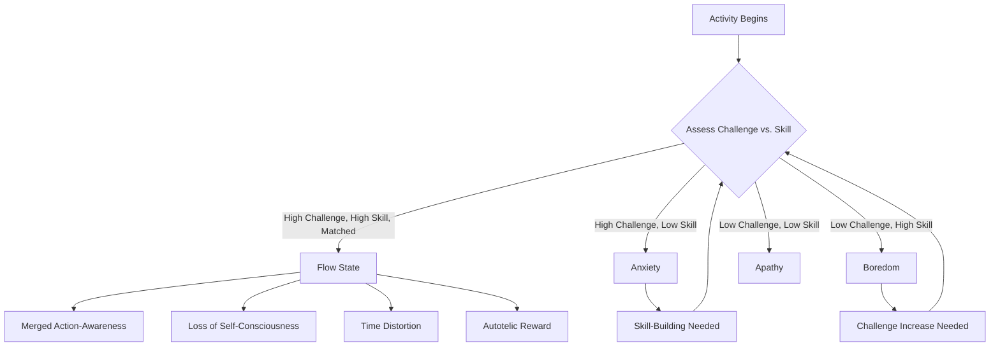

## Csikszentmihalyi's Concept of Flow and Optimal Experience

### Definitions

**Flow** is defined by Mihaly Csikszentmihalyi as a psychological state of complete absorption in an activity, characterized by intense focus, a merging of action and awareness, and a sense that the activity is intrinsically rewarding — often colloquially described as being "in the zone" (Csikszentmihalyi, 1975, 1990). Csikszentmihalyi termed this and related states **optimal experience**, positioning flow research as an investigation into the conditions under which human experience is subjectively most fulfilling, regardless of the specific activity or domain in which it occurs.

Flow is conceptualized as a distinct psychological state rather than a stable trait, though individuals vary in their **autotelic personality** — a general disposition toward entering flow states more readily and frequently across activities.

---

### Theoretical Origins and Methodology

Csikszentmihalyi's research program began with interviews and studies of individuals engaged in activities pursued for their own sake despite offering no obvious external reward (rock climbers, chess players, dancers, surgeons, composers), seeking to understand what made these activities so absorbing. This led to the development of the **Experience Sampling Method (ESM)**, in which participants carry pagers or devices that prompt them at random intervals throughout the day to report their current activity, mood, and subjective experience — a methodological innovation that became widely used across positive psychology and affective science more broadly, extending well beyond flow research specifically.

---

### The Nine Dimensions/Components of Flow

Csikszentmihalyi identified a consistent cluster of characteristics reported across flow experiences, often summarized as nine components:

1. **Challenge-skill balance**: the perceived challenge of the activity closely matches the individual's perceived skill level.
2. **Merging of action and awareness**: the activity becomes automatic; the person feels at one with what they are doing rather than consciously directing each step.
3. **Clear goals**: the activity has unambiguous, moment-to-moment objectives.
4. **Immediate and unambiguous feedback**: the person receives clear, real-time information about how they are doing.
5. **Concentration on the task at hand**: complete focus on the activity, with irrelevant stimuli filtered out.
6. **Sense of control**: a feeling of potential control over the activity and its outcome, without necessarily needing to actively exert control at every moment.
7. **Loss of self-consciousness**: reduced concern about self-presentation or ego-related evaluation during the activity.
8. **Transformation of time**: distorted subjective time perception, commonly experienced as time passing unusually quickly, though some flow accounts also describe momentary time-slowing in specific contexts.
9. **Autotelic experience**: the activity is experienced as intrinsically rewarding — worth doing for its own sake, independent of external outcomes.

[Inference] Not all nine components are necessarily present with equal intensity in every reported flow episode; the components are best understood as a characteristic cluster commonly co-occurring during flow, rather than nine strictly necessary and individually sufficient criteria that must all be simultaneously present at a fixed threshold.

---

### The Challenge-Skill Balance Model

The most frequently cited and empirically tested component is the **challenge-skill balance**, often visualized as a quadrant or channel model:

$$\text{Flow State} \approx f(\text{Challenge Level}, \text{Perceived Skill Level}), \quad \text{optimal when Challenge} \approx \text{Skill (both relatively high)}$$

Csikszentmihalyi's original and expanded models describe several possible experiential states depending on the relationship between challenge and skill:

| Challenge Level | Skill Level | Resulting State |
| --- | --- | --- |
| High | High (matched) | Flow |
| High | Low | Anxiety |
| Low | High | Boredom |
| Low | Low | Apathy |
| Moderate | High | Control |
| High | Moderate | Arousal |
| Moderate | Low | Worry |
| Low | Moderate | Relaxation |

This expanded eight-channel model (sometimes called the **flow channel model**) refines the original four-quadrant version by recognizing intermediate states beyond the four corners.

---

### Flow Channel Diagram

---

### Flow Channel Model (SVG)

<svg xmlns="http://www.w3.org/2000/svg" viewBox="0 0 500 500" font-family="sans-serif">
<text x="250" y="24" text-anchor="middle" font-size="16" font-weight="bold">Challenge-Skill Flow Channel (svg_diagram)</text>
<line x1="70" y1="440" x2="70" y2="60" stroke="#555" stroke-width="1.5" />
<line x1="70" y1="440" x2="450" y2="440" stroke="#555" stroke-width="1.5" />
<text x="260" y="470" text-anchor="middle" font-size="12">Skill Level →</text>
<text x="35" y="250" text-anchor="middle" font-size="12" transform="rotate(-90 35 250)">Challenge Level →</text>
<polygon points="70,440 450,60 420,60 70,410" fill="#D5F5E3" stroke="#28B463" stroke-width="1.5" fill-opacity="0.7" />
<text x="290" y="180" text-anchor="middle" font-size="13" font-weight="bold" fill="#196F3D">FLOW CHANNEL</text>

<text x="130" y="120" text-anchor="middle" font-size="12" fill="`#C0392B`" font-weight="bold">Anxiety</text>

<text x="130" y="138" text-anchor="middle" font-size="10">(high challenge,</text>

<text x="130" y="152" text-anchor="middle" font-size="10">low skill)</text>

<text x="370" y="400" text-anchor="middle" font-size="12" fill="`#7D6608`" font-weight="bold">Boredom</text>

<text x="370" y="418" text-anchor="middle" font-size="10">(low challenge,</text>

<text x="370" y="430" text-anchor="middle" font-size="10">high skill)</text>

</svg>

---

### Distinguishing Flow from Related Constructs

| Construct | Core Feature | Distinction from Flow |
| --- | --- | --- |
| Engagement (job/work) | Sustained vigor, dedication, absorption at work | Broader, less momentary; absorption is one shared sub-component |
| Mindfulness | Present-moment, non-judgmental, valence-neutral awareness | Mindfulness is intentionally cultivated attentional stance; flow is an emergent state tied to a specific activity's challenge-skill fit |
| Peak experience (Maslow) | Rare, profound, often mystical or transcendent momentary experience | Peak experiences are typically rarer and more intensely transformative; flow is more common and repeatable in everyday skilled activity |
| Hyperfocus | Intense, sometimes involuntary absorption, notably discussed in ADHD-related contexts | Flow is generally framed as a positively-valenced, autotelic, controllable state; hyperfocus framing in clinical contexts often emphasizes reduced voluntary control and less consistent positive valence |
| Zest (VIA strength) | General trait-level energy and enthusiasm across life activities | Broader dispositional trait; flow is an activity-specific momentary state |

---

### Empirical Findings

- Csikszentmihalyi and LeFevre (1989), using ESM, found that individuals reported flow experiences more frequently during work activities than during leisure activities in their sampled populations, despite generally reporting a *preference* for leisure — a counterintuitive finding sometimes referred to as the "paradox of work," attributed to work more often providing the requisite clear goals, feedback, and challenge-skill structuring that leisure activities (particularly passive leisure like television viewing) often lack.
- Multiple studies across domains (sports psychology, music performance, education, gaming) have found flow states associated with enhanced subjective enjoyment, and in various studies with improved performance outcomes, though the performance-flow relationship's causal direction (flow enabling better performance versus better performance/skill fluency enabling flow) is not always disentangled in correlational designs. [Inference] much of the flow-performance literature is correlational, and the extent to which flow is a *cause* versus a *concomitant/downstream marker* of high-skill, well-matched task engagement remains an open methodological question.
- Nakamura and Csikszentmihalyi (2002) reviewed evidence that flow experiences, aggregated over time, are associated with greater engagement, skill development (since flow tends to occur near the edge of current competence, encouraging skill growth to maintain the challenge-skill match), and overall life satisfaction — framing flow as a mechanism connecting momentary optimal experience to longer-term personal growth.
- Neurophysiological research on flow (e.g., studies using EEG examining prefrontal cortex activity) has proposed a **transient hypofrontality hypothesis** — the idea that flow involves temporary downregulation of certain prefrontal executive/self-monitoring functions, potentially explaining reduced self-consciousness and altered time perception during flow. [Unverified] the transient hypofrontality hypothesis remains a debated and only partially supported neurophysiological account; findings across studies using different methodologies (EEG, fMRI) are not fully consistent, and this should be treated as a candidate explanatory mechanism rather than an established fact.

---

### Applications

**Key Points**

- **Education**: flow theory has informed instructional design principles emphasizing appropriately calibrated challenge levels, clear learning objectives, and immediate feedback — seen in some adaptive learning technology and game-based learning design.
- **Sports psychology**: flow-inducing training and pre-performance routines are used by athletes and coaches aiming to support optimal in-competition performance states.
- **Workplace design and job crafting**: flow theory has informed job-design principles emphasizing task variety, clear goals, and skill-challenge matching as levers for engagement and intrinsic motivation.
- **Game design**: flow theory (particularly the challenge-skill balance) has been highly influential in video game design, informing difficulty-curve calibration intended to keep players within their individual flow channel as skill develops.
- **Clinical and therapeutic applications**: some positive psychology interventions incorporate flow-activity identification (helping clients identify and schedule activities that reliably produce flow) as a wellbeing-building strategy, distinct from purely hedonic pleasure-seeking activities.

**Example**

A novice rock climber attempting a route far beyond their current skill level is likely to experience anxiety (high challenge, low skill) rather than flow. As their skill develops through practice, routes of the same original difficulty level may shift into the flow channel (skill has "caught up" to challenge), while previously flow-inducing routes may become boring, prompting the climber to seek progressively harder routes — illustrating how flow is theorized to be a dynamic, developmentally responsive state that motivates continued skill growth rather than a fixed achievement.

---

### Critiques and Limitations

- **Measurement challenges**: flow is inherently a state characterized partly by reduced self-monitoring and self-consciousness, creating a methodological tension in measuring it via self-report, since the act of reflecting on and reporting the experience (particularly via in-the-moment ESM prompts) may itself interrupt or alter the state being measured. [Inference] this measurement paradox is widely acknowledged in the flow literature but not fully resolved methodologically; retrospective self-report after the fact is the more common practical compromise, with its own recall-bias limitations.
- **Component covariation debates**: some factor-analytic and psychometric work has questioned whether all nine components reliably co-occur as a single unified construct across different activities and populations, versus flow potentially being better represented by a smaller core set of components (e.g., challenge-skill balance, absorption, and enjoyment) with the remaining components more variably present. [Unverified] the degree of consensus on flow's precise factor structure across the broader research community.
- **Autotelic personality measurement**: the disposition toward frequent flow experience (autotelic personality) is less extensively and consistently measured across studies compared to state-level flow assessment, leaving open questions about how stable and well-validated this trait-level construct is relative to the momentary flow-state literature.
- **Possible overuse/dark-side considerations**: some applied and clinical discussions have raised the possibility that flow-seeking, particularly around certain highly engaging digital or gaming activities, could in some cases be associated with excessive engagement patterns, though this connection is more speculative and derived from adjacent behavioral-addiction literature than from direct, dedicated flow-research studies. [Speculation] the relationship between flow proneness and problematic/excessive engagement patterns in specific activities (e.g., gaming) is not a well-established finding within the core flow research literature itself.

---

**Related Topics**

- Experience Sampling Method (ESM) methodology
- Challenge-skill balance and instructional/game design
- Work engagement (Schaufeli's vigor-dedication-absorption model)
- Autotelic personality
- Broaden-and-build theory and positive emotion
- Intrinsic motivation and self-determination theory
- Peak experience (Maslow)