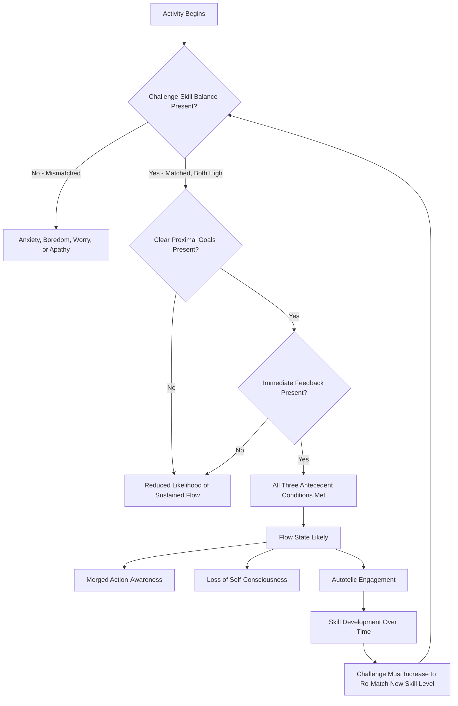

## The Challenge-Skill Balance and Conditions for Flow

### Definitions

The **challenge-skill balance** is the central structural condition proposed by Csikszentmihalyi (1975, 1990) for the occurrence of flow: the perceived difficulty of a task must closely match the individual's perceived level of skill for that task, with both elements positioned at a relatively high (rather than low) absolute level. This is distinguished from the broader set of **antecedent conditions for flow** — the fuller collection of environmental and task features (clear goals, immediate feedback, and the challenge-skill match itself) that jointly increase the likelihood of a flow state occurring, as opposed to the nine *experiential components* that describe what flow feels like once it occurs (see companion topic on flow and optimal experience).

---

### Theoretical Structure of the Challenge-Skill Relationship

#### The Original Four-Channel Model

Csikszentmihalyi's earliest formal model (1975) proposed four possible experiential outcomes from the intersection of perceived challenge and perceived skill:

| Challenge | Skill | State |
| --- | --- | --- |
| High | High | Flow |
| High | Low | Anxiety |
| Low | High | Boredom |
| Low | Low | Apathy |

#### The Expanded Eight-Channel Model

Massimini and Carli (1988), working with Csikszentmihalyi, refined this into an **eight-channel model**, recognizing that challenge and skill each vary continuously (not just as binary high/low categories) and that intermediate combinations produce distinguishable experiential states beyond the original four corners:

| Challenge | Skill | State |
| --- | --- | --- |
| High | High (well matched) | Flow |
| Moderate | High | Control |
| High | Moderate | Arousal |
| Low | High | Boredom |
| Moderate | Low | Worry |
| Low | Moderate | Relaxation |
| High | Low | Anxiety |
| Low | Low | Apathy |

$$\text{Experiential State} = f(C, S), \quad \text{Flow} \approx \{(C, S) : C \approx S, \text{ both above individual's baseline}\}$$

where $C$ is perceived challenge and $S$ is perceived skill, both typically measured relative to the individual's own average challenge/skill levels rather than on an absolute external scale — a methodologically important point, since the model is inherently **person-relative**: what counts as "high challenge" for a novice may register as "low challenge" for an expert in the same objective task.

[Inference] The eight-channel model's specific boundary lines between adjacent states (e.g., precisely where "arousal" ends and "flow" begins) are conceptual and heuristic rather than derived from a fixed, universally validated numerical threshold; empirical operationalizations vary across studies in how finely they subdivide the challenge-skill space.

---

### The Broader Set of Antecedent Conditions

While the challenge-skill balance is the most emphasized and tested condition, Csikszentmihalyi's fuller model specifies three commonly cited antecedent conditions that jointly support flow occurrence:

1. **Challenge-skill balance**: as detailed above — the core structural condition.
2. **Clear proximal goals**: the activity provides an unambiguous sense of what needs to be done moment-to-moment (distinct from long-term life goals; these are task-level, immediate goals).
3. **Immediate and unambiguous feedback**: the activity provides continuous, real-time information about performance, allowing micro-adjustments without requiring conscious deliberation.

**Key Points**

- These three conditions are theorized to operate synergistically: a well-matched challenge-skill level without clear goals or feedback (e.g., an ambiguous, open-ended creative task with a well-matched difficulty level) may still fail to reliably produce flow, since the person lacks the moment-to-moment guidance needed to sustain the merged action-awareness component.
- Activities that are frequently cited as naturally strong on all three conditions simultaneously (rock climbing, musical performance, many sports, some video games) are disproportionately represented in flow research precisely because their structural features make flow more reliably inducible and observable, which introduces a possible **sampling bias** toward these domains in the broader evidence base. [Inference] activities lower in inherent goal-clarity/feedback structure (e.g., open-ended writing, abstract theoretical work) may still produce flow, but may do so less reliably or may require the individual to self-impose structure (e.g., self-set sub-goals, self-monitoring checkpoints) to approximate these conditions.

---

### Antecedent Conditions Flow Diagram

---

### Eight-Channel Model (SVG)

<svg xmlns="http://www.w3.org/2000/svg" viewBox="0 0 560 560" font-family="sans-serif">
<text x="280" y="24" text-anchor="middle" font-size="16" font-weight="bold">Eight-Channel Challenge-Skill Model (svg_diagram)</text>
<line x1="280" y1="280" x2="280" y2="60" stroke="#ccc" stroke-width="1" />
<line x1="280" y1="280" x2="480" y2="139" stroke="#ccc" stroke-width="1" />
<line x1="280" y1="280" x2="500" y2="280" stroke="#ccc" stroke-width="1" />
<line x1="280" y1="280" x2="480" y2="421" stroke="#ccc" stroke-width="1" />
<line x1="280" y1="280" x2="280" y2="500" stroke="#ccc" stroke-width="1" />
<line x1="280" y1="280" x2="80" y2="421" stroke="#ccc" stroke-width="1" />
<line x1="280" y1="280" x2="60" y2="280" stroke="#ccc" stroke-width="1" />
<line x1="280" y1="280" x2="80" y2="139" stroke="#ccc" stroke-width="1" />
<circle cx="280" cy="280" r="8" fill="#888" />

<text x="280" y="70" text-anchor="middle" font-size="12" font-weight="bold" fill="`#196F3D`">Flow</text>

<text x="470" y="145" text-anchor="middle" font-size="11" fill="`#1F618D`">Control</text>

<text x="505" y="284" text-anchor="middle" font-size="11" fill="`#B7950B`">Arousal</text>

<text x="470" y="430" text-anchor="middle" font-size="11" fill="`#C0392B`">Anxiety</text>

<text x="280" y="518" text-anchor="middle" font-size="11" fill="`#7B241C`">Worry</text>

<text x="70" y="430" text-anchor="middle" font-size="11" fill="`#616A6B`">Apathy</text>

<text x="45" y="284" text-anchor="middle" font-size="11" fill="`#B9770E`">Boredom</text>

<text x="70" y="145" text-anchor="middle" font-size="11" fill="`#7D3C98`">Relaxation</text>

</svg>

---

### Empirical Evidence

- Csikszentmihalyi and Csikszentmihalyi (1988) and subsequent ESM-based studies found that self-reported flow was most frequently reported during time segments where participants rated both challenge and skill as above their personal average, consistent with the core model prediction.
- Massimini, Csikszentmihalyi, and Carli (1987) provided empirical support for the eight-channel refinement, showing that intermediate challenge-skill combinations (e.g., moderate challenge with high skill) were associated with intermediate, distinguishable affective profiles (e.g., "control") rather than simply falling into one of the four original broad quadrants.
- Studies in educational and workplace settings applying challenge-skill balance principles to task design have generally found associations between better challenge-skill matching and higher reported engagement and enjoyment, though the specific magnitude of these associations varies across study designs and populations. [Inference] much of this applied literature is correlational or quasi-experimental rather than fully randomized controlled, since experimentally manipulating "true" perceived challenge-skill balance across many participants and task types presents practical difficulties.
- Some sport psychology research (e.g., Jackson & Csikszentmihalyi, 1999, in their applied flow-in-sport work) has used the challenge-skill framework to explain variability in athletes' flow reports across different competitive contexts, finding that flow reports were more frequent in competitions perceived as appropriately, rather than overwhelmingly or insufficiently, demanding relative to the athlete's current form.

---

### Dynamic Nature of the Challenge-Skill Relationship

**Key Points**

- The challenge-skill balance is not static: as skill increases through repeated engagement (partly driven by the growth-promoting feedback loop inherent in flow itself), the same objective challenge level tends to shift from the flow channel toward boredom, creating pressure — theorized by Csikszentmihalyi to be intrinsically motivating — to seek increased challenge to re-establish the flow-conducive match.
- This dynamic is proposed as a key mechanism by which flow contributes to long-term **complexity of consciousness** and skill development, since sustaining flow over time requires continuous upward recalibration of both challenge and skill, rather than settling into a static comfort zone.
- Conversely, if challenge escalates faster than skill development can keep pace (e.g., a person taking on an assignment substantially beyond current competence), the same mechanism predicts a shift toward anxiety rather than continued flow, illustrating why deliberately structured, incremental challenge escalation is a common design principle in domains applying flow theory (education, game design, coaching).

**Example**

A person learning to play chess initially finds games against a moderately skilled opponent both challenging and engaging (flow). As their skill improves through practice, repeated games against that same opponent begin to feel too easy, shifting the experience toward boredom (skill now exceeds challenge). To re-enter the flow channel, the player must seek a more skilled opponent or a more complex challenge (e.g., studying more advanced tactics) — illustrating the self-reinforcing challenge-escalation dynamic the model predicts.

---

### Applications of the Challenge-Skill Principle

- **Instructional design**: adaptive learning systems that dynamically adjust task difficulty based on real-time learner performance are directly informed by challenge-skill balance principles, aiming to keep learners within their individual flow channel rather than allowing sustained boredom (task too easy) or anxiety (task too hard).
- **Game design**: difficulty curves, adaptive AI opponents, and tiered level progression in video games are commonly explicitly designed around maintaining challenge-skill balance as player skill develops over a play session or across a game's full progression.
- **Workplace task design and job crafting**: matching employee task assignments to current skill level, with incremental challenge increases as competence grows, is a design principle drawn from flow theory applied to job design and employee engagement strategies.
- **Coaching and skill acquisition**: coaches in sports, music, and other skill domains often implicitly or explicitly apply challenge-skill balance principles when sequencing practice difficulty to maintain athlete/student engagement and motivation.

---

### Distinguishing Challenge-Skill Balance from Related Constructs

| Construct | Core Feature | Distinction |
| --- | --- | --- |
| Zone of Proximal Development (Vygotsky) | The gap between what a learner can do alone versus with guidance | A developmental/educational construct with conceptual overlap (both emphasize appropriately calibrated difficulty) but originating from a distinct theoretical tradition (sociocultural learning theory, not flow research) |
| Yerkes-Dodson Law | Optimal arousal level for performance follows an inverted-U relative to task difficulty | Focuses on arousal-performance relationship broadly; challenge-skill balance is specifically about subjective experiential state (flow) rather than performance optimization per se, though the two literatures share conceptual affinities |
| Self-efficacy (Bandura) | Belief in one's capability to execute a specific task | A cognitive appraisal construct that likely influences perceived skill within the challenge-skill model, but is conceptually distinct from the challenge-skill balance itself |
| Deliberate practice (Ericsson) | Structured, effortful practice at the edge of current ability with feedback | Shares the "edge of current ability" emphasis with flow's challenge-skill balance, but deliberate practice is explicitly effortful and not necessarily experienced as intrinsically enjoyable in the moment, whereas flow is defined partly by its autotelic, enjoyable quality |

---

### Limitations and Measurement Considerations

- **Person-relative measurement complexity**: because challenge and skill are typically assessed relative to an individual's own baseline (rather than an absolute external scale), cross-person and cross-study comparisons of "challenge-skill balance" require careful methodological standardization, and inconsistent operationalization across studies complicates direct comparison of findings.
- **Momentary self-report limitations**: as with flow more broadly, in-the-moment ESM assessment of challenge and skill perception may be disrupted by the assessment process itself (interrupting the very state being measured), and retrospective assessment introduces recall-based limitations.
- **Boundary precision**: the exact boundaries between adjacent channels in the eight-channel model (e.g., precisely where "control" transitions into "flow") are conceptually described rather than fixed by a validated numerical cutoff, meaning channel classification in empirical studies often relies on researcher-defined operational thresholds that can vary across studies. [Unverified] the degree of methodological standardization across the broader challenge-skill measurement literature.

---

**Related Topics**

- Csikszentmihalyi's concept of flow and optimal experience
- Experience Sampling Method (ESM) methodology
- Zone of Proximal Development (Vygotsky)
- Deliberate practice and expertise development
- Self-efficacy theory (Bandura)
- Adaptive learning and instructional design
- Autotelic personality