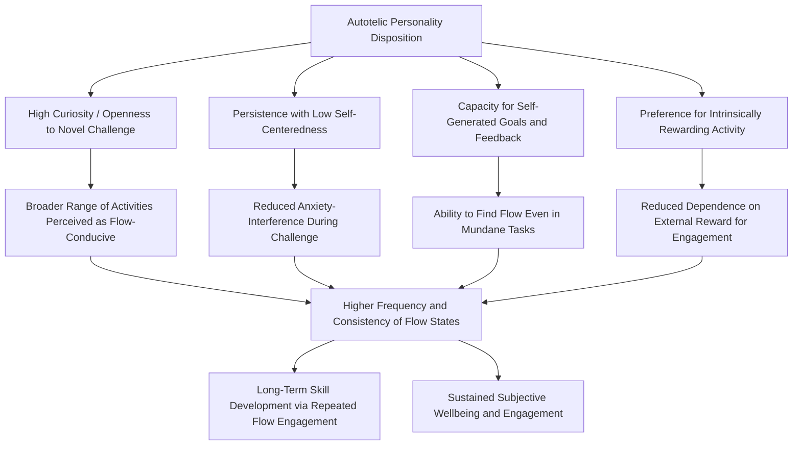

## The Autotelic Personality

### Definitions

The **autotelic personality** is a construct proposed by Mihaly Csikszentmihalyi describing a relatively stable individual-difference disposition toward experiencing flow more frequently, more easily, and across a broader range of activities than is typical (Csikszentmihalyi, 1975, 1990). The term derives from the Greek roots *auto* (self) and *telos* (goal), reflecting the underlying idea that autotelic individuals tend to find intrinsic reward and purpose in activities for their own sake, rather than depending primarily on external outcomes or rewards to sustain engagement.

This construct distinguishes flow as a **state** (a momentary psychological condition arising from specific activity conditions, particularly the challenge-skill balance) from the autotelic personality as a **trait-like disposition** that makes an individual more prone to entering and sustaining that state across diverse contexts.

---

### Theoretical Characteristics

Csikszentmihalyi and colleagues (notably Csikszentmihalyi, Rathunde, & Whalen, 1993, in their study of talented adolescents) proposed several characteristic features associated with the autotelic personality:

1. **High curiosity and interest in the world**: a generalized openness to engaging with novel challenges and activities.
2. **Persistence with low self-centeredness**: sustained engagement combined with reduced preoccupation with ego-protective self-monitoring or self-consciousness during activity.
3. **Low self-interest paired with high engagement**: paradoxically, autotelic individuals are theorized to be *less* driven by self-referential concerns (status, external validation) while simultaneously investing more fully in the activity itself.
4. **Capacity to find flow in mundane or ordinary tasks**: rather than requiring inherently dramatic or high-stimulation activities, individuals high in autotelic personality are theorized to be capable of structuring even routine tasks in ways that support flow conditions (self-set goals, self-monitored feedback).
5. **Intrinsic motivation orientation**: a general preference for and gravitation toward activities pursued for their own sake, consistent with (though not identical to) the broader intrinsic motivation construct from self-determination theory (Deci & Ryan, 1985).

[Inference] These characteristics are drawn primarily from Csikszentmihalyi's qualitative and theoretical writing and associated smaller empirical studies rather than from a single large, universally standardized personality-inventory validation; the autotelic personality construct has a less extensively developed and less widely replicated psychometric literature than more established personality frameworks such as the Big Five.

---

### Relationship to Established Personality Frameworks

#### Overlap with the Big Five

The autotelic personality shares conceptual territory with several established Big Five facets, though it has not been definitively reduced to or fully mapped onto any single existing trait:

| Big Five Dimension | Conceptual Overlap with Autotelic Personality |
| --- | --- |
| Openness to Experience | Curiosity, interest in novel challenges |
| Conscientiousness | Persistence, sustained task engagement |
| (Low) Neuroticism | Reduced self-consciousness, lower anxiety interference during challenge |
| Extraversion | Mixed/unclear overlap; flow-conducive engagement is not inherently social |

[Inference] Whether the autotelic personality represents a genuinely distinct trait construct, an emergent combination of existing Big Five facets, or largely a relabeling of already-established traits (a critique structurally similar to debates raised about grit's relationship to conscientiousness) is not fully resolved in the literature; direct large-sample psychometric studies disentangling autotelic personality from the Big Five are comparatively limited relative to the broader flow-state literature.

#### Relationship to Intrinsic Motivation and Self-Determination Theory

The autotelic personality is conceptually adjacent to, but not identical with, the broader construct of **intrinsic motivation** from self-determination theory (Deci & Ryan, 2000). Intrinsic motivation is typically framed as need-satisfaction-driven (autonomy, competence, relatedness), applicable to specific activities or domains, whereas the autotelic personality is framed by Csikszentmihalyi as a more generalized, cross-domain disposition toward finding activities self-rewarding, particularly through the specific mechanism of flow-conducive engagement (attention structuring, goal-setting, feedback-seeking) rather than needs-satisfaction per se.

---

### Measurement Approaches

- **Flow Questionnaire and related self-report measures**: some studies operationalize autotelic personality indirectly, via aggregated frequency and intensity of self-reported flow experiences across repeated ESM sampling occasions, treating a consistently high flow-frequency profile as a proxy indicator of autotelic disposition.
- **Autotelic Personality Questionnaire (and similar instruments)**: several researchers (e.g., Tse, Nakamura, & Csikszentmihalyi, in more recent work; also earlier attempts by other flow researchers) have developed direct self-report scales attempting to measure the disposition itself (e.g., items assessing tendency to set self-generated goals, capacity to find engagement in mundane tasks), though these instruments have a less extensive validation history and less widespread adoption than the core flow-state measures. [Unverified] no single autotelic personality instrument has achieved the level of psychometric consensus and cross-study standardization seen with, for example, the Big Five inventories or even the more established Grit Scale.
- **Talented teens studies methodology**: Csikszentmihalyi, Rathunde, and Whalen's (1993) foundational study of talented adolescents combined ESM data (frequency/quality of flow experiences) with interview-based qualitative coding to characterize autotelic patterns, an approach that, while rich, is more resource-intensive and less standardized than typical personality-inventory-based trait research.

---

### Autotelic Personality Conceptual Model

---

### Autotelic vs. Exotelic Orientation (SVG)

<svg xmlns="http://www.w3.org/2000/svg" viewBox="0 0 600 260" font-family="sans-serif">
<text x="300" y="24" text-anchor="middle" font-size="16" font-weight="bold">Autotelic vs. Exotelic Motivational Orientation (svg_diagram)</text>
<rect x="40" y="60" width="230" height="160" rx="10" fill="#D5F5E3" stroke="#28B463" />
<text x="155" y="88" text-anchor="middle" font-size="13" font-weight="bold">Autotelic</text>
<text x="155" y="115" text-anchor="middle" font-size="10">Activity pursued</text>
<text x="155" y="130" text-anchor="middle" font-size="10">for its own sake</text>
<text x="155" y="155" text-anchor="middle" font-size="10">Self-generated goals</text>
<text x="155" y="175" text-anchor="middle" font-size="10">Low ego-involvement</text>
<text x="155" y="195" text-anchor="middle" font-size="10">Broad flow capacity</text>
<rect x="330" y="60" width="230" height="160" rx="10" fill="#FADBD8" stroke="#C0392B" />
<text x="445" y="88" text-anchor="middle" font-size="13" font-weight="bold">Exotelic</text>
<text x="445" y="115" text-anchor="middle" font-size="10">Activity pursued for</text>
<text x="445" y="130" text-anchor="middle" font-size="10">external outcome</text>
<text x="445" y="155" text-anchor="middle" font-size="10">Externally imposed goals</text>
<text x="445" y="175" text-anchor="middle" font-size="10">Reward-dependent</text>
<text x="445" y="195" text-anchor="middle" font-size="10">Narrower flow capacity</text>
</svg>

---

### Empirical Findings

- Csikszentmihalyi, Rathunde, and Whalen (1993), in their longitudinal study of academically and artistically talented high school students, found that students who exhibited more autotelic-consistent patterns (frequent flow reports across both required and self-chosen activities, capacity to derive engagement from schoolwork rather than only from preferred hobbies) were more likely to sustain long-term commitment to and development within their talent domain, compared to talented peers whose engagement was more narrowly reward- or recognition-dependent.
- Studies applying the concept in workplace contexts (e.g., research reviewed by Nakamura & Csikszentmihalyi, 2002) have suggested that employees with more autotelic-consistent engagement patterns report higher job satisfaction and are more likely to experience flow during work tasks specifically, though dedicated large-sample workplace studies isolating the autotelic personality construct (as distinct from general work engagement or intrinsic motivation measures) remain comparatively limited. [Unverified] the incremental predictive validity of autotelic personality measures specifically, above and beyond established engagement and intrinsic motivation constructs, in workplace outcome research.
- Direct large-scale psychometric validation of dedicated autotelic personality scales, and large replicated studies establishing clear real-world outcome differences between high- and low-autotelic individuals across varied life domains, are less extensive than for many other individual-difference constructs discussed in the broader positive psychology literature (e.g., grit, character strengths, optimism). [Inference] the autotelic personality remains a theoretically influential but comparatively under-operationalized construct relative to its prominence in popular and applied discussions of flow.

---

### Practical Applications and Development

**Key Points**

- Csikszentmihalyi proposed that autotelic tendencies, while showing individual variation likely influenced by both temperament and developmental experience, are not considered entirely fixed — some flow-conducive skills (self-goal-setting, structuring feedback, sustained attention) are theorized to be learnable and improvable through deliberate practice of flow-supporting habits, even for individuals who do not naturally exhibit a strong autotelic disposition. [Inference] the extent to which autotelic disposition can be meaningfully "trained" versus reflecting a more fixed underlying temperament is not conclusively established; this claim is more programmatic/aspirational in Csikszentmihalyi's applied writing than confirmed by controlled longitudinal intervention studies.
- **Self-set goal practice**: deliberately structuring ambiguous or open-ended tasks with self-imposed sub-goals and checkpoints, mimicking the goal-clarity antecedent condition for flow even in naturally low-structure activities.
- **Attention training**: mindfulness and concentration practices are sometimes proposed as complementary skill-building activities that may support the sustained, filtered attention characteristic of both flow states and autotelic engagement generally, though this specific causal link (mindfulness training directly building autotelic disposition) is more theoretically proposed than rigorously demonstrated.
- **Finding flow in required/mundane tasks**: coaching approaches drawing on the autotelic personality concept sometimes focus on helping individuals reframe or restructure necessary but inherently low-stimulation tasks (e.g., routine administrative work) with self-generated challenge and feedback elements, to approximate flow-conducive conditions even in objectively unstimulating contexts.

**Example**

Two employees are assigned the same routine data-entry task. One experiences it as tedious and disengaging throughout (an exotelic orientation, dependent on external reward/completion rather than task-intrinsic engagement). The other, exhibiting more autotelic-consistent tendencies, spontaneously sets personal micro-goals (e.g., improving speed or accuracy against their own prior performance) and monitors real-time feedback against those self-generated benchmarks — restructuring an objectively low-stimulation task into one with the goal-clarity and feedback conditions that support at least a modest flow-like engagement state.

---

### Distinguishing Autotelic Personality from Related Constructs

| Construct | Core Feature | Distinction |
| --- | --- | --- |
| Flow (state) | Momentary absorbed engagement in a specific activity | Autotelic personality is the disposition toward experiencing flow frequently/broadly; flow itself is the momentary state |
| Intrinsic motivation (SDT) | Engagement driven by autonomy/competence/relatedness satisfaction | Broader motivational framework applicable per-activity; autotelic personality is framed as a more generalized cross-domain disposition specifically tied to flow-conducive engagement patterns |
| Openness to Experience (Big Five) | General trait curiosity and openness to novel experience | Conceptually overlapping component, but autotelic personality additionally emphasizes persistence, low self-centeredness, and self-structuring of goals/feedback |
| Growth mindset (Dweck) | Belief that ability is developable through effort | A cognitive belief construct about ability, distinct from the motivational/attentional orientation described by autotelic personality |
| Zest (VIA strength) | General trait-level energy and enthusiasm | Broader affective-energetic trait; autotelic personality specifically concerns capacity to structure activities for intrinsic, flow-conducive engagement |

---

### Limitations and Critiques

- **Underdeveloped psychometric base**: relative to its theoretical prominence, the autotelic personality lacks a single widely adopted, extensively validated, and cross-culturally tested measurement instrument comparable to those available for constructs like grit, the Big Five, or the VIA character strengths.
- **Circularity risk in operationalization**: when autotelic personality is measured primarily via aggregated flow-frequency self-report, there is a risk of definitional circularity (defining the trait by its own presumed outcome — frequent flow — rather than via independent trait markers), a methodological concern noted by some researchers examining the construct critically. [Inference] this circularity concern applies most directly to studies that infer autotelic personality solely from flow-frequency data rather than from independently validated trait items; studies using dedicated autotelic-personality questionnaires are less vulnerable to this specific critique, though those instruments have their own more limited validation history.
- **Popularization versus rigor gap**: as with several other positive-psychology individual-difference constructs (e.g., grit), the autotelic personality has received substantial attention in popular and applied writing that in some respects has outpaced the depth and consistency of large-sample, replicated empirical validation specific to the construct itself.

---

**Related Topics**

- Csikszentmihalyi's concept of flow and optimal experience
- The challenge-skill balance and conditions for flow
- Self-determination theory and intrinsic motivation
- Big Five personality traits (Openness, Conscientiousness)
- Grit: perseverance and passion for long-term goals
- Experience Sampling Method (ESM) methodology
- Mindfulness and attentional training