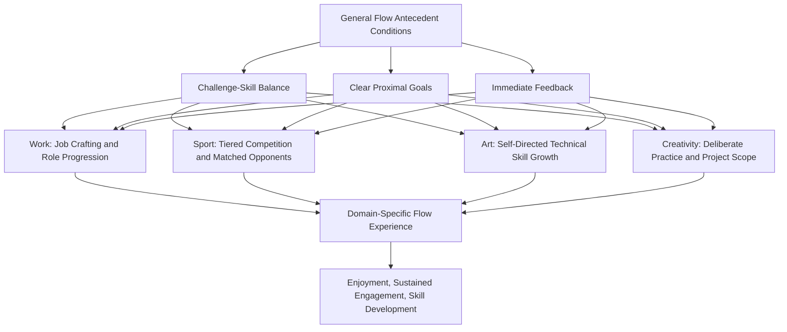

## Flow in Work, Sport, Art, and Creativity

### Definitions

This topic examines the **domain-specific application and manifestation of flow theory** (Csikszentmihalyi, 1975, 1990) across four commonly studied contexts — occupational/work settings, athletic/sport performance, artistic practice, and creative production — exploring how the general challenge-skill balance and antecedent conditions for flow (see companion topics) are structured, studied, and applied differently across these domains, along with domain-specific empirical findings and design implications.

---

### Flow in Work Contexts

#### The "Paradox of Work" Finding

Csikszentmihalyi and LeFevre's (1989) foundational Experience Sampling Method (ESM) study found that participants reported flow experiences more frequently during work activities than during leisure activities, despite generally reporting a stated *preference* for leisure over work when queried directly. This counterintuitive pattern — termed the **paradox of work** — is theorized to arise because work more often naturally provides the antecedent conditions for flow (clear goals, structured feedback, and skill-matched challenge) than unstructured leisure time, particularly passive leisure activities such as television viewing, which tend to involve low challenge and minimal skill deployment.

#### Job Design and Flow

**Key Points**

- Job characteristics theory (Hackman & Oldham, 1976), developed independently of flow research, shares substantial conceptual overlap with flow's antecedent conditions — task identity, skill variety, and feedback from the job are structurally similar to flow's clear-goals and immediate-feedback requirements.
- Applied organizational research has used flow theory to inform **job crafting** interventions, in which employees restructure aspects of their role (task sequencing, self-imposed sub-goals, feedback-seeking behavior) to better approximate flow-conducive conditions, particularly for roles that are otherwise low in inherent structure or variety.
- Studies examining flow frequency across occupations have generally found that roles combining substantial autonomy with clear performance feedback (e.g., certain skilled trades, some creative and technical professions) report more frequent flow than roles characterized by either excessive external control (limiting the sense of control component) or highly repetitive, low-challenge tasks (more likely to produce boredom). [Inference] cross-occupational comparisons of flow frequency are complicated by differences in ESM sampling methodology, occupational self-selection effects (people higher in autotelic disposition may self-select into flow-conducive occupations), and measurement inconsistency across studies.

---

### Flow in Sport

#### Application to Athletic Performance

Sport psychology has been one of the most active applied domains for flow research, given competitive sport's naturally strong alignment with flow's antecedent conditions: clear goals (win, score, complete the routine), immediate feedback (scoreboards, timing, direct sensory feedback from performance), and a competitive structure that often naturally calibrates challenge to skill level (matched opponents, tiered competition levels).

- **Jackson and Csikszentmihalyi's (1999) applied flow-in-sport research** developed sport-specific flow measurement instruments (e.g., the Flow State Scale, later revised as the FSS-2, and the Dispositional Flow Scale, DFS-2) adapting the nine flow components specifically to athletic contexts.
- Flow in sport is often studied in relation to the concept of **"being in the zone"** — a colloquial athletic term substantially overlapping with, though not always terminologically identical to, the academic flow construct.
- Pre-performance routines, mental rehearsal, and attentional-focus training used by athletes and sport psychologists are frequently explicitly informed by flow-antecedent principles, particularly aiming to establish clear task focus and reduce self-consciousness-inducing distraction before and during competition.

#### Empirical Findings in Sport

- Multiple studies (reviewed in Swann, Piggott, Crust, Keegan, & Hemmings, 2015, and related sport-flow literature) have found associations between self-reported flow states and both subjective enjoyment and, in various studies, objective performance outcomes, though — as with the broader flow-performance literature — causal direction (flow enabling performance versus skilled, well-matched performance producing flow) is not consistently disentangled in correlational sport studies. [Inference] much of the sport-flow literature relies on retrospective self-report following competition, introducing potential recall bias and difficulty establishing precise temporal/causal sequencing between flow onset and performance quality.
- Some qualitative research on elite athletes has described flow states associated with markedly reduced conscious, deliberate control over movement (an "automatic," highly practiced execution quality), consistent with flow's merged action-awareness component, though this pattern is most clearly documented in highly skilled, extensively trained athletes rather than novices.

---

### Flow in Art and Aesthetic Practice

Csikszentmihalyi's earliest flow research specifically included studies of visual artists and other creative practitioners, examining the felt experience of sustained creative absorption:

- Artistic practice often naturally exhibits several flow-conducive features: self-set goals (the artist determines the immediate objective — a particular brushstroke, compositional choice), relatively immediate sensory/visual feedback (seeing the emerging work develop in real time), and a challenge level that scales with the artist's developing technical skill.
- Csikszentmihalyi (1990) specifically noted the frequent observation that visual artists often report strong absorption and reduced self-consciousness *during* the act of creation, but comparatively less sustained interest or attachment to a completed piece afterward — interpreted as evidence that the *process* itself (autotelic engagement), rather than the external outcome or product, is what sustains the flow-conducive intrinsic reward in artistic practice.
- Musical performance and composition are similarly studied flow-conducive domains, given music's inherent real-time feedback structure (immediate auditory feedback on execution) and scalable technical challenge.

---

### Flow in Creativity and Creative Cognition

**Key Points**

- Flow is theorized to support certain phases of the creative process, particularly extended, absorbed engagement during **elaboration and execution** phases of creative work, though its relationship to earlier creative-process phases (initial idea generation, incubation) is less clearly or consistently established. [Unverified] whether flow specifically enhances idea-generation/divergent-thinking phases of creativity, as opposed to primarily supporting sustained execution of already-conceived creative work, remains an open and only partially resolved question in the creativity-flow literature.
- The relationship between flow and creative *output quality* (as opposed to subjective creative engagement/enjoyment) is empirically less consistently established than the relationship between flow and enjoyment or engagement more broadly; some studies find positive associations between flow and rated creative output quality, while others find flow more reliably predicts subjective creative satisfaction than externally-rated creative quality. [Inference] this divergence may partly reflect the distinct methodological challenge of measuring creative "quality" objectively, compared to the more straightforward self-report measurement of subjective flow experience and enjoyment.
- Csikszentmihalyi's later work (*Creativity: Flow and the Psychology of Discovery and Invention*, 1996) extended flow theory into a broader systems model of creativity, examining eminent creative individuals across domains (science, art) and their reported patterns of flow-conducive absorbed engagement during their most productive periods.

---

### Domain Comparison Table

| Domain | Typical Goal Clarity | Typical Feedback Immediacy | Common Challenge-Skill Calibration Mechanism |
| --- | --- | --- | --- |
| Work | Variable; often externally structured | Variable; often delayed (e.g., periodic performance review) | Job crafting, task redesign, promotion/role progression |
| Sport | High (win, score, complete routine) | High (immediate sensory/competitive feedback) | Tiered competition levels, matched opponents, skill progression |
| Art | Self-generated, moment-to-moment | High (immediate sensory feedback from the emerging work) | Self-directed technical skill development, medium/subject complexity choice |
| Creativity (general) | Variable; often self-generated in early phases, clearer in execution phases | Variable; often delayed for evaluation of final creative quality | Deliberate practice, project scope selection, iterative refinement |

---

### Domain-Specific Flow Conditions Diagram

---

### Domains of Flow (SVG)

<svg xmlns="http://www.w3.org/2000/svg" viewBox="0 0 640 320" font-family="sans-serif">
<text x="320" y="24" text-anchor="middle" font-size="16" font-weight="bold">Flow Across Domains (svg_diagram)</text>
<circle cx="320" cy="170" r="55" fill="#F4D03F" stroke="#B7950B" />
<text x="320" y="165" text-anchor="middle" font-size="12" font-weight="bold">Flow</text>
<text x="320" y="180" text-anchor="middle" font-size="11">Antecedents</text>
<circle cx="140" cy="90" r="65" fill="#D6EAF8" stroke="#2E86C1" fill-opacity="0.85" />
<text x="140" y="86" text-anchor="middle" font-size="12" font-weight="bold">Work</text>
<text x="140" y="102" text-anchor="middle" font-size="9">Job crafting,</text>
<text x="140" y="115" text-anchor="middle" font-size="9">autonomy, feedback</text>
<circle cx="500" cy="90" r="65" fill="#D5F5E3" stroke="#28B463" fill-opacity="0.85" />
<text x="500" y="86" text-anchor="middle" font-size="12" font-weight="bold">Sport</text>
<text x="500" y="102" text-anchor="middle" font-size="9">Being "in the zone,"</text>
<text x="500" y="115" text-anchor="middle" font-size="9">FSS-2, DFS-2</text>
<circle cx="180" cy="260" r="65" fill="#FADBD8" stroke="#C0392B" fill-opacity="0.85" />
<text x="180" y="256" text-anchor="middle" font-size="12" font-weight="bold">Art</text>
<text x="180" y="272" text-anchor="middle" font-size="9">Process over product,</text>
<text x="180" y="285" text-anchor="middle" font-size="9">sensory feedback</text>
<circle cx="460" cy="260" r="65" fill="#E8DAEF" stroke="#7D3C98" fill-opacity="0.85" />
<text x="460" y="256" text-anchor="middle" font-size="12" font-weight="bold">Creativity</text>
<text x="460" y="272" text-anchor="middle" font-size="9">Execution phase,</text>
<text x="460" y="285" text-anchor="middle" font-size="9">systems model</text>
</svg>

---

### Practical Applications by Domain

**Example**

A software developer (work), a competitive swimmer (sport), a painter (art), and a novelist (creativity) each seek to increase flow frequency in their respective practice:

- The **developer** restructures an ambiguous, open-ended project into smaller self-imposed milestones with clear completion criteria, and sets up automated testing for immediate feedback on code correctness — approximating flow's goal-clarity and feedback conditions in an otherwise loosely structured task.
- The **swimmer** works with a coach to select a competition tier where opponents are closely matched to current ability, avoiding both overwhelming (anxiety-inducing) and under-challenging (boredom-inducing) competition levels.
- The **painter** selects a subject and technique slightly beyond current comfortable mastery (deliberately maintaining challenge slightly above current skill baseline) rather than repeating already-mastered techniques, in order to sustain engagement rather than drift toward boredom.
- The **novelist**, working through the more diffusely structured early idea-generation phase, self-imposes a daily word-count goal and immediate self-review checkpoint, translating an otherwise ambiguous creative task into one with clearer proximal goals and faster feedback, more closely approximating flow-conducive structure during the execution phase specifically.

---

### Limitations and Cross-Domain Considerations

- **Measurement instrument proliferation**: different domains have developed somewhat domain-specific flow measurement instruments (e.g., FSS-2/DFS-2 for sport), which, while useful for domain-specific research, complicates direct cross-domain comparison of flow frequency or intensity using a single unified metric.
- **Selection effects**: individuals who pursue and remain in flow-conducive domains (elite sport, professional art) may already be self-selected for higher autotelic disposition or domain-specific skill, complicating causal claims about whether domain features alone (versus pre-existing individual differences) drive observed flow frequency differences.
- **Product versus process distinction in art/creativity**: the specific finding that artists report stronger flow during creation than attachment to the finished product is a genuinely interesting and often-cited observation, but represents a more qualitative, less extensively quantitatively replicated finding compared to the sport and work flow literatures. [Unverified] the generalizability of this process-over-product pattern across all creative domains and practitioner experience levels.
- **Workplace flow measurement challenges**: unlike sport and structured creative practice, many workplace tasks lack the clean start/end boundaries that facilitate ESM-based flow measurement, introducing additional methodological complexity in occupational flow research relative to more temporally bounded sport or creative-session studies.

---

**Related Topics**

- Csikszentmihalyi's concept of flow and optimal experience
- The challenge-skill balance and conditions for flow
- The autotelic personality
- Job crafting and workplace engagement
- Deliberate practice and expertise development
- Creativity: systems model and eminent creative achievement
- Work engagement (Schaufeli's vigor-dedication-absorption model)