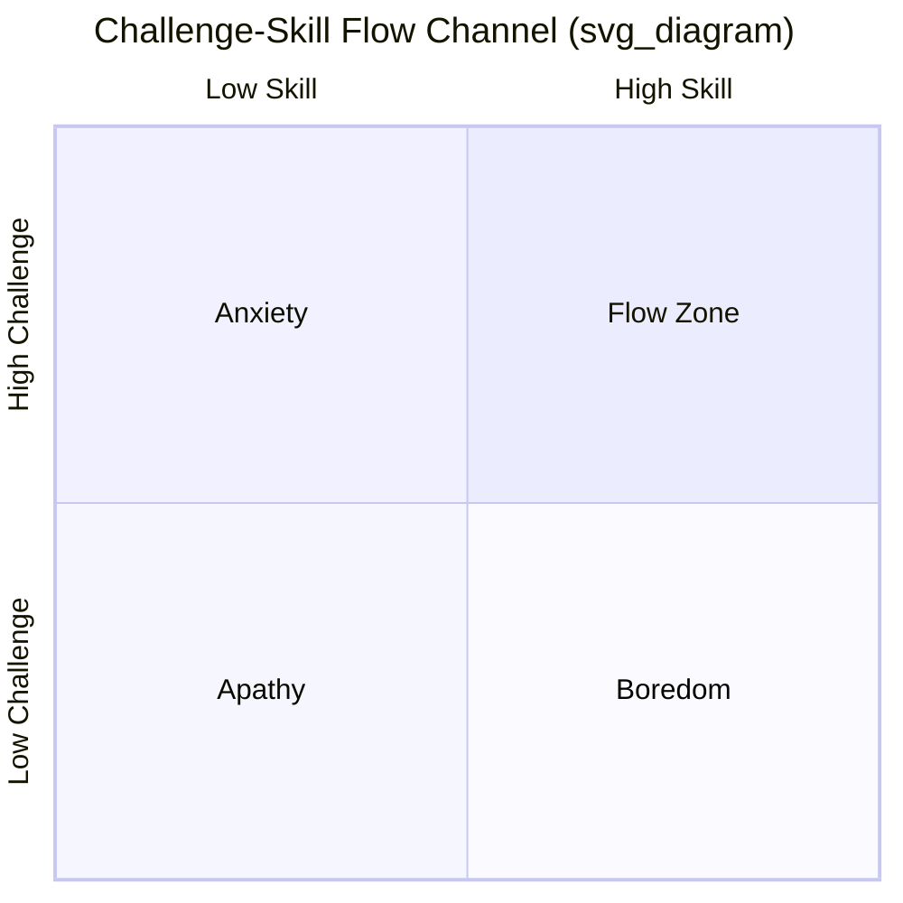

## Engagement as a Component of PERMA

### Definition and Theoretical Placement

Engagement is the "E" in Martin Seligman's PERMA model of well-being, introduced in his 2011 book *Flourish*. Within PERMA, Engagement refers to the subjective state of being absorbed, focused, and involved in an activity to the point that self-consciousness disappears and time perception is altered. Seligman distinguished Engagement from the pleasant emotions captured by the "P" (Positive Emotion) component: Engagement is often described in the moment as an absence of felt emotion, rather than a felt positive state, since the experience of deep absorption crowds out active emotional self-monitoring. Engagement is typically assessed retrospectively — a person reports "I lost track of time" or "I was completely absorbed" only after the activity ends.

### Relationship to Flow Theory

Engagement in PERMA is built directly on Mihaly Csikszentmihalyi's concept of **flow**, developed decades earlier through his studies of artists, athletes, and workers. Seligman incorporated flow as the operational core of the Engagement pillar rather than proposing a separate construct.

Csikszentmihalyi's flow model identifies flow as occurring at the intersection of two variables:

- **Perceived challenge** of a task
- **Perceived skill** the individual brings to that task

When challenge and skill are both high and roughly matched, flow is likely. When challenge exceeds skill, anxiety results; when skill exceeds challenge, boredom results; when both are low, apathy results.

### Core Components of Flow (as Applied to Engagement)

Csikszentmihalyi identified several conditions that commonly co-occur during flow states, which positive psychology treats as markers of Engagement:

- **Clear goals** at every step of the activity
- **Immediate feedback** on progress
- **Balance between challenge and skill**
- **Merging of action and awareness** (the activity feels automatic)
- **Concentration on the task at hand**, excluding irrelevant stimuli
- **Sense of control** over the activity or environment
- **Loss of self-consciousness**
- **Transformation of time** (time speeds up or slows down subjectively)
- **Autotelic experience** — the activity is intrinsically rewarding, done for its own sake

**Key Points**

- Engagement is measured by the depth of absorption, not by the pleasantness of the activity.
- High engagement activities are frequently effortful (e.g., rock climbing, composing music, competitive sport), distinguishing this pillar from simple hedonic pleasure.
- Engagement is domain-general: it can occur at work, in hobbies, in relationships, or in physical activity.

### Measurement Approaches

Because Engagement is largely retrospective and subjective, several instruments are used in research and applied settings:

- **Flow Short Scale (FSS)** — a 10-item self-report measure of fluency of performance and absorption, developed by Rheinberg, Vollmeyer, and Engeser.
- **Experience Sampling Method (ESM)** — participants are prompted at random intervals (historically via pager, now via smartphone app) to rate their current challenge, skill, and affect, allowing researchers to map flow episodes across a day rather than relying on retrospective recall.
- **PERMA-Profiler** — a broader well-being questionnaire developed by Seligman's collaborators that includes items specifically targeting Engagement, such as "How often do you become absorbed in what you are doing?"
- **Work-related flow inventory (WOLF)** — used in organizational psychology to assess flow in job tasks.

[Inference] Self-report flow measures are subject to recall bias since, by definition, a person is not reflecting on their state while deeply engaged; ESM was developed partly to address this limitation.

### Engagement in Applied Contexts

**Example**

A software developer working on a challenging bug for two hours, unaware of hunger or the passage of time, and reporting afterward that the session "flew by," is exhibiting classic flow-based Engagement. Contrast this with the same developer scrolling social media for two hours, which produces low engagement despite similar time spent, because it lacks clear goals, calibrated challenge, and active feedback loops.

Common domains where Engagement is cultivated intentionally:

- **Workplace design**: job crafting to align task difficulty with employee skill, reducing boredom (low challenge) and burnout (excessive challenge).
- **Education**: instructional scaffolding that increases task difficulty in step with student competence, a design principle directly derived from the flow channel.
- **Clinical and coaching interventions**: identifying "signature strengths" (a separate but related Seligman construct from *Authentic Happiness*) and matching them to daily tasks tends to increase reported flow frequency.
- **Sport psychology**: pre-performance routines designed to narrow attentional focus and support the concentration and control components of flow.

### Distinguishing Engagement from Other PERMA Pillars

| PERMA Pillar | Primary Character | Relation to Engagement |
| --- | --- | --- |
| Positive Emotion (P) | Felt pleasant affect (joy, contentment) | Often absent *during* engagement; may follow afterward as satisfaction |
| Engagement (E) | Absorption, flow, loss of self-consciousness | Core focus of this pillar |
| Relationships (R) | Social connection | Flow can occur in shared activities (team sport, ensemble music) — "social flow" |
| Meaning (M) | Belonging to and serving something larger than oneself | Engagement in meaningful work can compound both pillars simultaneously |
| Accomplishment (A) | Achievement, mastery, competence pursued for its own sake | Repeated flow experiences often build toward long-term accomplishment |

### Interventions to Increase Engagement

- **Strength-spotting exercises**: identifying top character strengths (via instruments such as the VIA Survey) and deliberately applying one in a new way daily.
- **Task redesign**: breaking large, ambiguous goals into sub-goals with clear completion criteria and fast feedback.
- **Environmental control**: minimizing interruption sources (notifications, multitasking demands) that fragment attention and prevent the "merging of action and awareness."
- **Skill-challenge recalibration**: deliberately increasing difficulty as competence grows, or seeking simpler entry points when a task currently produces anxiety.

### Criticisms and Limitations

- [Unverified] The causal direction between flow/engagement and well-being outcomes is debated; longitudinal designs are less common than cross-sectional self-report studies, so it is not fully settled whether engagement drives well-being or well-being enables more frequent engagement.
- Some researchers argue Engagement and Positive Emotion are not cleanly separable in practice, since retrospective satisfaction after flow states blends into the P component.
- Critics of PERMA broadly (e.g., proponents of alternative well-being models) note the model's five pillars were derived through Seligman's theoretical synthesis rather than purely bottom-up factor-analytic methods, though the PERMA-Profiler has since been used to test its structure empirically with generally supportive results. [Inference] The degree of independence between the five factors varies somewhat across studies and populations.

### Engagement Across the Lifespan and Culture

- Flow-conducive activities and their availability (leisure time, resources, autonomy at work) vary significantly by socioeconomic context, which affects how equitably this pillar of well-being can be pursued.
- Cross-cultural studies suggest the *experience* of flow (absorption, time distortion) is broadly consistent, but the *sources* of flow (individual achievement vs. collective/group activities) differ by cultural orientation toward individualism versus collectivism.

**Related Topics**

- Flow theory and the challenge-skill channel model (Csikszentmihalyi)
- Positive Emotion (P) as a distinct PERMA component
- VIA Character Strengths and strength-spotting interventions
- Experience Sampling Method (ESM) methodology
- Job crafting and organizational flow design
- Meaning (M) and Accomplishment (A) as adjacent PERMA pillars
- Social/group flow in team and ensemble contexts
- Attention and mindfulness as precursors to engagement