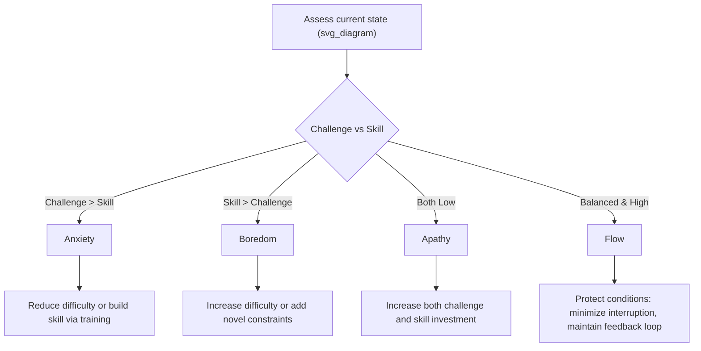

## Barriers to Flow and Designing Environments for Engagement

### Overview

Flow, as defined by Mihaly Csikszentmihalyi, is a fragile state that depends on a specific configuration of task, environment, and internal conditions. Because flow requires the simultaneous presence of several factors (clear goals, immediate feedback, challenge-skill balance, and freedom from distraction), disrupting any single factor can prevent or terminate the state. This section covers the documented barriers to flow and the environmental/design principles used to counteract them.

### Individual-Level Barriers

- **Challenge-skill mismatch**: The most cited barrier. Task difficulty exceeding perceived skill produces anxiety; skill exceeding difficulty produces boredom. Both states are incompatible with flow.
- **Attentional fragmentation**: Flow depends on sustained, undivided attention. Interruptions — notifications, multitasking demands, ambient noise — break the "merging of action and awareness" that characterizes flow.
- **Excessive self-consciousness**: Flow requires a temporary loss of self-monitoring. Performance anxiety, evaluation apprehension (e.g., being watched or judged), or rumination reintroduces self-focus and blocks absorption.
- **Unclear or absent goals**: Without a concrete target for the activity, attention has nothing to organize around, making sustained engagement difficult to initiate.
- **Delayed or absent feedback**: Tasks where results are not visible until long after the effort (e.g., long-cycle projects) provide fewer natural entry points into flow compared to tasks with tight feedback loops.
- **Low autonomy**: A sense of control over one's actions is a documented flow component; externally imposed, rigid procedures with no room for adaptation reduce the likelihood of flow.
- **Fatigue and low physiological readiness**: Flow has attentional and cognitive demands; sleep deprivation, stress, or depleted willpower reduce the capacity to sustain focused effort.
- **Intrinsic motivation deficit**: Csikszentmihalyi describes flow activities as autotelic (done for their own sake). Tasks pursued purely for external reward (compliance, punishment avoidance) are less likely to produce flow than tasks with some element of personal interest.

### Environmental and Structural Barriers

- **Interruption-heavy environments**: Open-plan offices, constant messaging tools, and notification-driven workflows are frequently cited in organizational psychology as structural flow inhibitors.
- **Poorly designed task sequencing**: Work systems that interleave unrelated tasks (context-switching) prevent the sustained focus flow requires.
- **Physical environment mismatches**: Noise, poor lighting, uncomfortable temperature, or lack of a dedicated workspace can impose low-level cognitive load that competes with task absorption.
- **Organizational culture of constant availability**: Norms requiring immediate response to messages structurally prevent the extended, uninterrupted time blocks flow typically requires (often cited as 20–45+ minutes minimum to enter a flow state, though duration varies by individual and task).

[Inference] The commonly cited "15–20 minutes to enter flow" figure varies across sources and has not been established as a fixed, universal threshold; it is best treated as an approximate, individual-dependent range rather than a hard number.

### The Flow Channel Model as a Diagnostic Tool

Csikszentmihalyi's challenge-skill matrix functions diagnostically: identifying *which* barrier is present (excess challenge vs. excess skill) points toward a specific design intervention.

### Designing Environments: Core Principles

**Key Points**

- Flow-supportive design operates on three levers: **task structure**, **physical/digital environment**, and **social/organizational norms**.
- Interventions typically aim to restore one of the missing flow conditions (clear goals, feedback, challenge-skill balance, autonomy, or freedom from distraction) rather than trying to induce flow directly.

#### Task Structure Design

- Break large or ambiguous goals into sub-goals with explicit completion criteria.
- Build in feedback checkpoints (progress bars, milestone reviews, automated test results) so performance information is available quickly and clearly.
- Calibrate difficulty dynamically — this is the design principle behind adaptive difficulty in games and adaptive learning platforms, which adjust task difficulty in real time based on performance.
- Allow some autonomy in method, even when the goal itself is fixed, to preserve the "sense of control" component of flow.

#### Physical and Digital Environment Design

- Reduce ambient interruption sources: notification batching, "do not disturb" modes, and dedicated focus-time blocks are common organizational interventions.
- Provide environmental consistency (a stable, low-distraction workspace) so the individual does not expend cognitive resources adapting to a novel setting each session.
- In digital tool design, minimize unnecessary friction between intention and action (e.g., reducing the number of steps between deciding to act and executing the action), since added friction increases the chance of attentional drift before the task begins.

#### Organizational and Social Design

- Establish norms around asynchronous communication so employees are not expected to respond instantly, protecting extended focus blocks.
- Match task assignment to individual skill profiles where possible (job crafting), rather than uniform task distribution across a team.
- Provide psychological safety to reduce the excessive self-consciousness/evaluation-apprehension barrier — flow is harder to reach under conditions of high perceived judgment.

### Example: Redesigning a Work Environment for Flow

**Example**

A software team notices developers rarely report flow states. Diagnosis reveals: (1) constant Slack interruptions fragment attention, (2) tickets often lack clear acceptance criteria (unclear goals), and (3) code review feedback can take days (delayed feedback). Redesign steps:

1. Institute "focus blocks" (e.g., 9–11 AM) with Slack notifications muted team-wide.
2. Require acceptance criteria on every ticket before work begins, giving developers a clear goal.
3. Set a review SLA (e.g., same-day review) to shorten the feedback loop.

Each change targets a specific, previously identified flow barrier rather than attempting to induce flow as an undifferentiated goal.

### Barriers Specific to Learning and Educational Contexts

- **Fixed-pace curricula**: A single pace applied to a group with heterogeneous skill levels guarantees some students experience boredom (skill > challenge) and others anxiety (challenge > skill) simultaneously.
- **Summative-only assessment**: Feedback delivered only at the end of a unit (e.g., final exams) removes the "immediate feedback" component during the learning process itself.
- **High-stakes evaluation pressure**: Can trigger the self-consciousness barrier, especially in students prone to performance anxiety.

Design responses include mastery-based progression (advancing only once a skill threshold is met, keeping challenge matched to demonstrated skill) and formative feedback loops (frequent, low-stakes checks that provide feedback without the self-consciousness cost of high-stakes evaluation).

### Measurement of Barrier Reduction

Organizations and researchers typically triangulate barrier-reduction efforts using:

- **Experience Sampling Method (ESM)**: random in-the-moment prompts measuring reported challenge, skill, and absorption before and after an intervention.
- **Flow Short Scale (FSS)** pre/post comparisons around a structural change (e.g., before and after introducing focus blocks).
- **Behavioral proxies**: reduction in task-switching frequency, increased average uninterrupted work session length, or reduced time-to-first-response metrics reframed as protected focus time.

[Inference] Because flow is inherently subjective, behavioral proxies (session length, switching frequency) are correlational indicators rather than direct measures of the flow state itself, and should be interpreted alongside self-report data.

### Limitations and Open Questions

- Some individuals report flow more readily in social/collaborative settings ("group flow" or "social flow"), which complicates purely individual-level environmental design; team-level synchrony (shared goals, mutual feedback) becomes an additional design variable.
- [Speculation] The generalizability of flow-channel-based design across highly creative or open-ended domains (e.g., artistic work without externally defined goals) is less well established than in structured task domains like sport, work, or gaming, where goals and feedback are more naturally explicit.
- Overuse of "flow" as an organizational buzzword risks conflating simple productivity or busyness with the specific psychological state Csikszentmihalyi described; not all focused work constitutes flow in the technical sense.

**Related Topics**

- Flow theory and the challenge-skill channel model
- Engagement as a PERMA component
- Job crafting and task redesign
- Experience Sampling Method (ESM) methodology
- Adaptive difficulty systems (games, e-learning platforms)
- Attention restoration theory and cognitive load
- Group/social flow in team settings
- Psychological safety and its role in performance states