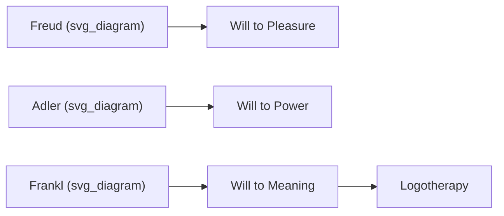

## Viktor Frankl, Logotherapy, and the Will to Meaning

### Historical and Biographical Context

Viktor Emil Frankl (1905–1997) was an Austrian neurologist and psychiatrist who developed logotherapy prior to World War II, drawing on his early clinical work and his engagement with psychoanalysis (he corresponded with Freud) and individual psychology (he worked briefly with Alfred Adler). Frankl's theoretical framework was significantly shaped and later popularized by his experience as a prisoner in several Nazi concentration camps, including Auschwitz and Dachau, between 1942 and 1945. His memoir and clinical account, *Man's Search for Meaning* (originally published in German in 1946), documents both his observations of prisoner psychology and the foundations of logotherapy. The book has sold millions of copies and remains one of the most widely read works connecting lived trauma to psychological theory.

[Inference] Frankl's own account states that the core ideas of logotherapy predated the camps, but the experience served as an empirical testing ground and rhetorical vehicle that shaped how the theory was presented to a broad audience.

### Core Theoretical Claim: The Will to Meaning

Frankl positioned logotherapy in explicit contrast to two dominant psychological paradigms of his era:

- **Freudian psychoanalysis**, which Frankl characterized as centered on the **"will to pleasure"** (the pursuit of drive satisfaction).
- **Adlerian individual psychology**, which Frankl characterized as centered on the **"will to power"** (the pursuit of superiority or status).

Frankl proposed a third primary human motivation: the **will to meaning** — the assertion that the primary drive in humans is not pleasure or power, but the search for meaning and purpose in one's existence. This is the foundational axiom of logotherapy.

### What "Logotherapy" Means

The term derives from the Greek *logos*, which Frankl used to signify "meaning" (distinct from its use in linguistics to mean "word" or in theology to mean "the Word"). Logotherapy is accordingly meaning-centered psychotherapy, in contrast to psychoanalysis's focus on past drives and conflicts. Frankl described logotherapy and existential analysis as a school of thought he founded, sometimes referred to as the "Third Viennese School of Psychotherapy" (following the first two Viennese schools: Freud's psychoanalysis and Adler's individual psychology).

### Three Core Tenets of Logotherapy

Frankl's system rests on three interlocking philosophical claims:

1. **Life has meaning under all circumstances**, including the most miserable ones. Meaning is not contingent on favorable conditions.
2. **The main human motivation is the will to meaning**, not pleasure or power avoidance/pursuit as secondary byproducts.
3. **People have freedom to find meaning in what they do and experience**, or at the very least in the stance they take toward unavoidable suffering — a concept Frankl termed the **"freedom of attitude."**

### The Tragic Triad

Frankl identified three universal sources of human suffering that logotherapy specifically addresses, termed the **tragic triad**:

- **Pain** (suffering)
- **Guilt**
- **Death** (mortality/transience)

Logotherapy's central claim is that meaning can be found even in confronting these three inescapable features of existence — not by eliminating them, but by adopting a meaningful stance toward them.

### Three Avenues to Discovering Meaning

Frankl proposed that meaning can be found through three distinct routes:

- **Creating a work or doing a deed** — meaning through creative or productive achievement.
- **Experiencing something or encountering someone** — meaning through experience (e.g., nature, art) or through love and relationship with another person.
- **The attitude we take toward unavoidable suffering** — meaning through the stance adopted when suffering cannot be changed or avoided. Frankl considered this the most distinctly human capacity: the ability to transform suffering into an achievement by the attitude with which one bears it.

**Key Points**

- The third avenue (attitude toward suffering) is the most philosophically distinctive contribution of logotherapy, since it locates meaning-making even in situations with no possibility of external change.
- Logotherapy does not claim suffering is necessary for meaning; it claims meaning remains *possible* even when suffering is unavoidable.

### Key Techniques in Logotherapeutic Practice

- **Paradoxical intention**: A technique for anxiety and phobic disorders (notably applied to insomnia and obsessive-compulsive patterns) in which the patient is guided to intentionally wish for, or exaggerate, the very outcome they fear, disrupting the anticipatory anxiety cycle that reinforces the symptom.
- **Dereflection**: A technique aimed at reducing excessive self-focus or self-observation (hyper-reflection) by redirecting attention away from the self and toward external meaning-oriented engagement — relevant to conditions where excessive self-monitoring (e.g., some forms of sexual dysfunction Frankl discussed clinically, or obsessive self-focus) worsens the presenting problem.
- **Socratic dialogue**: Used to help patients uncover personally meaningful values and goals rather than the therapist prescribing meaning directly, consistent with logotherapy's view that meaning must be discovered by the individual, not supplied externally.

### Concept: The "Existential Vacuum"

Frankl used the term **existential vacuum** to describe a widespread subjective sense of emptiness and meaninglessness he observed clinically, which he associated with modern industrialized life's loss of traditional instinctual and social/cultural structures that previously provided ready-made purpose. He connected chronic existential vacuum to what he termed **"noögenic neurosis"** — psychological distress arising specifically from a lack of meaning, as distinct from neuroses arising from psychodynamic conflict.

[Unverified] The formal diagnostic status and empirical prevalence of "noögenic neurosis" as a distinct clinical category is not part of mainstream diagnostic systems (e.g., DSM/ICD); it remains a theoretical construct specific to the logotherapeutic framework rather than a validated clinical diagnosis.

### Relationship to Contemporary Positive Psychology

Frankl's work predates and substantially influences the "Meaning" pillar (M) of Seligman's PERMA model. Points of connection:

- Frankl's "will to meaning" anticipates contemporary positive psychology's treatment of meaning and purpose as a core, independent driver of well-being, distinct from momentary positive affect.
- The distinction between **hedonic well-being** (pleasure-based) and **eudaimonic well-being** (meaning/purpose-based), central to modern well-being research, echoes Frankl's explicit rejection of pleasure as the primary human motivator.
- Contemporary meaning-in-life research (e.g., work by Michael Steger and colleagues on the Meaning in Life Questionnaire) operationalizes constructs — presence of meaning, search for meaning — that trace conceptual lineage to Frankl's framework, though using modern psychometric methods Frankl himself did not employ.

### Example: Paradoxical Intention in Practice

**Example**

A patient with chronic insomnia driven by anticipatory anxiety about *not* sleeping is instructed, instead of trying to fall asleep, to deliberately try to stay awake as long as possible. This paradoxical instruction removes the performance pressure that itself fuels the insomnia, often resulting in the patient falling asleep faster — illustrating how logotherapy targets the feedback loop of anxiety rather than the surface symptom directly.

### Criticisms and Limitations

- Logotherapy's philosophical foundations (rooted in existential and phenomenological thought) make some of its central constructs — "will to meaning," "existential vacuum" — difficult to operationalize and test using standard empirical psychological methods, compared to more measurement-driven contemporary frameworks.
- [Inference] Empirical outcome research specifically validating logotherapy as a distinct clinical intervention is more limited in volume and methodological rigor (e.g., fewer large randomized controlled trials) compared to well-established evidence-based therapies such as CBT, though paradoxical intention has received some independent empirical support for specific anxiety-related applications.
- Critics have noted the risk of logotherapy's emphasis on finding meaning in suffering being misapplied to imply that all suffering is necessary or should be accepted uncritically rather than addressed or alleviated where possible; Frankl's own writing frames meaning-making as relevant specifically to *unavoidable* suffering, not suffering broadly.

### Influence and Legacy

Frankl's work has had broad influence across clinical psychology, chaplaincy and pastoral counseling, trauma studies, and organizational/leadership contexts (particularly around purpose-driven work). The Viktor Frankl Institute continues to promote logotherapeutic training and practice internationally. *Man's Search for Meaning* remains a frequently cited text bridging first-person survivor testimony with formal psychological theory, distinguishing it from most academic psychology texts of comparable influence.

**Related Topics**

- Meaning (M) as a PERMA component
- Hedonic vs. eudaimonic well-being
- Meaning in Life Questionnaire (Steger et al.) and modern meaning research
- Post-traumatic growth
- Existential psychotherapy more broadly (Yalom, Bugental)
- Paradoxical intention as a clinical technique
- Purpose-driven work and organizational meaning-making