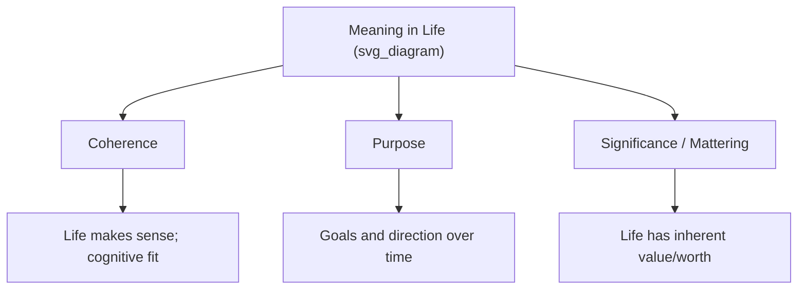

## Sources and Dimensions of Meaning in Life

### Overview

Meaning in life is a core construct in positive psychology, existential psychology, and well-being research, distinct from momentary happiness or pleasure. Contemporary research converges on a multidimensional view: meaning is not a single unified feeling but a construct composed of several measurable dimensions, drawn from multiple life sources. This entry covers the dominant dimensional models and the empirically and theoretically identified sources of meaning.

### The Tripartite Dimensional Model

The most widely cited contemporary framework, developed largely through the work of Michael Steger, Frank Martela, and colleagues, decomposes "meaning in life" into three interrelated but distinct dimensions:

- **Coherence**: The sense that one's life makes sense — a feeling of comprehensibility, predictability, and cognitive fit between one's experiences, self-concept, and worldview. Coherence is primarily a cognitive dimension.
- **Purpose**: The sense of having overarching goals, direction, and aims that organize and motivate one's activities over time. Purpose is primarily a motivational/directional dimension.
- **Significance** (also called *mattering*): The sense that one's life and existence has inherent value and matters — that one's existence is not inconsequential. Significance is primarily an evaluative dimension.

**Key Points**

- Coherence, purpose, and significance are empirically correlated but factorially distinguishable — a person can score high on one dimension and low on another (e.g., a highly organized, goal-driven life that nonetheless feels insignificant to the person living it).
- This tripartite structure has become the standard organizing framework in contemporary meaning-in-life research, distinguishing it from earlier, less differentiated treatments of "meaning" as a unitary construct.

### Presence of Meaning vs. Search for Meaning

Steger's widely used **Meaning in Life Questionnaire (MLQ)** operationalizes two further distinct constructs:

- **Presence of Meaning**: The degree to which a person currently feels their life is meaningful.
- **Search for Meaning**: The degree to which a person is actively engaged in seeking or trying to establish meaning in their life.

These two subscales are not simply opposites. Research using the MLQ has found that the relationship between search and presence varies by individual and context: for some, active searching correlates with lower well-being (associated with current meaning deficit), while for others, searching co-occurs with high presence (an ongoing, healthy process of meaning elaboration rather than meaning deficit repair). [Inference] The precise conditions under which searching is adaptive versus indicative of distress are still an active area of empirical investigation rather than fully settled.

### Sources of Meaning

Empirical and theoretical work (including large cross-cultural surveys, such as those conducted by the Pew Research Center, and academic taxonomies) identifies several recurring life domains that people commonly cite as sources of meaning:

- **Relationships and family**: Consistently the most frequently cited source of meaning across large-scale surveys, including romantic partnerships, parenting, and friendships.
- **Occupation and work**: Meaning derived from a sense of contribution, mastery, or purpose through one's career or vocation.
- **Religion and spirituality**: Meaning derived from religious belief systems, spiritual practice, or a sense of connection to something transcendent.
- **Personal growth and self-actualization**: Meaning derived from learning, self-improvement, and the pursuit of one's potential.
- **Health and well-being**: For some individuals, particularly those managing illness, meaning is tied to physical health, bodily autonomy, or the process of coping with health challenges.
- **Society, community, and civic engagement**: Meaning derived from contributing to a broader community, social causes, or civic institutions.
- **Nature and aesthetic experience**: Meaning derived from engagement with the natural world, art, music, or other aesthetic experiences.
- **Leisure, hobbies, and recreation**: Meaning derived from freely chosen activities pursued for intrinsic enjoyment or mastery.
- **Finances and material security**: Some studies find this cited as a source of meaning, particularly related to providing security to oneself or one's family, though it is generally reported as less central than relationships.

[Unverified] The precise relative ranking of these sources (which is "most" important) differs across studies, cultures, and survey methodologies (e.g., open-ended vs. forced-choice survey formats), so any specific ranking should be treated as context-dependent rather than universal.

### Theoretical Sources Beyond Empirical Surveys

Beyond survey-based taxonomies, theoretical traditions propose additional or overlapping structural sources of meaning:

- **Self-transcendence**: Connecting to something beyond the self — other people, causes, nature, or the divine — frequently identified across existential and humanistic traditions (echoing Frankl's "encountering someone" avenue to meaning).
- **Self-continuity/narrative identity**: The sense of a coherent life story connecting one's past, present, and future self, drawn from narrative identity theory (notably associated with Dan McAdams).
- **Belongingness**: Meaning derived from social inclusion and the sense of being embedded in a group or community, connected to broader theories of basic psychological needs.
- **Competence and mastery**: Meaning derived from developing and exercising skill, connected to self-determination theory's basic psychological needs framework (autonomy, competence, relatedness).

### Relationship to Self-Determination Theory

Self-Determination Theory (SDT), developed by Edward Deci and Richard Ryan, proposes three basic psychological needs — **autonomy**, **competence**, and **relatedness** — whose satisfaction is strongly linked empirically to eudaimonic well-being and reported meaning in life. Many of the "sources" of meaning identified above (work, relationships, personal growth) can be understood as vehicles through which these three basic needs are satisfied, providing a mechanistic explanation for *why* those domains generate meaning.

### Measurement Instruments

- **Meaning in Life Questionnaire (MLQ)**: 10-item scale measuring Presence and Search subscales; the most widely used instrument in the field.
- **Sources of Meaning and Meaning in Life Questionnaire (SoMe)**: Developed by Tatjana Schnell, this instrument assesses a broader taxonomy of specific meaning sources (e.g., generativity, tradition, individualism, spirituality) alongside overall meaningfulness.
- **Life Regard Index**: An earlier instrument assessing both the framework a person uses to derive meaning and the degree of fulfillment they perceive within it.
- **Purpose in Life Test (PIL)**: One of the earliest instruments, developed by Crumbaugh and Maholick, directly inspired by Frankl's logotherapy, though largely superseded by more recent, better-validated instruments like the MLQ.

### Example: Distinguishing the Three Dimensions in Practice

**Example**

Consider a retired engineer who spends time volunteering at a local community center. They may report high **coherence** (their daily routine and self-concept as a "helper" fit together predictably), high **purpose** (they have a clear daily goal: showing up and contributing), but variable **significance** if they privately doubt whether their specific contribution matters in the larger scheme of things. This illustrates why interventions aimed at improving "meaning" broadly may need to target a specific dimension — in this case, reinforcing the person's sense that their contribution has genuine impact (significance) rather than further structuring their routine (coherence) or goals (purpose), which are already intact.

### Meaning-Making Under Adversity

A distinct research thread examines how people construct or reconstruct meaning in the aftermath of trauma or major life disruption:

- **Meaning-making coping**: Cognitive and behavioral processes used to reinterpret or find significance in adverse events, associated with better long-term adjustment in bereavement and trauma research.
- **Post-traumatic growth**: Positive psychological change reported by some individuals following highly challenging life circumstances, often involving shifts across the coherence (revised worldview), purpose (new goals), and significance (renewed sense of value) dimensions simultaneously.

### Cultural and Individual Variation

- Cross-cultural research indicates that while the tripartite structure (coherence, purpose, significance) appears broadly applicable, the *relative weighting* of specific sources (e.g., religion vs. family vs. individual achievement) varies substantially across cultural and national contexts.
- [Inference] Individualistic cultures may place relatively greater emphasis on personal achievement and self-actualization as meaning sources, while collectivistic cultures may emphasize relational and familial sources more heavily, though this pattern is a general tendency rather than a strict rule and exceptions are common at the individual level.

### Criticisms and Open Questions

- Some scholars argue that "meaning in life" as an umbrella construct risks becoming too broad to be empirically tractable, given that virtually any positively valued life domain can be framed as a "source of meaning."
- The causal direction between well-being and meaning is not fully resolved: higher well-being may make it easier to perceive one's life as meaningful, in addition to (or instead of) meaning driving well-being.
- [Speculation] The applicability of Western-derived meaning frameworks and instruments (largely developed and validated in North American and European samples) to non-Western populations continues to be an active area of cross-cultural validation research, with question wording and construct emphasis sometimes requiring adaptation.

**Related Topics**

- Viktor Frankl, logotherapy, and the will to meaning
- Meaning as a PERMA component
- Self-Determination Theory (autonomy, competence, relatedness)
- Post-traumatic growth
- Narrative identity theory (Dan McAdams)
- Hedonic vs. eudaimonic well-being
- Meaning in Life Questionnaire (MLQ) and related instruments
- Purpose-driven work and vocational calling