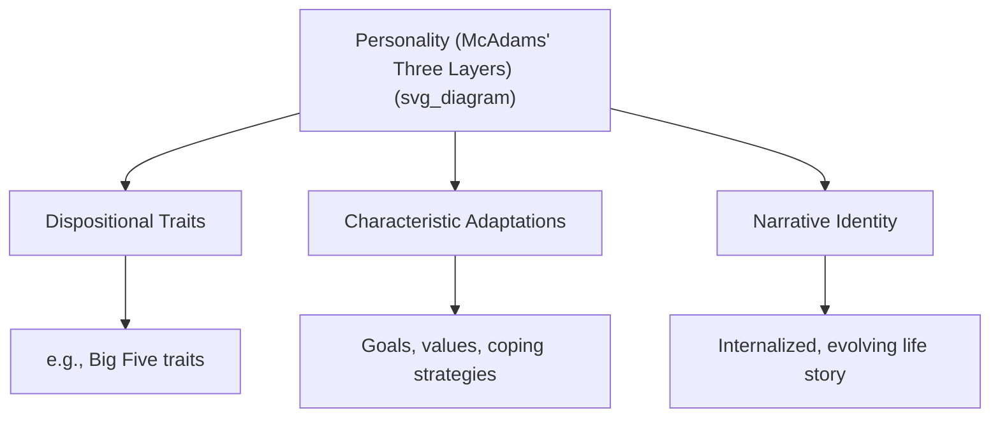

## Meaning-Making, Narrative Identity, and Life Stories

### Overview

Narrative identity theory holds that individuals construct a sense of self and personal meaning by organizing their remembered past, perceived present, and imagined future into an internalized, evolving life story. This framework, most closely associated with psychologist **Dan McAdams**, provides a distinct mechanism for meaning-making — one centered on storytelling and identity construction rather than on discrete cognitive appraisals or single events.

### Theoretical Foundations

McAdams's **Life Story Model of Identity**, developed from the late 1980s onward, proposes that identity itself, in adulthood, takes the form of an internalized narrative. This model positions narrative identity as one of three broad layers of personality, alongside:

- **Dispositional traits** (e.g., the Big Five personality traits — broad, decontextualized tendencies)
- **Characteristic adaptations** (context-specific goals, values, coping strategies, developmental stage-related concerns)
- **Narrative identity** (the integrative life story that ties traits and adaptations into a meaningful, temporally extended self-understanding)

**Key Points**

- Narrative identity is considered the most integrative and meaning-laden layer, since it is the layer where a person actively interprets *why* their traits and adaptations fit together into a coherent self.
- The life story is understood as a psychosocial construction — shaped by cultural narrative templates, not purely by objective autobiographical fact.

### Core Process: Meaning-Making Through Narrative

Meaning-making, in this framework, refers to the process by which individuals interpret and derive significance from life events by integrating them into their ongoing life narrative. Key mechanisms include:

- **Redemption sequences**: A narrative pattern in which a negative or difficult event is followed by a positive outcome, which the narrator frames as having emerged from or been enabled by the earlier hardship (e.g., "that job loss forced me to find work I actually love").
- **Contamination sequences**: The inverse pattern, in which a positive event or state is followed by a negative turn that "contaminates" or spoils the initial positive experience.
- **Agency**: The degree to which the narrator depicts themselves as an active, self-determining force in their own story, versus a passive recipient of external events.
- **Communion**: The degree to which the narrative emphasizes connection, intimacy, and relationships with others.
- **Exploratory narrative processing**: The degree to which a person actively works through and reflects on difficult events within their story, associated in research with better psychological adjustment compared to narratives that avoid or superficially gloss over difficulty.

[Inference] Redemption sequences are associated with higher well-being and generativity in McAdams's research (particularly in studies of highly generative adults), but this is a correlational association identified in specific research populations rather than a universal causal law applicable to every individual or culture.

### The Life Story as a Developmental Achievement

Narrative identity is understood not as present from birth but as a developmental capacity that emerges and matures over the lifespan:

- **Childhood**: Autobiographical memory and basic narrative comprehension develop, but children generally do not yet construct an integrated life story.
- **Adolescence and emerging adulthood**: The cognitive capacity for autobiographical reasoning (drawing meaning and self-relevant lessons from remembered events) matures, and individuals begin constructing an explicit, integrative life narrative — consistent with Erik Erikson's stage of identity formation, which strongly influenced McAdams's model.
- **Adulthood**: The life story continues to be revised and reconstructed throughout adulthood in response to new experiences, relationships, and developmental transitions, rather than being fixed after adolescence.

### Autobiographical Reasoning

A related and central concept is **autobiographical reasoning**: the cognitive process of drawing generalized meaning, self-insight, or lessons from specific remembered events. Autobiographical reasoning is what transforms a mere sequence of remembered events into an interpreted, meaning-laden story. Two commonly studied forms:

- **Lessons learned**: Extracting a specific practical or moral insight from an event ("that experience taught me to trust my instincts").
- **Self-event connections**: Drawing broader connections between an event and one's enduring identity or character ("that was the moment I realized I was someone who values honesty").

### Generativity and the Redemptive Self

McAdams's research on highly generative adults (those strongly invested in guiding and contributing to future generations) identified a recurring narrative pattern he termed the **"redemptive self"** — a life story structure characterized by:

- An early sense of personal advantage or specialness
- Early sensitivity to others' suffering
- A clear, stable value system established early in life
- Repeated redemption sequences (adversity transformed into growth)
- Prosocial future goals oriented toward benefiting others or society

[Unverified] This redemptive narrative pattern has been most robustly documented within American cultural samples; the degree to which it generalizes as a universal template for generativity across other cultural contexts is less established, and some cross-cultural narrative research suggests different dominant templates elsewhere.

### Relationship to Broader Meaning-in-Life Research

Narrative identity provides a distinct route to the coherence and significance dimensions of meaning in life (see the tripartite model of coherence, purpose, and significance):

- **Coherence** is directly supported by a well-integrated life story that connects past, present, and future into a comprehensible whole.
- **Significance** can be reinforced through narrative themes emphasizing agency and communion — feeling that one's actions and relationships matter within the story.
- **Purpose** is often embedded in the imagined future chapters of the life story — the anticipated next steps of the narrative.

### Clinical and Applied Approaches

- **Narrative therapy** (associated with Michael White and David Epston, a related but distinct clinical tradition from McAdams's research program) works directly with a client's self-told stories, helping them "re-author" problem-saturated narratives into more empowering ones.
- **Life review therapy**: Used particularly with older adults, this structured intervention guides individuals through a systematic review of their life story, associated with improved well-being and reduced depressive symptoms in some clinical studies.
- **Expressive writing interventions**: Structured writing tasks (e.g., James Pennebaker's paradigm of writing about a difficult experience for a set number of sessions) can prompt autobiographical reasoning and narrative integration of difficult events, with documented associations with improved psychological and even physical health outcomes in some studies.

### Example: Narrative Reframing in Practice

**Example**

A person recounts being laid off from a long-held job. Told as a **contamination sequence**, the narrative might run: "I had built a stable career, then it was suddenly taken away, and now everything feels uncertain." Told as a **redemption sequence** after therapeutic narrative work, the same event might be reframed: "Losing that job was painful, but it forced me to reconsider what I actually wanted, and I ended up finding work that fits who I am now." The underlying facts are identical; the narrative structure and its meaning-making function differ substantially, illustrating how meaning is actively constructed rather than simply read off from events.

### Measurement Approaches

- **Life Story Interview**: A semi-structured interview protocol developed by McAdams in which participants narrate key chapters, high points, low points, turning points, and future scripts of their life; narratives are then coded for themes such as redemption, agency, communion, and coherence.
- **Narrative coding schemes**: Standardized systems for scoring transcribed life narratives on dimensions like emotional tone, thematic content, and structural coherence, allowing quantitative analysis of qualitative narrative data.
- **Autobiographical reasoning tasks**: Structured prompts asking participants to describe a self-defining memory and then explain its meaning, used to assess the degree and sophistication of meaning-making.

### Criticisms and Limitations

- Narrative coding is labor-intensive and involves a degree of interpretive judgment by trained coders, raising reliability considerations compared to more straightforward self-report questionnaire measures.
- The life story model of identity was developed primarily within Western, and particularly American, cultural and academic contexts; [Inference] its emphasis on an integrated, temporally continuous, individually authored narrative may reflect culturally specific assumptions about selfhood that are less emphasized in more collectivistic or non-narrative-oriented cultural traditions of self-understanding.
- Some critics note the risk of "narrative determinism" — overstating the degree to which a coherent story is necessary for well-being, when some individuals report high well-being without a strongly elaborated or highly coherent autobiographical narrative.

**Related Topics**

- Sources and dimensions of meaning in life
- Viktor Frankl, logotherapy, and the will to meaning
- Post-traumatic growth
- Erik Erikson's stages of psychosocial development
- Narrative therapy (White and Epston)
- Expressive writing interventions (Pennebaker paradigm)
- Generativity in adulthood