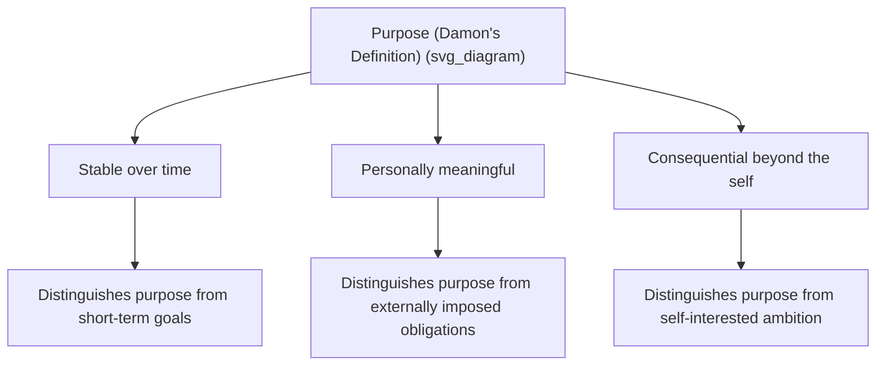

## Purpose, Goal Pursuit, and Long-Term Life Direction

### Overview

Purpose is a distinct construct within meaning-in-life research, referring specifically to the possession of stable, overarching, future-directed goals that organize an individual's behavior and give their life a sense of direction. While closely related to coherence and significance (the other dimensions of meaning), purpose is defined by its temporal and motivational character: it orients the person toward the future and structures ongoing goal pursuit.

### Defining Purpose: Key Theoretical Formulations

The most widely cited contemporary definition comes from developmental psychologist **William Damon**, who defines purpose as a stable and generalized intention to accomplish something that is at once meaningful to the self and consequential for the world beyond the self. This definition contains three key components:

- **Stability**: Purpose is enduring, not a fleeting goal or momentary intention.
- **Personal meaningfulness**: The goal matters intrinsically to the individual.
- **Beyond-the-self consequence**: The goal has significance or impact extending beyond the individual's own immediate interests.

**Key Points**

- A short-term goal (e.g., finishing a report by Friday) does not qualify as "purpose" under Damon's definition because it lacks the stability and beyond-the-self criteria.
- A goal can be personally meaningful without being a "purpose" in this technical sense if it lacks durability or broader consequence (e.g., a passing hobby interest).

### Purpose vs. Meaning vs. Goals: Conceptual Distinctions

| Construct | Temporal Scope | Primary Character |
| --- | --- | --- |
| Goal | Short- to medium-term | A specific, often achievable target |
| Purpose | Long-term, often lifelong | A stable, organizing life direction |
| Meaning (overall) | Can be momentary or enduring | Coherence + purpose + significance combined |

Purpose functions as a kind of "super-ordinate goal" — a higher-order aim under which many specific, concrete goals can be organized and made sense of. [Inference] This hierarchical relationship between purpose and everyday goals is a widely used conceptual framing in the literature, though the exact boundary between a "very important long-term goal" and a "purpose" is not always sharply defined empirically.

### Goal Pursuit Theory and Purpose

Several established motivational frameworks intersect with purpose research:

- **Self-Determination Theory (SDT)**: Distinguishes **intrinsic goals** (personal growth, relationships, community contribution) from **extrinsic goals** (wealth, fame, image). Research within this tradition finds that pursuit and attainment of intrinsic goals is more strongly associated with well-being than extrinsic goal attainment, providing a motivational account of why certain kinds of purpose (beyond-the-self, intrinsically meaningful) are more strongly linked to flourishing.
- **Possible Selves Theory** (Markus and Nurius): Proposes that individuals hold cognitive representations of their potential future selves (hoped-for and feared selves), which function as motivational guides for present goal pursuit — providing a cognitive mechanism through which long-term purpose translates into everyday behavior.
- **Goal-setting theory** (Locke and Latham): While primarily focused on task performance rather than life purpose per se, its principles (specific and challenging goals improve performance more than vague or easy ones) are often applied in translating an abstract sense of purpose into concrete, actionable sub-goals.

### Developmental Trajectory of Purpose

Purpose development has been studied particularly extensively in adolescence and emerging adulthood, a period considered developmentally significant for purpose formation:

- **Adolescence**: Considered a critical period for the emergence of purpose, coinciding with identity formation (per Erikson's psychosocial stages) and increasing capacity for future-oriented abstract thinking.
- **Purpose exploration vs. purpose commitment**: Analogous to identity status models (e.g., Marcia's identity statuses), some researchers distinguish adolescents actively exploring possible purposes from those who have committed to a specific purpose, and from those who remain diffuse (neither exploring nor committed).
- **Adulthood and later life**: Purpose can continue to evolve, be revised, or in some cases be threatened by major life transitions such as retirement, bereavement, or health decline, prompting purpose reconstruction processes similar to broader meaning-making after adversity.

### Health and Well-Being Correlates of Purpose

A substantial body of longitudinal research, notably associated with psychologist **Patricia Boyle** and colleagues (using data from aging cohort studies such as the Rush Memory and Aging Project), has linked higher self-reported purpose in life with:

- Lower rates of mortality across follow-up periods in some longitudinal cohorts
- Reduced risk of cognitive decline and, in some studies, reduced risk of developing Alzheimer's disease pathology-related outcomes
- Better cardiovascular health markers in some studies
- Improved subjective well-being and lower rates of depressive symptoms

[Inference] These are associational findings from observational longitudinal studies; while the associations are well replicated across several independent cohorts, the specific causal mechanisms (e.g., whether purpose directly protects biological health, or whether better health enables sustained purpose, or both) are still an active area of investigation, and causal claims should be stated cautiously.

### Purpose in Organizational and Career Contexts

- **Calling orientation**: Research on work orientations (distinguishing "job," "career," and "calling" orientations toward work, originating with Amy Wrzesniewski and colleagues) identifies a "calling" orientation as one where work is experienced as intrinsically fulfilling and socially significant — closely paralleling Damon's definition of purpose applied specifically to occupational life.
- **Job crafting**: The practice of proactively reshaping the tasks, relationships, or perceived meaning of one's job to better align with personal values and purpose, without necessarily changing the formal job description.
- **Purpose-driven organizational design**: Increasingly used in management literature to describe efforts to align organizational mission with employees' personal sense of purpose, though [Speculation] the empirical evidence base for specific organizational purpose interventions is less mature and standardized than the individual-level psychological research on purpose.

### Example: Translating Abstract Purpose into Goal Pursuit

**Example**

A person identifies their long-term purpose as "reducing suffering caused by preventable illness." On its own, this is too abstract to act on daily. Applying goal-setting principles, they translate it into a hierarchy: mid-term goal (complete public health training), short-term goals (enroll in a specific course this term, secure a related internship this year), and daily actions (study sessions, networking outreach). This illustrates the purpose-to-goal translation process: purpose provides the stable "why," while nested concrete goals provide the actionable "what" and "how."

### Measurement Instruments

- **Life Engagement Test (LET)**: Measures purposeful engagement with life goals and activities.
- **Ryff Scales of Psychological Well-Being — Purpose in Life subscale**: One of six subscales in Carol Ryff's widely used multidimensional model of eudaimonic well-being, specifically targeting the sense of directedness and intentionality in life.
- **Claremont Purpose Scale**: Developed specifically to assess Damon's tripartite definition of purpose (stability, personal meaningfulness, beyond-the-self orientation), particularly used in adolescent and youth development research.
- **Purpose in Life Test (PIL)**: Earlier instrument derived from logotherapy, still occasionally used though largely superseded by newer, better-validated measures.

### Interventions to Cultivate Purpose

- **Purpose-exploration curricula**: Structured programs, often used in educational settings, guiding adolescents and young adults through reflective exercises examining values, strengths, and desired societal contributions.
- **Best possible self exercises**: Writing interventions asking participants to vividly imagine their ideal future self, associated in some studies with increased optimism and goal clarity, which can support purpose articulation.
- **Values clarification exercises**: Common in Acceptance and Commitment Therapy (ACT) and coaching contexts, used to help individuals identify core values that can then inform longer-term purpose statements.
- **Mentorship and generative relationships**: Exposure to mentors or role models pursuing purposeful work has been associated in developmental research with facilitating purpose formation, particularly in adolescents.

### Criticisms and Limitations

- The "beyond-the-self" criterion in Damon's definition has been debated: some researchers argue purely self-oriented but stable, meaningful goals (e.g., personal artistic mastery with no explicit social benefit) should still qualify as purpose, while Damon's framework would technically exclude them.
- Purpose research has historically been conducted predominantly in Western, educated, industrialized, rich, and democratic (WEIRD) populations; [Inference] cross-cultural generalizability of specific purpose measures and developmental trajectories is an ongoing area requiring further validation, particularly given cultural variation in how individual versus collective goals are prioritized.
- Distinguishing genuine purpose from socially desirable self-presentation in self-report measures remains a methodological challenge common to most self-report well-being constructs.

**Related Topics**

- Sources and dimensions of meaning in life
- Meaning-making, narrative identity, and life stories
- Viktor Frankl, logotherapy, and the will to meaning
- Self-Determination Theory and intrinsic vs. extrinsic goals
- Ryff's model of psychological well-being
- Calling and work orientation (job/career/calling)
- Possible selves theory