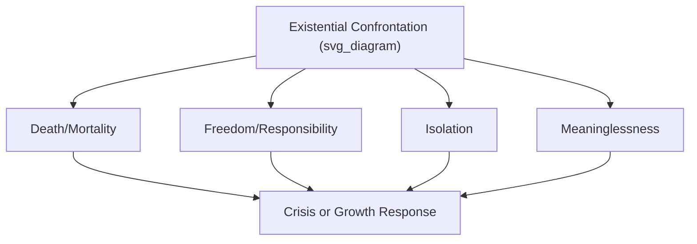

## Meaning in Suffering, Adversity, and Existential Crisis

### Overview

This topic addresses how individuals construct, retain, or lose meaning when confronted with severe adversity, trauma, or existential crisis. It draws together existential philosophy, clinical psychology, and empirical positive psychology research on how suffering interacts with the meaning-making processes covered in prior topics (Frankl's logotherapy, narrative identity, and the coherence/purpose/significance model).

### Theoretical Foundations

**Existential givens**: Existential psychologist **Irvin Yalom** identified four "ultimate concerns" that confront all humans and that existential crises typically revolve around:

- **Death** (mortality and its inevitability)
- **Freedom** (the anxiety-provoking responsibility of authoring one's own choices)
- **Isolation** (the unbridgeable separateness between self and others)
- **Meaninglessness** (the absence of any inherent, given meaning to existence)

This framework overlaps substantially with, but is broader than, Frankl's earlier **tragic triad** (pain, guilt, death), which was developed specifically within the context of unavoidable suffering.

### Existential Crisis: Definition and Character

An existential crisis is typically characterized by an acute confrontation with one or more of the ultimate concerns above, often precipitated by a major life event (serious illness diagnosis, bereavement, career collapse, aging milestones, moral failure) that disrupts a person's previously taken-for-granted assumptions about the coherence, purpose, or significance of their life.

**Key Points**

- Existential crisis is distinct from clinical depression or anxiety disorders, though the two can co-occur; existential crisis is defined by its content (confrontation with fundamental questions of existence) rather than by a specific symptom profile.
- Not all confrontation with existential concerns produces crisis — the same confrontation (e.g., a terminal diagnosis) can also directly precipitate active meaning-making and, in some cases, reported growth.

### Meaning-Making Coping

A substantial empirical literature, notably associated with **Crystal Park's integrated model of meaning-making**, distinguishes two components of how people cope with meaning-threatening events:

- **Global meaning**: A person's overarching, relatively stable beliefs, goals, and sense of purpose that exist prior to the crisis.
- **Situational meaning**: The meaning made of the specific stressful event itself, including initial appraisals of its significance and threat.

Park's model proposes that psychological distress following adversity often stems from a **discrepancy** between situational and global meaning — the event violates or contradicts the person's prior global beliefs (e.g., "bad things don't happen to good people," "the world is fundamentally just"). Coping, in this model, is largely a process of reducing this discrepancy, either by:

- **Assimilation**: Reinterpreting the event to fit existing global beliefs (e.g., framing an illness as a test of character consistent with prior religious beliefs).
- **Accommodation**: Revising global beliefs to incorporate the new, discrepant information (e.g., relinquishing a belief in a fully just world).

[Inference] Which pathway (assimilation vs. accommodation) is more adaptive appears to depend on the specific belief and context; wholesale accommodation of core beliefs is not consistently shown to be superior to selective assimilation, and the empirical picture is more nuanced than a simple "revise your worldview" prescription.

### Post-Traumatic Growth

**Post-traumatic growth (PTG)**, a construct developed by psychologists **Richard Tedeschi** and **Lawrence Calhoun**, refers to positive psychological change reported by some individuals as a result of their struggle with highly challenging life circumstances — distinct from simple resilience (a return to baseline) or recovery. PTG is theorized to occur across five commonly measured domains:

- **Personal strength**: A sense of increased resilience or capability ("if I survived that, I can handle anything").
- **New possibilities**: Recognition of new life paths or opportunities not previously considered.
- **Relating to others**: Increased closeness, compassion, or valuing of relationships.
- **Appreciation of life**: A shift in priorities and a greater valuing of everyday existence.
- **Spiritual/existential change**: Deepened or altered spiritual and existential understanding.

[Unverified] A key methodological debate in PTG research concerns whether reported growth reflects genuine psychological transformation or a form of positive illusion/cognitive coping narrative constructed after the fact; longitudinal studies attempting to verify PTG against pre-trauma baselines have produced mixed results, and this remains an active area of methodological scrutiny in the field.

### Distinguishing Resilience, Recovery, and Growth

| Concept | Trajectory | Core Character |
| --- | --- | --- |
| Resilience | Stable functioning maintained throughout, minimal disruption | Ability to withstand adversity without significant decline |
| Recovery | Decline followed by return to pre-adversity baseline | Restoration of prior functioning |
| Post-traumatic growth | Decline followed by functioning that exceeds prior baseline in specific domains | Positive transformation exceeding the pre-adversity state |

These are not mutually exclusive; an individual might show resilience in some life domains while experiencing reported growth in others.

### Logotherapeutic Contribution: Meaning Under Unavoidable Suffering

As established in Frankl's framework, the "attitude" avenue to meaning specifically addresses suffering that cannot be changed or removed. This contrasts with meaning-making coping models (like Park's), which more often address *changeable* threats to belief systems. Frankl's contribution is most directly relevant to situations of genuinely unavoidable suffering (terminal illness, irreversible loss), where the goal is not to solve or reverse the situation but to find a dignified or meaningful stance toward it.

### Clinical and Applied Approaches

- **Meaning-Centered Psychotherapy (MCP)**: Developed by **William Breitbart** and colleagues specifically for patients with advanced cancer, directly building on Frankl's logotherapy. MCP is a manualized, evidence-based intervention (tested in randomized controlled trials) that helps terminally ill patients identify and reinforce sources of meaning despite their prognosis. It has demonstrated improvements in spiritual well-being and reductions in hopelessness and desire for hastened death in clinical trials.
- **Acceptance and Commitment Therapy (ACT)**: While not exclusively an existential therapy, ACT's emphasis on values clarification and psychological flexibility in the presence of unavoidable pain shares conceptual ground with logotherapy's attitude-based meaning-making.
- **Grief and bereavement-specific meaning reconstruction therapy**: Approaches (e.g., associated with Robert Neimeyer) that explicitly help bereaved individuals reconstruct a coherent life narrative and sense of meaning disrupted by loss.
- **Existential therapy more broadly** (Yalom, Bugental, van Deurzen): Addresses existential crisis directly by helping clients confront, rather than avoid, the ultimate concerns, on the theoretical premise that authentic engagement with these concerns — rather than avoidance or denial — supports psychological health.

### Example: Meaning-Making After a Cancer Diagnosis

**Example**

A patient receiving a serious cancer diagnosis initially experiences acute discrepancy between global meaning (a prior assumption of a long, predictable life trajectory) and situational meaning (the diagnosis directly threatens that assumption). Through Meaning-Centered Psychotherapy, the patient engages in structured exercises identifying historical, experiential, and creative sources of meaning (per Frankl's three avenues), and works toward an accommodated global meaning framework that incorporates mortality without requiring the illness itself to be "for a reason." This illustrates the difference between assimilation (forcing the diagnosis into an unchanged worldview) and accommodation (revising the worldview to hold both the diagnosis and a continued sense of meaning).

### Risk Factors for Poor Meaning-Related Outcomes

- Pre-existing rigid or fragile global meaning systems that cannot flexibly accommodate discrepant information.
- Social isolation reducing the availability of the "relatedness" avenue to meaning during crisis.
- Repeated or cumulative trauma exposure, which is associated in some research with greater difficulty achieving meaning-making resolution compared to single-incident trauma, though individual variation is substantial.
- Co-occurring untreated depression or anxiety, which can impair the cognitive and motivational resources needed for active meaning reconstruction.

**Important note**: Existential crisis and meaning-related distress can, in some cases, co-occur with or escalate into suicidal ideation, particularly in contexts of terminal illness, chronic pain, or profound hopelessness. This is a sensitive area; if this topic is being explored in a personal (not purely academic) context, professional mental health support is the appropriate resource, and Meaning-Centered Psychotherapy and related interventions above are delivered by trained clinicians rather than through self-directed study.

### Measurement Approaches

- **Posttraumatic Growth Inventory (PTGI)**: The standard instrument for assessing the five PTG domains listed above.
- **Meaning in Life Questionnaire (MLQ)**: Used pre/post crisis or intervention to track presence and search for meaning.
- **Constructed Meaning Scale** and related instruments: Assess the degree to which a person has successfully made sense of a specific stressful or traumatic event.
- **Core Beliefs Inventory**: Used within Park's meaning-making framework to assess the degree of disruption to global beliefs following a stressor.

### Criticisms and Limitations

- The PTG construct faces ongoing methodological critique regarding whether it measures genuine change or retrospective positive reappraisal bias, as noted above.
- Cultural and religious frameworks substantially shape *which* meaning-making pathway (assimilation vs. accommodation, or specific PTG domains) is emphasized or considered appropriate, so findings from predominantly Western, largely Christian-influenced samples may not generalize directly to other cultural or religious contexts. [Inference] This is a widely acknowledged limitation in the PTG and meaning-making literature rather than a settled resolution.
- There is a risk, noted by several scholars in this area, of implicitly pressuring trauma survivors toward narratives of growth or redemption, which can invalidate those for whom adversity does not yield growth and instead produces lasting difficulty — meaning-centered approaches generally emphasize that growth is one possible outcome, not an expected or required one.

**Related Topics**

- Viktor Frankl, logotherapy, and the will to meaning
- Meaning-making, narrative identity, and life stories
- Sources and dimensions of meaning in life
- Resilience as a distinct construct
- Existential psychotherapy (Yalom, Bugental)
- Meaning-Centered Psychotherapy (Breitbart)
- Grief, bereavement, and meaning reconstruction