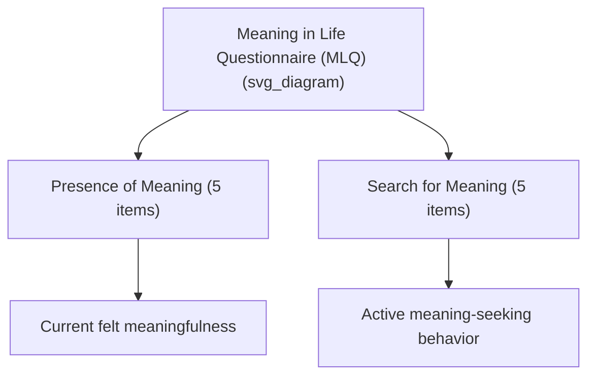

## Measuring Meaning: The Meaning in Life Questionnaire and Related Instruments

### Overview

This entry provides a technical survey of the primary psychometric instruments used to measure meaning in life within positive psychology and clinical research, with particular focus on the Meaning in Life Questionnaire (MLQ) — the most widely used instrument in the field — alongside complementary and historically antecedent measures.

### The Meaning in Life Questionnaire (MLQ)

**Developer and origin**: Developed by Michael Steger, Patricia Frazier, Shigehiro Oishi, and Matthew Kaler, first published in 2006. The MLQ was designed to address limitations in earlier meaning instruments (notably confounding of the "having meaning" and "seeking meaning" constructs).

**Structure**: The MLQ is a 10-item self-report scale divided into two subscales of 5 items each:

- **Presence of Meaning (MLQ-P)**: Assesses the degree to which respondents feel their lives are meaningful. Example item content (paraphrased, not verbatim due to copyright): a statement about understanding one's life's meaning.
- **Search for Meaning (MLQ-S)**: Assesses the degree to which respondents are actively seeking or trying to establish meaning in their lives. Example item content (paraphrased): a statement about actively looking for something that makes life feel significant.

Items are typically rated on a 7-point Likert scale ranging from "Absolutely Untrue" to "Absolutely True."

**Key Points**

- Presence and Search are measured as two independent subscales, not opposite poles of a single dimension — a respondent can score high or low on either independently of the other.
- The MLQ deliberately avoids specifying *sources* of meaning, making it a domain-general measure applicable across religious, secular, relational, or achievement-oriented meaning frameworks.

### Psychometric Properties of the MLQ

- The two-factor structure (Presence and Search) has been supported across multiple confirmatory factor analyses in the scale's validation and subsequent research.
- Presence of Meaning has been consistently found to correlate positively with life satisfaction, positive affect, and other well-being indicators, and negatively with depressive symptoms, across numerous studies.
- The relationship between Search for Meaning and well-being is more variable across studies and populations: in some samples, search correlates negatively with well-being (suggesting search reflects an unmet deficit), while in others, particularly among individuals who also score high on Presence, search correlates neutrally or even positively with well-being (suggesting an ongoing, exploratory process rather than distress-driven seeking).

[Inference] This variability in the Search subscale's correlates is a documented and replicated pattern in the literature, but the specific moderating conditions (e.g., cultural context, developmental stage, co-occurring Presence level) that determine whether search is adaptive or distress-linked are not yet fully mapped and remain an active research area.

### Related and Predecessor Instruments

**Purpose in Life Test (PIL)**

Developed by James Crumbaugh and Leonard Maholick in 1964, directly inspired by and designed to operationalize Viktor Frankl's logotherapeutic construct of the "will to meaning." The PIL was among the first quantitative instruments in this domain. It has been substantially superseded in contemporary research by newer instruments with stronger psychometric validation (such as the MLQ), though it retains historical significance as the field's foundational measurement attempt. [Unverified] Specific critiques of the PIL's factor structure and item wording (some items reflecting dated language or conflating multiple constructs) have been raised in the psychometric literature relative to more modern scales.

**Life Regard Index (LRI)**

Developed by Battista and Almond (1973), this instrument assesses two components: the degree to which a person has developed a "framework" for understanding their life, and the degree of "fulfillment" they perceive in relation to that framework. Conceptually, it anticipates aspects of the later coherence/purpose distinction.

**Sources of Meaning and Meaning in Life Questionnaire (SoMe)**

Developed by Tatjana Schnell, this instrument goes beyond assessing overall meaningfulness to assess a detailed taxonomy of specific meaning *sources* (e.g., generativity, individualism, tradition, spirituality, social commitment, and others), alongside a global "crisis of meaning" subscale. This makes SoMe particularly useful for research questions about *which* sources of meaning are most active for a given individual or population, complementing the MLQ's more general presence/search framework.

**Claremont Purpose Scale**

Developed specifically to operationalize William Damon's tripartite definition of purpose (stability, personal meaningfulness, beyond-the-self consequence), primarily used in youth and adolescent development research.

**Ryff Scales of Psychological Well-Being — Purpose in Life Subscale**

One of six subscales within Carol Ryff's broader multidimensional model of eudaimonic well-being (alongside autonomy, environmental mastery, personal growth, positive relations, and self-acceptance). This subscale specifically assesses a sense of directedness and intentionality, often used when researchers want purpose measured within a broader eudaimonic well-being battery rather than as a standalone meaning construct.

**Comprehensive Assessment of Sense of Meaning (CASM)** and other multidimensional instruments have also been developed to more explicitly separate the coherence, purpose, and significance dimensions described in the tripartite model, reflecting the field's move toward finer-grained measurement.

### Comparison Table of Major Instruments

| Instrument | Developer(s) | Primary Focus | Dimensions Assessed |
| --- | --- | --- | --- |
| MLQ | Steger, Frazier, Oishi, Kaler (2006) | General presence/search | Presence, Search |
| PIL | Crumbaugh & Maholick (1964) | Logotherapy-based purpose | Global purpose/meaning |
| LRI | Battista & Almond (1973) | Framework and fulfillment | Framework, Fulfillment |
| SoMe | Schnell | Specific meaning sources | Multiple named sources + crisis of meaning |
| Claremont Purpose Scale | Damon and colleagues | Purpose specifically | Stability, meaningfulness, beyond-self |
| Ryff PWB — Purpose subscale | Ryff | Eudaimonic well-being | Purpose (1 of 6 subscales) |

### Experience Sampling and State-Level Meaning Measurement

In addition to trait-level questionnaires (administered once, assessing general tendencies), researchers also use **Experience Sampling Method (ESM)** and daily diary designs to assess *state* meaning — momentary fluctuations in felt meaningfulness across a day or across repeated days. This approach captures within-person variability that single-administration trait measures cannot, and is often used alongside trait MLQ scores to study how daily meaning fluctuates with specific activities, moods, or social contexts.

### Example: Interpreting MLQ Score Combinations

**Example**

Two respondents both score low on Presence of Meaning. Respondent A scores high on Search for Meaning, suggesting active, ongoing effort to establish meaning — consistent with an adaptive, exploratory response to a current meaning deficit, and a plausible candidate for meaning-focused intervention (e.g., values clarification exercises). Respondent B scores low on both Presence and Search, suggesting disengagement from meaning-related concerns altogether — a pattern some researchers associate with apathy or avoidance rather than active exploration, and potentially warranting a different clinical or coaching approach (e.g., first cultivating engagement with the question of meaning itself, before pursuing specific meaning content). This illustrates why the two-subscale structure has more diagnostic value than a single combined "meaning score."

### Use in Applied and Clinical Settings

- **Clinical screening**: Low Presence of Meaning scores are used as one indicator (among others) of risk for depression or reduced psychological well-being, though the MLQ is not itself a diagnostic instrument.
- **Intervention outcome tracking**: The MLQ and related instruments are commonly used as pre/post measures in studies of meaning-focused interventions (e.g., Meaning-Centered Psychotherapy trials, purpose-cultivation programs).
- **Cross-cultural and translation research**: The MLQ has been translated and validated in numerous languages and cultural contexts, generally supporting its two-factor structure, though [Inference] item-level cultural nuance (e.g., how "meaning" as a concept is linguistically and culturally framed) means translated versions sometimes require adaptation beyond direct translation to preserve construct validity.

### Limitations Common to Self-Report Meaning Measures

- **Social desirability bias**: Respondents may over-report Presence of Meaning due to social norms favoring a "meaningful life" self-presentation.
- **Retrospective and momentary confounds**: Trait-level questionnaires ask respondents to summarize an inherently variable internal state into a single global rating, which may not capture meaningful day-to-day or context-dependent fluctuation (addressed partially by ESM approaches, as above).
- **Construct proliferation**: With multiple instruments assessing overlapping but not identical aspects of "meaning" (presence/search, coherence/purpose/significance, specific sources), cross-study comparison can be complicated by differing operationalizations — a methodological challenge acknowledged within the field itself.

### Criticisms and Open Questions

- Some scholars argue the field would benefit from greater convergence toward a single, well-validated multidimensional instrument (e.g., one directly assessing coherence, purpose, and significance as separate subscales) rather than the current proliferation of partially overlapping measures.
- [Speculation] The optimal way to weight or combine Presence and Search scores into actionable clinical or coaching guidance is not standardized across the field, and practitioners may apply differing interpretive frameworks.

**Related Topics**

- Sources and dimensions of meaning in life
- Viktor Frankl, logotherapy, and the will to meaning
- Purpose, goal pursuit, and long-term life direction
- Ryff's model of psychological well-being
- Experience Sampling Method (ESM) methodology
- Meaning-Centered Psychotherapy outcome research