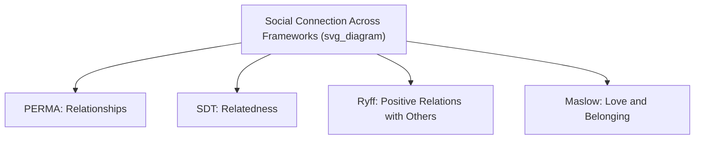

## Social Connection as a Pillar of Well-Being

### Overview

Social connection — the subjective and behavioral experience of being close to, supported by, and engaged with other people — is one of the most consistently replicated predictors of well-being across the positive psychology and broader psychological literature. It constitutes the "R" (Relationships) pillar in Seligman's PERMA model and appears as a core component across nearly every major well-being framework, distinguishing it from more domain-specific factors.

### Theoretical Placement Across Well-Being Frameworks

Social connection is not unique to PERMA; it recurs across multiple independently developed models, which strengthens the claim that it functions as a foundational rather than incidental well-being component:

- **PERMA (Seligman)**: "Relationships" (R) is one of five core pillars, defined as feeling supported, loved, and valued by others.
- **Self-Determination Theory (Deci & Ryan)**: "Relatedness" is one of three basic psychological needs (alongside autonomy and competence), whose satisfaction is proposed as necessary for intrinsic motivation and eudaimonic well-being.
- **Ryff's Model of Psychological Well-Being**: "Positive relations with others" is one of six core dimensions.
- **Maslow's Hierarchy of Needs**: "Love and belonging" occupies a middle tier, positioned as a prerequisite for higher-order esteem and self-actualization needs.

**Key Points**

- The convergence of independent theoretical traditions on social connection as a core need is a widely cited piece of evidence for its foundational status in well-being science.
- Social connection is measured both as a subjective experience (felt closeness, felt support) and as an objective/behavioral variable (frequency of contact, size of social network, marital status), and these dimensions are only moderately correlated with each other.

### Empirical Evidence Base

**Longevity and mortality research**: A frequently cited meta-analysis by Julianne Holt-Lunstad and colleagues (2010), synthesizing data from a large number of studies, found that stronger social relationships were associated with a substantially reduced risk of mortality, with effect sizes comparable to well-established risk factors such as smoking, and larger than the effects of some other commonly cited risk factors like physical inactivity or obesity. [Inference] These findings are drawn from meta-analyzed observational data, so while the association is robust and widely replicated, the degree to which the relationship is fully causal (versus partially reflecting reverse causation, where healthier individuals maintain more social ties) continues to be discussed in the literature, though subsequent longitudinal work has generally supported a genuine protective causal pathway.

**Loneliness and social isolation as distinct risk factors**: Related meta-analytic work by the same research group found that both objective social isolation and subjective loneliness independently predicted increased mortality risk, indicating that both the *structural* presence of relationships and the *subjective experience* of connection matter, not merely one or the other.

**The Harvard Study of Adult Development**: One of the longest-running longitudinal studies in psychology (following participants for over 80 years, with current direction associated with Robert Waldinger), has repeatedly identified the quality of close relationships — more than wealth, fame, or career achievement — as the strongest predictor of long-term happiness and healthy aging among its cohort. [Inference] This is a single (though very long-running and influential) longitudinal cohort rather than a multi-study meta-analysis, so its findings, while highly consistent internally over decades, should be considered alongside the broader evidence base rather than as a standalone definitive proof.

### Mechanisms Linking Social Connection to Well-Being

Several proposed mechanisms explain *why* social connection influences well-being:

- **Stress-buffering hypothesis**: Social support is proposed to buffer the physiological and psychological impact of stressors, reducing cortisol reactivity and providing coping resources during adversity.
- **Belongingness as a basic need**: Baumeister and Leary's influential "need to belong" theory proposes that humans have an innate drive to form and maintain a minimum quantity of lasting, positive interpersonal relationships, and that thwarting this need produces negative psychological and even physical health consequences.
- **Co-regulation of emotion**: Close relationships allow for interpersonal emotion regulation — being soothed, validated, or emotionally supported by another person — supplementing individual self-regulation capacity.
- **Social identity and meaning provision**: Relationships are a primary source of meaning (as covered in the "sources of meaning" topic), linking social connection directly to the Meaning pillar of well-being as well as the Relationships pillar.
- **Behavioral health influence**: Social networks influence health behaviors (diet, exercise, substance use) through social norms and mutual accountability, providing an indirect behavioral pathway to well-being and longevity.

### Quality vs. Quantity of Social Connection

A key empirical distinction in this literature is between the **number** of relationships (social network size) and the **quality** of relationships (depth, trust, mutual support). Research generally finds that relationship *quality* is a stronger and more consistent predictor of well-being than sheer network size — a small number of high-quality, trusted relationships tends to outperform a large number of superficial contacts on most well-being outcomes. [Inference] This pattern is well replicated but the specific quality-vs-quantity trade-off point likely varies by individual (e.g., differing needs for social contact linked to personality traits such as extraversion).

### Loneliness: A Distinct but Related Construct

Loneliness is defined as the subjective, distressing experience of a discrepancy between one's desired and actual level of social connection — distinguishing it clearly from objective social isolation (a lack of social contacts), since a person can be objectively isolated but not lonely (if their desired level of contact is also low), or surrounded by others yet lonely (if the connection lacks depth or quality).

- **UCLA Loneliness Scale**: The most widely used instrument for measuring loneliness, developed by Russell and colleagues.
- Loneliness has been increasingly framed as a public health concern; some public health bodies have described rising loneliness rates, particularly in certain age groups, as warranting population-level intervention attention. [Unverified] Specific prevalence trend figures vary across surveys and countries and change over time, so current statistics should be checked against up-to-date sources rather than assumed static.

### Types of Social Connection

- **Strong ties**: Close, emotionally significant relationships (family, close friends, romantic partners) providing deep support.
- **Weak ties**: Sociologist Mark Granovetter's concept of more peripheral, less emotionally intense relationships (acquaintances, casual contacts), which research has found can still meaningfully contribute to well-being and even to practical outcomes like information access and opportunity (the "strength of weak ties").
- **Micro-interactions**: Brief, low-commitment social exchanges (e.g., a friendly interaction with a barista or fellow commuter), which some research finds contribute measurably to daily positive affect despite their brevity and superficiality — a finding sometimes cited as evidence that even minimal social contact carries some well-being benefit.

### Example: Distinguishing Isolation, Loneliness, and Connection Quality

**Example**

Consider three individuals: Person A lives alone, sees few people, but reports feeling entirely content and unbothered by this (objectively isolated, not lonely). Person B lives with a large family and has a wide social circle, but reports persistent feelings of disconnection and being misunderstood (socially embedded, but lonely). Person C has only two close friends but describes deep, mutually supportive relationships with both (small network, high quality, not lonely). Well-being research would predict Person C likely reports the highest relational well-being of the three, despite having the smallest network — illustrating why subjective and structural measures must be interpreted together rather than relying on network size alone.

### Interventions to Strengthen Social Connection

- **Active-constructive responding**: A communication technique (studied by Shelly Gable and colleagues) involving enthusiastic, engaged responses to a partner's good news, shown in research to strengthen relationship quality more effectively than passive or purely practical responses.
- **Gratitude and appreciation expression**: Explicitly expressing gratitude toward specific people has been linked in intervention studies to improved relationship satisfaction for both giver and recipient.
- **Structured social engagement programs**: Particularly used with older adults or isolated populations, these provide scheduled opportunities for social contact (community centers, befriending programs, group activities) to counteract isolation.
- **Digital/technology-mediated connection**: Video calls and messaging can help maintain relationships across distance, though [Speculation] research on whether digital-only interaction fully substitutes for in-person connection in terms of well-being benefit is mixed and likely depends on how the technology is used (active, personal communication vs. passive social media consumption).

### Measurement Instruments

- **UCLA Loneliness Scale**: Standard measure of subjective loneliness.
- **Social Provisions Scale**: Assesses multiple distinct functions relationships can serve (attachment, guidance, reliable alliance, and others).
- **Lubben Social Network Scale**: Commonly used in gerontological research to assess social network size and engagement, particularly with older adults.
- **PERMA-Profiler — Relationships subscale**: Items specifically assessing felt support and connection within the broader PERMA measurement instrument.

### Criticisms and Limitations

- Much of the foundational longevity and mortality research is correlational; while large-scale meta-analyses strengthen confidence in the association, definitive causal mechanisms and their relative contributions remain an area of ongoing investigation.
- Cultural variation affects both the *structure* of valued relationships (e.g., extended family networks vs. nuclear family and friend-centered models) and the *expression* of connection, meaning findings from individualist Western contexts may require adaptation when applied elsewhere.
- [Inference] The rapid rise of digital and social-media-mediated interaction represents a relatively recent shift that longer-running longitudinal studies (such as the Harvard Study of Adult Development, which began before digital communication existed) could not directly assess in their original design, so conclusions about connection quality may need continued updating as social interaction patterns evolve.

**Related Topics**

- Engagement as a PERMA component
- Sources and dimensions of meaning in life
- Self-Determination Theory and relatedness
- Loneliness and social isolation as public health concerns
- Active-constructive responding and relationship quality
- Attachment theory and adult relationships