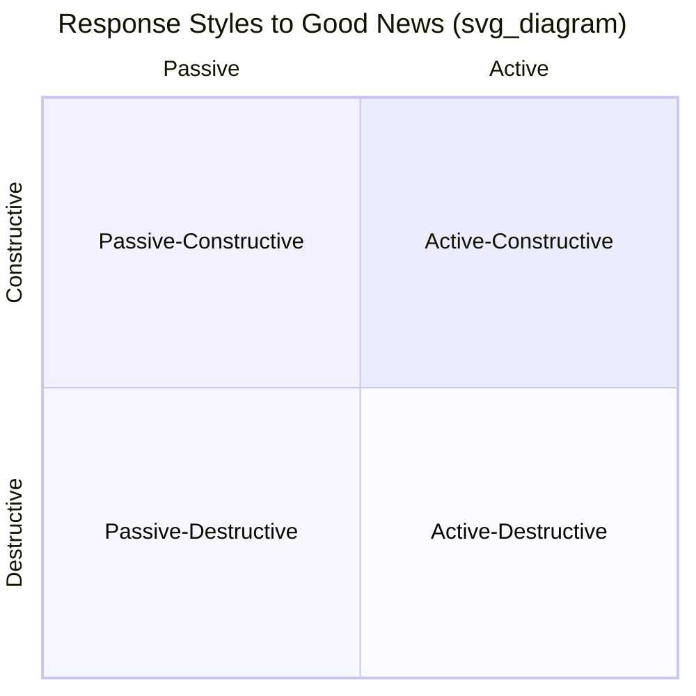

## Active-Constructive Responding and Capitalizing on Good News

### Overview

Active-constructive responding (ACR) is an empirically studied interpersonal communication pattern describing how individuals respond when a partner, friend, or colleague shares positive news. Developed primarily through the research of social psychologist **Shelly Gable** and colleagues, ACR research demonstrates that *how* one responds to another person's good news has a measurable impact on relationship quality — independent of, and in some studies more predictive than, how partners respond to each other's negative events.

### The Response Styles Framework

Gable's research identifies four distinct response styles to a partner's disclosure of positive news, organized along two independent dimensions: **active vs. passive** and **constructive vs. destructive**.

- **Active-Constructive (AC)**: Enthusiastic, genuine engagement with the good news — asking questions, expressing authentic excitement, encouraging the person to elaborate and relive the positive experience.
- **Passive-Constructive (PC)**: Understated, low-energy support — a brief, positive but unenthusiastic acknowledgment ("That's nice") without further engagement.
- **Active-Destructive (AD)**: Actively engaged but negative — pointing out downsides, potential problems, or costs associated with the good news ("That's great, but won't that mean more work/stress/risk?").
- **Passive-Destructive (PD)**: Ignoring the disclosure or redirecting the conversation elsewhere, effectively failing to acknowledge the event at all.

**Key Points**

- Only the active-constructive style is consistently associated with positive relational outcomes in Gable's research; the other three styles are associated with neutral or negative outcomes for relationship quality.
- The distinction is behavioral and observable (based on what is said and how), not merely about the sincerity of underlying feeling, making it directly trainable as a communication skill.

### The Capitalization Process

The theoretical foundation underlying ACR is the concept of **capitalization**: the process of sharing positive events with others and, in doing so, deriving additional benefit from the event beyond the direct experience itself. Capitalization research proposes that sharing good news serves social and emotional functions distinct from simply experiencing the positive event privately:

- **Savoring extension**: Retelling and discussing a positive event allows the sharer to relive and further process the positive emotion, extending its subjective duration and intensity.
- **Social validation**: A partner's enthusiastic response provides external confirmation that the event is indeed significant and worth celebrating.
- **Relationship-building function**: The *act* of sharing (rather than the news itself) signals trust and investment in the relationship, and the *quality of the response received* signals whether that trust is reciprocated.

[Inference] Gable's research and subsequent replications support both an intrapersonal benefit (savoring, positive affect boost for the sharer) and an interpersonal benefit (relationship quality) from active-constructive responding, though the relative magnitude of each benefit may vary by relationship type and individual.

### Empirical Findings

- Gable and colleagues' foundational studies found that active-constructive responding to a partner's positive event disclosures was associated with higher relationship satisfaction, greater intimacy, and greater relationship stability over time, compared to the other three response styles.
- Notably, several studies in this research program found that responses to *positive* events were a stronger predictor of relationship quality than responses to *negative* events (i.e., traditional social support during hardship) — a finding that challenged the prior research emphasis on support during adversity as the primary driver of relationship quality.
- Active-destructive and passive-destructive responses have been associated in this research with reduced relationship satisfaction and, in some studies, increased likelihood of relationship dissolution over longitudinal follow-up.

### Example: Four Responses to the Same News

**Example**

A partner announces: "I just got offered a promotion at work!"

- **Active-Constructive**: "That's amazing! Tell me everything — what will the new role involve? You've worked so hard for this, I'm so proud of you."
- **Passive-Constructive**: "Oh, cool." (continues with prior activity, no follow-up)
- **Active-Destructive**: "That's great, but doesn't that mean way more hours? Are you sure you can handle the extra stress on top of everything else?"
- **Passive-Destructive**: "Anyway, did you remember to pick up the dry cleaning?"

Only the first response engages both actively and supportively — asking questions, expressing genuine enthusiasm, and inviting further elaboration, which is the behavioral signature of ACR.

### Application Beyond Romantic Relationships

While Gable's original research focused primarily on romantic couples, the ACR framework has since been applied and studied in other relational contexts:

- **Parent-child relationships**: Active-constructive responses from parents to children's achievements or positive disclosures are studied in developmental psychology as contributing to children's self-esteem and willingness to share future experiences.
- **Workplace and managerial relationships**: Some organizational psychology and leadership literature applies the ACR framework to manager-employee interactions, proposing that active-constructive responses to employee successes support engagement and psychological safety, though [Speculation] the empirical evidence base specifically validating ACR within organizational settings is smaller and less established than the original relationship-science research on romantic partners.
- **Friendships**: Later studies have extended capitalization and ACR research to platonic friendships, generally finding similar directional patterns, though with some variation in effect size compared to romantic relationship studies.

### Practical Application and Skill-Building

ACR is frequently taught as a practical relationship skill in couples therapy, relationship education programs, and positive psychology coaching contexts. Key behavioral components emphasized in training include:

- Asking open-ended follow-up questions about the positive event.
- Maintaining engaged nonverbal behavior (eye contact, animated tone, physical presence) during the disclosure.
- Avoiding the impulse to immediately introduce caveats, risks, or comparisons.
- Allowing the discloser to elaborate and "relive" the event rather than quickly moving the conversation elsewhere.

### Measurement Approaches

- **Perceived Responses to Capitalization Attempts (PRCA) scale**: The primary instrument developed within Gable's research program, asking respondents to rate how their partner typically responds to their good news, generating scores across the four response style categories.
- Observational coding of recorded couple interactions, where trained raters classify recorded responses to positive disclosures according to the four-category framework, is also used in laboratory-based relationship research.

### Criticisms and Limitations

- Much of the foundational research relies on self-report measures of partner responses, which may be subject to the responder's own relationship satisfaction biasing their perception and recall of how their partner actually responded (a common methodological challenge in relationship science).
- [Inference] The specific magnitude and consistency of ACR's relational benefits across highly diverse relationship types, cultural contexts, and communication norms (e.g., cultures with different norms around expressed enthusiasm) has received less extensive study than the original findings within predominantly Western romantic-couple samples.
- Critics note the framework's apparent simplicity may understate real-world complexity — for example, an active-destructive response delivered with clear underlying care and concern (rather than dismissiveness) may be received differently than the framework's category label alone would suggest, an area where later refinements of the research have attempted more nuanced coding.

**Related Topics**

- Social connection as a pillar of well-being
- Savoring positive experiences
- Attachment theory and adult relationships
- Positive Emotion (P) as a PERMA component
- Couples therapy and relationship education interventions
- Loneliness and social isolation