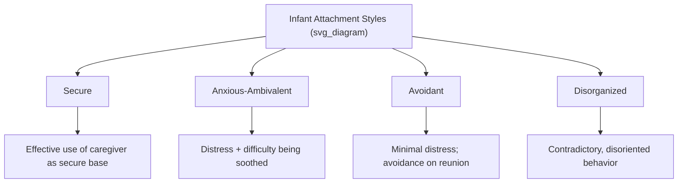

## Attachment Theory and Its Links to Flourishing

### Overview

Attachment theory, originally developed by **John Bowlby** and empirically extended by **Mary Ainsworth**, describes the formation and function of close emotional bonds, beginning with the infant-caregiver relationship and extending, in later theoretical work, to adult romantic and social relationships. Contemporary positive psychology draws on attachment theory to explain individual differences in relational functioning and their downstream links to flourishing and well-being.

### Foundational Concepts: Bowlby's Attachment Theory

Bowlby proposed that infants possess an innate, evolutionarily selected behavioral system oriented toward maintaining proximity to a caregiver, particularly under conditions of threat or distress. Key foundational concepts include:

- **Secure base**: The caregiver functions as a safe base from which the infant can explore the environment, returning for comfort and safety when needed.
- **Internal working models**: Bowlby proposed that early attachment experiences become internalized as cognitive-emotional templates ("internal working models") for how relationships function, including expectations about the self's worthiness of love and others' likely responsiveness — templates theorized to influence relational patterns across the lifespan.
- **Attachment behavioral system**: An evolutionarily adaptive system, activated by distress or threat, that motivates proximity-seeking toward an attachment figure.

### Ainsworth's Attachment Styles: The Strange Situation

Mary Ainsworth's empirical contribution, the **Strange Situation** laboratory procedure, involved observing infant behavior across a structured sequence of separations from and reunions with a caregiver, identifying distinct patterns of attachment:

- **Secure attachment**: The infant uses the caregiver as a secure base for exploration, shows distress upon separation, and is readily comforted upon reunion.
- **Anxious-ambivalent (resistant) attachment**: The infant shows heightened distress upon separation and is difficult to soothe upon reunion, displaying both proximity-seeking and resistant/angry behavior.
- **Avoidant attachment**: The infant shows minimal distress upon separation and actively avoids or ignores the caregiver upon reunion.
- A fourth category, **disorganized attachment**, was later identified by Mary Main and colleagues, characterized by contradictory, disoriented, or fearful behavior toward the caregiver, often associated in research with caregiving environments involving frightening or unpredictable caregiver behavior.

### Extension to Adult Romantic Attachment

Researchers Cindy Hazan and Phillip Shaver extended attachment theory to adult romantic relationships in the late 1980s, proposing that adult romantic bonds function through a similar attachment behavioral system as infant-caregiver bonds. Contemporary adult attachment research typically organizes attachment styles along two continuous dimensions rather than discrete categories:

- **Attachment anxiety**: The degree to which a person fears abandonment or rejection and seeks reassurance and closeness, often accompanied by heightened vigilance to relationship threats.
- **Attachment avoidance**: The degree to which a person is uncomfortable with closeness and interdependence, preferring self-reliance and emotional distance.

Combining these two dimensions yields four commonly referenced adult attachment styles:

| Style | Anxiety | Avoidance | General Pattern |
| --- | --- | --- | --- |
| Secure | Low | Low | Comfortable with intimacy and independence |
| Anxious-preoccupied | High | Low | Craves closeness, fears abandonment |
| Dismissive-avoidant | Low | High | Values independence, minimizes emotional closeness |
| Fearful-avoidant | High | High | Desires closeness but fears intimacy/rejection |

**Key Points**

- Adult attachment is typically measured dimensionally (degree of anxiety and avoidance) rather than as strict discrete categories, reflecting contemporary psychometric consensus, even though categorical labels remain common in popular usage.
- Attachment style is theorized to be relatively stable but not fixed; research finds meaningful continuity from childhood into adulthood on average, alongside documented individual cases of attachment style change linked to significant relational experiences (a secure, healthy relationship, or conversely, relational trauma).

### Links to Flourishing and Well-Being

Adult attachment security is one of the more robust individual-difference predictors within relationship science, with documented associations to multiple flourishing-related outcomes:

- **Relationship satisfaction**: Securely attached individuals consistently report higher relationship satisfaction and stability compared to anxiously or avoidantly attached individuals across numerous studies.
- **Emotion regulation**: Secure attachment is associated with more adaptive emotion regulation strategies, including greater comfort seeking and providing support during distress, linking attachment security to the broader construct of resilience.
- **Self-esteem and self-concept**: Attachment security is associated with more stable and positive self-concept, consistent with Bowlby's internal working models framework (secure models of self as worthy of love).
- **Mental health outcomes**: Insecure attachment styles (particularly anxious and fearful-avoidant) are associated in meta-analytic research with elevated risk for depression, anxiety disorders, and difficulty in interpersonal functioning, though [Inference] attachment insecurity functions as one risk factor among many rather than a sole or deterministic cause of these outcomes.
- **Capacity for intimacy and social connection**: Given the direct link between social connection and well-being (covered in the "Social connection as a pillar of well-being" topic), attachment security's facilitation of comfortable intimacy provides a plausible developmental/individual-difference mechanism underlying who forms and maintains high-quality relationships more readily.

### Mechanisms: Why Attachment Security Supports Flourishing

- **Secure base for exploration extended to adulthood**: Just as securely attached infants explore more confidently with a caregiver as secure base, securely attached adults are theorized to engage more confidently with novel challenges, goals, and personal growth opportunities when they have a stable relational base (romantic partner, close friend, or family).
- **Effective co-regulation**: Secure individuals both seek and provide effective emotional support, supporting the interpersonal emotion regulation mechanisms linked to well-being under the social connection topic.
- **Reduced defensive processing**: Avoidant and anxious attachment styles are associated with defensive cognitive-emotional strategies (suppression for avoidant types; hypervigilance for anxious types) that are more cognitively and emotionally costly to sustain, potentially depleting resources otherwise available for flourishing-related pursuits (engagement, goal pursuit, positive emotion).

### Example: Attachment Style and Response to Relationship Conflict

**Example**

Following a disagreement with a partner, a securely attached individual is likely to seek reconnection relatively directly, express their feelings, and remain open to repair. An anxiously attached individual might experience heightened distress and engage in protest behaviors (repeated calls or texts, urgent reassurance-seeking) driven by fear of abandonment. A dismissive-avoidant individual might withdraw, minimize the conflict's significance, and avoid the emotional conversation altogether, prioritizing self-reliance over engagement. This illustrates how the same external event (conflict) is processed and responded to differently depending on underlying attachment patterns, with downstream implications for how effectively the relationship is repaired and maintained — directly relevant to relationship quality and thus to flourishing.

### Attachment-Informed Interventions

- **Emotionally Focused Therapy (EFT)**: A couples therapy modality, developed by Sue Johnson, explicitly grounded in attachment theory, which works to identify and interrupt negative interaction cycles rooted in attachment fears and to foster more secure emotional bonding between partners. EFT has a substantial evidence base including randomized controlled trials supporting its efficacy for relationship distress.
- **Attachment-based parenting interventions**: Programs aimed at increasing caregiver sensitivity and responsiveness to infant cues, associated in intervention research with increased rates of secure infant attachment.
- **"Earned security"**: A concept in attachment research describing adults who, despite insecure childhood attachment histories, develop a coherent, secure narrative about their attachment experiences in adulthood (often through therapy or a corrective relational experience), associated with outcomes similar to those with continuously secure attachment histories.

### Measurement Instruments

- **Strange Situation Procedure**: The original laboratory-based observational measure for infant attachment classification.
- **Adult Attachment Interview (AAI)**: A semi-structured interview assessing adult attachment representations through narrative coherence about childhood attachment experiences, scored by trained coders (distinct from self-report).
- **Experiences in Close Relationships scale (ECR, and revised ECR-R)**: The most widely used self-report measure of adult romantic attachment, assessing the anxiety and avoidance dimensions.
- **Relationship Questionnaire (RQ)**: A brief, categorical self-report measure of the four adult attachment styles.

### Criticisms and Limitations

- The degree of continuity between infant and adult attachment style is a subject of ongoing empirical debate; while meta-analytic evidence supports moderate continuity on average, individual-level prediction from infant to adult attachment is imperfect, and life experiences (relationships, therapy, trauma) can shift attachment patterns.
- Attachment theory's foundational research was conducted predominantly in Western, and specifically North American and Northern European, cultural contexts; [Inference] some cross-cultural research suggests differing caregiving norms (e.g., communal or multiple-caregiver child-rearing practices in some cultures) may affect how attachment classifications map onto other cultural contexts, an area of continued cross-cultural attachment research.
- Self-report adult attachment measures (like the ECR) and interview-based measures (like the AAI) sometimes show only modest correlation with each other, raising questions about whether they are capturing fully overlapping constructs — a recognized methodological issue within adult attachment research.

**Related Topics**

- Social connection as a pillar of well-being
- Active-constructive responding and capitalizing on good news
- Emotionally Focused Therapy (EFT)
- Emotion regulation and co-regulation
- Internal working models and narrative identity
- Resilience and its developmental origins