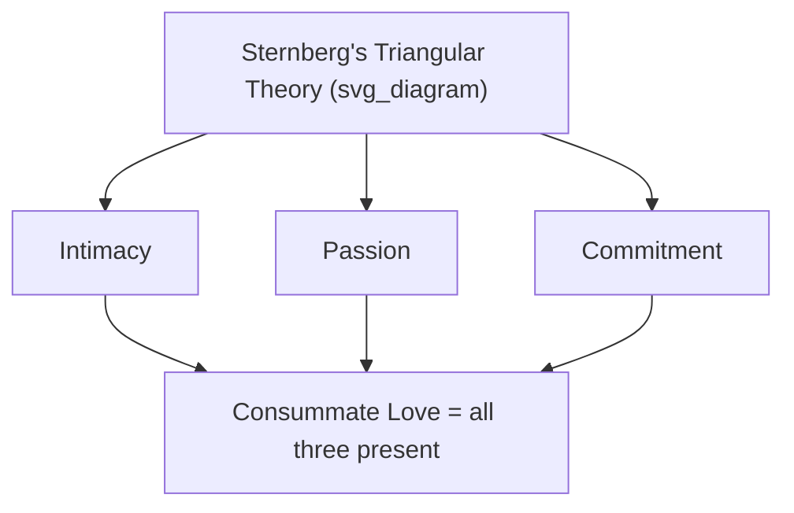

## Love, Intimacy, and the Science of Close Relationships

### Overview

This entry surveys the major empirical and theoretical frameworks used within relationship science to understand love, intimacy, and the maintenance of close relationships. It builds on attachment theory and social connection research covered previously, focusing specifically on models of love's structure, the mechanics of intimacy-building, and evidence-based predictors of relationship success and dissolution.

### Sternberg's Triangular Theory of Love

Psychologist Robert Sternberg proposed that love can be decomposed into three distinct components, whose relative presence and balance produce different experienced forms of love:

- **Intimacy**: Feelings of closeness, connectedness, and bondedness — the emotional component.
- **Passion**: Drives leading to romance, physical attraction, and sexual consummation — the motivational/arousal component.
- **Commitment**: The decision to love another and the intention to maintain that love over time — the cognitive/decisional component.

Different combinations of these three components yield Sternberg's typology of love forms, including:

- **Liking**: Intimacy alone, without passion or commitment (friendship).
- **Infatuation**: Passion alone, without intimacy or commitment.
- **Empty love**: Commitment alone, without intimacy or passion (e.g., some long-term relationships that have lost emotional and physical connection but persist through decision/obligation).
- **Romantic love**: Intimacy and passion, without commitment.
- **Companionate love**: Intimacy and commitment, without passion (often characteristic of long-term marriages or deep friendships).
- **Fatuous love**: Passion and commitment, without intimacy (e.g., whirlwind engagements).
- **Consummate love**: All three components present — considered by Sternberg the most complete form, though he noted it is often difficult to sustain in its complete form over the long term.

[Inference] Sternberg's model is a widely used and taught theoretical framework, but the specific claim about the difficulty of sustaining "consummate love" is a theoretical proposition rather than a precisely quantified empirical finding.

### Intimacy Development: The Self-Expansion Model

Arthur Aron and Elaine Aron's **self-expansion model** proposes that individuals are motivated to enter and maintain close relationships partly because relationships allow for the expansion of the self — incorporating a partner's resources, perspectives, and identities into one's own sense of self. Key implications:

- Novel and challenging shared activities are theorized to accelerate self-expansion and, correspondingly, feelings of closeness and passion, because they provide rapid opportunities for self-expansion.
- This model provides the theoretical basis for Aron's well-known **36 Questions** closeness-generating procedure, a structured, escalating self-disclosure task developed in laboratory research to experimentally induce interpersonal closeness between strangers.

### Self-Disclosure and Intimacy

Intimacy development is closely tied to **reciprocal self-disclosure** — the mutual sharing of increasingly personal information. Key theoretical concepts:

- **Social penetration theory** (Altman and Taylor): Describes relationship development as a process of increasing breadth (number of topics discussed) and depth (personal significance of topics discussed) of self-disclosure, often depicted metaphorically as peeling back layers of an "onion" model of personality.
- **Responsiveness**: A concept central to contemporary intimacy research, referring to a partner's perceived understanding, validation, and caring in response to disclosure. Responsiveness (not mere disclosure itself) is considered the key mechanism translating self-disclosure into felt intimacy — disclosure without a responsive listener does not reliably build closeness.

### The Gottman Method: Predicting Relationship Success and Failure

Psychologist **John Gottman**, through decades of observational research on couples (including physiological measurement during conflict discussions), developed one of the most empirically validated frameworks for predicting relationship stability and satisfaction.

**The Four Horsemen of the Apocalypse**: Gottman identified four specific negative communication patterns that, observed during couple conflict interactions, were strong predictors of eventual relationship dissolution in his longitudinal research:

- **Criticism**: Attacking a partner's character or personality rather than addressing a specific behavior.
- **Contempt**: Communicating disrespect, mockery, or disdain — identified by Gottman's research as the single strongest predictor of divorce among the four.
- **Defensiveness**: Responding to a perceived attack with self-protective counter-attack or victim-playing rather than accountability.
- **Stonewalling**: Withdrawing from interaction, shutting down communication, particularly under high physiological arousal.

**The Positive-to-Negative Ratio**: Gottman's research identified an approximate ratio of positive to negative interactions during conflict that distinguished stable from unstable couples in his samples — commonly cited as approximately 5:1 (five positive interactions for every negative one) during conflict discussions. [Unverified] This specific ratio figure, sometimes called the "magic ratio," derives from Gottman's particular study samples and mathematical modeling approach; while widely cited, some methodologists have raised questions about the precision and generalizability of the exact numerical ratio, and it should be treated as an approximate, illustrative finding rather than a universally fixed threshold.

**Bids for connection and turning toward**: Gottman's research also identified everyday "bids" — small attempts to gain attention, affirmation, or connection from a partner (a comment, a question, a gesture) — and found that partners' tendency to "turn toward" (respond positively and engagingly to) versus "turn away" (ignore) or "turn against" (respond with hostility) these bids was strongly predictive of long-term relationship stability in his research, echoing the active-constructive responding literature covered previously but applied across everyday small moments rather than major positive events specifically.

### Example: Applying Gottman's Framework in Practice

**Example**

During a disagreement about household responsibilities, a partner using criticism might say: "You never help around here, you're so lazy." Reframed to avoid the "Four Horsemen" pattern, the same concern could be expressed as: "I've been feeling overwhelmed with the housework this week — could we talk about dividing it differently?" The second version addresses a specific behavior and need without attacking character, consistent with Gottman's research-based recommendation to substitute a "gentle startup" for criticism.

### Passionate vs. Companionate Love

A long-standing distinction in relationship science, originating with researchers Elaine Hatfield and colleagues:

- **Passionate love**: An intense emotional state characterized by longing, physiological arousal, and preoccupation with the partner, typically most pronounced in early-stage relationships.
- **Companionate love**: A deeper, calmer form of affection, characterized by trust, care, and intertwined lives, often becoming more prominent as relationships mature over time.

[Inference] The commonly described pattern of passionate love naturally moderating over time as companionate love increases is a broadly supported generalization in relationship research, though considerable individual and couple-level variation exists, and some longitudinal studies find subsets of long-term couples retaining relatively high passionate love.

### Intimacy and Flourishing

Consistent with the broader "social connection" and "attachment" topics, high-quality intimate relationships are robustly associated with well-being outcomes across the literature: greater life satisfaction, better physical health markers, more effective stress buffering, and — per the Harvard Study of Adult Development and related longitudinal research — long-term happiness and healthy aging. Sternberg's, Gottman's, and the self-expansion frameworks each offer complementary mechanistic accounts of *how* specific relational processes (balanced love components, positive conflict ratios, responsive self-disclosure) produce these downstream flourishing benefits.

### Interventions Derived from Relationship Science

- **Gottman Method Couples Therapy**: A structured therapeutic approach directly derived from Gottman's observational research, targeting the Four Horsemen, building the positive-to-negative interaction ratio, and strengthening bid-turning-toward behavior.
- **Emotionally Focused Therapy (EFT)**: As noted in the attachment topic, addresses relationship distress through an attachment-theoretic lens, complementary to Gottman's more behavioral/observational approach.
- **Self-expansion-based date activities**: Couples counseling and relationship-enrichment programs sometimes explicitly recommend novel, challenging shared activities based on self-expansion model research, to counteract the natural decline in novelty (and associated passion) that can occur in long-term relationships.

### Measurement Instruments

- **Sternberg Triangular Love Scale**: Self-report measure assessing the three love components.
- **Gottman's Sound Relationship House assessment tools**: A battery of couple assessment instruments used clinically, derived from his broader theoretical model (of which the Four Horsemen and positive/negative ratio are components).
- **Inclusion of Other in the Self Scale (IOS)**: A simple, widely used pictorial measure (overlapping circles) assessing subjective closeness, derived from the self-expansion model.
- **Relationship Assessment Scale (RAS)**: A brief, widely used general relationship satisfaction measure.

### Criticisms and Limitations

- Gottman's research, while highly influential and based on extensive observational data, has faced some methodological critique regarding sample characteristics (e.g., degree of representativeness across diverse populations and relationship structures) and the precise predictive accuracy claims sometimes popularized in media coverage of his work (such as claims of near-perfect divorce prediction), which some independent methodological reviews have argued overstate the underlying statistical findings.
- Much of classic relationship science historically focused on heterosexual, married, Western couples; more recent research has worked to extend these frameworks to same-sex relationships, non-marital partnerships, and non-Western cultural contexts, generally finding partial but not complete generalizability of frameworks like Gottman's Four Horsemen.
- [Speculation] The self-expansion model's emphasis on novelty as a driver of closeness may interact with individual differences (e.g., attachment style, novelty-seeking personality traits) in ways not fully specified by the base theory.

**Related Topics**

- Attachment theory and its links to flourishing
- Social connection as a pillar of well-being
- Active-constructive responding and capitalizing on good news
- Emotionally Focused Therapy (EFT)
- Self-expansion model and closeness-generating procedures
- Conflict resolution and communication skills in relationships