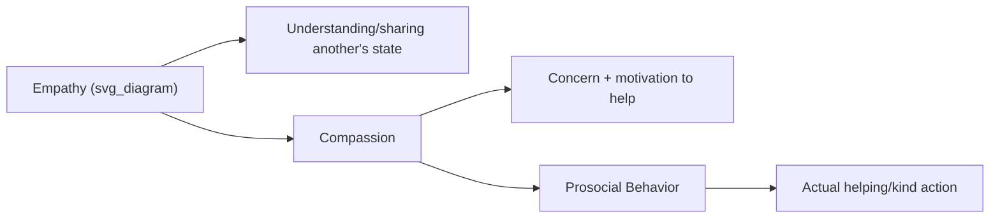

## Compassion, Kindness, and Prosocial Behavior

### Overview

This entry covers the empirical study of compassion, kindness, and prosocial behavior within positive psychology — examining their definitions, psychological mechanisms, measurement, and their bidirectional relationship with individual and relational well-being.

### Defining the Core Constructs

- **Prosocial behavior**: The broadest term, referring to any voluntary behavior intended to benefit another person or group, including helping, sharing, cooperating, comforting, and donating.
- **Kindness**: A specific form of prosocial behavior characterized by warmth, generosity, and consideration toward others, often studied in terms of small, everyday acts (e.g., holding a door, offering a compliment, small favors).
- **Compassion**: Distinguished in the psychological literature as involving an affective/emotional component — a felt sense of concern for another's suffering coupled with a motivation to alleviate it. Compassion is often theoretically positioned as a precursor or driver of kind or prosocial action, rather than the action itself.
- **Empathy**: Related but distinct — generally defined as the capacity to understand or vicariously share another's emotional state, which can occur without necessarily motivating helping behavior (distinguishing empathy from compassion, which specifically includes a motivational/action-oriented component).

**Key Points**

- Contemporary affective neuroscience research (notably associated with Tania Singer and colleagues) distinguishes empathy and compassion at a neural level: empathic distress (feeling another's pain as one's own) is associated with different neural circuitry and different subjective/motivational consequences than compassion (which is associated with warmth and approach motivation rather than distress).
- This distinction has practical significance: unchecked empathic distress, without the buffering effect of compassion training, is associated in some research with burnout risk in caregiving professions, whereas compassion is associated with sustained caregiving capacity.

### Theoretical Perspectives on the Origins of Prosocial Behavior

- **Evolutionary/kin selection and reciprocal altruism theories**: Propose that prosocial tendencies evolved because they increased inclusive fitness (helping genetic relatives) or because reciprocal helping produced mutual long-term survival benefits within social groups.
- **Social exchange theory**: Frames helping behavior partly in terms of a cost-benefit calculation, where individuals help when perceived benefits (social approval, reciprocity, reduced personal distress) outweigh costs.
- **Empathy-altruism hypothesis** (C. Daniel Batson): Proposes that genuine empathic concern can produce truly altruistic motivation — helping aimed at increasing another's welfare as an end in itself, rather than purely as an instrumental means to reduce one's own distress or gain a reward. Batson's experimental research is frequently cited as evidence against a purely egoistic account of all human helping behavior, though this remains a debated area in social psychology.

[Inference] The empathy-altruism hypothesis has substantial experimental support from Batson's research program, but whether *any* human prosocial act is entirely free of self-interested motivation (however subtle) remains a long-standing philosophical and psychological debate rather than a fully settled empirical question.

### Well-Being Benefits of Prosocial Behavior: The "Helper's High" and Beyond

A substantial body of research demonstrates that engaging in prosocial behavior is associated with benefits to the *giver*, not only the recipient:

- **Elizabeth Dunn and colleagues' research on prosocial spending**: Experimental studies have found that spending money on others (prosocial spending) is associated with greater increases in happiness than spending the same amount on oneself, a finding replicated across multiple cultural contexts, though [Inference] the specific magnitude of this effect and the conditions under which it holds most strongly (e.g., autonomy in choosing how to give, feeling a connection to the recipient) have been refined by subsequent research rather than being a uniform, unconditional effect.
- **Positive affect and mood benefits**: Numerous studies find that performing small acts of kindness produces short-term boosts in positive affect and life satisfaction for the person performing the act, sometimes termed colloquially the "helper's high," though this is a research-derived pattern rather than a formal clinical or physiological diagnosis term.
- **Physical health correlates**: Some research links volunteering and prosocial engagement to physical health benefits (including, in some longitudinal studies, associations with reduced mortality risk), though as with other longevity-related well-being research, causal mechanisms and the role of potential confounds (e.g., healthier individuals being more able to volunteer) remain areas of ongoing investigation.
- **Meaning and purpose links**: Prosocial and generative activity (contributing to others or future generations) connects directly to the "beyond-the-self" component of purpose (Damon's definition, covered previously) and to sources of meaning research, where contribution to community and others is consistently cited as a major meaning source.

### Kindness Interventions in Positive Psychology

Kindness-based interventions are among the most widely studied positive psychology interventions (PPIs):

- **"Random acts of kindness" interventions**: Participants are instructed to perform a set number of kind acts (often over a defined period, such as performing several acts in a single day) and report on well-being outcomes; multiple studies find short-term increases in positive affect and life satisfaction following such interventions.
- **Variety and novelty effects**: Some research (e.g., work by Sonja Lyubomirsky and colleagues) finds that varying the type of kind acts performed, rather than repeating the same act, sustains well-being benefits more effectively over time — consistent with broader hedonic adaptation research, where novelty helps counteract the diminishing emotional impact of repeated identical experiences.

### Compassion Training Programs

Distinct from simple kindness-behavior interventions, several structured compassion-cultivation programs have been developed and empirically evaluated:

- **Compassion Cultivation Training (CCT)**: Developed at Stanford University, a structured meditation-based program aimed at cultivating compassion for self and others.
- **Mindful Self-Compassion (MSC)**: Developed by Kristin Neff and Christopher Germer, integrating self-compassion practices with mindfulness training (self-compassion is covered in more depth elsewhere as a related but distinct construct focused inward rather than outward).
- **Cognitively-Based Compassion Training (CBCT)**: Developed at Emory University, involving structured contemplative practices aimed at systematically extending compassion outward, including toward difficult or disliked individuals.

These programs have been evaluated in randomized studies for outcomes including reduced stress reactivity, increased prosocial behavior in laboratory tasks, and improvements in well-being measures, though [Unverified] the overall evidence base, while growing, is smaller in volume and long-term follow-up compared to more established interventions like standard mindfulness-based stress reduction (MBSR).

### Example: Compassion vs. Empathic Distress in Caregiving

**Example**

A hospice nurse caring for dying patients daily is at risk, over time, of **empathic distress** — absorbing patients' suffering as personal distress, which can lead to emotional exhaustion and burnout. Compassion training approaches aim instead to cultivate a state in which the nurse maintains warm concern and motivation to help *without* fully mirroring the patient's suffering internally, theoretically supporting sustained caregiving capacity rather than depletion. This distinction illustrates why "more empathy" is not always the recommended intervention in high-exposure caregiving contexts, whereas compassion cultivation is often specifically targeted instead.

### Prosocial Behavior and Social Connection

Prosocial acts frequently function as relationship-building behaviors, linking this topic directly to the "Social connection" pillar covered earlier: helping behavior can initiate and strengthen social bonds, and reciprocal helping within a community or relationship contributes to the sense of mutual reliability and trust associated with high-quality relationships (echoing Gottman's "turning toward" concept and the broader social provisions literature).

### Measurement Instruments

- **Prosocial Behavior Questionnaire / Self-Report Altruism Scale**: Common self-report instruments assessing frequency and range of prosocial behaviors.
- **Interpersonal Reactivity Index (IRI)**: A widely used multidimensional measure distinguishing cognitive (perspective-taking) and affective (empathic concern, personal distress) components of empathy.
- **Compassionate Love Scale**: Assesses compassionate love directed toward specific others (e.g., strangers, humanity broadly, or specific close relationships).
- **Santa Clara Brief Compassion Scale**: A brief self-report instrument specifically measuring compassionate attitudes and behavior.

### Criticisms and Limitations

- Much prosocial behavior research relies on self-report or brief laboratory tasks (e.g., economic games such as the dictator game), which may not fully generalize to complex, real-world helping behavior over extended timeframes.
- The well-being benefits of prosocial spending and kindness interventions, while replicated across multiple studies, show effect sizes that vary depending on study design, cultural context, and whether the giving is autonomous versus obligated; [Inference] obligated or externally pressured giving does not consistently produce the same well-being benefit as freely chosen prosocial acts, based on self-determination-theory-informed research on autonomous versus controlled motivation.
- Compassion training program evaluations, while promising, have generally involved smaller sample sizes and shorter follow-up periods than more established clinical interventions, meaning [Speculation] the durability of compassion training's effects over years (rather than weeks or months) is not yet well established.

**Related Topics**

- Social connection as a pillar of well-being
- Active-constructive responding and capitalizing on good news
- Purpose, goal pursuit, and long-term life direction
- Self-compassion (Kristin Neff)
- Positive psychology interventions (PPIs) more broadly
- Volunteering and generativity in adulthood