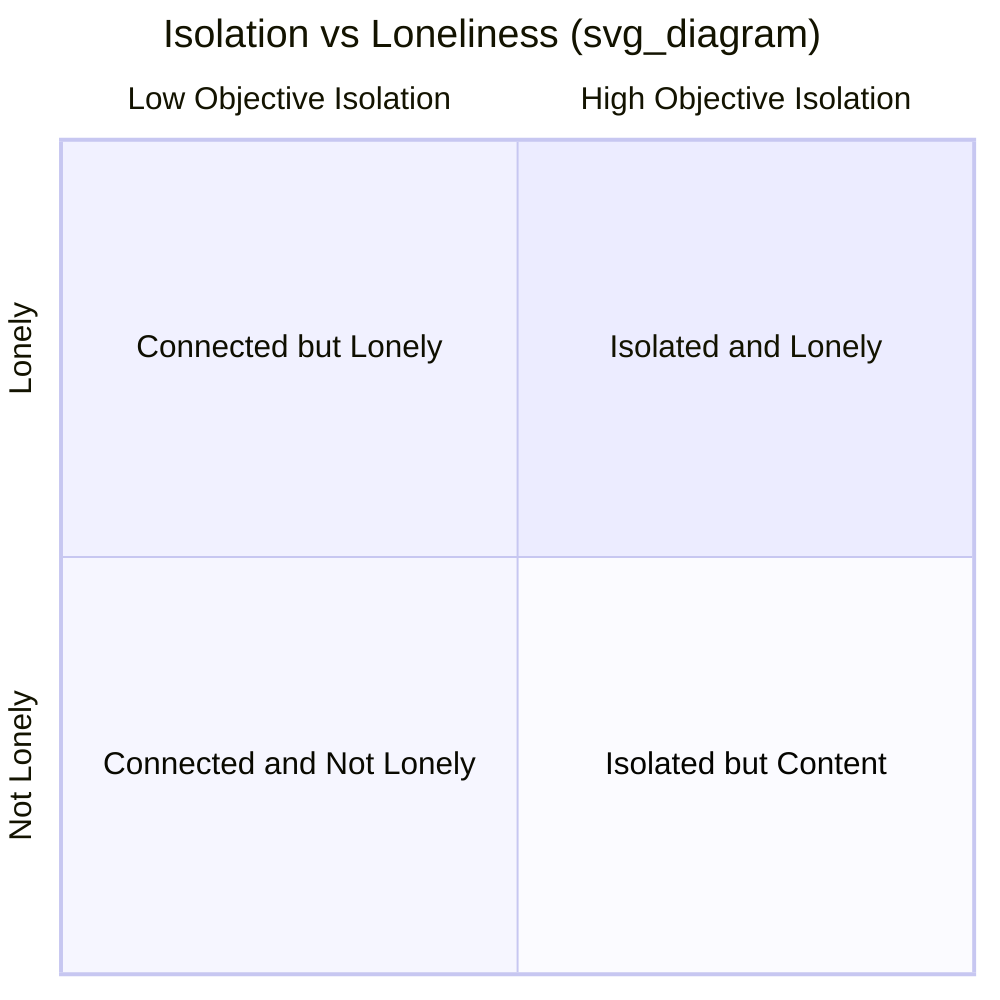

## Loneliness, Social Isolation, and Their Effects on Well-Being

### Overview

Loneliness and social isolation are two related but conceptually and empirically distinct constructs central to relationship science and public health. This entry examines their definitions, measurement, causes, health consequences, and evidence-based interventions, extending the introductory treatment provided under "Social connection as a pillar of well-being."

### Defining and Distinguishing the Constructs

- **Social isolation**: An objective, structural condition referring to a lack of social contacts, relationships, or engagement — measurable via network size, frequency of contact, or living arrangement (e.g., living alone).
- **Loneliness**: A subjective, distressing psychological state arising from a perceived discrepancy between one's desired and actual level or quality of social connection. Loneliness is fundamentally about *perceived* deficiency, not objective contact frequency.

**Key Points**

- A person can be objectively isolated (few social contacts) without feeling lonely, if their desired level of contact is also low — this pattern is sometimes associated with high solitude preference or introversion.
- Conversely, a person can be embedded in a large social network yet feel persistently lonely if the relationships lack perceived depth, understanding, or responsiveness — a pattern especially studied in research on loneliness within marriages and long-term partnerships.

### Types of Loneliness

Drawing on foundational work by Robert Weiss, loneliness researchers commonly distinguish:

- **Emotional loneliness**: The absence of a specific close, intimate attachment figure (e.g., following the loss of a spouse or best friend), theorized to be linked to attachment-system activation.
- **Social loneliness**: The absence of a broader engaging social network or sense of community belonging, distinct from missing one specific person.

This distinction has practical implications: interventions addressing social loneliness (e.g., joining group activities) may not resolve emotional loneliness (which requires a specific close bond), and vice versa.

### Prevalence and Trends

Loneliness has been increasingly described by public health researchers and organizations as a significant population-level concern, with some public health bodies (including, notably, statements associated with the U.S. Surgeon General's office) characterizing loneliness and isolation as constituting a public health priority given documented associations with morbidity and mortality. [Unverified] Specific prevalence percentages and trend data vary across surveys, countries, time periods, and measurement methods, and should be verified against current, dated sources rather than treated as fixed figures, since rates have been reported to fluctuate over time (including documented increases during the COVID-19 pandemic period in multiple studies).

### Health and Well-Being Consequences

**Mortality risk**: Building on the meta-analytic work introduced under "Social connection as a pillar of well-being" (Holt-Lunstad and colleagues), both objective social isolation and subjective loneliness have independently been found in meta-analyses to be associated with increased mortality risk, with effect sizes in some analyses reported as comparable to other major, well-established public health risk factors.

**Physical health correlates**: Loneliness has been associated in research with:

- Elevated inflammatory markers and altered immune function in some studies
- Increased cardiovascular risk factors
- Disrupted sleep quality
- Accelerated cognitive decline risk in some longitudinal aging research

**Mental health correlates**: Loneliness is robustly associated with elevated risk of depression and anxiety, and the relationship appears to some degree bidirectional in longitudinal research — loneliness predicting later depressive symptoms, and depressive symptoms also predicting later loneliness (e.g., through withdrawal behaviors), forming a potential reinforcing cycle in some individuals.

[Inference] Because most of this evidence base derives from observational and longitudinal (rather than fully experimental) designs, causal directionality and the specific biological mechanisms linking loneliness to health outcomes remain areas of active research, even though the associations themselves are well replicated across many independent studies.

### The Cognitive Discrepancy Model of Loneliness

A leading theoretical account, associated with researcher John Cacioppo and colleagues, frames loneliness as arising from a perceived discrepancy between desired and actual social relationships, combined with a proposed evolutionary function: loneliness, in this model, functions similarly to physical pain or hunger — an aversive signal motivating corrective social behavior (analogous to hunger motivating eating). Cacioppo's research additionally proposed that chronic, unaddressed loneliness can trigger a self-reinforcing cycle:

1. Loneliness increases hypervigilance to social threat (heightened sensitivity to rejection cues).
2. This hypervigilance can manifest as more guarded, less warm social behavior.
3. Guarded behavior can elicit less positive responses from others, reinforcing the individual's isolation.
4. This reinforces and potentially deepens the original loneliness.

[Inference] This self-reinforcing cycle is a well-established theoretical model with supporting evidence from Cacioppo's research program, though the strength and universality of each specific step (e.g., degree of hypervigilance, its behavioral effects) likely varies across individuals and contexts.

### Risk Factors and Vulnerable Populations

- **Older adults**: Particularly vulnerable due to bereavement, retirement-related loss of workplace social contact, reduced mobility, and shrinking social networks over time.
- **Adolescents and young adults**: Some recent research has identified elevated loneliness rates in younger populations, with hypothesized (though debated) links to social media use patterns, though [Speculation] the specific causal contribution of social media to youth loneliness, versus other contributing factors (economic pressures, changing social structures), remains an actively contested research area rather than a settled conclusion.
- **Individuals experiencing major life transitions**: Divorce, bereavement, relocation, job loss, and becoming a new parent are all associated with elevated loneliness risk during the transition period.
- **Individuals with chronic illness or disability**: Physical limitations on mobility and social participation, alongside potential social stigma, are associated with elevated loneliness risk in some populations.
- **Caregivers**: Individuals providing extensive care for a family member (e.g., a spouse with dementia) are documented in research as being at elevated risk for social isolation and loneliness due to the time and emotional demands of caregiving.

### Example: Distinguishing Intervention Targets

**Example**

An older adult who recently lost their spouse of 40 years may have an intact broader social network (children, friends, community group) but experiences profound **emotional loneliness** due to the loss of their primary attachment figure. A support group connecting them with others who have experienced similar loss may help by providing new understanding relationships, but is unlikely to fully substitute for the specific, irreplaceable bond that was lost — illustrating why grief-specific support (rather than generic "get out and socialize more" advice) is often more appropriate for emotional loneliness following bereavement, whereas a newly relocated young professional experiencing predominantly **social loneliness** might benefit more directly from broad social network-building activities (joining local groups, clubs, or community organizations).

### Evidence-Based Interventions

A frequently cited meta-analysis by Masi and colleagues (2011) categorized loneliness interventions into four types and assessed their relative effectiveness:

- **Improving social skills**: Training in social skills relevant to initiating and maintaining relationships.
- **Enhancing social support**: Providing or facilitating access to supportive relationships or resources.
- **Increasing opportunities for social contact**: Structural interventions increasing exposure to potential social interaction (e.g., community programs, group activities).
- **Addressing maladaptive social cognition**: Interventions targeting the negative, hypervigilant social cognition patterns described in Cacioppo's discrepancy model (e.g., cognitive-behavioral approaches challenging distorted beliefs about social rejection).

This meta-analysis found that interventions targeting **maladaptive social cognition** produced the largest effect sizes among the four categories, a finding that has influenced subsequent intervention design toward addressing the cognitive/perceptual dimension of loneliness rather than relying solely on increasing contact opportunities. [Inference] This is a well-cited finding from a specific meta-analysis; subsequent research has generally supported the value of cognitive-focused approaches, though effectiveness likely varies by population and the specific cause of an individual's loneliness.

### Measurement Instruments

- **UCLA Loneliness Scale**: The most widely used self-report loneliness measure, developed by Russell and colleagues, typically a 20-item (or shorter revised) scale.
- **De Jong Gierveld Loneliness Scale**: Distinguishes emotional and social loneliness subtypes, commonly used in European aging research.
- **Social and Emotional Loneliness Scale for Adults (SELSA)**: Also distinguishes emotional and social loneliness dimensions, with additional differentiation between family and romantic emotional loneliness.
- **Lubben Social Network Scale**: Assesses objective social network size and engagement, commonly used alongside subjective loneliness measures in gerontological research to distinguish isolation from loneliness empirically.

### Criticisms and Limitations

- Much loneliness research relies on cross-sectional self-report data, though a growing body of longitudinal cohort studies (particularly in aging research) has strengthened causal inference regarding health outcomes over time.
- Cultural norms significantly shape both the experience and reporting of loneliness (e.g., differing cultural expectations around family co-residence, individual solitude, and the acceptability of expressing loneliness), meaning prevalence comparisons across countries require careful methodological interpretation rather than direct numerical comparison.
- [Speculation] The relative contribution of modern technological and social changes (remote work, digital communication, urbanization, delayed marriage) to population-level loneliness trends is a topic of ongoing research and public debate, with multiple contributing factors likely interacting rather than any single cause being definitively established.

**Related Topics**

- Social connection as a pillar of well-being
- Attachment theory and its links to flourishing
- Love, intimacy, and the science of close relationships
- Compassion, kindness, and prosocial behavior
- Bereavement and grief
- Public health approaches to well-being