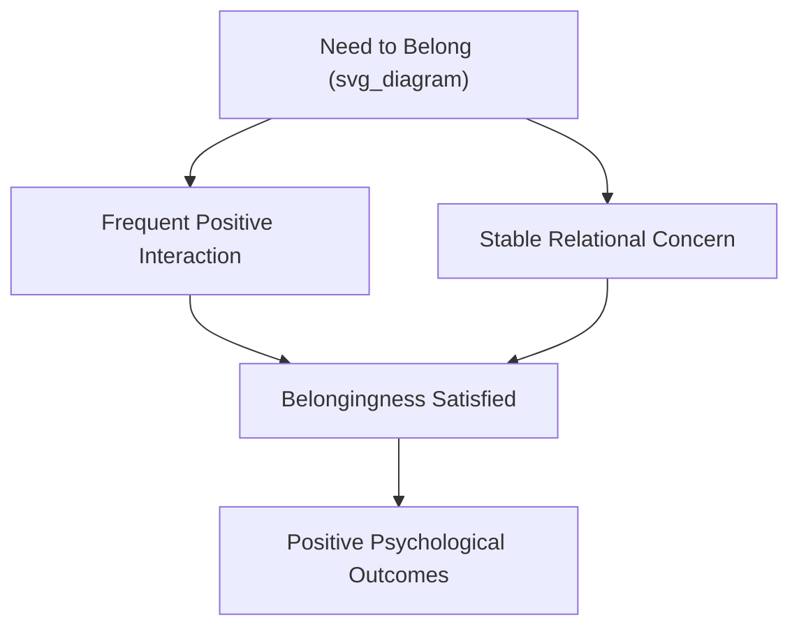
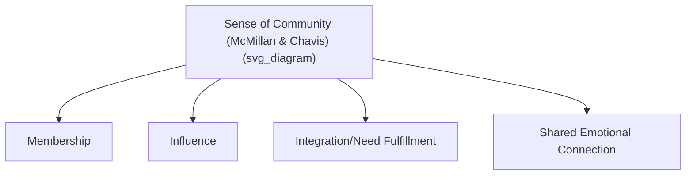

## Building Community and Belonging

### Overview

Community and belonging represent a level of social connection distinct from dyadic relationships (close friendships, romantic partnerships) — referring instead to an individual's felt membership in, and connection to, a broader group, network, or shared identity. This entry examines the psychological need for belonging, the structural and psychological components of community, and evidence-based approaches to building it.

### The Need to Belong

Psychologists Roy Baumeister and Mark Leary's influential **"need to belong" theory** (1995) proposes that humans possess a fundamental, evolutionarily rooted drive to form and maintain a minimum quantity of lasting, positive, and significant interpersonal relationships and group memberships. Key claims of the theory:

- The need to belong is proposed as a basic human motivation, comparable in fundamentality to other basic needs (though distinct from purely biological needs like hunger).
- Belongingness requires both **frequent positive interactions** and a sense of **stable, ongoing relational concern** — meaning neither frequent superficial contact alone, nor a stable but emotionally distant bond alone, fully satisfies the need.
- Thwarted belonging is proposed to produce a range of negative psychological and behavioral consequences, including increased anxiety, depression, and in some research, associations with aggressive or antisocial behavior.

**Key Points**

- Belonging is distinct from mere social contact frequency — it requires a perceived sense of mutual care and continuity, not just repeated interaction.
- The need-to-belong framework provides theoretical grounding for why community-level (not just dyadic) social structures matter independently for well-being.

### Distinguishing Community from Interpersonal Relationships

While close relationships (covered in prior topics) satisfy specific dyadic attachment and intimacy needs, **community** and **belonging** operate at a broader, group level:

- **Sense of community**: A psychological construct, formally defined by researchers David McMillan and David Chavis (1986), comprising four elements:
  - **Membership**: A feeling of belonging and of investing part of oneself in the group.
  - **Influence**: A sense of mattering to the group, and of the group mattering to its members (bidirectional influence).
  - **Integration and fulfillment of needs**: The perception that group membership meets one's personal needs or values.
  - **Shared emotional connection**: A sense of shared history, identity, or emotional bond among members.

### Social Identity Theory and Group Belonging

Henri Tajfel and John Turner's **Social Identity Theory** provides a complementary lens: individuals derive part of their self-concept from membership in social groups (national, occupational, religious, hobby-based, etc.), and this group-derived identity contributes to self-esteem and psychological functioning independent of specific interpersonal relationships within the group. Key related concepts:

- **In-group identification**: The degree to which a person psychologically identifies with and derives meaning from a given group membership.
- **Collective self-esteem**: Self-esteem derived specifically from group memberships, studied as distinct from purely individual/personal self-esteem.

[Inference] Social Identity Theory is a well-established framework primarily used to explain intergroup dynamics (including intergroup bias and conflict), but its core insight — that group membership contributes independently to self-concept and well-being — is directly relevant to understanding why community belonging matters for flourishing beyond dyadic relationships.

### Types of Community

Community and belonging can be organized around multiple, non-exclusive bases:

- **Geographic community**: Neighborhood, town, or local area-based belonging.
- **Identity-based community**: Communities organized around shared identity characteristics (cultural, religious, ethnic, or other shared identity groups).
- **Interest-based community**: Communities organized around shared hobbies, activities, or interests (hobby clubs, sports leagues, fandoms).
- **Occupational/professional community**: Belonging derived from shared profession or workplace.
- **Faith communities**: Religious or spiritual communities, which research consistently identifies as a significant source of both social support and belonging for adherents, distinct from the belief content itself.
- **Online/virtual communities**: Increasingly studied as a distinct category, with research finding that well-structured, interactive online communities can provide meaningful belonging, though findings on the relative depth of online versus in-person community belonging are mixed and appear to depend heavily on the specific platform, interaction style, and whether online ties are exclusive or supplement in-person relationships.

### Empirical Links to Well-Being

- **Religious/spiritual community involvement**: Consistently associated across numerous studies with higher reported well-being, lower rates of depression, and in some longitudinal research, greater longevity — though [Inference] disentangling the specific contribution of community/social belonging from other components of religious involvement (belief content, meaning-making, health behaviors associated with some religious practices) is methodologically challenging, and most researchers attribute at least part of the observed benefit to the social/community dimension specifically.
- **Civic and volunteer community engagement**: Associated with higher life satisfaction and sense of purpose, connecting community belonging directly to the "beyond-the-self" component of purpose covered earlier and to prosocial behavior research.
- **Workplace belonging**: Organizational psychology research links employees' sense of belonging and inclusion at work to job satisfaction, engagement (connecting to the PERMA Engagement pillar), retention, and reduced burnout.
- **Neighborhood cohesion**: Research on neighborhood-level social cohesion (mutual trust and willingness to help neighbors) finds associations with both individual well-being and broader community-level outcomes (reduced crime rates in some studies, better collective efficacy).

### Barriers to Community Belonging

- **Residential mobility**: Frequent relocation disrupts the accumulation of shared history and stable membership central to the McMillan-Chavis model.
- **Declining traditional community structures**: Sociological research (notably Robert Putnam's *Bowling Alone*, 2000) documented declining participation in traditional civic and community organizations in the United States over recent decades, proposing this as a driver of reduced social capital. [Unverified] Putnam's specific empirical claims and their generalizability beyond the U.S. context and time period studied have been both influential and subject to ongoing scholarly debate and updated data in subsequent decades.
- **Stigma and marginalization**: Individuals from marginalized or minority groups may face structural or social barriers to full community membership and influence, even within nominally inclusive communities.
- **Digital fragmentation**: Some researchers propose that the proliferation of narrow, algorithmically curated online communities may reduce exposure to broader, geographically-grounded community structures, though [Speculation] the net effect of this shift on overall belonging (as opposed to simply changing its form) is an area of active and unresolved research.

### Example: Building Belonging in Practice

**Example**

A newly relocated individual joins a local hiking club. Initially, this satisfies only the "membership" component (attending, being nominally part of the group) of the McMillan-Chavis model. Over subsequent months, as they contribute ideas to route planning (**influence**), find the group meets their desire for both exercise and social contact (**integration/needs fulfillment**), and develop shared memories and inside jokes with regular members (**shared emotional connection**), their sense of community deepens across all four components — illustrating that belonging is a cumulative, multidimensional process rather than a binary state achieved simply by joining a group.

### Interventions and Design Principles for Building Community

- **Structured onboarding and inclusion practices**: Explicitly welcoming and integrating new members (in workplaces, clubs, or neighborhoods) has been associated with faster development of belonging compared to passive inclusion.
- **Shared ritual and tradition**: Recurring group rituals (regular meetings, celebrations, shared traditions) support the "shared emotional connection" component of community by building collective history over time.
- **Opportunities for meaningful contribution**: Structuring roles so that members can meaningfully influence group direction or outcomes supports the "influence" component, which research suggests is important beyond mere participation.
- **Physical and digital "third places"**: Sociologist Ray Oldenburg's concept of "third places" — informal public gathering spaces distinct from home ("first place") and work ("second place"), such as cafes, parks, and community centers — is frequently cited in community-building and urban design literature as structurally important for facilitating the casual, repeated interactions from which community belonging tends to grow.

### Measurement Instruments

- **Sense of Community Index (SCI)**: The primary instrument operationalizing the McMillan-Chavis four-component model.
- **Social Identification scales**: Various instruments assessing degree of identification with specific groups, derived from Social Identity Theory research.
- **Belongingness scales** (e.g., the General Belongingness Scale): Assess general trait-level belongingness across relationships and group memberships.
- **PERMA-Profiler — Relationships subscale items**: Some items assess broader social connectedness alongside close relationship quality.

### Criticisms and Limitations

- The McMillan-Chavis model, while widely used, has faced some psychometric critique regarding whether its four proposed components are always empirically distinguishable as separate factors across different community types and cultural contexts.
- Much community and belonging research has focused on relatively stable, established communities; [Inference] less is definitively established about belonging formation in rapidly changing, transient, or purely digital community structures, which represent a growing share of contemporary social organization.
- Debates about the health of contemporary community and social capital (e.g., Putnam's thesis) remain contested, with some scholars arguing that traditional civic organization metrics fail to capture newer, different forms of community and connection that have emerged alongside or replaced older structures.

**Related Topics**

- Social connection as a pillar of well-being
- Loneliness, social isolation, and their effects on well-being
- Compassion, kindness, and prosocial behavior
- Purpose, goal pursuit, and long-term life direction
- Social Identity Theory and intergroup dynamics
- Civic engagement and social capital