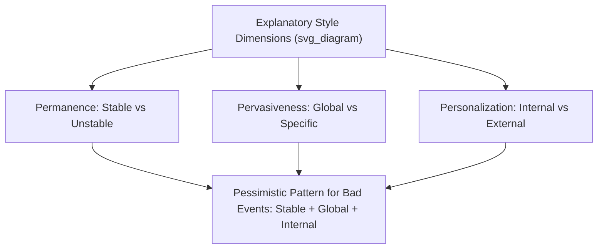

## Learned Optimism and Explanatory Style

### Overview

Learned optimism is a psychological framework developed by **Martin Seligman**, building directly on his earlier research on **learned helplessness**, proposing that optimism and pessimism are largely products of habitual patterns of interpreting events — termed **explanatory style** — and that these patterns can be identified, measured, and deliberately modified through training.

### Theoretical Origins: From Learned Helplessness to Learned Optimism

Seligman's earlier research (1960s–1970s) on **learned helplessness** found that animals (and later, in adapted paradigms, humans) exposed to uncontrollable negative events would subsequently fail to take action even when escape or control became possible, exhibiting passivity generalized beyond the original uncontrollable situation. Later refinements to the theory (developed with Lyn Abramson and John Teasdale) identified that the *degree* to which helplessness generalized depended on how the individual explained the uncontrollable event to themselves — introducing the concept of **explanatory style** as the cognitive mechanism mediating between adverse events and their psychological aftermath. Learned optimism reframes this same explanatory mechanism in the positive direction: if a pessimistic explanatory style produces helplessness, a modifiable optimistic explanatory style should protect against it and can be actively cultivated.

### The Three Dimensions of Explanatory Style

Seligman's model identifies three dimensions along which people characteristically explain negative (and, to a lesser extent studied, positive) events:

- **Permanence (Stable vs. Unstable)**: Whether the cause of an event is seen as permanent/enduring ("I always fail at this") versus temporary ("I didn't do well this time").
- **Pervasiveness (Global vs. Specific)**: Whether the cause is seen as affecting many areas of life ("I'm bad at everything") versus being limited to a specific domain ("I'm not good at this particular task").
- **Personalization (Internal vs. External)**: Whether the cause is attributed to oneself ("It's my fault") versus external circumstances ("The situation was against me").

**Key Points**

- A **pessimistic explanatory style** for negative events is characterized by explanations that are stable (permanent), global (pervasive), and internal (personal): "I always mess things up, everywhere, and it's my fault."
- An **optimistic explanatory style** for negative events is characterized by the opposite pattern: unstable (temporary), specific (limited), and external where appropriate: "That particular project didn't go well this time, due to circumstances outside my full control."
- Critically, Seligman's model proposes the *reverse pattern* for **positive events**: optimists tend to explain good events as stable, global, and internal ("I did well because I'm capable, and this reflects who I am generally"), while pessimists tend to explain good events as unstable, specific, and external ("I got lucky this one time").

### The Full Explanatory Style Model

| Event Type | Optimistic Style | Pessimistic Style |
| --- | --- | --- |
| Bad events | Unstable, Specific, External | Stable, Global, Internal |
| Good events | Stable, Global, Internal | Unstable, Specific, External |

This creates a symmetrical model: optimists take credit for good events broadly and durably, while treating bad events as temporary and limited; pessimists do the reverse, treating good events as flukes while treating bad events as evidence of durable, pervasive personal failure.

### Explanatory Style and Learned Helplessness: The Reformulated Model

The **reformulated learned helplessness model** (Abramson, Seligman, and Teasdale, 1978) proposed that the degree and generalization of helplessness following an uncontrollable negative event depends specifically on the explanatory style applied to that event:

- A **stable** attribution predicts helplessness that persists over time.
- A **global** attribution predicts helplessness that generalizes across situations.
- An **internal** attribution predicts a drop in self-esteem accompanying the helplessness (though internal attribution alone does not determine duration or breadth of helplessness — that is governed by stability and globality).

[Inference] This reformulated model is a foundational and well-cited framework within attribution theory and clinical psychology, though subsequent research has continued to refine and add nuance to the precise relationships between each dimension and specific outcomes, rather than treating the original formulation as a final, unrevised account.

### Empirical Links to Outcomes

- **Depression**: Numerous studies link pessimistic explanatory style to increased risk of depressive symptoms, and explanatory style has been studied as both a vulnerability factor (predicting who becomes depressed following adversity) and a maintaining factor (a pattern found more prevalently among individuals already experiencing depression).
- **Achievement and performance**: Seligman's own research, including studies with sales representatives and student populations, found that optimistic explanatory style predicted better subsequent performance and lower dropout/attrition rates, attributed to greater persistence following setbacks (since setbacks are explained as temporary and specific rather than as evidence of permanent, global inadequacy).
- **Physical health**: Some longitudinal research has associated pessimistic explanatory style, measured in early adulthood, with poorer health outcomes and increased mortality risk decades later, though [Unverified] the specific mechanisms (behavioral, immunological, or health-care-seeking pathways) and the consistency of effect sizes across different studies and populations continue to be examined, and this remains a more actively researched and debated area than the depression-related findings.
- **Academic performance**: Explanatory style has been used to predict school-related outcomes, including studies of students' responses to academic setbacks, with more optimistic explanatory styles generally associated with more persistent, resilient responses to poor grades or setbacks.

### Measurement Instruments

- **Attributional Style Questionnaire (ASQ)**: The primary self-report instrument, developed by Seligman and colleagues, presenting hypothetical positive and negative events and asking respondents to rate the cause along the three dimensions (stable/unstable, global/specific, internal/external).
- **Content Analysis of Verbatim Explanations (CAVE) technique**: A method for coding explanatory style from existing text (letters, interviews, speeches, media quotes) rather than relying on direct self-report, allowing retrospective or historical analysis of explanatory style (notably used by Seligman's research group to study, for example, historical figures or archived interview transcripts).
- **Children's Attributional Style Questionnaire (CASQ)**: A version adapted for use with children, used in developmental and school-based intervention research.

### The Learned Optimism Intervention Program

Seligman's applied program for cultivating optimism centers on cognitive restructuring techniques, most notably the **ABCDE model**, adapted from Albert Ellis's Rational Emotive Behavior Therapy (REBT) framework:

- **A — Adversity**: The negative event or situation that occurred.
- **B — Belief**: The automatic explanatory belief generated about the adversity (often reflecting habitual explanatory style).
- **C — Consequence**: The emotional and behavioral consequence following from the belief.
- **D — Disputation**: Actively challenging and disputing the pessimistic belief, examining evidence for and against it, generating alternative explanations.
- **E — Energization**: The resulting improved emotional and motivational state following successful disputation.

### Example: Applying the ABCDE Model

**Example**

**Adversity**: A person's project proposal is rejected by their manager. **Belief** (pessimistic explanatory style): "I'm just not good at this job, and I never will be" (stable, global, internal). **Consequence**: Discouragement, reduced motivation to submit future proposals. **Disputation**: "Actually, three of my last five proposals were approved — this one specific proposal didn't fit this particular project's current priorities, which isn't the same as being generally bad at my job." **Energization**: Renewed motivation to revise and resubmit, or to pursue a different approach, having reframed the setback as specific and temporary rather than evidence of stable, global inadequacy.

### Applications: The Penn Resilience Program

Seligman's explanatory style and ABCDE framework form the theoretical core of the **Penn Resilience Program (PRP)**, a school-based intervention developed at the University of Pennsylvania aimed at teaching cognitive-behavioral resilience skills, including explanatory style modification, to children and adolescents. The PRP has been evaluated in multiple studies, with some meta-analytic evidence supporting modest reductions in depressive symptoms among participants, though [Inference] effect sizes across the broader body of resilience-program evaluation research (including PRP and similar programs) have been found to vary, with some meta-analyses reporting smaller or more inconsistent long-term effects than earlier individual studies suggested, reflecting ongoing scientific debate about program efficacy at scale.

### Relationship to Dispositional Optimism (Distinct Construct)

Learned optimism (explanatory-style-based) should be distinguished from **dispositional optimism**, a related but conceptually distinct construct developed by Charles Carver and Michael Scheier, which frames optimism as a generalized expectancy that good things will happen in the future, measured directly (e.g., via the Life Orientation Test) rather than inferred from causal attribution patterns. [Inference] The two constructs are correlated and often discussed together in the broader positive psychology literature, but they originate from different theoretical traditions (attribution theory for explanatory style; expectancy-value theory for dispositional optimism) and are measured with different instruments.

### Criticisms and Limitations

- Some researchers have questioned whether explanatory style is best understood as a stable trait or a more context-dependent cognitive pattern that varies by domain (e.g., a person might show an optimistic explanatory style at work but a pessimistic one in relationships), which complicates simple trait-based intervention approaches.
- The "positive events" component of the model (optimists take stable/global/internal credit for good events) has received comparatively less empirical attention and validation than the "negative events" component, with much of the foundational and clinical research historically focused on explaining responses to adversity.
- As with other resilience and optimism interventions, questions remain about the durability of ABCDE-based cognitive restructuring skills over the long term without ongoing practice or reinforcement, and about generalizability across cultural contexts with differing norms around self-attribution and emotional expression.

**Related Topics**

- Learned helplessness (foundational theory)
- Dispositional optimism (Carver and Scheier)
- Hope theory (C.R. Snyder)
- Cognitive Behavioral Therapy and cognitive restructuring
- Penn Resilience Program
- Resilience as a distinct construct