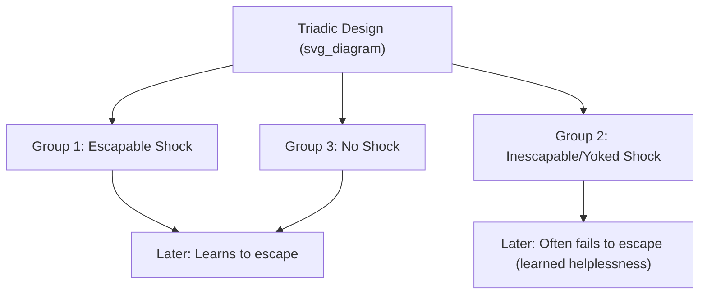
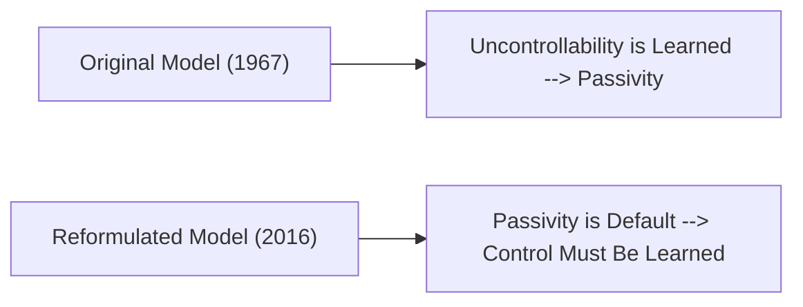

## Learned Helplessness and Its Reversal

### Overview

Learned helplessness is a foundational psychological theory describing how exposure to uncontrollable negative events can produce a generalized pattern of passivity and impaired subsequent problem-solving, even when control later becomes available. Originally developed by **Martin Seligman** and **Steven Maier** through experimental research beginning in the late 1960s, the theory has since been substantially revised — including, notably, a reformulation by Seligman himself decades later that reversed key aspects of the original model. This entry covers both the classical theory and its subsequent reversal and refinement.

### The Original Experimental Paradigm

Seligman and Maier's foundational studies used a **triadic design** with dogs, involving three groups:

- **Group 1 (Escapable shock)**: Received shocks that could be terminated by the animal's own action (e.g., pressing a panel).
- **Group 2 (Yoked, inescapable shock)**: Received the identical shocks in duration and timing as Group 1, but had no control over termination — the shock stopped only when Group 1's action stopped it.
- **Group 3 (No shock control)**: Received no shock exposure.

All three groups were subsequently tested in a new situation where escape was possible (a shuttle box, where the animal could escape shock by crossing to another compartment). The key finding: animals from Group 2 (inescapable, uncontrollable shock) frequently failed to learn the new escape response, remaining passive even when escape was available — despite having no reduced sensitivity to shock itself. Groups 1 and 3 readily learned to escape.

**Key Points**

- The critical variable was not the shock itself (which was physically identical between Groups 1 and 2) but the *controllability* of the shock.
- This finding was theoretically significant because it challenged then-dominant pure behaviorist accounts, which struggled to explain why identical physical stimuli produced such different learned outcomes — pointing toward a cognitive mechanism (perceived control) rather than a purely associative one.

### The Original Theoretical Account

The original learned helplessness theory proposed that organisms exposed to uncontrollable aversive events learn that their responses and outcomes are independent of each other — that "nothing I do matters" — and that this learned expectation of non-contingency generalizes to subsequently impair motivation, learning, and emotional functioning even in new, genuinely controllable situations. Three components of helplessness deficits were identified:

- **Motivational deficit**: Reduced initiation of voluntary responses.
- **Cognitive deficit**: Impaired ability to learn that a response *does* produce an outcome, even when demonstrated.
- **Emotional deficit**: Increased passivity and depression-like affective states.

### Extension to Human Depression: The Learned Helplessness Model of Depression

Seligman proposed learned helplessness as an animal model relevant to human depression, given surface similarities between helplessness symptoms (passivity, motivational deficits) and depressive symptoms. This proposal was influential but also drew significant criticism, most notably because the original model could not adequately explain **individual differences** — why some humans exposed to uncontrollable negative events became depressed while others did not.

### The Reformulated Model: Introducing Explanatory Style

To address this limitation, Lyn Abramson, Seligman, and John Teasdale published the **reformulated learned helplessness model** in 1978, incorporating attribution theory. This reformulation proposed that the *explanatory style* applied to an uncontrollable negative event (its perceived permanence, pervasiveness, and personalization — detailed in the companion "Learned optimism and explanatory style" topic) determines the duration, generalization, and self-esteem impact of the resulting helplessness. This reformulation directly bridges classical learned helplessness theory to the explanatory-style framework underlying learned optimism.

### Seligman's Later Reversal: The "Default to Helplessness" Reformulation

In a substantial theoretical development decades after the original research, Seligman (along with colleague Steven Maier, drawing on newer neuroscience findings) proposed a striking **reversal of the original model's core assumption**. The revised account proposes:

- **Passivity, not helplessness, is the default, unlearned response to prolonged uncontrollable aversive events** — the passive response is proposed to be an evolutionarily adaptive, automatically triggered reaction (mediated by specific brainstem/limbic circuitry, including the dorsal raphe nucleus), not something that must be "learned" through experience.
- **What must actually be learned, according to this revised account, is control itself** — the recognition that one's actions *can* influence outcomes is proposed to require active learning (mediated by prefrontal cortical circuitry that can inhibit the default passivity response), rather than passivity being the learned outcome.

[Unverified] This later reversal represents a significant and relatively recent theoretical development proposed by Seligman and Maier themselves, grounded partly in neuroscience research on brain circuitry; while influential, the degree to which this reformulation has been fully integrated and independently validated across the broader psychological research community (as opposed to primarily within the originating research group's own subsequent work) should be treated as a genuinely evolving area of the theory rather than settled consensus comparable to the well-established original triadic findings.

**Key Points**

- This reversal is a notable example of a foundational psychological theory being substantially revised by its own original authors based on decades of accumulated evidence, rather than a minor refinement.
- Practically, the reversal reframes the therapeutic target: rather than needing to "unlearn" helplessness, the emphasis shifts toward actively teaching and reinforcing the perception and exercise of control.

### Reversal and Prevention: Immunization Against Helplessness

A key early experimental finding, well-replicated within the classical paradigm, is that **prior experience with controllable outcomes can "immunize" against subsequently developing helplessness** when later exposed to uncontrollable events. Animals (and in adapted human paradigms, people) given initial mastery experiences over controllable events showed resistance to helplessness effects when subsequently exposed to uncontrollable events, compared to those without prior mastery experience. This immunization concept underlies much of the applied resilience-training literature, including the Penn Resilience Program's emphasis on building perceived control and mastery experiences proactively, before adversity occurs, rather than solely addressing helplessness after it develops.

### Reversing Established Helplessness: Therapeutic Approaches

Once a helplessness pattern (or, per the revised model, a failure to learn/exercise control) is established, several approaches are used to reverse it:

- **Graduated mastery experiences**: Structuring small, achievable successes that directly demonstrate response-outcome contingency, gradually rebuilding the perception (or learned capacity) of control.
- **Cognitive restructuring / explanatory style modification**: As detailed in the companion learned optimism entry, disputing pessimistic (stable, global, internal) attributions for negative events directly targets the reformulated model's proposed mechanism linking uncontrollable events to generalized, persistent helplessness.
- **Behavioral activation**: A core component of evidence-based depression treatment, directly targeting the motivational/passivity deficit by structuring engagement in activities regardless of initial motivation, based on the premise that action can precede and generate motivation and mood improvement rather than only following from it.

### Example: Helplessness and Its Reversal in a Workplace Context

**Example**

An employee whose repeated efforts to improve a broken process are consistently blocked or ignored by management may develop a helplessness-like pattern: reduced initiative, passive acceptance of continued problems, and generalized disengagement, even in unrelated tasks where their input genuinely could make a difference. Reversal, under the revised control-learning model, would focus not on somehow "unlearning" helplessness directly, but on providing new, genuine opportunities to exercise control (a project where their input demonstrably produces a visible outcome), rebuilding the learned expectation that action produces results.

### Relationship to Related Constructs

- **Locus of control** (Julian Rotter): A related but distinct construct describing a generalized belief about whether outcomes are controlled internally (by one's own actions) or externally (by chance or powerful others), conceptually overlapping with but developed independently from the learned helplessness tradition.
- **Self-efficacy** (Albert Bandura): The belief in one's capacity to execute specific actions needed to produce specific outcomes; self-efficacy theory shares the reformulated model's emphasis on learned perception of capability and control, though developed through a distinct theoretical and research tradition (social cognitive theory).

### Criticisms and Limitations

- The original animal-model-to-human-depression extension has faced longstanding critique regarding the degree to which findings from acute laboratory shock paradigms generalize to the complex, multi-causal nature of human clinical depression.
- [Inference] The later "reversal" reformulation, while grounded in neuroscience findings on specific brain circuitry, represents a substantial theoretical shift proposed relatively recently in the field's overall history; broader independent replication and integration of this reformulation across the wider depression and motivation research literature is still an ongoing process rather than a fully settled matter.
- Ethical considerations regarding the original animal research paradigms (involving inescapable aversive stimuli) have been raised in subsequent decades as animal research ethics standards have evolved, and such research designs would face substantially more stringent ethical review under contemporary standards.

**Related Topics**

- Learned optimism and explanatory style
- Locus of control (Rotter)
- Self-efficacy theory (Bandura)
- Behavioral activation and depression treatment
- Hope theory (C.R. Snyder)
- Penn Resilience Program