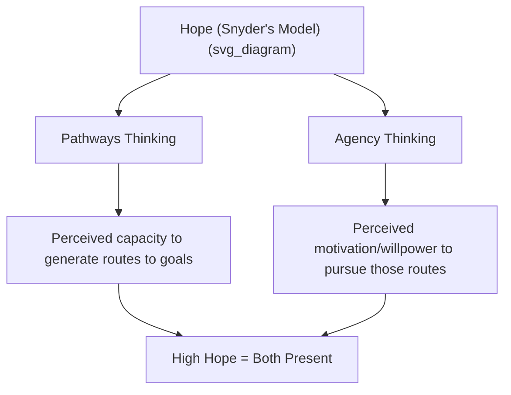
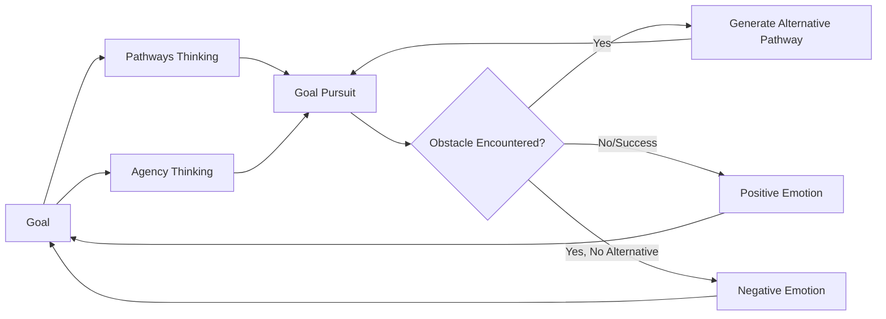

## Snyder's Hope Theory: Pathways Thinking and Agency Thinking

### Overview

Hope Theory is a cognitive-motivational model of hope developed by psychologist **C.R. (Rick) Snyder** beginning in the early 1990s. It defines hope as a measurable, goal-directed cognitive process rather than a purely emotional state, distinguishing it from colloquial or purely affective conceptions of hope, and positions hope as composed of two interacting cognitive components: **pathways thinking** and **agency thinking**.

### Defining Hope Within Snyder's Framework

Snyder defined hope as a positive motivational state based on an interactively derived sense of successful **agency** (goal-directed energy) and **pathways** (planning to meet goals). This definition places hope firmly within a goal-pursuit framework: hope, in this model, only exists in relation to specific goals, and requires both the perceived capacity to generate routes toward a goal and the perceived motivation/willpower to pursue those routes.

### The Two Components in Detail

**Pathways Thinking**

Pathways thinking refers to the perceived capacity to generate one or more viable routes or strategies to reach a desired goal, including the capacity to generate **alternative** pathways when the initial route encounters an obstacle. Key features:

- Pathways thinking is not simply about *having* a plan, but about the perceived cognitive capacity to produce plans, including contingency plans.
- Individuals high in pathways thinking are theorized to more readily generate alternative routes when blocked, rather than becoming stuck when the primary plan fails.

**Agency Thinking**

Agency thinking (sometimes described as "willpower") refers to the perceived motivation and determination to use the identified pathways to actually pursue the goal, including the capacity to sustain motivation when facing obstacles. Key features:

- Agency thinking involves self-referential thoughts such as a sense of determination and confidence in one's capacity to succeed.
- Agency is theorized to be especially critical at "blockage points" along the pursuit of a goal, where sustained motivation determines whether an available alternative pathway is actually pursued.

**Key Points**

- Both components are necessary for high hope; pathways thinking without agency thinking produces a person who can identify routes but lacks the drive to pursue them, while agency thinking without pathways thinking produces a person who is motivated but lacks the perceived strategic capacity to find a way forward — Snyder's model proposes that both are required simultaneously and interact reciprocally throughout goal pursuit.
- Hope Theory is explicitly a **cognitive** theory of goal pursuit, distinguishing it from optimism-as-general-expectancy models (dispositional optimism) and from explanatory-style-based learned optimism, though all three are related constructs within the broader positive psychology treatment of future-oriented thinking.

### The Hope Cycle: Goals, Pathways, Agency, and Emotion

Snyder's fuller model describes an iterative cycle in which goal pursuit generates pathways and agency thoughts, which in turn generate emotional responses that feed back into subsequent goal pursuit:

1. A **goal** is identified (Snyder specified that goals must have some degree of value and some degree of uncertainty of attainment to be relevant to hope theory — a certain, guaranteed outcome does not require hope).
2. **Pathways thoughts** are generated regarding how to reach the goal.
3. **Agency thoughts** are generated regarding motivation to pursue those pathways.
4. Progress or obstacles produce **emotional responses**: positive emotions when pathways/agency thinking proceeds successfully, negative emotions when blocked.
5. These emotions feed back into subsequent pathways and agency thinking for the same or future goals, forming an ongoing feedback loop rather than a one-time linear process.

### Distinguishing High-Hope and Low-Hope Individuals

Research using Snyder's hope measures has characterized high-hope individuals as tending to:

- Set clearly defined, moderately challenging (rather than either trivially easy or unrealistically difficult) goals.
- View obstacles as challenges requiring alternative strategies, rather than as insurmountable stopping points.
- Generate multiple alternative pathways when a primary route is blocked.
- Maintain self-referential agency talk ("I can do this," "I will find a way") during setbacks.

Low-hope individuals, by contrast, tend to generate fewer alternative pathways when blocked, and are theorized to experience greater difficulty sustaining motivation (agency) in the face of obstacles, contributing to earlier goal disengagement.

### Empirical Links to Outcomes

Snyder and colleagues' research program, along with subsequent independent studies, has linked dispositional hope (as measured by Snyder's scales) to a range of outcomes:

- **Academic performance**: Higher hope scores have been associated with better academic achievement across multiple studies, with hope predicting outcomes independent of, and sometimes beyond, measured intelligence or prior academic performance in some research.
- **Athletic performance**: Some studies with athletes have found hope scores predictive of competitive performance outcomes, plausibly through the combination of strategic (pathways) thinking and sustained motivation (agency) under competitive pressure.
- **Physical health and coping**: Higher hope has been associated in various studies with better coping and adjustment among individuals facing illness or chronic health conditions.
- **Psychological well-being**: Hope is robustly associated with life satisfaction and inversely associated with depression and anxiety symptoms across the broader literature.

[Inference] These associations are generally well replicated across a substantial body of research using Snyder's hope scales, though as with most individual-difference constructs studied primarily through correlational and longitudinal (rather than fully experimental) designs, causal directionality (hope driving outcomes vs. success experiences building hope, likely a bidirectional relationship) is not fully disentangled in every study.

### Measurement Instruments

- **Adult Hope Scale (also called the Trait Hope Scale)**: Snyder's primary self-report instrument for adults, comprising separate pathways and agency subscales alongside filler items, yielding both subscale and total hope scores.
- **Children's Hope Scale**: An adapted version for use with children, similarly assessing pathways and agency components in age-appropriate language.
- **State Hope Scale**: Measures momentary, situation-specific hope rather than trait-level dispositional hope, useful for studying hope fluctuation in response to specific goal-relevant events.
- **Domain-Specific Hope Scale**: Assesses hope within particular life domains (e.g., academics, relationships, health) separately, reflecting research findings that hope levels can vary meaningfully across different domains for the same individual rather than being a single unified trait.

### Distinguishing Hope Theory from Related Constructs

| Construct | Core Mechanism | Key Theorist |
| --- | --- | --- |
| Hope Theory | Pathways (strategy) + Agency (motivation) toward specific goals | C.R. Snyder |
| Dispositional Optimism | Generalized positive outcome expectancy | Carver & Scheier |
| Learned Optimism | Explanatory style (permanence, pervasiveness, personalization) | Martin Seligman |
| Self-Efficacy | Belief in capacity to execute specific actions | Albert Bandura |

[Inference] These four constructs are theoretically distinct but empirically correlated, and the field has not fully converged on how much unique predictive variance each contributes once the others are statistically controlled for — a topic addressed by some, but not all, comparative studies in the literature.

### Example: Applying Hope Theory to a Career Goal

**Example**

A person sets a goal of transitioning into a new career field. High pathways thinking would manifest as their generating multiple potential routes — a certification program, a lateral internal transfer, networking-based entry, or freelance portfolio-building — rather than fixating on a single path. High agency thinking would manifest as sustained motivation to pursue these routes even after an initial rejection or setback (e.g., not being selected for an internal transfer), reflected in self-talk such as "That didn't work, but I have other options and I'm going to keep pursuing this." A person low in either component might either fail to generate alternative routes when the first attempt fails (low pathways) or generate alternatives but lose motivation to act on them after the initial setback (low agency).

### Interventions to Build Hope

- **Hope-based coaching and therapy interventions**: Structured programs teaching explicit goal-setting, generation of multiple pathways, and agency-building self-talk, developed and tested in both clinical and educational/coaching contexts by Snyder and subsequent researchers.
- **Goal-mapping exercises**: Structured worksheets or exercises explicitly prompting individuals to articulate a specific goal, brainstorm multiple pathways to it, identify likely obstacles, and generate contingency pathways in advance.
- **School-based hope curricula**: Programs implemented in educational settings aiming to build both pathways skills (planning, problem-solving) and agency (motivational self-talk, goal commitment) among students.

### Criticisms and Limitations

- Some critics argue that Hope Theory's strong goal-pursuit framing may not fully capture more diffuse, non-goal-specific forms of hope (e.g., existential or spiritual hope not tied to a concrete, attainable goal), which some other theoretical traditions (e.g., certain philosophical or religious conceptions of hope) address differently.
- The overlap between Hope Theory's agency component and related constructs like self-efficacy and dispositional optimism has led to ongoing psychometric discussion about the degree of genuine construct distinctiveness versus overlapping measurement of a broader underlying "positive future-orientation" factor.
- [Speculation] As with many trait-based positive psychology constructs, most measurement and validation work has occurred within Western, English-speaking populations, and full cross-cultural generalizability of the two-component pathways/agency structure continues to be an area of ongoing validation research.

**Related Topics**

- Learned optimism and explanatory style
- Learned helplessness and its reversal
- Dispositional optimism (Carver and Scheier)
- Self-efficacy theory (Bandura)
- Goal-setting theory (Locke and Latham)
- Purpose, goal pursuit, and long-term life direction