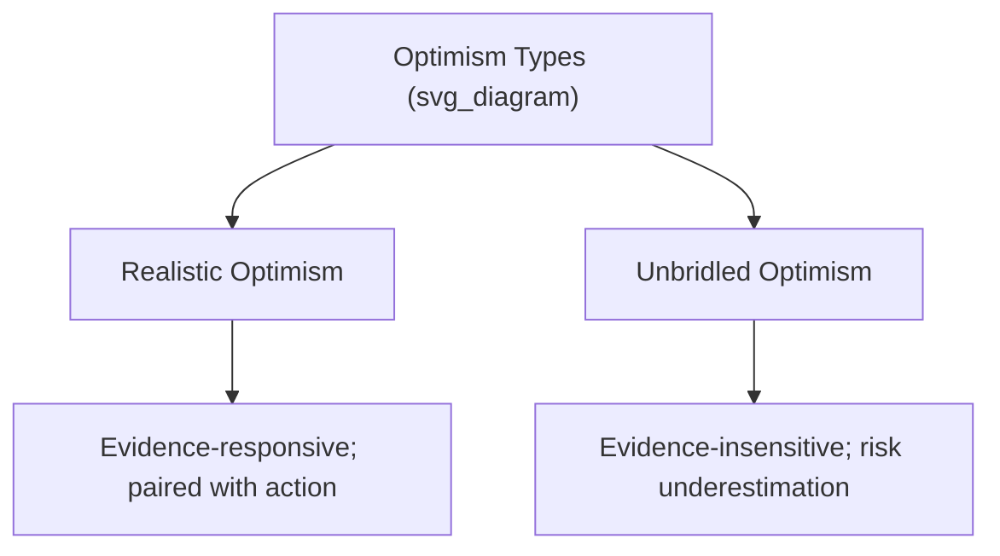

## Realistic Optimism versus Unbridled Optimism

### Overview

This entry addresses a central conceptual distinction within positive psychology's treatment of optimism: the difference between **realistic optimism** — a positive future orientation calibrated to and informed by accurate assessment of circumstances — and **unbridled (or unrealistic) optimism** — an uncalibrated positive expectancy that persists regardless of, or in defiance of, available evidence. This distinction addresses a common critique of positive psychology: that unqualified "positive thinking" can be maladaptive.

### Defining the Distinction

- **Realistic optimism**: A positive but evidence-responsive orientation toward the future, in which favorable expectations are updated in light of relevant information, and positive expectation is paired with active engagement in the specific actions needed to bring about desired outcomes.
- **Unbridled/unrealistic optimism**: A positive expectancy that is largely insensitive to disconfirming evidence, actual risk levels, or the practical requirements of achieving the desired outcome — sometimes associated with underestimating genuine risks or overestimating the likelihood of positive outcomes independent of one's own effort or relevant circumstances.

**Key Points**

- The distinction is not between "more" and "less" optimism in a simple quantitative sense, but between optimism that is *integrated with accurate perception and appropriate action* and optimism that operates independently of, or in tension with, accurate perception.
- This distinction is central to responding to a long-standing criticism of positive psychology broadly: that encouraging positive thinking risks promoting complacency or poor decision-making when applied without discernment.

### The Optimistic Bias / Unrealistic Optimism Literature

A substantial body of research, notably associated with psychologist **Neil Weinstein**, has documented a well-replicated cognitive bias termed **unrealistic optimism** (or optimistic bias): the tendency for individuals to judge themselves as less likely than similar others to experience negative events (illness, accidents, relationship failure) and more likely than similar others to experience positive events, a pattern that holds even when such comparative judgments are not statistically plausible for the population as a whole (since not everyone can be below-average risk).

- This bias has been documented across numerous domains, including health risk perception, financial risk-taking, and relationship expectations.
- [Inference] Unrealistic optimism of this kind has been linked in research to reduced engagement in protective or precautionary behaviors (e.g., underestimating personal health risk being associated with reduced health-protective behavior in some studies), illustrating a concrete pathway by which uncalibrated optimism can produce maladaptive real-world outcomes.

### Defensive Pessimism as a Contrasting Strategy

Psychologist **Julie Norem's** research on **defensive pessimism** provides an important contrast case relevant to this topic: some individuals (termed defensive pessimists) deliberately set low expectations and extensively imagine potential negative outcomes prior to a performance situation, using this anticipatory reflection to motivate thorough preparation and channel anxiety productively. Norem's research found that defensive pessimism, for individuals who characteristically use this strategy, was associated with performance outcomes comparable to those of optimists — but that experimentally *disrupting* a defensive pessimist's strategy (e.g., inducing artificial calm or forcing positive-only visualization) *impaired* their subsequent performance. [Inference] This finding is frequently cited as evidence that a single "optimism is always best" framework oversimplifies individual differences in effective self-regulation strategy, since defensive pessimism appears to function adaptively for individuals whose habitual cognitive style relies on it, even though it does not fit a straightforward optimism-is-better model.

### The Role of Realistic Assessment in Adaptive Optimism

Several converging lines of research and theory support the value of pairing positive expectancy with accurate assessment:

- **Mental contrasting** (Gabriele Oettingen): A structured technique involving vividly imagining a desired positive future outcome, then deliberately contrasting it with the current obstacles standing in the way. Oettingen's research found that mental contrasting (combining positive future imagery with realistic obstacle acknowledgment) produced better goal pursuit and achievement outcomes than either pure positive fantasizing alone or pure focus on obstacles alone — directly supporting the "realistic optimism" model over either unbridled positive thinking or pure pessimism.
- **WOOP framework**: A practical technique derived from mental contrasting research, standing for **Wish, Outcome, Obstacle, Plan** — explicitly structuring goal pursuit to include both positive envisioning (Wish, Outcome) and realistic obstacle identification with contingency planning (Obstacle, Plan).
- **Hope Theory's "pathways thinking"** (covered in the companion entry): Snyder's model explicitly requires the generation of realistic, viable routes to a goal, including contingency pathways for when obstacles are encountered — building a form of grounded, action-oriented optimism directly into its structure, rather than optimism as pure positive feeling divorced from strategy.

### Example: Contrasting Realistic and Unbridled Optimism in Practice

**Example**

Two entrepreneurs launch competing startups. The first (unbridled optimism) proceeds with high confidence in success, dismissing early negative customer feedback as unimportant, under-preparing for known market risks, and making minimal contingency plans, reasoning that "it will work out." The second (realistic optimism) maintains genuine confidence in the venture's potential while actively seeking out and responding to negative feedback, conducting rigorous market risk assessment, and developing contingency plans for likely obstacles (a mental-contrasting/WOOP-consistent approach). Positive psychology research on mental contrasting and hope theory would predict the second entrepreneur is more likely to succeed, not because they are "less optimistic" in overall positive feeling, but because their optimism is integrated with accurate risk assessment and concrete pathway planning rather than substituting for it.

### Relationship to Dispositional Optimism Research

It is worth noting that Carver and Scheier's dispositional optimism research (measured via the Life Orientation Test) has generally found positive associations between general optimistic expectancy and adaptive coping, including active, problem-focused coping strategies — suggesting that, in practice, trait optimism as typically measured in this research tradition is often *already* associated with engaged, active coping rather than passive wishful thinking. [Inference] This suggests the realistic-versus-unbridled distinction may be less about two cleanly separable *types* of people and more about identifying a specific maladaptive *subtype or manifestation* of positive expectancy (uncalibrated, passive, risk-denying) that can be distinguished from the more common and better-validated adaptive form of optimism studied in mainstream dispositional optimism research.

### Distinguishing Optimism from Denial

A related conceptual boundary is the distinction between optimism and **denial** as a coping mechanism:

- **Optimism** (realistic form) involves acknowledging a difficult reality while maintaining a positive orientation toward future possibilities and remaining engaged with appropriate action.
- **Denial** involves failing to acknowledge or actively avoiding the reality of a difficult situation altogether, which can obstruct necessary problem-solving or help-seeking behavior.

[Inference] While both can superficially present as "staying positive," they are functionally distinct in clinical and coping literature: denial is generally associated with worse long-term adjustment in the coping research literature (particularly regarding health-related decision-making), whereas realistic, engaged optimism is generally associated with better adjustment, illustrating why the surface behavior of "seeming positive" does not by itself indicate a healthy coping style.

### Applications in Specific Domains

- **Medical and health communication**: Clinicians and health psychologists often aim to cultivate realistic optimism in patients facing serious diagnoses — encouraging hope and continued engagement in treatment and life goals, while avoiding either despair or unrealistic denial of prognosis, a balance directly informed by Meaning-Centered Psychotherapy and related approaches covered in earlier meaning-related topics.
- **Organizational and leadership contexts**: Some leadership and organizational psychology literature explicitly promotes "realistic optimism" as a desirable leadership trait, contrasted with both excessive pessimism (which can demoralize teams) and unfounded positive projection (which can lead to poor strategic decisions, sometimes discussed under related concepts like overconfidence bias in decision-making research).
- **Risk-taking domains** (e.g., extreme sports, entrepreneurship, financial investment): Fields where uncalibrated optimism carries particularly high potential costs, making the realistic/unbridled distinction practically significant for decision quality.

### Measurement and Assessment Challenges

Distinguishing realistic from unbridled optimism empirically is more methodologically complex than measuring general optimism level alone, since it requires an external, objective benchmark of actual risk or probability against which to compare a person's stated expectancy — a benchmark not always available or agreed upon. Approaches used in research include:

- **Comparative optimism paradigms** (following Weinstein's methodology): Comparing self-rated risk to statistically expected population risk to identify the degree of miscalibration.
- **Calibration studies**: Comparing individuals' confidence judgments about specific predictions to actual subsequent outcomes, used more broadly in judgment and decision-making research and applied to optimism-specific contexts.

### Criticisms and Open Questions

- The realistic-versus-unbridled framework, while conceptually useful and practically important, does not have a single, universally agreed-upon operational boundary distinguishing the two — what counts as "realistic" can itself be genuinely uncertain in many real-world situations (e.g., predicting the outcome of a novel business venture), making the distinction sometimes easier to apply in retrospect than prospectively.
- [Speculation] Some tension exists in the literature between findings supporting a general positive relationship between optimism and adaptive outcomes (Carver and Scheier's tradition) and findings emphasizing the risks of specific unrealistic optimism biases (Weinstein's tradition); reconciling these into a single, precise, universally applicable operational framework for "how much realism is optimal" remains an area without full consensus.

**Related Topics**

- Learned optimism and explanatory style
- Snyder's Hope Theory: pathways and agency thinking
- Dispositional optimism (Carver and Scheier)
- Mental contrasting and the WOOP framework (Oettingen)
- Defensive pessimism (Norem)
- Coping strategies and denial