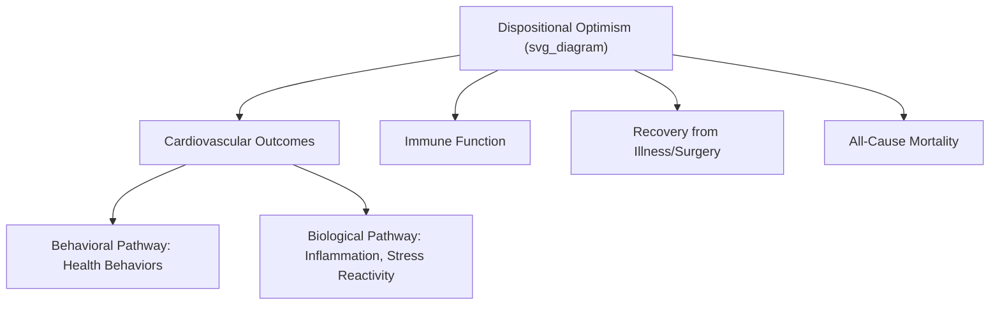

## Optimism, Physical Health, and Longevity

### Overview

A substantial body of research within health psychology and positive psychology has examined the relationship between dispositional optimism and physical health outcomes, including cardiovascular disease, immune function, recovery from illness or surgery, and all-cause mortality. This entry surveys the major findings, proposed mechanisms, and methodological considerations in this literature.

### Defining the Construct Under Study

Most research in this domain uses **dispositional optimism** as defined by Charles Carver and Michael Scheier — a generalized expectancy that good outcomes, rather than bad ones, will occur across important life domains — typically measured via the **Life Orientation Test (LOT)** or its revised version, the **LOT-R**. Some studies in this literature instead use explanatory-style-based measures (related to Seligman's learned optimism framework) or other related optimism measures; the specific instrument used is an important detail for interpreting any given study's findings, since these related but distinct constructs are not always interchangeable.

### Cardiovascular Health

Multiple prospective longitudinal studies and meta-analyses have found associations between higher dispositional optimism and reduced risk of cardiovascular events:

- Several large longitudinal cohort studies have found optimism associated with reduced incidence of coronary heart disease and cardiovascular mortality over follow-up periods spanning years to decades.
- Some research has examined mechanistic pathways, including associations between optimism and healthier cardiovascular risk profiles (blood pressure, lipid levels) and, in some studies, more favorable inflammatory marker profiles.

[Inference] These cardiovascular associations are drawn from multiple independent longitudinal studies and have been summarized in systematic reviews and meta-analyses, providing a reasonably robust evidence base; however, as with most large-scale observational cohort research, residual confounding by other health-relevant traits (e.g., conscientiousness, socioeconomic status) cannot be fully ruled out even in well-controlled studies.

### Immune Function

A smaller body of research has examined associations between optimism and immune markers, including some studies finding associations between higher optimism and more favorable immune cell profiles or antibody responses following vaccination or immune challenge in laboratory studies. [Unverified] This area of research (linking optimism to specific immunological outcomes) is generally smaller in sample size and replication volume compared to the cardiovascular and mortality literature, and specific immunological findings should be treated as a more preliminary and actively developing area of the broader optimism-health literature rather than as firmly established as the cardiovascular associations.

### Recovery from Illness and Surgery

Optimism has been studied as a predictor of recovery trajectories following significant medical events:

- Research on patients recovering from coronary artery bypass surgery has found associations between pre-surgical optimism and various positive post-surgical outcomes, including in some studies faster physical recovery milestones and better psychological adjustment during recovery.
- Studies of cancer patients have found associations between optimism and better psychological adjustment during treatment, and in some studies, associations with health behaviors relevant to treatment adherence and recovery.
- [Inference] The consistency of these recovery-related findings varies across specific illness types and outcome measures studied; the overall direction of association (higher optimism, better recovery-related outcomes) is a common pattern across this literature, but effect sizes and the specific outcomes affected vary by study.

### All-Cause Mortality

Several longitudinal cohort studies have examined the association between dispositional optimism (or related constructs) and all-cause mortality risk over extended follow-up periods, generally finding that higher optimism is associated with reduced mortality risk, in analyses controlling for relevant covariates such as baseline health status, depression, and demographic factors. [Inference] As with the cardiovascular literature, this is a well-populated area of longitudinal research with a generally consistent directional finding across multiple independent cohorts, though the precise magnitude of the effect, and the degree to which it holds independently across all studied populations and after adjustment for all plausible confounders, varies across specific studies.

### Proposed Mechanisms

Several complementary mechanistic pathways have been proposed to explain the optimism-health association, generally organized into behavioral and biological categories:

**Behavioral pathways**:

- Optimists are found in some research to engage in more health-protective behaviors (exercise, healthier diet, regular medical checkups, treatment adherence), providing a straightforward behavioral mechanism.
- Optimists have been found in some research to use more active, problem-focused coping strategies when facing health challenges, potentially supporting better engagement with treatment and health management.

**Biological/physiological pathways**:

- Some research has examined associations between optimism and stress-related physiological markers, including cortisol reactivity and inflammatory markers, proposing that optimism may buffer physiological stress responses in ways relevant to long-term cardiovascular and immune health.
- [Speculation] The precise biological mechanisms linking a psychological trait like optimism to specific physiological pathways remain an active area of psychoneuroimmunology and health psychology research, and the field has not fully established a single definitive causal biological pathway; multiple partial mechanisms operating together is the more commonly proposed model rather than any single dominant pathway.

### The Behavioral vs. Biological Mechanism Debate

A key open question in this literature is the relative contribution of behavioral mechanisms (optimists simply engaging in healthier behaviors) versus more direct biological/physiological mechanisms (optimism directly affecting stress physiology or immune function independent of behavior). Some studies attempt to statistically control for health behaviors to isolate a potential direct biological pathway, with mixed findings across the literature regarding how much of the optimism-health association remains after such adjustment. [Unverified] This mechanistic question is a genuinely unresolved and actively researched area rather than one with a settled answer, and it is likely that both behavioral and biological pathways contribute to varying degrees depending on the specific health outcome studied.

### Example: Optimism's Pathway to Cardiovascular Health

**Example**

Consider two individuals with similar baseline cardiovascular risk profiles. The more optimistic individual may be more likely to adhere to a prescribed exercise regimen following a health scare (behavioral pathway), and may also show comparatively lower cortisol reactivity during stressful situations (proposed biological pathway), both of which could independently and cumulatively contribute to better long-term cardiovascular outcomes relative to a less optimistic individual with similar starting risk — illustrating why the literature generally frames the optimism-health link as operating through multiple, potentially interacting pathways rather than a single direct mechanism.

### Methodological Considerations and Limitations

- **Reverse causation and confounding**: Because most of this research is observational and longitudinal (rather than experimental), the possibility that better underlying health independently produces higher optimism (rather than, or in addition to, optimism causing better health) cannot be fully ruled out, though well-designed longitudinal studies controlling for baseline health status help address this concern to some degree.
- **Depression as a confound**: Since optimism and depression are inversely correlated, and depression itself is independently associated with worse physical health outcomes, careful studies attempt to statistically control for depressive symptoms to isolate optimism's independent contribution; findings vary in the degree to which optimism's association with health outcomes remains significant after such adjustment.
- **Publication bias considerations**: As with many areas of psychological and health research, [Speculation] the degree to which null or contrary findings in this specific literature are as likely to be published as positive findings is not fully quantifiable, and meta-analyses in this area, while generally supportive of the optimism-health association, should be interpreted with this general methodological consideration in mind, as with most observational health research literatures.

### Measurement Instruments Used in This Research

- **Life Orientation Test — Revised (LOT-R)**: The dominant measure of dispositional optimism used across most of the cardiovascular, immune, and mortality research reviewed above.
- **Explanatory Style measures (ASQ, CAVE)**: Used in a subset of studies examining optimism-health links through the learned-optimism/explanatory-style tradition rather than the dispositional optimism tradition.
- **Health-specific optimism measures**: Some studies use illness-specific or context-specific optimism measures (e.g., optimism specifically about recovery from a particular surgery) rather than general dispositional optimism, which may show different or more targeted associations with specific health outcomes.

### Criticisms and Limitations

- As emphasized throughout, the bulk of the evidence base in this domain is observational rather than experimental, which fundamentally limits the strength of causal claims that can be made, despite the consistency of directional associations across many independent studies.
- Effect sizes across studies in this literature vary considerably, and some meta-analyses have found more modest associations than the more striking findings reported in individual, sometimes widely publicized, studies — a common pattern in health psychology research where initial findings are sometimes attenuated upon more rigorous meta-analytic synthesis.
- [Inference] As with the broader realistic-versus-unbridled optimism distinction covered in the companion topic, it is plausible that the *type* of optimism studied (evidence-responsive, action-oriented dispositional optimism, as typically captured by the LOT-R) matters for these health associations, and findings from this literature should not be uncritically generalized to imply that any form of positive thinking, including uncalibrated or denial-adjacent forms, would produce similar health benefits.

**Related Topics**

- Realistic optimism versus unbridled optimism
- Dispositional optimism (Carver and Scheier)
- Learned optimism and explanatory style
- Social connection as a pillar of well-being (parallel longevity literature)
- Stress physiology and psychoneuroimmunology
- Health behavior change and treatment adherence