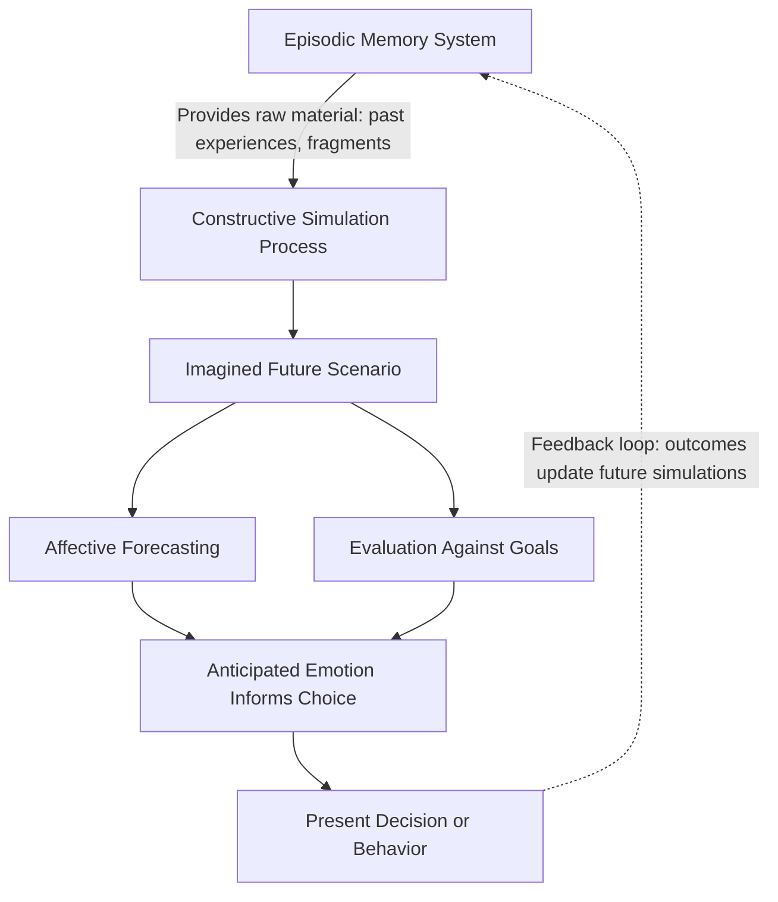

## Future-Mindedness and Prospection

### Definition and Conceptual Overview

Prospection is the mental capacity to represent and evaluate possible future events — simulating what has not yet happened in order to guide present decisions, emotions, and behavior. Future-mindedness refers to the broader dispositional and motivational orientation toward considering, valuing, and planning for the future, as opposed to being oriented primarily toward the present or past.

Within positive psychology, this area gained prominence through the reframing proposed by Martin Seligman and colleagues: that much of human cognition is not merely a passive record of the past but an active, forward-projecting system. This is captured in the phrase "Homo prospectus," used to argue that navigating anticipated futures — not simply conditioned responses to past reinforcement — is a defining feature of human cognition. [Inference: the precise evolutionary weighting between prospective and retrospective cognitive mechanisms remains a subject of ongoing theoretical debate in cognitive science.]

**Key Points**

- Prospection is distinct from simple prediction; it involves constructive simulation, drawing on episodic memory systems to build novel imagined scenarios rather than retrieving stored ones.
- Future-mindedness is treated as an individual-difference variable: people vary reliably in how far into the future they habitually think and how vividly they simulate future scenarios.
- The two constructs are related but not identical: prospection is the cognitive mechanism/process; future-mindedness is closer to a stable trait or motivational stance built on repeated use of that mechanism.

### Theoretical Foundations

**Homo Prospectus Framework**

Proposed by Martin Seligman, Peter Railton, Roy Baumeister, and Chandra Sripada, this framework argues that navigating into the future is a core organizing principle of the mind, on par with or exceeding the importance traditionally given to associative learning from the past.

**Prospective Brain Hypothesis**

Neuroscience research (notably by Daniel Schacter and colleagues) proposes that a core brain network — overlapping substantially with the default mode network, including the medial prefrontal cortex, posterior cingulate cortex, and hippocampus — is engaged both when remembering the past and when imagining the future. This shared neural substrate supports the "constructive episodic simulation hypothesis": the same machinery used to reconstruct memories is repurposed to construct hypothetical future scenes.

**Temporal Self-Continuity**

Hal Hershfield's research on the psychological connection between one's present and future self demonstrates that people who perceive weaker continuity with their future self tend to discount future outcomes more heavily (a pattern linked to reduced saving behavior, reduced ethical restraint, and lower goal persistence). Interventions that increase vividness of the future self (e.g., age-progressed digital renderings) have been shown in controlled studies to shift some financial decision-making toward greater future orientation. [Unverified: effect sizes and replication robustness vary across specific studies and populations, and this remains an active area of empirical refinement.]

**Time Perspective Theory**

Philip Zimbardo's time perspective framework categorizes habitual temporal orientations into profiles such as past-negative, past-positive, present-hedonistic, present-fatalistic, and future-oriented. A balanced time perspective — flexibly shifting between orientations depending on context, rather than being rigidly locked into one — is associated in this framework with better adaptive functioning than a purely future-dominant orientation.

### Mechanisms of Prospection

**Key Points**

- **Affective forecasting** is the sub-process of predicting how a future event will make one feel; this process is documented to be systematically biased in specific, well-studied ways (e.g., impact bias — overestimating the intensity and duration of future emotional reactions).
- **Episodic future thinking** refers specifically to pre-experiencing a personal future event with sensory and contextual detail, distinct from abstract or semantic future thinking (e.g., knowing generally that "exercise is healthy" without simulating a specific future workout).
- Prospection supports **goal-directed self-regulation**: it is the mechanism through which distant, abstract goals are translated into concrete simulated steps that can guide immediate action.

### Relationship to Hope and Optimism

Future-mindedness and prospection form the cognitive infrastructure underlying constructs treated elsewhere in the chapter:

- **Optimism** (dispositional expectation of favorable outcomes) draws on prospection as its input mechanism — one cannot hold an expectation about the future without some form of future simulation.
- **Hope theory** (C.R. Snyder) explicitly requires prospective cognition in its "pathways thinking" component (generating routes to a future goal) and "agency thinking" component (believing oneself capable of pursuing those routes).
- Distinction: optimism and hope are evaluative/motivational stances about the future, while prospection is the underlying generative cognitive process that produces the future-oriented content those stances evaluate.

### Well-Established Cognitive Biases in Prospection

| Bias | Description | Typical Effect |
| --- | --- | --- |
| Impact bias | Overestimating intensity/duration of future emotional reactions | Leads to overweighting anticipated highs/lows in decision-making |
| Focalism | Overweighting the focal event and underweighting surrounding life context | Exaggerates predicted impact of single future events |
| Temporal discounting | Devaluing future rewards relative to immediate ones | Reduces future-oriented behavior (saving, health behaviors) |
| Planning fallacy | Underestimating time/resources needed for future tasks | Leads to systematically optimistic timelines |
| Restraint bias | Overestimating one's ability to resist future temptation | Leads to underpreparing for self-control challenges |

### Practical Applications and Interventions

**Example: Episodic Future Thinking Exercise**

A structured intervention used in behavioral research asks participants to vividly imagine a specific, personally relevant positive future event (e.g., a health milestone) in first-person, sensory detail, including location, people present, and emotional tone, then to write a short narrative description. Studies using this paradigm have found associations with reduced discounting of future rewards in subsequent choice tasks. [Inference: the durability of these effects beyond laboratory settings and their generalization across populations is not yet fully established.]

**Example: Future Self-Continuity Exercise**

Individuals write a letter to their future self (commonly framed at a 10-year horizon), describing hoped-for circumstances and offering advice. This is used in coaching and educational settings to increase the psychological vividness and emotional connection to one's future identity, theoretically increasing motivation for present behaviors that serve that future self.

**Example: Best Possible Self Exercise**

Participants are asked to write, for approximately 10-20 minutes, about a future in which everything has gone as well as it possibly could, across major life domains (career, relationships, health), having worked hard and achieved their goals. This is one of the more extensively studied positive psychology interventions and has shown associations with increased positive affect and optimism in several controlled studies. [Inference: effect sizes vary across studies and populations, and this remains subject to ongoing replication work typical of positive psychology intervention research generally.]

### Measurement Approaches

- **Consideration of Future Consequences (CFC) Scale**: self-report measure of the extent to which individuals consider distant versus immediate outcomes of their behavior.
- **Zimbardo Time Perspective Inventory (ZTPI)**: measures the five time-perspective profiles described above.
- **Prospective and Retrospective Memory Questionnaire (PRMQ)**: though primarily a memory measure, it is sometimes used adjacently in prospection research to distinguish memory-based from imagination-based future orientation.
- Behavioral/experimental paradigms: delay discounting tasks (choosing between smaller-sooner and larger-later rewards) serve as a behavioral proxy for future-mindedness rather than self-report.

### Diagram: Balanced Time Perspective Model

<svg xmlns="http://www.w3.org/2000/svg" viewBox="0 0 640 380" font-family="Helvetica, Arial, sans-serif">
<text x="320" y="28" font-size="17" font-weight="bold" text-anchor="middle" fill="#1a1a2e">Balanced Time Perspective (svg_diagram)</text>
<circle cx="320" cy="200" r="130" fill="none" stroke="#555" stroke-width="2" stroke-dasharray="3,3" />
<text x="320" y="200" font-size="13" text-anchor="middle" fill="#333" font-weight="bold">Adaptive Flexibility</text>
<text x="320" y="218" font-size="11" text-anchor="middle" fill="#666">(shifts by context)</text>
<circle cx="320" cy="70" r="55" fill="#bbdefb" opacity="0.8" />
<text x="320" y="65" font-size="12" font-weight="bold" text-anchor="middle" fill="#0d47a1">Future</text>
<text x="320" y="80" font-size="10" text-anchor="middle" fill="#0d47a1">Orientation</text>
<circle cx="180" cy="290" r="55" fill="#c8e6c9" opacity="0.8" />
<text x="180" y="285" font-size="12" font-weight="bold" text-anchor="middle" fill="#1b5e20">Present</text>
<text x="180" y="300" font-size="10" text-anchor="middle" fill="#1b5e20">Hedonistic</text>
<circle cx="460" cy="290" r="55" fill="#ffe0b2" opacity="0.8" />
<text x="460" y="285" font-size="12" font-weight="bold" text-anchor="middle" fill="#e65100">Past</text>
<text x="460" y="300" font-size="10" text-anchor="middle" fill="#e65100">Positive</text>
<line x1="320" y1="125" x2="220" y2="245" stroke="#999" stroke-width="1.5" />
<line x1="320" y1="125" x2="420" y2="245" stroke="#999" stroke-width="1.5" />
<line x1="235" y1="290" x2="405" y2="290" stroke="#999" stroke-width="1.5" />
</svg>

### Distinguishing Future-Mindedness from Related Constructs

| Construct | Core Focus | Key Difference from Prospection |
| --- | --- | --- |
| Prospection | Generative process of simulating future events | The mechanism itself, not a trait or belief |
| Future-mindedness | Dispositional tendency to prioritize/consider the future | A trait built from repeated prospective activity |
| Optimism | Generalized positive expectancy about future outcomes | An evaluative stance, not the simulation process |
| Hope | Goal-directed agency + pathways belief | Motivational-cognitive construct, narrower goal focus |
| Delay of gratification | Behavioral capacity to forgo immediate reward | A downstream behavioral outcome, not the cognitive input |

### Practical Implications

- **Financial behavior**: Interventions increasing future self-vividness are associated with improved retirement-saving intentions in several studies. [Inference: translation from laboratory intention measures to sustained real-world saving behavior is less consistently established.]
- **Health behavior**: Episodic future thinking has been studied as an adjunct in behavioral interventions for conditions involving impulsive choice patterns (e.g., some substance-use and dietary-choice research), based on its association with reduced delay discounting.
- **Goal-setting and coaching**: Structured future-self exercises are commonly incorporated into coaching and career-development practice to increase engagement with long-term goals, though rigorous controlled evidence in applied coaching contexts is less extensive than in laboratory settings. [Speculation: the transferability of laboratory-derived prospection interventions to unstructured real-world coaching contexts warrants further study.]

### Conclusion

Future-mindedness and prospection describe, respectively, a stable orientation toward the future and the underlying cognitive machinery — heavily reliant on episodic memory systems — that generates simulated future scenarios. This machinery is neither purely accurate nor emotionally neutral; it is subject to well-documented biases such as impact bias and temporal discounting. Within positive psychology, prospection functions as foundational infrastructure for hope and optimism, and its deliberate cultivation through techniques such as episodic future thinking and future self-continuity exercises represents a practical bridge between theory and applied intervention.

**Related Topics**

- Homo Prospectus theory (Seligman, Railton, Baumeister, Sripada)
- Affective forecasting and the impact bias
- C.R. Snyder's hope theory (pathways and agency thinking)
- Zimbardo's time perspective theory and balanced time perspective
- Temporal discounting and behavioral economics of self-control
- Future self-continuity and Hal Hershfield's research
- Best Possible Self intervention protocols
- Default mode network and constructive episodic simulation hypothesis