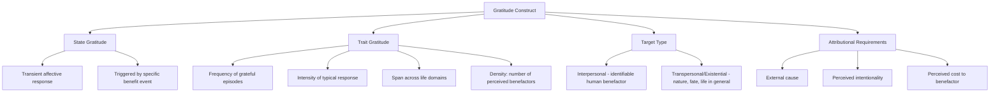

## The Science and Structure of Gratitude as an Emotion and Trait

### Definition and Conceptual Overview

Gratitude is studied in positive psychology at two distinct levels of analysis: as a discrete **emotional state** (a transient affective response to a specific benefit received) and as a **dispositional trait** (a stable individual difference in the tendency to notice, appreciate, and respond gratefully to positive experiences across time and contexts). Robert Emmons, one of the field's foundational researchers, defines gratitude as involving a two-step cognitive process: (1) recognizing that one has received a positive outcome, and (2) recognizing that this outcome originated at least partly from an external source.

**Key Points**

- Gratitude is classified within positive psychology as a **moral affect**, alongside emotions like guilt and empathy, because it is theorized to serve social and ethical functions beyond simple pleasure.
- The state/trait distinction matters methodologically: state gratitude is typically measured immediately following an induction (e.g., after a gratitude exercise), while trait gratitude is measured via retrospective self-report scales assessing general disposition.
- Gratitude is conceptually and empirically distinct from related constructs such as indebtedness (which carries an obligatory, often uncomfortable quality) and general positive affect (which lacks gratitude's essential attributional component — the recognition of a benefactor).

### The Attributional Structure of Gratitude

Weiner's attribution theory framework, applied to gratitude by researchers including Emmons and McCullough, holds that gratitude arises specifically when a positive outcome is attributed to:

1. **External cause** — a person, group, or force perceived as separate from the self
2. **Intentional/voluntary action** — the benefactor is seen as having chosen to help, rather than acting accidentally or under compulsion
3. **Cost to the benefactor** — some degree of effort, sacrifice, or resource expenditure is perceived on the benefactor's part

$$\text{Gratitude Intensity} \propto (\text{Perceived Intentionality}) \times (\text{Perceived Cost/Effort}) \times (\text{Value of Benefit})$$

This is a widely used conceptual (not strictly quantitative) formulation in the literature to illustrate that gratitude is not merely proportional to the objective size of a benefit but to the perceived intentionality and cost behind it. [Inference: this multiplicative framing is a simplified heuristic representation rather than a precisely validated mathematical model.]

**Example**

Two people each receive an identical $50 gift. Person A receives it from a stranger who found a discarded gift card and passed it along with no personal cost. Person B receives it from a friend who worked overtime specifically to afford the gift. Attribution theory predicts Person B will report substantially higher gratitude despite the objectively identical monetary value, because perceived intentionality and cost to the benefactor are higher.

### Gratitude Toward Non-Human Targets

A theoretically important extension addresses whether gratitude requires a human benefactor. Contemporary models (notably work associated with Fitzgerald and later expanded by Emmons) distinguish:

- **Interpersonal gratitude**: directed at an identifiable human benefactor.
- **Transpersonal/existential gratitude**: directed at non-human sources such as nature, fate, a higher power, or "life in general" — sometimes termed generalized or existential gratitude, which does not require the classic intentional-benefactor structure.

This distinction matters because trait gratitude scales differ in how much they emphasize interpersonal versus generalized components, affecting cross-study comparability.

### Neurobiological and Physiological Correlates

Neuroimaging research (e.g., studies using fMRI paradigms with gratitude-recall tasks) has associated gratitude experiences with activity in regions including the medial prefrontal cortex and anterior cingulate cortex — areas also implicated in social cognition, moral judgment, and reward processing. [Unverified: precise neural specificity to gratitude versus overlapping positive social emotions is still being refined, and findings vary by study design and task paradigm.]

At the physiological level, some studies have found associations between trait gratitude and heart rate variability (HRV), a marker linked to parasympathetic nervous system regulation, suggesting a possible link between gratitude and stress-regulation capacity. [Inference: causal direction and mechanism in this HRV association are not firmly established in the current literature.]

### Structural Models of Gratitude Measurement

**GQ-6 (Gratitude Questionnaire-6)**

Developed by McCullough, Emmons, and Tsang (2002), this is among the most widely used trait gratitude scales. It operationalizes trait gratitude along four theorized facets:

| Facet | Description |
| --- | --- |
| Intensity | How strongly gratitude is felt for a given positive event |
| Frequency | How often gratitude is experienced in daily life |
| Span | The number of life domains (relationships, health, work) gratitude extends across |
| Density | The number of people one feels grateful to for a single positive outcome |

**GRAT (Gratitude, Resentment, and Appreciation Test)**

Developed by Watkins and colleagues, this scale distinguishes trait gratitude from its opposite pole (resentment/ingratitude) and includes subscales for a general sense of abundance, appreciation of others, and appreciation of simple pleasures.

**Appreciation Scale**

A broader measure (Adler & Fagley) capturing appreciation across multiple targets — people, possessions, the present moment, rituals, and existential aspects of life — treating gratitude as one component within a wider appreciation construct.

### Structural Diagram: Components of the Gratitude Construct

### Functional Theories of Gratitude

**Find-Remind-and-Bind Theory (Algoe, 2012)**

This theory proposes gratitude serves a relationship-management function distinct from simple reward-based reinforcement: gratitude helps individuals **find** new relationship partners worth investing in, **remind** them of the value of existing relationships, and **bind** them more closely to responsive benefactors, strengthening social bonds over time.

**Broaden-and-Build Theory (Fredrickson)**

Within Barbara Fredrickson's broader framework for positive emotions, gratitude is classified as an emotion that broadens attention and cognition (encouraging prosocial and other-oriented thinking) and builds durable psychological and social resources over repeated experience, contributing to an "upward spiral" of wellbeing.

**Moral Affect Theory (McCullough, Kilpatrick, Emmons, Larson)**

Positions gratitude as serving three moral functions:

- **Moral barometer**: signaling that one has been the beneficiary of another's moral action.
- **Moral motivator**: motivating prosocial and reciprocal behavior toward the benefactor or third parties.
- **Moral reinforcer**: encouraging benefactors to continue behaving morally by rewarding their prosocial acts with visible gratitude.

### Diagram: Find-Remind-and-Bind Cycle

<svg xmlns="http://www.w3.org/2000/svg" viewBox="0 0 640 300" font-family="Helvetica, Arial, sans-serif">
<text x="320" y="26" font-size="17" font-weight="bold" text-anchor="middle" fill="#1a1a2e">Find-Remind-and-Bind Theory (svg_diagram)</text>
<circle cx="120" cy="170" r="70" fill="#bbdefb" opacity="0.85" />
<text x="120" y="165" font-size="13" font-weight="bold" text-anchor="middle" fill="#0d47a1">FIND</text>
<text x="120" y="182" font-size="10" text-anchor="middle" fill="#0d47a1">Identify responsive</text>
<text x="120" y="195" font-size="10" text-anchor="middle" fill="#0d47a1">new partners</text>
<circle cx="320" cy="170" r="70" fill="#c8e6c9" opacity="0.85" />
<text x="320" y="165" font-size="13" font-weight="bold" text-anchor="middle" fill="#1b5e20">REMIND</text>
<text x="320" y="182" font-size="10" text-anchor="middle" fill="#1b5e20">Reinforce value of</text>
<text x="320" y="195" font-size="10" text-anchor="middle" fill="#1b5e20">existing relationships</text>
<circle cx="520" cy="170" r="70" fill="#ffe0b2" opacity="0.85" />
<text x="520" y="165" font-size="13" font-weight="bold" text-anchor="middle" fill="#e65100">BIND</text>
<text x="520" y="182" font-size="10" text-anchor="middle" fill="#e65100">Strengthen commitment</text>
<text x="520" y="195" font-size="10" text-anchor="middle" fill="#e65100">and closeness over time</text>
<line x1="190" y1="170" x2="250" y2="170" stroke="#555" stroke-width="2" marker-end="url(#arrow)" />
<line x1="390" y1="170" x2="450" y2="170" stroke="#555" stroke-width="2" marker-end="url(#arrow)" />
</svg>

### Empirical Correlates of Trait Gratitude

Trait gratitude, measured across numerous studies, has been associated with:

- Higher subjective well-being and life satisfaction scores
- Lower depressive symptomatology in several correlational studies
- Higher reported relationship satisfaction, particularly in romantic partnerships
- Lower materialism and social comparison tendencies
- Higher prosocial behavior, including reciprocal helping and charitable giving

[Inference: the majority of this evidence base is correlational; causal claims about gratitude *producing* these outcomes rely on the smaller subset of experimental and longitudinal intervention studies discussed in applied gratitude-intervention topics, and effect sizes vary considerably by study design, population, and measurement instrument.]

### Distinguishing Gratitude from Adjacent Constructs

| Construct | Core Feature | Key Distinction from Gratitude |
| --- | --- | --- |
| Indebtedness | Feeling obligated to repay a benefit | Often experientially unpleasant; gratitude is typically pleasant |
| Positive affect (general) | Broad pleasant emotional state | Lacks the attributional/benefactor component |
| Awe | Response to vastness requiring cognitive accommodation | Not necessarily tied to a benefit received from an agent |
| Appreciation | Broader recognition of value in people, objects, or experiences | Gratitude is a subset focused specifically on received benefit |
| Reciprocity/social exchange | Behavioral norm of returning favors | A behavioral norm, not itself an emotional experience |

### Conclusion

Gratitude functions in the positive psychology literature as both a discrete emotional response, structured around attributions of external, intentional, and costly benefit-giving, and as a stable trait capturing how frequently, intensely, broadly, and multiply an individual experiences such responses across life domains. Its theorized functions extend beyond simple pleasant affect into relationship-building (find-remind-and-bind), moral signaling, and cognitive-behavioral broadening, giving it a structural richness that distinguishes it from adjacent constructs like general positive affect or indebtedness.

**Related Topics**

- Gratitude interventions (gratitude journaling, letters of gratitude, three good things exercise)
- Robert Emmons's research program and the psychology of gratitude
- Broaden-and-build theory (Barbara Fredrickson)
- Find-remind-and-bind theory (Sara Algoe)
- Moral affect theory and prosocial emotion
- Gratitude and relationship satisfaction research
- Cross-cultural variation in gratitude expression and norms
- Measurement instruments: GQ-6, GRAT, Appreciation Scale