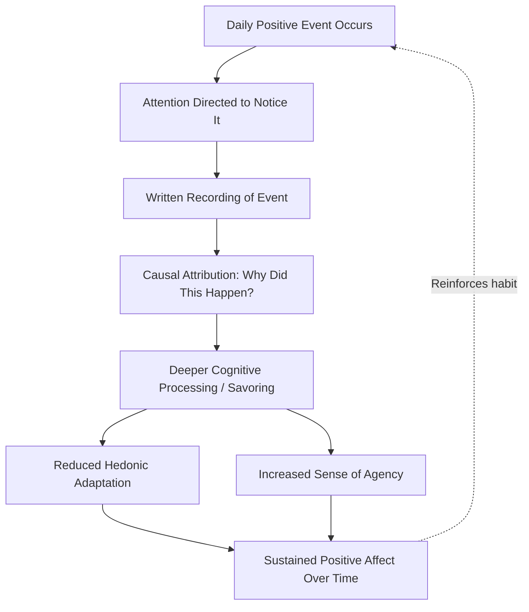

## Gratitude Journaling and the Three Good Things Exercise

### Definition and Conceptual Overview

Gratitude journaling and the "Three Good Things" exercise are among the most extensively studied behavioral interventions in positive psychology, designed to translate the trait/state constructs of gratitude into structured, repeatable practices. Both interventions operate on the same underlying mechanism: directing attention toward positive events and their causes counteracts the mind's default negativity bias and habituation to positive circumstances (sometimes termed hedonic adaptation).

**Key Points**

- **Gratitude journaling** broadly refers to the regular written recording of things, people, or events one feels grateful for, typically on a daily or weekly basis.
- **Three Good Things** (also called "What Went Well") is a specific, manualized version of gratitude journaling developed by Martin Seligman and colleagues, requiring participants to write down three positive events each day and their perceived causes.
- Both interventions belong to a broader category positive psychology researchers term **Positive Psychological Interventions (PPIs)** — brief, structured activities designed to increase wellbeing.

### Origins and Empirical History

The Three Good Things exercise was formally tested and popularized in Seligman, Steen, Park, and Peterson's 2005 study published in *American Psychologist*, "Positive Psychology Progress: Empirical Validation of Interventions." This study compared several PPIs, including Three Good Things and a "gratitude visit" exercise, against a placebo control condition (writing about early memories).

**Key Points**

- In the original study, participants completed the Three Good Things exercise nightly for one week.
- Reported benefits (increased happiness, decreased depressive symptoms) persisted at follow-up assessments beyond the intervention period itself in the original study, which was notable because most brief interventions show effects that fade quickly. [Inference: subsequent replications have shown more variable persistence of effects, and the durability of benefits is an area of continued research rather than a settled finding.]
- Earlier foundational work by Robert Emmons and Michael McCullough (2003), comparing weekly gratitude listing against hassles-listing and neutral-listing control conditions, established much of the empirical groundwork showing gratitude listing increased wellbeing measures relative to controls.

### The Three Good Things Protocol

**Standard Procedure**

1. At the end of each day (commonly before sleep), write down three things that went well that day. These can range from minor (a good cup of coffee) to major (a career success).
2. For each item, write a brief explanation of *why* it happened — specifically, what the participant's own role or a specific causal factor was in bringing it about.
3. Repeat consistently, typically for a minimum of one week, though many protocols extend to several weeks for stronger habituation-resistant effects.

**Example**

> **Good thing:** "My colleague covered a meeting for me when I was running late."
>
> **Why it happened:** "I've built a reliable, reciprocal working relationship with her over the past year by helping her out when she needed it, so she was willing to help me."

The causal-attribution step is considered a critical structural component distinguishing Three Good Things from simple positive-event listing; it is theorized to reinforce a sense of agency and to deepen the cognitive processing of the positive event rather than allowing it to be passively noted and forgotten.

### Mechanism Diagram

### Theoretical Mechanisms

**Attentional Retraining**

The exercise is theorized to work partly by retraining habitual attention patterns. Because negative events tend to be more attentionally "sticky" (a well-documented negativity bias in cognitive psychology), the deliberate, effortful search for positive events each day counteracts this default asymmetry.

**Counteracting Hedonic Adaptation**

Positive circumstances (a new job, a good relationship) tend to lose their emotional impact over time as they become the new baseline — a process termed hedonic adaptation. Regularly re-noticing and re-processing positive events, including small everyday ones, is theorized to partially interrupt this adaptation process by preventing positive experiences from fading into unnoticed background routine.

**Savoring**

Fred Bryant's concept of savoring — the capacity to attend to, appreciate, and enhance positive experiences — is closely related. The Three Good Things exercise operationalizes a form of savoring by extending attention on a positive event well past its initial occurrence, into a deliberate reflective and written form.

### Variants of Gratitude Journaling

| Variant | Structure | Distinguishing Feature |
| --- | --- | --- |
| Three Good Things / What Went Well | 3 items nightly + causal attribution | Includes explicit "why" component |
| General gratitude listing | Open-ended list of things one is grateful for | No fixed number; no causal attribution requirement |
| Gratitude letter | Extended written letter to a specific benefactor | Interpersonal, often delivered (see gratitude visit) |
| Weekly gratitude journal (Emmons & McCullough protocol) | 5 items listed once per week | Lower frequency; designed to avoid habituation from over-repetition |
| Photo/multimedia gratitude journal | Visual or mixed-media recording of gratitude-eliciting moments | Adapted for populations or contexts favoring non-text formats |

**Key Points**

- Emmons and McCullough's original research found that a **weekly** gratitude-listing frequency sometimes outperformed daily listing in certain outcome measures, suggesting a possible dose-frequency relationship where excessive repetition may reduce novelty and induce its own form of habituation. [Inference: findings on optimal frequency are mixed across the literature and likely depend on exercise format, duration, and population; this is not a fully resolved empirical question.]
- Digital and app-based gratitude journals have proliferated in recent years; empirical validation of specific commercial apps varies widely and is generally less rigorous than that of the original manualized laboratory protocols. [Unverified: the wellbeing benefits of specific consumer gratitude-journaling apps, as opposed to the underlying exercise itself, have not been uniformly validated with the same rigor as the original research protocols.]

### Comparative Outcomes Across Studies

Meta-analytic and systematic review work on gratitude interventions (including but not limited to Three Good Things) has generally found:

- Small-to-moderate positive effects on subjective wellbeing measures compared to control conditions
- Effects that are typically stronger for wellbeing/life-satisfaction outcomes than for depressive symptom reduction specifically
- Substantial heterogeneity across studies in effect size, attributable to differences in intervention duration, population (clinical vs. non-clinical), dosage/frequency, and control-condition design

[Inference: as with most brief positive psychology interventions, publication bias and variability in methodological rigor across the broader intervention literature mean that meta-analytic effect size estimates should be interpreted with some caution rather than as precise, fixed quantities.]

### Practical Implementation Guidance

**Key Points**

- **Specificity matters**: research on savoring and gratitude suggests that specific, detailed positive events ("my daughter laughed at my joke at dinner") tend to produce stronger effects than vague or generic ones ("my family is nice").
- **Variety reduces habituation**: some studies suggest that varying the content or format of gratitude practice (rather than listing the same recurring things) sustains benefit better over multi-week periods.
- **Consistency over intensity**: shorter, consistent daily practice is generally emphasized over infrequent, lengthy sessions, based on the general finding that habit consistency drives durability of intervention effects in behavioral change research broadly.
- **Timing**: many protocols specify an evening/pre-sleep timing, partly because reflecting on the day's positive events at day's end aligns naturally with a review structure, though [Speculation: whether time-of-day itself is a causally important variable, as opposed to simply a convenient scheduling choice, has not been rigorously isolated in the literature].

### Illustration: Three Good Things Daily Log Template

<svg xmlns="http://www.w3.org/2000/svg" viewBox="0 0 640 340" font-family="Helvetica, Arial, sans-serif">
<text x="320" y="28" font-size="17" font-weight="bold" text-anchor="middle" fill="#1a1a2e">Three Good Things Log Structure (svg_diagram)</text>
<rect x="60" y="50" width="520" height="80" rx="8" fill="#e3f2fd" stroke="#1976d2" stroke-width="1.5" />
<text x="80" y="75" font-size="13" font-weight="bold" fill="#0d47a1">1. Good thing:</text>
<text x="80" y="95" font-size="11" fill="#333">[Specific positive event from today]</text>
<text x="80" y="115" font-size="11" font-style="italic" fill="#555">Why it happened: [Causal attribution]</text>
<rect x="60" y="140" width="520" height="80" rx="8" fill="#e8f5e9" stroke="#388e3c" stroke-width="1.5" />
<text x="80" y="165" font-size="13" font-weight="bold" fill="#1b5e20">2. Good thing:</text>
<text x="80" y="185" font-size="11" fill="#333">[Specific positive event from today]</text>
<text x="80" y="205" font-size="11" font-style="italic" fill="#555">Why it happened: [Causal attribution]</text>
<rect x="60" y="230" width="520" height="80" rx="8" fill="#fff3e0" stroke="#f57c00" stroke-width="1.5" />
<text x="80" y="255" font-size="13" font-weight="bold" fill="#e65100">3. Good thing:</text>
<text x="80" y="275" font-size="11" fill="#333">[Specific positive event from today]</text>
<text x="80" y="295" font-size="11" font-style="italic" fill="#555">Why it happened: [Causal attribution]</text>
</svg>

### Common Pitfalls and Limitations

- **Rote/mechanical completion**: research on positive interventions broadly cautions that completing the exercise perfunctorily, without genuine reflective engagement, is associated with weaker or negligible effects — the causal-attribution step is thought to be particularly vulnerable to being skipped or trivialized.
- **Ceiling effects in already-high-wellbeing populations**: individuals with already high trait wellbeing or gratitude may show smaller measurable gains, a general pattern in PPI research termed a ceiling effect.
- **Not a substitute for clinical treatment**: gratitude journaling is studied and applied as a wellbeing-enhancement practice, not as a validated standalone treatment for diagnosed clinical depression or anxiety disorders; several research protocols explicitly position it as adjunctive rather than primary treatment. [Inference: clinical guidance on appropriate adjunctive use varies by condition severity and should not be inferred as a blanket clinical recommendation.]
- **Cultural and individual variation**: the framing and comfort with explicit gratitude expression vary cross-culturally, and some studies suggest that intervention framing (e.g., religious vs. secular language) affects engagement and outcomes for different populations. [Speculation: the extent of this moderating effect across specific cultural contexts is not comprehensively mapped in the current literature.]

### Conclusion

Gratitude journaling, and the Three Good Things exercise specifically, represent among the most rigorously tested brief positive psychology interventions, combining simple behavioral structure (nightly written recording) with a theoretically grounded causal-attribution component designed to deepen cognitive processing of positive events. Evidence generally supports small-to-moderate wellbeing benefits, particularly when the exercise is practiced with genuine reflective engagement and specificity, though effect durability and optimal dosage remain areas of continued empirical refinement rather than fully settled parameters.

**Related Topics**

- Robert Emmons and Michael McCullough's foundational gratitude research (2003)
- Fred Bryant's savoring theory
- Hedonic adaptation and the hedonic treadmill
- The gratitude letter and gratitude visit intervention
- Positive Psychological Interventions (PPIs) as a research category
- Negativity bias in cognitive psychology
- Broaden-and-build theory applied to journaling practices
- Digital/app-based positive psychology interventions and their evidence base