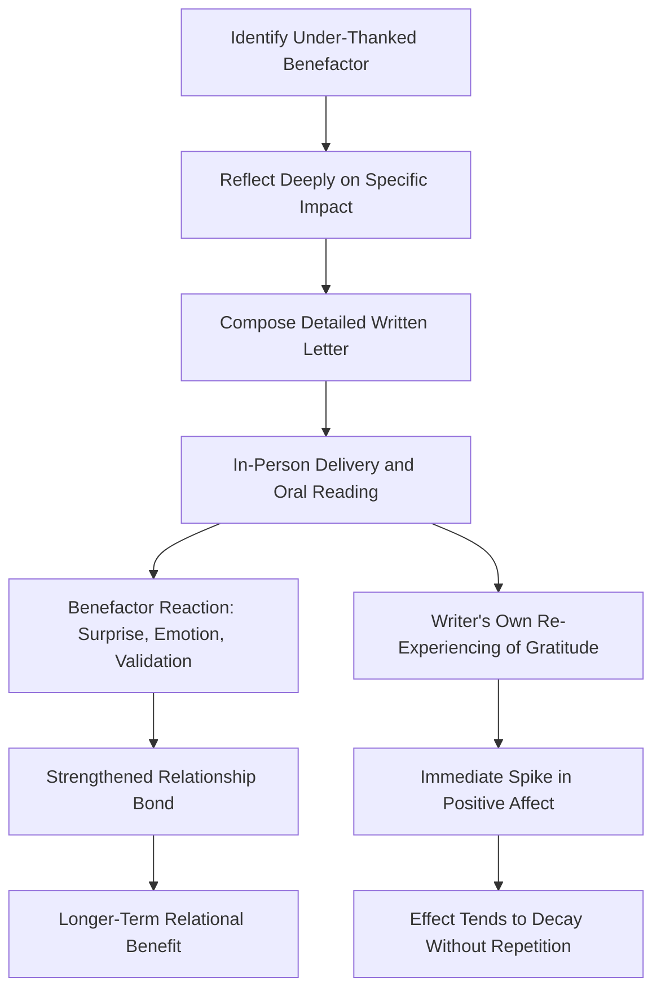

## The Gratitude Visit and Letter-Writing Interventions

### Definition and Conceptual Overview

The gratitude visit is a structured positive psychology intervention in which an individual writes a detailed letter of thanks to someone who has had a significant positive impact on their life but whom they have never properly thanked, and then delivers that letter in person, reading it aloud to the recipient. It is distinguished from more general gratitude journaling by its **interpersonal, dyadic structure**: rather than privately reflecting on positive events, the exercise requires direct expression of gratitude to a specific benefactor and, in its full form, face-to-face delivery.

**Key Points**

- The exercise was formally tested and popularized by Martin Seligman and colleagues in the same 2005 *American Psychologist* study ("Positive Psychology Progress: Empirical Validation of Interventions") that validated the Three Good Things exercise.
- In that original study, the gratitude visit produced some of the largest immediate effect sizes on happiness measures among all interventions tested, though the effect was also among the least durable, tending to decay more quickly than lower-intensity, repeatable practices like Three Good Things. [Inference: this durability pattern has been a consistent theme in subsequent discussions of the intervention, though direct replications with long-term follow-up are less numerous than for repeatable daily interventions.]
- A **gratitude letter** refers to the written component alone (composing and typically sending or giving the letter, without necessarily an in-person reading); the **gratitude visit** specifically requires the additional step of in-person delivery and oral reading.

### Standard Protocol

**Step-by-Step Procedure**

1. Identify a specific person who did something significant to help or influence the individual positively, for whom proper thanks was never given.
2. Write a detailed letter (typically 300 words or more in the original protocol) describing specifically what the person did and precisely how it affected the writer's life.
3. Arrange, without necessarily disclosing the exact purpose in advance, to visit the person.
4. Read the letter aloud to the recipient in person, allowing for their reaction and subsequent conversation.

**Example Structural Elements of an Effective Letter**

> "You may not even remember this, but during my first year of college when I was struggling and considering dropping out, you sat with me for hours helping me understand calculus without ever making me feel inadequate. Because of that patience, I passed the course, stayed enrolled, and went on to finish my degree — which changed the entire direction of my career. I never properly thanked you for that, and I want you to know how much it mattered."

This example illustrates the two structural components emphasized in the protocol: **specificity** (a particular remembered action, not a vague general compliment) and **causal impact** (an explicit description of how that action changed a subsequent life outcome).

### Mechanism Diagram

### Theoretical Mechanisms

**Dual-Beneficiary Structure**

Unlike private gratitude journaling, the gratitude visit is theorized to produce benefits through two simultaneous channels: the *writer's* re-processing and deepened appreciation of the benefit received, and the *recipient's* experience of being seen, valued, and thanked — which research on prosocial behavior suggests can itself independently boost the recipient's wellbeing.

**Find-Remind-and-Bind Function**

Consistent with Sara Algoe's find-remind-and-bind theory of gratitude, the gratitude visit is a particularly strong instantiation of the "remind" and "bind" functions: it explicitly reminds both parties of the value of an existing relationship and creates a shared emotional event that can strengthen relational closeness going forward.

**Social Validation and Reciprocal Reinforcement**

From the moral-affect perspective (McCullough, Kilpatrick, Emmons, Larson), the gratitude visit operationalizes the "moral reinforcer" function especially directly: the benefactor receives concrete social reward for their earlier prosocial action, which may increase their motivation to continue similar behavior toward others.

### Comparison: Gratitude Letter vs. Gratitude Visit vs. Gratitude Journaling

| Feature | Gratitude Journaling | Gratitude Letter (unsent/sent) | Gratitude Visit (letter + in-person delivery) |
| --- | --- | --- | --- |
| Structure | Private, repeated, brief entries | Single, extended, interpersonal | Single, extended, interpersonal + face-to-face |
| Target | General positive events, self-directed | Specific benefactor | Specific benefactor |
| Frequency | Daily/weekly, ongoing | Typically one-time | Typically one-time |
| Immediate effect size | Small-to-moderate | Moderate | Often large in original studies |
| Durability of effect | More sustained with repetition | Variable, less studied in isolation | Tends to decay faster without repetition |
| Interpersonal exposure | None required | Low (if unsent) to moderate (if sent) | High (direct, in-person, real-time reaction) |
| Practical burden | Low, easily repeatable | Moderate | High (logistics of visit, emotional vulnerability) |

### Variants and Adaptations

**Key Points**

- **Unsent gratitude letters**: some adapted protocols, particularly in contexts where in-person delivery is impractical (geographic distance, the benefactor is deceased, or the relationship has ended), have participants write the letter without delivering it, retaining some of the reflective/re-experiencing benefit for the writer while forgoing the interpersonal delivery component.
- **Sent-but-not-delivered-in-person letters**: an intermediate version where the letter is mailed or emailed rather than read aloud in person; this preserves the interpersonal exposure but removes the real-time reciprocal emotional exchange thought to amplify the effect.
- **Group or workplace adaptations**: some organizational wellbeing programs have adapted the exercise into structured peer-recognition or gratitude-exchange formats, though [Speculation: the extent to which these organizational adaptations preserve the psychological mechanisms of the original one-on-one protocol, as opposed to functioning more like general recognition programs, has not been rigorously established].
- **Grief and loss adaptations**: letters addressed to deceased or estranged individuals are sometimes used therapeutically, though this shifts the intervention's function toward processing grief or unresolved relational material rather than straightforward gratitude expression, and falls more within a clinical/therapeutic framework than the standard positive psychology protocol. [Inference: this adaptation, if used, is generally considered better suited to a clinical or therapeutic context than a self-administered wellbeing exercise.]

### Illustration: Effect Size and Durability Trade-off

<svg xmlns="http://www.w3.org/2000/svg" viewBox="0 0 640 380" font-family="Helvetica, Arial, sans-serif">
<text x="320" y="26" font-size="16" font-weight="bold" text-anchor="middle" fill="#1a1a2e">Immediate Impact vs. Durability Across Gratitude Interventions (svg_diagram)</text>
<line x1="90" y1="330" x2="580" y2="330" stroke="#333" stroke-width="2" />
<line x1="90" y1="330" x2="90" y2="60" stroke="#333" stroke-width="2" />
<text x="335" y="360" font-size="12" text-anchor="middle" fill="#333">Durability of Effect (Low → High)</text>
<text x="35" y="200" font-size="12" text-anchor="middle" fill="#333" transform="rotate(-90 35 200)">Immediate Impact (Low → High)</text>
<circle cx="200" cy="130" r="14" fill="#e57373" />
<text x="200" y="110" font-size="11" text-anchor="middle" fill="#333">Gratitude Visit</text>
<circle cx="450" cy="230" r="14" fill="#64b5f6" />
<text x="450" y="210" font-size="11" text-anchor="middle" fill="#333">Three Good Things</text>
<text x="450" y="255" font-size="10" text-anchor="middle" fill="#666">(repeated daily)</text>
<circle cx="330" cy="180" r="12" fill="#81c784" />
<text x="330" y="160" font-size="11" text-anchor="middle" fill="#333">Gratitude Letter</text>
<text x="330" y="200" font-size="10" text-anchor="middle" fill="#666">(unsent/single)</text>
</svg>

### Practical Implementation Guidance

- **Recipient selection**: guidance typically emphasizes choosing someone whose contribution was significant but under-acknowledged, rather than someone already frequently and explicitly thanked (e.g., a spouse who hears "thank you" daily), since novelty of the explicit acknowledgment is thought to matter for the surprise and impact components of the exercise.
- **Specificity over generality**: as with other gratitude interventions, letters describing a specific incident and its causal downstream impact are generally emphasized over broad, generic statements of appreciation.
- **Managing emotional intensity**: because the exercise often elicits strong emotion in both parties, practical guidance in applied/coaching contexts typically includes preparing participants for the possibility of an intense, vulnerable emotional exchange, and normalizing that outcome rather than treating it as a sign the exercise "went wrong."
- **One-time vs. repeated use**: because of the intervention's relatively high logistical and emotional cost compared to daily journaling, it is generally studied and applied as an occasional, high-impact practice rather than a repeatable daily habit.

### Limitations and Considerations

- **Logistical constraints**: the requirement for in-person delivery limits applicability when the benefactor is deceased, geographically distant, or estranged, which several adapted protocols (noted above) attempt to address at the cost of some hypothesized mechanism strength.
- **Recipient's autonomy and reaction**: unlike self-directed journaling, this intervention involves another person's emotional experience and reaction, introducing a degree of unpredictability and interpersonal risk not present in solitary gratitude practices.
- **Single-administration limits on generalizability**: because the classic protocol is typically a one-time exercise, its evidence base is structurally different from that of repeated interventions like Three Good Things, making direct effect-size comparisons across intervention types somewhat imprecise. [Inference: comparing a single high-intensity event to a repeated low-intensity practice involves different measurement timeframes and dosage models, which complicates straightforward comparative claims about "which intervention works better."]
- **Cultural variation in expressive norms**: comfort with explicit, emotionally direct verbal gratitude expression, and with the vulnerability of in-person delivery, varies across cultural contexts, which may affect both willingness to complete the exercise and its measured effectiveness. [Speculation: the degree of this cross-cultural moderating effect has not been comprehensively mapped for this specific intervention.]

### Conclusion

The gratitude visit and its related letter-writing variants extend gratitude practice beyond private reflection into direct interpersonal expression, drawing on relationship-strengthening mechanisms (find-remind-and-bind) and moral-reinforcement functions not fully captured by solitary journaling exercises. Empirically, the intervention has been associated with some of the largest immediate positive-affect gains among tested positive psychology interventions, at the cost of being more logistically demanding, emotionally vulnerable, and typically less durable as a one-time event compared to repeatable daily practices — positioning it as a high-impact, occasional complement to, rather than a replacement for, ongoing gratitude journaling.

**Related Topics**

- Seligman, Steen, Park, and Peterson (2005) empirical validation study
- Sara Algoe's find-remind-and-bind theory
- Moral affect theory of gratitude (McCullough, Kilpatrick, Emmons, Larson)
- Gratitude journaling and the Three Good Things exercise
- Positive Psychological Interventions (PPIs) and dosage/durability research
- Prosocial behavior and the psychology of being thanked
- Applications of gratitude interventions in organizational and workplace settings
- Therapeutic letter-writing adaptations in grief and loss contexts