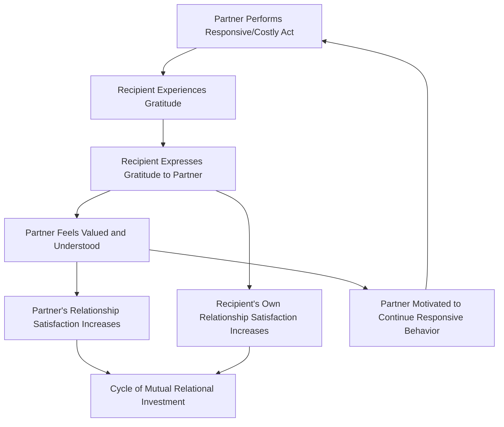

## Gratitude's Effects on Relationships and Prosocial Behavior

### Definition and Conceptual Overview

This topic addresses gratitude's function as a relationally embedded emotion — one whose effects extend beyond the individual experiencing it to shape interpersonal bonds, cooperative behavior, and broader social dynamics. Where earlier topics in this chapter addressed gratitude's internal structure and measurement, this topic focuses on its **interpersonal and behavioral downstream consequences**: how gratitude shapes relationship quality, reciprocity, and prosocial action toward both the original benefactor and third parties.

**Key Points**

- Gratitude is theorized and studied as a mechanism that helps solve a recurring social problem: identifying and investing in relationships with people who are responsive to one's needs (sometimes framed in the literature as detecting and rewarding "communal" or high-responsiveness partners).
- Effects are commonly studied at three levels: **dyadic** (the relationship between benefactor and recipient), **generalized reciprocity** (gratitude motivating helping behavior toward third parties, not just the original benefactor), and **relational maintenance over time** (longitudinal relationship quality and stability).
- This body of research draws heavily on Sara Algoe's find-remind-and-bind theory (introduced under gratitude's structure) as its central organizing framework.

### Gratitude and Dyadic Relationship Quality

**Perceived Partner Responsiveness**

A substantial body of research, particularly in romantic relationship contexts, links gratitude to **perceived partner responsiveness** — the belief that one's partner understands, validates, and cares for one's needs. Algoe and colleagues' research on romantic couples has found that expressing and receiving gratitude within a relationship is associated with increased relationship satisfaction and connection, for both the person expressing gratitude and the person receiving it, on the same day the exchange occurs. [Inference: much of this evidence relies on daily-diary and correlational designs; establishing gratitude expression as a strong independent causal driver of long-term relationship trajectories, isolated from other relationship-quality factors, remains an area of ongoing research.]

**Gratitude as a Relationship "Booster Shot"**

Algoe has characterized gratitude expression within established relationships as functioning like a periodic "booster," reinforcing commitment and connection even in relationships that are already stable, rather than serving only to initiate new relationships. This distinguishes gratitude's dyadic-maintenance function from its "find" function (identifying new partners), discussed under the broader find-remind-and-bind framework.

### Mechanism Diagram: Gratitude's Relational Pathway

### Gratitude and Generalized Reciprocity (Third-Party Effects)

One of the more theoretically distinctive findings in this literature is that gratitude's prosocial effects are not limited to the original benefactor. Research (notably by Bartlett and DeSteno, and later work by others) has demonstrated:

- Individuals induced to feel grateful (e.g., after receiving unexpected help on a task) show increased willingness to help a **different, unrelated person**, not just the original helper.
- This pattern is sometimes termed **"upstream reciprocity"** or **generalized/pay-it-forward reciprocity**, distinguishing it from direct reciprocity (helping back the specific person who helped you).
- This finding supports the broader theoretical claim that gratitude functions partly as a general prosocial-motivation trigger, rather than solely as a narrow, transactional debt-repayment mechanism.

**Example**

In a commonly cited experimental paradigm, participants first either receive help from a confederate on a difficult computer task (gratitude induction) or do not. Later, in an apparently unrelated context, they are given an opportunity to help a different stranger with a tedious, effortful task. Participants in the gratitude-induction condition typically spend significantly more time helping the unrelated stranger than those in control conditions, despite having no direct relationship with or obligation to that new person.

### Prosocial and Cooperative Behavior Correlates

Beyond direct experimental inductions, trait gratitude and gratitude interventions have been associated in the broader literature with:

| Outcome Domain | Associated Pattern |
| --- | --- |
| Charitable giving | Higher trait gratitude associated with greater self-reported and behavioral generosity |
| Workplace helping behavior | Gratitude expression from supervisors associated with increased employee prosocial/organizational citizenship behavior in several studies |
| Cooperation in economic games | Gratitude induction associated with increased cooperative choices in some trust/dictator-game paradigms |
| Volunteering | Trait gratitude positively associated with volunteering frequency in survey-based research |
| Social support seeking and provision | Grateful individuals report both giving and receiving more social support in relationship networks |

[Inference: as with most social-behavioral correlates in this literature, effect sizes vary by study design, population, and the specific behavioral measure used, and correlational findings should be distinguished from the smaller subset of controlled experimental studies isolating gratitude's causal role.]

### Theoretical Frameworks Explaining Relational Effects

**Find-Remind-and-Bind Theory (Algoe)**

As introduced earlier in this chapter, this remains the dominant framework for gratitude's relational function, proposing that gratitude helps people (1) identify new high-quality relationship partners, (2) remind themselves of the value of existing relationships, and (3) bind themselves more closely to responsive partners over time.

**Broaden-and-Build Theory (Fredrickson)**

Applied to social behavior specifically, this theory proposes that gratitude, as a positive emotion, broadens an individual's momentary attentional and behavioral repertoire toward other-oriented, prosocial action (rather than the narrowed, self-protective repertoires associated with many negative emotions), and that repeated experiences build durable social resources — friendships, support networks, and social capital — over time.

**Moral Affect Theory (McCullough, Kilpatrick, Emmons, Larson)**

This framework's "moral motivator" function is directly relevant here: gratitude is theorized to motivate prosocial behavior specifically because it signals that one has benefited from another's moral action, creating psychological pressure (distinct from mere social obligation) to behave well in turn — whether toward the original benefactor or toward others.

**Costly Signaling and Partner-Selection Models**

Some evolutionary-psychology-informed accounts frame gratitude expression as a **costly, hard-to-fake signal** of appreciation and relational investment, which helps solve the practical problem of distinguishing genuinely responsive, trustworthy relationship partners from less reliable ones. [Speculation: the specific evolutionary claims within this framework are more difficult to test directly than the proximate behavioral and relational effects, and should be treated as a theoretical interpretive layer rather than as directly established fact.]

### Illustration: Direct vs. Generalized (Upstream) Reciprocity

<svg xmlns="http://www.w3.org/2000/svg" viewBox="0 0 640 340" font-family="Helvetica, Arial, sans-serif">
<text x="320" y="26" font-size="16" font-weight="bold" text-anchor="middle" fill="#1a1a2e">Direct vs. Generalized Reciprocity (svg_diagram)</text>

<text x="160" y="60" font-size="13" font-weight="bold" text-anchor="middle" fill="`#1976d2`">Direct Reciprocity</text>

<circle cx="90" cy="150" r="40" fill="`#bbdefb`" />

<text x="90" y="155" font-size="11" text-anchor="middle" fill="`#0d47a1`">Person A</text>

<circle cx="240" cy="150" r="40" fill="`#bbdefb`" />

<text x="240" y="155" font-size="11" text-anchor="middle" fill="`#0d47a1`">Person B</text>

<line x1="130" y1="135" x2="200" y2="135" stroke="`#1976d2`" stroke-width="2" marker-end="url(#arrow1)" />

<text x="165" y="125" font-size="9" text-anchor="middle" fill="`#1976d2`">helps</text>

<line x1="200" y1="165" x2="130" y2="165" stroke="`#1976d2`" stroke-width="2" marker-end="url(#arrow1)" />

<text x="165" y="180" font-size="9" text-anchor="middle" fill="`#1976d2`">thanks / repays</text>

<text x="480" y="60" font-size="13" font-weight="bold" text-anchor="middle" fill="`#e65100`">Generalized (Upstream) Reciprocity</text>

<circle cx="400" cy="150" r="38" fill="`#ffe0b2`" />

<text x="400" y="155" font-size="10" text-anchor="middle" fill="`#e65100`">Person C</text>

<circle cx="530" cy="150" r="38" fill="`#ffe0b2`" />

<text x="530" y="155" font-size="10" text-anchor="middle" fill="`#e65100`">Person D</text>

<circle cx="595" cy="260" r="38" fill="`#ffccbc`" />

<text x="595" y="265" font-size="10" text-anchor="middle" fill="`#bf360c`">Person E</text>

<line x1="438" y1="150" x2="492" y2="150" stroke="`#e65100`" stroke-width="2" marker-end="url(#arrow1)" />

<text x="465" y="140" font-size="9" text-anchor="middle" fill="`#e65100`">helps</text>

<line x1="550" y1="180" x2="580" y2="230" stroke="`#e65100`" stroke-width="2" stroke-dasharray="4,2" marker-end="url(#arrow1)" />

<text x="595" y="205" font-size="9" text-anchor="middle" fill="`#e65100`">helps a new,</text>

<text x="595" y="216" font-size="9" text-anchor="middle" fill="`#e65100`">unrelated person</text>

</svg>

### Applied Contexts

**Romantic Relationships**

Couples-focused interventions incorporating structured gratitude expression (e.g., regularly stating specific appreciations to a partner) have been studied as adjuncts to relationship-satisfaction and relationship-education programs, drawing on the responsiveness and booster-shot mechanisms described above.

**Workplace and Organizational Settings**

Gratitude expression from leaders to employees, and peer-to-peer gratitude/recognition practices, have been examined as levers for organizational citizenship behavior, reduced turnover intention, and workplace social cohesion. [Inference: as with consumer gratitude apps discussed elsewhere in this chapter, the rigor and design of organizational gratitude programs vary considerably, and not all workplace implementations have been evaluated with controlled research designs comparable to the original laboratory and couples studies.]

**Community and Prosocial Program Design**

Some community health and prosocial-behavior program designs have incorporated gratitude-elicitation components explicitly to leverage the upstream/generalized reciprocity effect, aiming to increase broader community helping behavior rather than only benefiting a single identified recipient.

### Distinguishing Gratitude's Relational Effects from Related Constructs

| Construct | Core Relational Function | Key Distinction |
| --- | --- | --- |
| Gratitude | Signals and reinforces a responsive partner/benefactor relationship | Requires perceived intentional, costly benefit |
| Direct reciprocity | Behavioral norm of returning a favor to the same person | A behavioral norm, not necessarily emotion-driven |
| Generalized/upstream reciprocity | Helping third parties after receiving help | Not directed at original benefactor |
| Trust | Belief in another's reliability or benevolent intent | Broader, not necessarily tied to a specific benefit event |
| Social capital | Aggregate network of relationships and mutual obligation | A structural/network-level outcome, not an individual emotion |

### Limitations and Considerations

- **Correlational dominance**: much dyadic relationship research in this area (particularly longitudinal romantic relationship studies) is correlational; controlled experimental isolation of gratitude's unique causal contribution, separate from general relationship warmth or communication quality, is more limited. [Inference: this is a common methodological constraint across relationship science generally, not unique to gratitude research specifically.]
- **Reverse causality possibility**: it is plausible that already-satisfying, high-quality relationships simply produce more frequent gratitude expression, rather than gratitude expression being the primary causal driver of relationship quality; most study designs cannot fully rule out this bidirectional possibility. [Speculation: the relative causal weight in each direction likely varies by relationship stage and context and is not fully resolved in the current literature.]
- **Expression norms vary**: cultural and individual differences in comfort with explicit verbal gratitude expression may moderate both the frequency of gratitude expression and its measured relational impact, an area noted as under-researched relative to the volume of Western, English-speaking-sample-based studies in this literature.

### Conclusion

Gratitude's effects extend well beyond the individual experiencing the emotion, functioning as a relational signal and behavioral driver that reinforces existing bonds, motivates continued responsiveness from partners, and — notably — spreads prosocial behavior to third parties uninvolved in the original beneficial exchange. This combination of dyadic relationship-strengthening (via find-remind-and-bind and responsiveness mechanisms) and generalized upstream reciprocity positions gratitude as a socially generative emotion whose downstream effects on cooperation and relational stability represent one of positive psychology's more robust applied findings, while still leaving open questions about causal direction and cross-cultural generalizability.

**Related Topics**

- Sara Algoe's find-remind-and-bind theory and perceived partner responsiveness research
- Upstream/generalized reciprocity experimental paradigms (Bartlett and DeSteno)
- Broaden-and-build theory applied to social resource-building
- Moral affect theory and the "moral motivator" function of gratitude
- Gratitude-based couples and relationship-education interventions
- Organizational citizenship behavior and workplace gratitude practices
- Social capital theory and its relationship to prosocial emotion
- Cross-cultural variation in gratitude expression norms