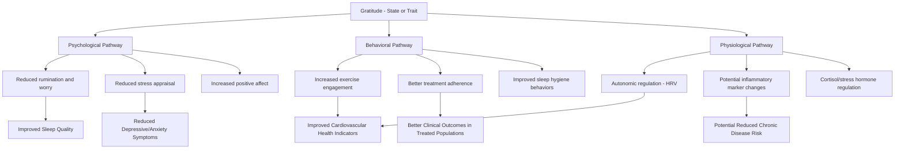

## Gratitude and Physical and Mental Health Outcomes

### Definition and Conceptual Overview

This topic examines the empirical literature linking gratitude — both as a momentary state and a stable trait — to indicators of physical health, mental health, and biological functioning. This body of research extends gratitude's study beyond its social and relational functions (covered elsewhere in this chapter) into the domains of health psychology and psychoneuroimmunology, examining plausible behavioral, psychological, and physiological pathways connecting gratitude to health outcomes.

**Key Points**

- Research in this domain spans self-report correlational studies, randomized controlled intervention trials, and a smaller body of biomarker/physiological studies.
- Proposed pathways linking gratitude to health are generally categorized into **direct psychological pathways** (e.g., reduced stress appraisal), **behavioral pathways** (e.g., improved health behaviors), and **physiological pathways** (e.g., autonomic nervous system regulation, inflammation markers).
- As with most positive psychology constructs, the majority of the evidence base is correlational, with a smaller but growing subset of experimental and longitudinal studies attempting to establish more confident causal and mechanistic claims. [Inference: the relative strength of the evidence varies considerably across specific outcomes discussed below, and this variation is noted throughout rather than treated uniformly.]

### Mental Health Correlates

**Depression and Anxiety Symptoms**

Multiple studies and several meta-analyses have found trait gratitude to be inversely associated with depressive and anxiety symptom severity. Gratitude interventions (see the Three Good Things and gratitude letter/visit topics elsewhere in this chapter) have shown small-to-moderate reductions in depressive symptoms in a number of controlled trials, particularly when used as an adjunct to standard treatment rather than a standalone intervention. [Inference: effect sizes for depression outcomes specifically tend to be more modest and heterogeneous across studies than effects on general wellbeing measures, and gratitude interventions are not established as substitutes for evidence-based clinical treatment of diagnosed mood disorders.]

**Subjective Wellbeing and Life Satisfaction**

This is among the most consistently replicated associations in the literature: trait gratitude correlates positively with life satisfaction, positive affect, and overall subjective wellbeing across a wide range of study populations, ages, and cultural contexts.

**Sleep Quality**

Several studies have found trait gratitude and pre-sleep gratitude practices (e.g., gratitude journaling before bed) associated with improved subjective sleep quality and reduced sleep latency (time to fall asleep). A commonly proposed mechanism is that gratitude reduces pre-sleep cognitive arousal — specifically, ruminative or worry-based thought patterns that otherwise interfere with sleep onset. [Inference: much of this research relies on self-reported sleep quality rather than objective polysomnographic measures, which limits the precision of these findings.]

**Post-Traumatic Growth and Resilience**

Gratitude has been studied as a component of, and contributor to, post-traumatic growth — positive psychological change following adversity. Some research suggests grateful individuals may be more likely to find meaning in difficult experiences, though [Speculation: the precise causal role of gratitude in producing post-traumatic growth, as opposed to being a correlate or downstream consequence of adaptive coping more broadly, is not firmly established].

### Physical Health Correlates

**Cardiovascular Health**

Some studies have examined associations between trait gratitude or gratitude interventions and cardiovascular risk markers, including blood pressure and heart rate variability (HRV) — a marker of autonomic nervous system balance associated with stress resilience. Findings in this area are generally suggestive rather than conclusive. [Unverified: cardiovascular findings in the gratitude literature are based on a relatively small number of studies, several with modest sample sizes, and should be considered preliminary rather than firmly established.]

**Immune Function and Inflammation**

A smaller body of research has examined gratitude's association with inflammatory markers (e.g., C-reactive protein) and immune function, motivated by the broader psychoneuroimmunology literature linking chronic stress and negative affect to elevated inflammation. [Unverified: findings specific to gratitude and inflammatory biomarkers remain limited in number and require further replication before being considered well-established.]

**Health Behaviors**

Gratitude has been associated in several studies with increased engagement in health-promoting behaviors, including:

- More frequent exercise
- Greater adherence to medical treatment recommendations in some clinical populations
- Reduced likelihood of substance misuse in some samples
- Healthier dietary choices in select studies

[Inference: these associations are generally interpreted as gratitude increasing self-regulatory capacity and future-oriented motivation (see the future-mindedness and prospection topic), which in turn supports health-promoting behavior, though the specific causal mechanisms linking gratitude to each behavior category vary in how well they have been empirically isolated.]

**Pain Management**

Some research in chronic pain populations has examined gratitude interventions as adjunctive tools, with several studies reporting associations between higher trait gratitude and lower pain interference or better pain-related coping, though this remains a smaller and less consolidated area of the literature compared to gratitude's general wellbeing associations.

### Proposed Mechanistic Pathways

**Key Points**

- These three pathways (psychological, behavioral, physiological) are theorized as interacting and mutually reinforcing rather than fully independent — for example, reduced rumination (psychological) may improve sleep, which in turn supports better emotional regulation and adherence to health behaviors.
- [Inference: this mechanistic model represents a synthesis of proposed pathways found across the literature rather than a single validated causal model with fully mapped and quantified pathway strengths.]

### Comparative Summary of Evidence Strength by Outcome

| Outcome Domain | General Strength of Evidence | Notes |
| --- | --- | --- |
| Subjective wellbeing / life satisfaction | Strong, highly consistent | Most replicated finding in the literature |
| Depressive symptoms | Moderate | Small-to-moderate effects; adjunctive, not standalone treatment |
| Sleep quality | Moderate | Mostly self-report measures |
| Cardiovascular markers | Preliminary | Limited number of studies, mixed findings |
| Inflammatory/immune markers | Preliminary | Small evidence base, requires further replication |
| Health behavior engagement | Moderate | Varies considerably by specific behavior studied |
| Post-traumatic growth | Emerging | Correlational; causal role unclear |

[Inference: this table reflects a general synthesis of relative evidentiary maturity across outcome domains rather than a formal meta-analytic ranking, and should be read as an approximate summary rather than a precise, weighted evidence hierarchy.]

### Illustration: Gratitude's Multi-Domain Health Pathways

<svg xmlns="http://www.w3.org/2000/svg" viewBox="0 0 640 380" font-family="Helvetica, Arial, sans-serif">
<text x="320" y="26" font-size="16" font-weight="bold" text-anchor="middle" fill="#1a1a2e">Gratitude's Proposed Health Pathways (svg_diagram)</text>
<circle cx="320" cy="90" r="55" fill="#c8e6c9" />
<text x="320" y="85" font-size="12" font-weight="bold" text-anchor="middle" fill="#1b5e20">Gratitude</text>
<text x="320" y="100" font-size="10" text-anchor="middle" fill="#1b5e20">(state/trait)</text>
<circle cx="130" cy="230" r="65" fill="#bbdefb" opacity="0.85" />
<text x="130" y="220" font-size="11" font-weight="bold" text-anchor="middle" fill="#0d47a1">Psychological</text>
<text x="130" y="235" font-size="9" text-anchor="middle" fill="#0d47a1">Reduced rumination,</text>
<text x="130" y="248" font-size="9" text-anchor="middle" fill="#0d47a1">lower stress appraisal</text>
<circle cx="320" cy="280" r="65" fill="#ffe0b2" opacity="0.85" />
<text x="320" y="270" font-size="11" font-weight="bold" text-anchor="middle" fill="#e65100">Behavioral</text>
<text x="320" y="285" font-size="9" text-anchor="middle" fill="#e65100">Exercise, adherence,</text>
<text x="320" y="298" font-size="9" text-anchor="middle" fill="#e65100">sleep hygiene</text>
<circle cx="510" cy="230" r="65" fill="#f8bbd0" opacity="0.85" />
<text x="510" y="220" font-size="11" font-weight="bold" text-anchor="middle" fill="#880e4f">Physiological</text>
<text x="510" y="235" font-size="9" text-anchor="middle" fill="#880e4f">HRV, cortisol,</text>
<text x="510" y="248" font-size="9" text-anchor="middle" fill="#880e4f">inflammatory markers</text>
<line x1="290" y1="130" x2="170" y2="185" stroke="#555" stroke-width="1.5" />
<line x1="320" y1="145" x2="320" y2="215" stroke="#555" stroke-width="1.5" />
<line x1="350" y1="130" x2="470" y2="185" stroke="#555" stroke-width="1.5" />
</svg>

### Clinical and Applied Considerations

**Key Points**

- **Adjunctive framing**: across the reviewed domains, gratitude practices are consistently framed in the more rigorous literature as adjunctive wellbeing tools rather than replacements for evidence-based medical or psychological treatment for diagnosed conditions.
- **Population differences**: effect sizes and applicability vary across clinical and non-clinical populations; findings from generally healthy community samples should not be assumed to transfer directly to populations with significant physical or mental illness without population-specific validation. [Inference: this caution reflects a general principle in health psychology intervention research rather than a finding specific to a particular gratitude study.]
- **Self-report limitations**: a substantial portion of both the mental and physical health findings summarized here rely on self-report measures (of mood, sleep, pain, and sometimes even health behaviors), which are subject to reporting biases; the smaller subset of studies using objective biomarkers or third-party behavioral observation generally provides more robust, though still limited, corroboration.

### Limitations and Considerations

- **Directionality and confounding**: as with gratitude's relational effects discussed elsewhere in this chapter, most correlational health findings cannot fully rule out reverse causation (people who are already healthier or less distressed may find it easier to feel and express gratitude) or third-variable confounding (e.g., general personality traits like optimism or extraversion co-varying with both gratitude and health outcomes).
- **Publication bias considerations**: as is common across positive psychology intervention research broadly, published effect sizes in this domain may be subject to some degree of publication bias favoring positive findings, which meta-analytic corrections attempt to address but cannot fully eliminate. [Inference: the magnitude of this bias in the gratitude-health literature specifically has not been definitively quantified.]
- **Heterogeneity of measurement**: physical health outcomes in this literature are measured using a wide range of instruments and biomarkers across studies, complicating direct comparison and aggregation of findings into single overall effect-size estimates.

### Conclusion

The literature connecting gratitude to health outcomes spans a spectrum from well-established associations (subjective wellbeing, life satisfaction) through moderately supported findings (depressive symptoms, sleep quality, health behavior engagement) to more preliminary and less consolidated areas (cardiovascular markers, inflammatory biomarkers, post-traumatic growth). Proposed mechanisms operate through interacting psychological, behavioral, and physiological pathways, though the overall evidence base remains predominantly correlational, with important open questions about causal direction, mechanism specificity, and generalizability across clinical and non-clinical populations that continue to be addressed by ongoing research.

**Related Topics**

- Psychoneuroimmunology and positive emotion research
- Heart rate variability (HRV) as a biomarker in wellbeing research
- Gratitude interventions as adjuncts to clinical treatment
- Post-traumatic growth theory
- Sleep psychology and pre-sleep cognitive arousal
- Health behavior change models and self-regulation theory
- Publication bias and methodological rigor in positive psychology intervention research
- The broaden-and-build theory's physiological "undoing effect" on stress