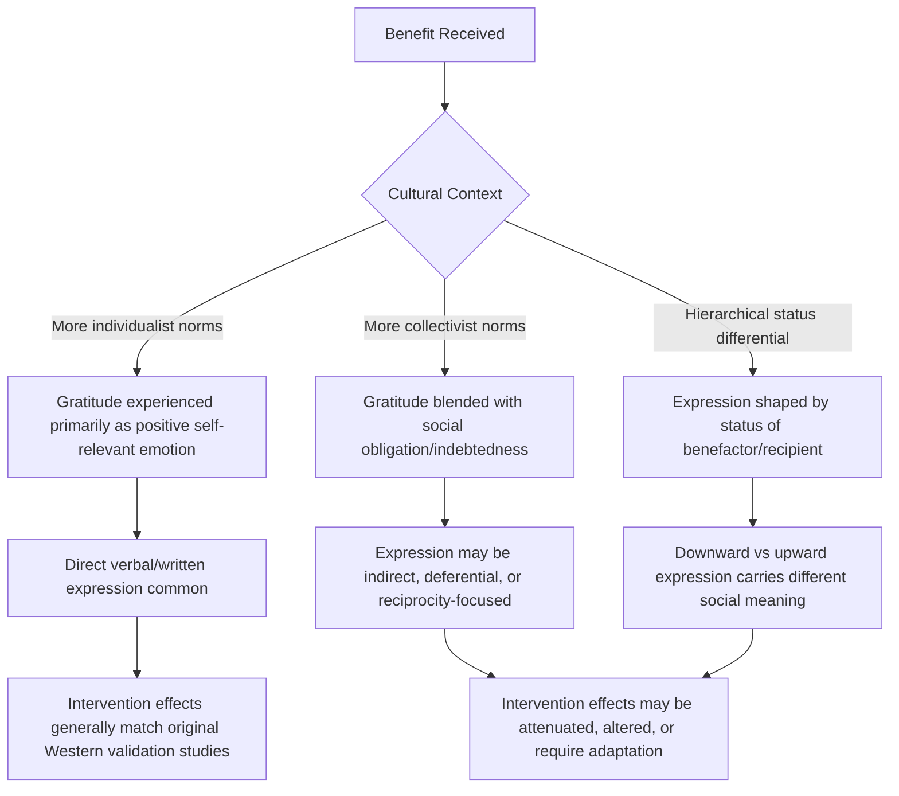

## Limits and Cultural Variation in Gratitude Practices

### Definition and Conceptual Overview

This topic examines the boundary conditions of gratitude's benefits and the ways cultural context shapes how gratitude is experienced, expressed, and evaluated. While earlier topics in this chapter established gratitude's structure, interventions, and relational and health benefits largely drawing on research conducted in Western, educated, industrialized, rich, and democratic (WEIRD) populations, this topic addresses the critical scholarly work examining where those findings do and do not generalize, and where gratitude practices can produce null, mixed, or even counterproductive effects.

**Key Points**

- Positive psychology as a field has faced sustained methodological critique for over-relying on WEIRD samples, and gratitude research is frequently cited as a specific case study within this broader critique.
- "Limits" in this context refers to two distinct issues: (1) boundary conditions under which gratitude interventions show reduced or null effects even within similar populations, and (2) cases where gratitude expression or practice interacts negatively with cultural, relational, or individual factors.
- Cultural variation research draws primarily on cross-cultural psychology frameworks, including individualism-collectivism theory and social dominance/hierarchy norms, to explain divergent patterns of gratitude experience and expression across societies.

### Cultural Variation in the Meaning and Function of Gratitude

**Individualist vs. Collectivist Contexts**

Research comparing gratitude across cultural contexts has found that the *meaning* attached to receiving help and expressing thanks differs systematically:

- In more individualist cultural contexts (commonly studied via North American and Western European samples), gratitude has often been studied and framed primarily as a positive, self-beneficial emotion tied to individual wellbeing enhancement.
- In more collectivist cultural contexts (commonly studied via East Asian samples, among others), receiving help can carry a stronger dimension of **indebtedness and social obligation** alongside or even overshadowing straightforward positive gratitude, because accepting help implicates one's position within a network of ongoing reciprocal social obligations.

[Inference: this individualism-collectivism framing is a widely used heuristic in cross-cultural psychology, but treating entire national or regional populations as internally homogeneous on this dimension is itself a simplification the literature increasingly cautions against; substantial within-culture variation exists alongside between-culture differences.]

**Example**

Comparative research (e.g., work by Yeung and colleagues, and earlier work by Naito and colleagues on Japanese samples) has found that in some East Asian cultural contexts, receiving a favor from someone of higher status can elicit a mixture of gratitude *and* a distinct sense of debt or discomfort (related to concepts sometimes discussed in relation to culturally specific terms for social indebtedness), a blended emotional experience less commonly reported or emphasized in North American gratitude research samples. [Inference: the precise weighting and cross-sample consistency of this blended-emotion finding varies across studies and specific cultural comparisons.]

### Gratitude and Social Hierarchy

Some research suggests gratitude expression is not culturally or socially neutral with respect to power and hierarchy:

- Expressing gratitude toward a lower-status individual (e.g., a subordinate or service worker) may be processed differently, and sometimes less naturally reciprocated with the same relational-bonding effect, compared to gratitude exchanged among status-equals.
- In some hierarchical organizational or cultural contexts, downward gratitude expression (from higher-status to lower-status individuals) may be perceived as a marker of good leadership, while upward gratitude expression (from lower-status to higher-status individuals) may be complicated by pre-existing obligations of deference, potentially blurring the line between genuine gratitude and expected social performance. [Speculation: the specific behavioral and relational consequences of these hierarchy interactions are less thoroughly mapped empirically than the basic finding that hierarchy is a relevant moderating factor.]

### Mechanism Diagram: Cultural Moderators of Gratitude Expression

### Limits Within Similar Populations: Boundary Conditions

Beyond cross-cultural variation, research has identified boundary conditions that limit gratitude intervention effectiveness even within broadly similar populations:

**Key Points**

- **Depression severity**: some studies suggest gratitude interventions show smaller or less reliable effects in individuals with more severe clinical depression, compared to subclinical or non-clinical samples, possibly because severe depressive cognitive patterns (e.g., anhedonia, negative attributional style) interfere with the intervention's core mechanism of generating and processing positive appraisals.
- **Coercive or externally imposed gratitude practice**: research on motivation more broadly (self-determination theory) suggests that gratitude practices experienced as externally mandated or obligatory (e.g., a workplace requiring gratitude journaling as a compliance exercise) may produce weaker or even reactance-driven negative effects compared to autonomously chosen practice. [Inference: this is a reasonable extrapolation from self-determination theory's general findings about autonomous versus controlled motivation, though direct experimental tests specifically isolating "mandated gratitude" as a condition are less numerous than the broader motivation literature this inference draws on.]
- **Comparison-based or guilt-inducing framing**: some critiques note that framing gratitude interventions around "you should be grateful because others have it worse" can produce guilt or invalidation rather than genuine positive affect, particularly for individuals experiencing genuine hardship; this framing is generally distinguished in careful protocol design from the empirically validated approach of neutral, specific, self-relevant positive-event noticing.
- **Toxic positivity concerns**: a broader critique, applicable to positive psychology practices generally and gratitude specifically, holds that excessive emphasis on gratitude and positive reframing can function to suppress or invalidate legitimate negative emotions, grief, or valid grievances about difficult circumstances, particularly if practiced rigidly or applied insensitively to serious adversity or injustice. [Speculation: the boundary between healthy gratitude practice and this "toxic positivity" pattern is a matter of clinical and theoretical judgment more than a precisely quantified empirical threshold.]

### Comparative Table: Contexts of Reduced or Complicated Efficacy

| Context | Pattern Observed | Proposed Explanation |
| --- | --- | --- |
| Severe clinical depression | Reduced/attenuated intervention effect | Negative cognitive style interferes with positive appraisal generation |
| Mandated/externally imposed practice | Weaker or reactance-driven effects | Undermines autonomous motivation (self-determination theory) |
| High collectivist/indebtedness norms | Gratitude blended with discomfort/obligation | Receiving help implicates ongoing social debt |
| Hierarchical status differentials | Complicated expression dynamics | Deference norms interact with genuine gratitude signaling |
| Acute grief or serious adversity | Risk of invalidation if framing is insensitive | "Toxic positivity" dynamic; suppresses legitimate negative affect |
| Comparison/guilt-based framing | Reduced or counterproductive effect | Elicits guilt rather than genuine positive appraisal |

### Methodological Critiques of the Broader Evidence Base

**Key Points**

- **WEIRD sample overrepresentation**: the large majority of foundational gratitude studies (Emmons and McCullough, Seligman and colleagues, Algoe, and much of the subsequent replication literature) were conducted with North American undergraduate or broadly Western samples, limiting confidence in the universality of specific effect sizes and even some theoretical mechanisms.
- **Translation and construct equivalence**: gratitude scales developed and validated in English (e.g., the GQ-6, discussed under gratitude's structure) require careful translation and cross-cultural validation before being assumed to measure an equivalent construct in other languages and cultural contexts; some cross-cultural validation work has found differing factor structures or item performance across language groups. [Unverified: the extent of measurement non-equivalence varies by specific instrument and language pair, and comprehensive cross-cultural psychometric validation is not available for all gratitude measures across all studied cultural contexts.]
- **Publication and funding bias toward positive findings**: as with other areas of positive psychology intervention research, there is a general concern about publication bias favoring studies that find positive effects, potentially inflating the apparent robustness and universality of gratitude intervention benefits documented in the published literature.

### Illustration: Evidence Generalizability Gradient

<svg xmlns="http://www.w3.org/2000/svg" viewBox="0 0 640 320" font-family="Helvetica, Arial, sans-serif">
<text x="320" y="26" font-size="16" font-weight="bold" text-anchor="middle" fill="#1a1a2e">Generalizability Gradient of Gratitude Research Findings (svg_diagram)</text>
<rect x="60" y="60" width="520" height="50" fill="#c8e6c9" opacity="0.85" rx="6" />
<text x="320" y="90" font-size="12" font-weight="bold" text-anchor="middle" fill="#1b5e20">Well-Replicated: General wellbeing/life satisfaction correlation</text>
<rect x="60" y="120" width="520" height="50" fill="#fff9c4" opacity="0.85" rx="6" />
<text x="320" y="150" font-size="12" font-weight="bold" text-anchor="middle" fill="#795548">Moderately Established, Some Cultural Moderation: Journaling/letter interventions</text>
<rect x="60" y="180" width="520" height="50" fill="#ffe0b2" opacity="0.85" rx="6" />
<text x="320" y="210" font-size="12" font-weight="bold" text-anchor="middle" fill="#e65100">Limited Cross-Cultural Validation: Specific effect sizes, biomarker findings</text>
<rect x="60" y="240" width="520" height="50" fill="#ffcdd2" opacity="0.85" rx="6" />
<text x="320" y="270" font-size="12" font-weight="bold" text-anchor="middle" fill="#b71c1c">Contested/Context-Dependent: Hierarchical and indebtedness dynamics</text>
</svg>

### Practical Implications for Applying Gratitude Practices

- **Cultural adaptation over direct transfer**: practitioners and researchers applying gratitude interventions outside the original validation populations are generally advised to adapt framing and delivery (e.g., emphasizing collective or relational benefit rather than purely individual happiness gains in more collectivist contexts) rather than assuming direct transferability.
- **Autonomy-supportive framing**: consistent with the boundary conditions noted above, practices are generally more effective when framed as voluntary, personally meaningful choices rather than mandated compliance exercises.
- **Sensitivity to context and severity**: practitioners are generally cautioned against applying standard gratitude protocols indiscriminately to populations experiencing acute grief, trauma, or serious systemic hardship without careful, sensitive framing that avoids minimizing legitimate distress.
- **Avoiding comparison-based framing**: protocols emphasizing specific, self-relevant positive events and their causes (as in the Three Good Things structure) are generally preferable to framings that invoke comparison to others' worse circumstances, based on the general critique that comparison-based gratitude framing risks inducing guilt rather than genuine positive affect.

### Conclusion

While gratitude's core benefits for wellbeing show reasonably broad support, the field has increasingly recognized that both the meaning of gratitude and the effectiveness of specific interventions are shaped by cultural context, social hierarchy, individual clinical status, and the voluntariness of practice. Collectivist cultural contexts may blend gratitude with indebtedness in ways not well captured by instruments and protocols developed in individualist Western samples, hierarchical relationships complicate straightforward expression dynamics, and rigid or insensitively framed gratitude practice risks tipping into invalidating "toxic positivity" rather than genuine wellbeing enhancement. These limitations do not undermine gratitude's documented benefits so much as they clarify the conditions under which those benefits reliably apply, reinforcing a broader methodological lesson for positive psychology regarding sample diversity and cultural humility in intervention design.

**Related Topics**

- WEIRD sample critique in psychological science
- Individualism-collectivism theory in cross-cultural psychology
- Self-determination theory and autonomous versus controlled motivation
- Toxic positivity and the limits of positive-emotion-focused interventions
- Cross-cultural psychometric validation methodology
- Social hierarchy and status effects on emotional expression
- Cultural adaptation frameworks for positive psychology interventions
- Indebtedness as a distinct construct from gratitude