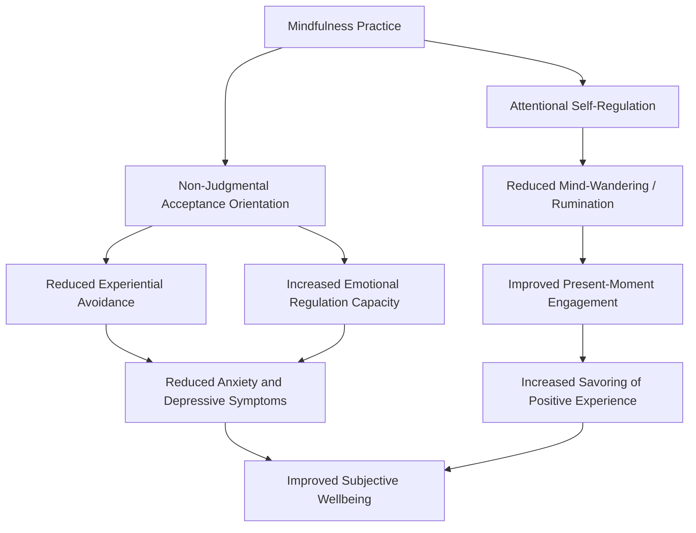

## Mindfulness-Based Approaches Within Positive Psychology

### Definition and Conceptual Overview

Mindfulness, within positive psychology, refers to the practice and dispositional capacity of paying deliberate, non-judgmental attention to present-moment experience — thoughts, bodily sensations, and the external environment — as it arises. While mindfulness originates in contemplative traditions, most prominently Buddhist meditation practice, its integration into positive psychology has proceeded largely through secularized, empirically operationalized frameworks developed within clinical and health psychology, most notably Jon Kabat-Zinn's Mindfulness-Based Stress Reduction (MBSR) program.

**Key Points**

- Positive psychology's interest in mindfulness centers on its function as a foundational capacity that supports several core wellbeing constructs: emotional regulation, attentional control, savoring, and reduced rumination.
- Mindfulness is studied both as a **trait** (dispositional mindfulness, varying stably across individuals) and as a **trainable state/skill** (cultivated through structured practice, typically meditation-based).
- The most widely used operational definition in the empirical literature (Kabat-Zinn) frames mindfulness as paying attention in a particular way: on purpose, in the present moment, and non-judgmentally.

### Historical Integration into Positive Psychology

Mindfulness entered mainstream Western clinical psychology substantially through Jon Kabat-Zinn's development of MBSR at the University of Massachusetts Medical School beginning in 1979, originally designed for chronic pain and stress-related medical conditions. Its subsequent adoption within positive psychology tracked a broader trend in the field toward integrating contemplative and Eastern psychological traditions with Western empirical methodology.

**Key Points**

- Mindfulness-Based Cognitive Therapy (MBCT), developed by Segal, Williams, and Teasdale, extended mindfulness training specifically for relapse prevention in recurrent depression, combining MBSR-style practice with cognitive therapy elements.
- Positive psychology researchers, including Ellen Langer (whose independent research tradition on mindfulness emphasizes novelty-seeking and reduced cognitive rigidity rather than meditation-based practice specifically), have contributed a parallel, less meditation-centric conceptualization sometimes termed "Western" or "cognitive" mindfulness, distinct from the meditation-based tradition associated with Kabat-Zinn.
- This has produced two partially distinct research traditions within the broader mindfulness literature: a **meditation-based tradition** (rooted in contemplative practice, measured via constructs like present-moment attention and acceptance) and a **cognitive-social tradition** (rooted in Langer's work, emphasizing active noticing of novel distinctions and reduced automatic/mindless processing).

### Two Traditions Compared

| Dimension | Meditation-Based Tradition (Kabat-Zinn) | Cognitive-Social Tradition (Langer) |
| --- | --- | --- |
| Origin | Buddhist contemplative practice, secularized | Social-cognitive psychology research program |
| Core mechanism | Present-moment, non-judgmental attention via meditation | Active novelty-seeking, reduced categorical/automatic thinking |
| Typical measurement | Trait mindfulness scales (e.g., MAAS, FFMQ) | Langer Mindfulness Scale |
| Typical intervention | Formal meditation practice (MBSR, MBCT) | Cognitive reframing, novelty exercises, perspective-taking |
| Primary application areas | Clinical psychology, stress reduction, emotion regulation | Organizational behavior, aging, creativity, education |

### Core Components of Mindfulness (Meditation-Based Tradition)

Bishop and colleagues' widely cited two-component operational model breaks mindfulness into:

1. **Self-regulation of attention**: sustaining attention on immediate present-moment experience, and flexibly redirecting attention back when it wanders (a skill often practiced through breath-focused or body-scan meditation).
2. **Orientation to experience**: an attitude of curiosity, openness, and acceptance toward whatever arises in awareness, rather than judgment, avoidance, or suppression.

### Mechanism Diagram: Mindfulness's Pathways to Wellbeing

### Relationship to Core Positive Psychology Constructs

**Savoring**

Mindfulness is theoretically and empirically linked to Fred Bryant's savoring construct: the capacity for present-moment attentional focus is considered a prerequisite for fully savoring positive experiences, since attention diverted to past regrets or future worries interferes with full engagement with a currently unfolding positive event.

**Emotional Regulation**

Mindfulness's non-judgmental, accepting orientation toward internal experience is theorized to support more adaptive emotional regulation strategies (e.g., cognitive reappraisal) and to reduce reliance on maladaptive strategies like suppression or avoidance, which are associated with poorer long-term emotional outcomes.

**Flow**

Some theoretical work has drawn connections between mindfulness and Mihaly Csikszentmihalyi's flow construct, noting both involve full present-moment attentional absorption, though the two are distinguished by flow's association with goal-directed, skill-challenge-balanced activity engagement, whereas mindfulness is typically practiced without a specific external task-performance goal. [Inference: the precise theoretical relationship between mindfulness and flow — whether one is a component, precursor, or simply a related-but-separate construct relative to the other — is not fully settled in the literature.]

**Character Strengths**

Mindfulness overlaps conceptually with several strengths in the VIA Classification of Character Strengths and Virtues (discussed elsewhere in the broader syllabus), particularly self-regulation and, in the cognitive-social tradition, curiosity/love of learning.

### Standard Mindfulness-Based Program Structures

**Mindfulness-Based Stress Reduction (MBSR)**

- Standard format: 8-week structured group program
- Core practices: body scan meditation, sitting meditation, gentle mindful movement/yoga
- Typical session length: weekly 2.5-hour group sessions plus an all-day retreat session, with daily home practice (commonly 30-45 minutes)

**Mindfulness-Based Cognitive Therapy (MBCT)**

- Standard format: 8-week structured group program, closely modeled on MBSR's structure
- Distinguishing feature: integrates cognitive therapy techniques specifically targeting the ruminative thought patterns associated with depressive relapse
- Primary validated application: relapse prevention for individuals with a history of three or more depressive episodes

### Measurement Instruments

| Instrument | Tradition | What It Measures |
| --- | --- | --- |
| Mindful Attention Awareness Scale (MAAS) | Meditation-based | General dispositional present-moment attention |
| Five Facet Mindfulness Questionnaire (FFMQ) | Meditation-based | Five facets: observing, describing, acting with awareness, non-judging, non-reactivity |
| Langer Mindfulness Scale | Cognitive-social | Novelty-seeking, engagement, novelty-producing |
| Toronto Mindfulness Scale | Meditation-based | State mindfulness during/after a specific meditation session |

### Empirical Outcomes Associated with Mindfulness Practice

Across a substantial body of randomized controlled trials and meta-analyses, mindfulness-based programs (particularly MBSR and MBCT) have been associated with:

- Reduced perceived stress and anxiety symptoms
- Reduced relapse rates in recurrent depression (specifically for MBCT, in individuals with three or more prior episodes)
- Improved emotional regulation and reduced reactivity to negative stimuli in several experimental paradigms
- Modest improvements in attentional control and working memory in some studies
- Associations with structural and functional brain changes in regions related to attention and emotion regulation in a subset of neuroimaging studies

[Inference: as with many psychological intervention literatures, effect sizes vary considerably by outcome measure, population, and study quality, and some meta-analyses have raised methodological concerns — including inconsistent control-group designs and variable practice adherence measurement — that suggest some caution in interpreting the uniformly positive picture sometimes presented in popular accounts of mindfulness research.]

### Illustration: The Two-Component Model of Mindfulness

<svg xmlns="http://www.w3.org/2000/svg" viewBox="0 0 640 320" font-family="Helvetica, Arial, sans-serif">
<text x="320" y="26" font-size="16" font-weight="bold" text-anchor="middle" fill="#1a1a2e">Two-Component Model of Mindfulness (svg_diagram)</text>
<circle cx="320" cy="180" r="90" fill="none" stroke="#555" stroke-width="2" stroke-dasharray="4,3" />
<text x="320" y="180" font-size="13" font-weight="bold" text-anchor="middle" fill="#333">Mindfulness</text>
<circle cx="220" cy="140" r="90" fill="#bbdefb" opacity="0.6" />
<text x="180" y="110" font-size="12" font-weight="bold" text-anchor="middle" fill="#0d47a1">Self-Regulation</text>
<text x="180" y="126" font-size="12" font-weight="bold" text-anchor="middle" fill="#0d47a1">of Attention</text>
<text x="180" y="145" font-size="10" text-anchor="middle" fill="#0d47a1">Sustained present-moment</text>
<text x="180" y="158" font-size="10" text-anchor="middle" fill="#0d47a1">focus, flexible redirection</text>
<circle cx="420" cy="140" r="90" fill="#c8e6c9" opacity="0.6" />
<text x="460" y="110" font-size="12" font-weight="bold" text-anchor="middle" fill="#1b5e20">Orientation to</text>
<text x="460" y="126" font-size="12" font-weight="bold" text-anchor="middle" fill="#1b5e20">Experience</text>
<text x="460" y="145" font-size="10" text-anchor="middle" fill="#1b5e20">Curiosity, openness,</text>
<text x="460" y="158" font-size="10" text-anchor="middle" fill="#1b5e20">non-judgment, acceptance</text>
</svg>

### Practical Applications and Exercises

**Example: Brief Body Scan**

A commonly used introductory mindfulness exercise involves systematically directing attention through different regions of the body (typically starting at the feet and moving upward), noticing physical sensations without judgment or the intent to change them, and gently redirecting attention back to the body whenever it wanders to thoughts or planning.

**Example: Three-Minute Breathing Space**

A brief MBCT-derived exercise structured in three stages: (1) briefly noticing current thoughts, feelings, and sensations; (2) narrowing attention exclusively to the breath; (3) broadening attention back out to the whole body while maintaining a mindful, accepting stance. This is designed as a portable, brief practice usable during a busy day, distinct from longer formal seated meditation sessions.

**Example: Mindful Eating**

A common introductory exercise involves eating a small piece of food (traditionally a raisin in the classic MBSR exercise) with full sensory attention — noticing texture, smell, and taste in detail — as a concrete, accessible entry point for practicing present-moment, non-judgmental attention.

### Limitations and Considerations

- **Practice adherence and dosage variability**: real-world adherence to recommended daily home practice varies considerably across studies and individuals, complicating dose-response conclusions about how much practice is needed for reliable benefit.
- **Not universally appropriate**: some clinical guidance cautions that certain individuals, particularly those with certain trauma histories or specific psychiatric conditions, may experience adverse reactions to intensive meditation practice (e.g., increased distress or dissociation), and structured programs increasingly incorporate trauma-informed modifications. [Inference: the prevalence and severity of such adverse reactions across the general population practicing standard mindfulness programs appears to be a minority pattern relative to the largely positive outcome literature, but this is an active area of clinical safety research rather than a fully quantified risk profile.]
- **Secularization debate**: some scholars and practitioners from contemplative traditions have raised concerns that clinical/positive-psychology operationalizations of mindfulness strip the practice of its original ethical and philosophical context, potentially altering its function or long-term developmental trajectory compared to traditional practice. [Speculation: the practical and outcome-related significance of this decontextualization, as opposed to being primarily a philosophical or ethical concern, is debated and not conclusively resolved empirically.]

### Conclusion

Mindfulness has been integrated into positive psychology as both a trainable skill and a stable disposition that underlies key wellbeing capacities, including emotional regulation, reduced rumination, and savoring of positive experience. Two partially distinct traditions — Kabat-Zinn's meditation-based clinical tradition and Langer's cognitive-social tradition — offer complementary but non-identical accounts of the construct's mechanisms and applications. Structured programs like MBSR and MBCT represent the most empirically validated delivery formats, with a substantial evidence base supporting benefits for stress, anxiety, and depressive relapse prevention, while ongoing scholarly discussion continues to address questions of dosage, individual suitability, and the implications of secularizing a practice with deep contemplative roots.

**Related Topics**

- Jon Kabat-Zinn and the development of MBSR
- Mindfulness-Based Cognitive Therapy (MBCT) for depression relapse prevention
- Ellen Langer's cognitive-social mindfulness research program
- Fred Bryant's savoring theory and its relationship to present-moment attention
- Flow theory (Mihaly Csikszentmihalyi) and its relationship to mindfulness
- Self-compassion practices (Kristin Neff) as a related contemplative-derived construct
- Acceptance and Commitment Therapy (ACT) and psychological flexibility
- Measurement instruments: MAAS, FFMQ, Langer Mindfulness Scale