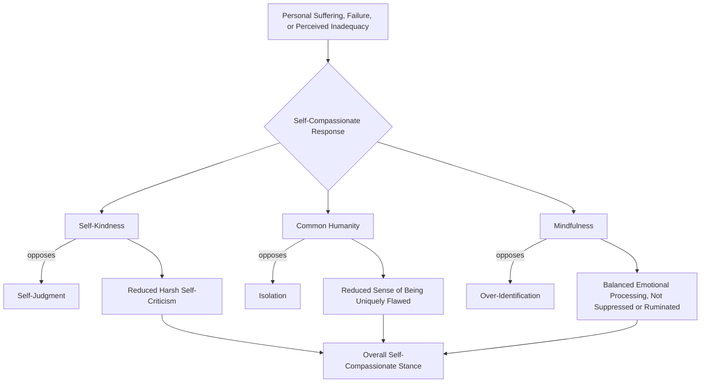

## Self-Compassion: Self-Kindness, Common Humanity, and Mindfulness

### Definition and Conceptual Overview

Self-compassion is a construct developed and empirically operationalized primarily by Kristin Neff, defined as the practice of extending the same warmth, understanding, and care toward oneself during moments of suffering, failure, or perceived inadequacy that one would naturally extend to a good friend in similar circumstances. Neff's model formalizes self-compassion as a tripartite construct composed of three interacting component pairs, each spanning a compassionate response versus its corresponding maladaptive counterpart.

**Key Points**

- Self-compassion is explicitly distinguished in the foundational literature from self-esteem: self-esteem is typically contingent on positive self-evaluation and often involves social comparison, whereas self-compassion is theorized to be available unconditionally, including in moments of failure when self-esteem is most likely to be threatened.
- The construct draws on Buddhist psychological concepts (particularly related to compassion and the recognition of shared suffering) but, like mindfulness, has been operationalized and validated within a secular, empirical Western psychological research framework.
- Self-compassion is measured primarily via Neff's Self-Compassion Scale (SCS), which yields both an overall score and six subscale scores corresponding to the three component pairs described below.

### The Three Core Components

**1. Self-Kindness vs. Self-Judgment**

Self-kindness involves treating oneself with warmth, understanding, and gentleness when confronting personal failures or difficulties, rather than harshly criticizing or judging oneself. Self-judgment, its opposing pole, involves critical, punitive self-evaluation in response to perceived shortcomings.

**2. Common Humanity vs. Isolation**

Common humanity involves recognizing that suffering, failure, and imperfection are part of the shared human experience — that one is not alone or uniquely flawed in struggling — rather than feeling isolated by one's difficulties, as though one's suffering separates and marks one as different from others.

**3. Mindfulness vs. Over-Identification**

In Neff's model, mindfulness refers specifically to holding one's painful thoughts and feelings in balanced, non-judgmental awareness, rather than either suppressing/avoiding them or becoming over-identified with them (i.e., being swept up in and consumed by exaggerated, ruminative negative narratives about the difficulty).

**Key Points**

- These three components are theorized to interact and mutually reinforce one another, rather than operating as fully independent factors; Neff's model presents them as combining to form a holistic self-compassionate response to suffering.
- The "mindfulness" component here is a more specific application of general mindfulness (covered separately in this chapter) to the particular context of one's own distress and self-related pain, rather than referring to mindfulness in all contexts broadly.

### Structural Diagram: The Three Components

### Self-Compassion vs. Self-Esteem: A Critical Distinction

| Dimension | Self-Esteem | Self-Compassion |
| --- | --- | --- |
| Basis | Often contingent on positive self-evaluation, achievement, or comparison | Available unconditionally, regardless of performance |
| Behavior under failure | May decrease sharply; can trigger defensive self-enhancement | Theorized to remain accessible; encourages honest self-assessment |
| Relationship to social comparison | Frequently comparative (better/worse than others) | Explicitly non-comparative; grounded in common humanity |
| Risk of maladaptive variants | Associated with narcissism or defensive aggression at high, contingent levels in some research | Not associated with narcissism in the empirical literature to the same degree |
| Stability | Can fluctuate significantly with daily events and feedback | Theorized and found in several studies to be relatively more stable across varying circumstances |

[Inference: this comparative table reflects the general theoretical framing advanced by Neff and supported by a substantial body of subsequent research, though direct head-to-head comparative findings vary somewhat by specific outcome measured and study design.]

### Empirical Correlates of Self-Compassion

Research using the Self-Compassion Scale and related measures has found self-compassion associated with:

- Lower levels of anxiety and depressive symptoms across numerous studies and several meta-analyses
- Greater emotional resilience following failure or setback experiences
- Reduced fear of failure and, in some studies, increased willingness to take on challenging goals (partly because failure feels less identity-threatening)
- Higher life satisfaction and overall subjective wellbeing
- Improved body image and reduced disordered eating attitudes in several studies [Note: self-compassion is studied here as a protective correlate; it is not itself a treatment for diagnosed eating disorders.]
- Greater relationship satisfaction in some studies, theorized to relate to reduced defensive reactivity during relational conflict

[Inference: as with most positive psychology constructs, the majority of these findings derive from correlational and cross-sectional designs, with a smaller subset of experimental/intervention studies providing more direct causal evidence; effect sizes vary by outcome and population.]

### Self-Compassion and Motivation: Addressing a Common Misconception

A frequently raised concern is that self-compassion might reduce motivation or accountability by allowing people to excuse poor behavior or performance. Neff's research program has directly addressed this concern:

**Key Points**

- Studies comparing self-compassionate responses to self-critical responses following failure have found that self-compassion is associated with *greater*, not reduced, motivation to improve and take responsibility for mistakes, compared to harsh self-criticism.
- The proposed mechanism is that self-criticism often triggers a threat-defense response (shame, avoidance, defensiveness) that interferes with honest self-assessment and constructive behavior change, whereas self-compassion is theorized to reduce this defensive reactivity, making it psychologically safer to acknowledge and learn from mistakes.
- This has led to a distinction in the literature between self-compassion and **self-indulgence** or **self-pity**: self-compassion is explicitly conceptualized as including honest acknowledgment of one's role in a difficulty (compatible with accountability), whereas self-indulgence or self-pity are considered distinct, less adaptive patterns not equivalent to genuine self-compassion as operationalized in Neff's model. [Inference: while this distinction is clearly articulated in the theoretical literature, empirically disentangling genuine self-compassion from self-indulgent responses in all real-world contexts can be more difficult than the clean conceptual distinction suggests.]

### Self-Compassion Interventions

**Mindful Self-Compassion (MSC) Program**

Developed by Kristin Neff and Christopher Germer, this is the most widely implemented structured intervention, typically delivered as an 8-week group program combining meditation, informal practices, and group discussion, explicitly designed to build all three components of the tripartite model.

**Example: Self-Compassion Break**

A brief, portable practice used within MSC and related protocols, typically structured around three phrases corresponding to the three components:

1. Acknowledging the difficulty mindfully ("This is a moment of suffering" — corresponding to the mindfulness component)
2. Recognizing common humanity ("Suffering is part of life; I am not alone in this" — corresponding to common humanity)
3. Offering self-kindness (a personally meaningful kind phrase directed at oneself, e.g., "May I be kind to myself in this moment" — corresponding to self-kindness)

**Example: Self-Compassionate Letter Writing**

Participants write a letter to themselves from the perspective of an unconditionally loving, understanding friend, addressing a specific personal struggle or perceived flaw, as a structured way of practicing the perspective-shift central to self-compassion.

### Illustration: Self-Compassion Break Structure

<svg xmlns="http://www.w3.org/2000/svg" viewBox="0 0 640 340" font-family="Helvetica, Arial, sans-serif">
<text x="320" y="26" font-size="16" font-weight="bold" text-anchor="middle" fill="#1a1a2e">The Self-Compassion Break (svg_diagram)</text>
<rect x="60" y="55" width="520" height="75" rx="8" fill="#bbdefb" opacity="0.85" />
<text x="80" y="80" font-size="12" font-weight="bold" fill="#0d47a1">1. Mindfulness</text>
<text x="80" y="100" font-size="11" fill="#0d47a1">"This is a moment of suffering."</text>
<text x="80" y="116" font-size="10" font-style="italic" fill="#1565c0">Acknowledge the difficulty without suppression or exaggeration</text>
<rect x="60" y="140" width="520" height="75" rx="8" fill="#c8e6c9" opacity="0.85" />
<text x="80" y="165" font-size="12" font-weight="bold" fill="#1b5e20">2. Common Humanity</text>
<text x="80" y="185" font-size="11" fill="#1b5e20">"Suffering is part of life. I am not alone."</text>
<text x="80" y="201" font-size="10" font-style="italic" fill="#2e7d32">Connect this struggle to shared human experience</text>
<rect x="60" y="225" width="520" height="75" rx="8" fill="#ffe0b2" opacity="0.85" />
<text x="80" y="250" font-size="12" font-weight="bold" fill="#e65100">3. Self-Kindness</text>
<text x="80" y="270" font-size="11" fill="#e65100">"May I be kind to myself right now."</text>
<text x="80" y="286" font-size="10" font-style="italic" fill="#ef6c00">Offer a warm, personally meaningful phrase to oneself</text>
</svg>

### Relationship to Other Constructs in This Chapter

- **Mindfulness (general)**: self-compassion's mindfulness component is a specific, self-directed application of the broader mindfulness capacity discussed elsewhere in this chapter; general mindfulness training may support but does not automatically produce self-compassion, since one can be mindfully aware of a difficulty while still responding with self-judgment rather than kindness.
- **Acceptance**: self-compassion overlaps conceptually with psychological acceptance (relevant to Acceptance and Commitment Therapy, discussed elsewhere in this chapter) in that both involve a non-avoidant, non-suppressive stance toward difficult internal experience, though self-compassion adds the specific relational/kindness orientation toward the self that acceptance frameworks do not always foreground as centrally.
- **Resilience**: self-compassion is frequently studied as a resilience-supporting resource, theorized to buffer the impact of setbacks by reducing the self-critical amplification of failure that can otherwise compound distress and impede recovery and adaptive coping.

### Limitations and Considerations

- **Cultural variation**: as with other constructs in this syllabus, most foundational self-compassion research derives from Western samples; cross-cultural research suggests some variation in baseline self-compassion levels and possibly in how self-directed kindness is culturally interpreted, though the tripartite structure has shown reasonable cross-cultural measurement validity in a number of translated and validated scale versions. [Inference: cross-cultural validation is more extensive for self-compassion than for some other constructs discussed in this syllabus, but is not yet exhaustive across all cultural and linguistic contexts.]
- **Self-report measurement concerns**: some methodologists have raised concerns about the negatively worded items on the original Self-Compassion Scale (which assess self-judgment, isolation, and over-identification) potentially conflating low self-compassion with general psychological distress or negative affectivity, prompting some subsequent psychometric refinement work. [Unverified: the degree to which this measurement concern meaningfully affects the substantive conclusions of the broader self-compassion literature, as opposed to being a more technical psychometric refinement issue, is still debated among researchers in this area.]
- **Distinguishing genuine self-compassion from avoidance**: as noted above, distinguishing adaptive self-compassion from self-indulgence or avoidance-motivated self-soothing can be conceptually clear but practically nuanced, and requires attention to whether accountability and honest self-assessment remain present alongside the kindness component.

### Conclusion

Self-compassion, as formalized by Kristin Neff, offers a structured alternative to self-esteem-based approaches to self-regard, built on three interacting components — self-kindness, common humanity, and mindfulness — each paired against a corresponding maladaptive counterpart. Its empirical correlates span reduced anxiety and depressive symptoms, greater resilience following failure, and, notably, increased rather than decreased motivation and accountability, directly countering common misconceptions that self-compassion promotes complacency. As a construct bridging contemplative tradition and empirical psychological science, self-compassion has become a central pillar of positive psychology's approach to how individuals relate to their own suffering and imperfection.

**Related Topics**

- Kristin Neff's Self-Compassion Scale (SCS) and its subscales
- Mindful Self-Compassion (MSC) program (Neff and Germer)
- Self-esteem research and its critiques (contingent self-worth, narcissism)
- Mindfulness-based approaches within positive psychology
- Acceptance and Commitment Therapy (ACT) and psychological flexibility
- Shame and self-criticism research in clinical psychology
- Resilience theory and self-compassion as a protective factor
- Cross-cultural validation of self-compassion measurement