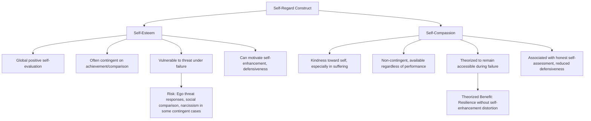

## Self-Compassion Versus Self-Esteem

### Definition and Conceptual Overview

This topic examines the theoretical and empirical distinction between self-compassion and self-esteem as two related but structurally different approaches to self-regard within positive psychology. While both constructs concern how individuals relate to and evaluate themselves, they differ fundamentally in their basis, stability, and behavioral consequences — a distinction most systematically developed and empirically tested by Kristin Neff and colleagues, often explicitly in contrast to the decades of prior self-esteem research that had previously dominated discussions of healthy self-regard.

**Key Points**

- **Self-esteem** is typically defined as a global evaluation of one's own worth, often operationalized as the degree to which a person likes, values, or feels positively about themselves.
- **Self-compassion** is defined as an orientation of kindness, common humanity, and mindful awareness directed toward oneself, particularly activated during moments of suffering or perceived failure, and is explicitly framed by Neff as not requiring positive self-evaluation at all.
- This distinction emerged partly as a corrective response to critiques of the self-esteem movement, which by the 1990s and 2000s had accumulated substantial empirical evidence of a more complicated and sometimes counterproductive picture than earlier decades of self-esteem-boosting educational and therapeutic programs had assumed.

### The Self-Esteem Movement and Its Critiques

Beginning roughly in the 1970s-1980s, a broad cultural and educational movement emphasized building self-esteem — often through unconditional praise, participation trophies, and general positive feedback — based on the assumption that higher self-esteem would produce better academic performance, reduced aggression, and improved life outcomes.

**Key Points**

- Subsequent rigorous research, notably reviews by Roy Baumeister and colleagues (2003), found that the causal benefits of self-esteem were considerably more limited and complicated than the earlier movement had assumed; high self-esteem was found to correlate with, but not clearly and reliably cause, many of the outcomes it had been promoted to produce.
- Research identified that self-esteem's benefits depend heavily on whether it is **contingent** (dependent on meeting specific standards, achievements, or external validation) or **non-contingent/secure** (stable regardless of specific successes or failures) — with contingent self-esteem showing more problematic associations.
- High but contingent or unstable self-esteem has been associated in some research with defensive aggression when threatened, and with certain narcissistic traits, whereas this problematic pattern is not found to the same degree in self-compassion research. [Inference: this contingent-versus-secure distinction within the self-esteem literature itself, not self-compassion research alone, was a significant driver of the broader field's move toward alternative constructs like self-compassion.]

### Core Structural Differences

### Comparative Analysis Across Key Dimensions

| Dimension | Self-Esteem | Self-Compassion |
| --- | --- | --- |
| **Basis of positive self-regard** | Evaluation of self as good/worthy, often via achievement or comparison | Kindness and understanding extended to self regardless of evaluation |
| **Availability during failure** | Often decreases when performance falls short | Theorized and found in several studies to remain relatively accessible |
| **Relationship to social comparison** | Frequently comparative; "better than average" effects well documented | Explicitly non-comparative; grounded in common humanity rather than relative standing |
| **Association with narcissism** | Some research links certain contingent/unstable forms to narcissistic traits | Generally not associated with narcissism in the empirical literature |
| **Response to personal failure** | May trigger denial, blame externalization, or defensive self-enhancement | Theorized to support honest acknowledgment and accountability |
| **Stability across circumstances** | Can fluctuate substantially with daily events, feedback, and comparisons | Found in several studies to be comparatively more stable |
| **Primary measurement instrument** | Rosenberg Self-Esteem Scale (most widely used) | Self-Compassion Scale (Neff) |
| **Theoretical relationship to achievement striving** | Often intertwined with achievement and external validation | Theorized to support striving without making self-worth contingent on outcomes |

[Inference: this table synthesizes the general theoretical framing found across Neff's foundational work and the subsequent comparative literature; specific effect sizes and the strength of each contrast vary across individual studies, populations, and the particular self-esteem measure or subtype used for comparison.]

### Empirical Comparative Findings

Direct empirical comparisons between self-esteem and self-compassion (frequently using both the Rosenberg Self-Esteem Scale and Neff's Self-Compassion Scale in the same samples) have generally found:

- Both constructs show positive associations with subjective wellbeing and negative associations with depression and anxiety, indicating substantial overlap in some outcomes.
- Self-compassion, but not self-esteem, has been found in several studies to remain a significant predictor of wellbeing even after controlling for social comparison tendencies, suggesting self-compassion's benefits are less dependent on favorable relative standing.
- Self-compassion has shown weaker or non-significant associations with narcissism and self-enhancement bias in studies where self-esteem (particularly certain subtypes) shows stronger positive associations with these more problematic patterns.
- In academic and achievement-related contexts, self-compassion (rather than self-esteem) has been associated in some studies with more adaptive responses to failure, including greater willingness to retry difficult tasks and reduced fear of failure. [Inference: this pattern is theoretically consistent with self-compassion's non-contingent structure, though the comparative literature isolating this specific mechanism against self-esteem directly is smaller than the broader self-compassion outcome literature generally.]

### Illustration: Divergent Responses to Failure

<svg xmlns="http://www.w3.org/2000/svg" viewBox="0 0 640 380" font-family="Helvetica, Arial, sans-serif">
<text x="320" y="26" font-size="16" font-weight="bold" text-anchor="middle" fill="#1a1a2e">Divergent Responses to Personal Failure (svg_diagram)</text>
<rect x="40" y="60" width="270" height="30" fill="#1a1a2e" />
<text x="175" y="80" font-size="13" font-weight="bold" text-anchor="middle" fill="white">Contingent Self-Esteem Pathway</text>
<rect x="40" y="100" width="270" height="55" rx="6" fill="#ffcdd2" />
<text x="175" y="122" font-size="11" text-anchor="middle" fill="#b71c1c">Failure threatens self-worth</text>
<text x="175" y="140" font-size="11" text-anchor="middle" fill="#b71c1c">directly ("I am not good")</text>
<rect x="40" y="170" width="270" height="55" rx="6" fill="#ffe0b2" />
<text x="175" y="192" font-size="11" text-anchor="middle" fill="#e65100">Defensive response:</text>
<text x="175" y="210" font-size="11" text-anchor="middle" fill="#e65100">denial, blame, avoidance</text>
<rect x="40" y="240" width="270" height="55" rx="6" fill="#f8bbd0" />
<text x="175" y="262" font-size="11" text-anchor="middle" fill="#880e4f">Reduced honest self-</text>
<text x="175" y="280" font-size="11" text-anchor="middle" fill="#880e4f">assessment and learning</text>
<rect x="330" y="60" width="270" height="30" fill="#1b5e20" />
<text x="465" y="80" font-size="13" font-weight="bold" text-anchor="middle" fill="white">Self-Compassion Pathway</text>
<rect x="330" y="100" width="270" height="55" rx="6" fill="#c8e6c9" />
<text x="465" y="122" font-size="11" text-anchor="middle" fill="#1b5e20">Failure acknowledged mindfully,</text>
<text x="465" y="140" font-size="11" text-anchor="middle" fill="#1b5e20">without exaggeration or denial</text>
<rect x="330" y="170" width="270" height="55" rx="6" fill="#bbdefb" />
<text x="465" y="192" font-size="11" text-anchor="middle" fill="#0d47a1">Self-kindness reduces</text>
<text x="465" y="210" font-size="11" text-anchor="middle" fill="#0d47a1">shame-driven defensiveness</text>
<rect x="330" y="240" width="270" height="55" rx="6" fill="#d1c4e9" />
<text x="465" y="262" font-size="11" text-anchor="middle" fill="#4527a0">Increased capacity for honest</text>
<text x="465" y="280" font-size="11" text-anchor="middle" fill="#4527a0">self-assessment and improvement</text>
</svg>

### Practical and Applied Implications

**Key Points**

- **Educational settings**: the shift in emphasis from self-esteem-boosting (e.g., unconditional praise) toward self-compassion-oriented approaches (e.g., teaching students to respond to academic setbacks with self-kindness and recognition of common struggle) reflects this comparative research, aiming to avoid the documented pitfalls of contingent self-esteem inflation.
- **Therapeutic contexts**: self-compassion-based interventions (e.g., Mindful Self-Compassion, discussed in the companion topic on self-compassion's components) are increasingly used as an alternative or complement to more traditional self-esteem-building therapeutic techniques, particularly for clients whose self-worth has become excessively tied to specific achievements or external approval.
- **Athletic and performance coaching**: some applied sport and performance psychology literature has begun incorporating self-compassion training explicitly to address performance anxiety and fear of failure without relying on inflated self-esteem framing, which the underlying research suggests may not durably protect against setback-related distress.

### Points of Convergence and Remaining Overlap

Despite the emphasized distinctions, the two constructs are not fully independent, and some important nuances qualify a purely oppositional framing:

- Some researchers have argued that **secure, non-contingent self-esteem** (as opposed to contingent self-esteem) shares substantial conceptual and functional overlap with self-compassion, suggesting the sharper contrast in the literature is most accurate specifically when comparing self-compassion against *contingent* self-esteem, rather than against all forms of self-esteem uniformly. [Inference: this nuance is present in more careful treatments of the comparative literature but is sometimes flattened in popular or simplified presentations that treat "self-esteem" as a single monolithic construct.]
- Both constructs show meaningful positive correlations with each other in most studies measuring them concurrently, indicating that individuals high in self-compassion also tend to report reasonably healthy self-esteem, even though the theoretical mechanisms proposed for each construct's benefits differ.
- The comparative critique of self-esteem is most strongly supported for its more problematic subtypes and delivery methods (e.g., unconditional praise disconnected from actual behavior or effort) rather than constituting a wholesale rejection of positive self-regard as a construct.

### Limitations and Considerations

- **Measurement and construct overlap concerns**: because self-esteem and self-compassion scales share some conceptual territory and are both self-report instruments, some of their comparative predictive differences could partly reflect measurement artifacts (e.g., item wording, shared method variance) rather than purely representing distinct underlying psychological mechanisms. [Speculation: the degree to which measurement artifacts versus genuine construct differences account for the comparative empirical findings has not been fully and definitively disentangled in the literature.]
- **Cultural and developmental variation**: most comparative research derives from Western adult and student samples; the relative importance and cultural framing of self-esteem versus self-compassion-oriented approaches to self-regard may vary across developmental stages and cultural contexts, an area of less extensive comparative cross-cultural investigation than either construct's within-culture literature.
- **Not a strict either/or framing**: contemporary applied guidance generally does not recommend abandoning healthy self-regard broadly, but rather cautions specifically against building self-worth on a narrowly contingent, comparison-based foundation, positioning self-compassion as a complementary or alternative foundation rather than requiring wholesale rejection of self-esteem as a concept.

### Conclusion

The comparative literature on self-compassion versus self-esteem represents one of positive psychology's clearer conceptual refinements: while both constructs relate to healthy self-regard and correlate with wellbeing, self-esteem's frequently contingent, comparison-based structure exposes it to instability and defensive reactivity under failure, whereas self-compassion's non-contingent, kindness-and-common-humanity-based structure is theorized and empirically supported to remain more consistently accessible and to support rather than undermine honest self-assessment and accountability. This distinction has meaningfully shaped applied practice in educational, therapeutic, and performance contexts, though careful readings of the literature note that the sharpest contrasts hold specifically against *contingent* forms of self-esteem rather than against secure self-regard as a category entirely.

**Related Topics**

- Kristin Neff's tripartite model of self-compassion (self-kindness, common humanity, mindfulness)
- Contingent versus non-contingent/secure self-esteem research
- Baumeister and colleagues' critique of the self-esteem movement (2003)
- Narcissism and unstable high self-esteem research
- Rosenberg Self-Esteem Scale and its psychometric history
- Applications of self-compassion in educational settings
- Fear of failure and achievement motivation research
- Mindful Self-Compassion (MSC) program applications