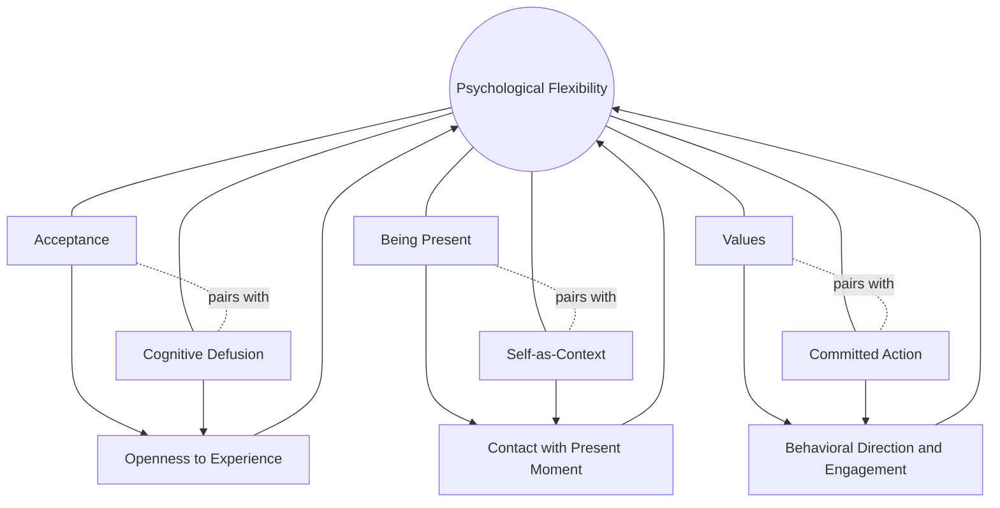

## Acceptance and Commitment Therapy's Connection to Flourishing

### Definition and Conceptual Overview

Acceptance and Commitment Therapy (ACT, typically pronounced as the word "act" rather than spelled out) is a behavior therapy developed primarily by Steven Hayes, along with Kirk Strosahl and Kelly Wilson, grounded in Relational Frame Theory (a behavioral account of human language and cognition). While ACT originated within clinical/behavioral psychology rather than positive psychology proper, its explicit focus on **psychological flexibility** and values-based living creates substantial theoretical overlap with positive psychology's concern for flourishing, making it a significant point of cross-disciplinary connection covered in this chapter.

**Key Points**

- ACT's central organizing construct is **psychological flexibility**: the capacity to contact the present moment fully, without unnecessary defense, and to persist in or change behavior in the service of chosen values.
- Unlike traditional cognitive-behavioral approaches that often aim to reduce or eliminate negative thoughts and feelings directly, ACT explicitly aims to change one's *relationship* to difficult internal experiences, promoting acceptance of them rather than struggle against them, while behavior change is directed toward value-consistent action.
- The connection to flourishing arises because ACT's endpoint is not symptom reduction alone but a rich, meaningful, values-directed life — a goal structurally similar to positive psychology's broader definitions of flourishing, even though ACT was developed within a clinical treatment tradition rather than a positive psychology research program.

### The Hexaflex Model of Psychological Flexibility

ACT's core theoretical model, often depicted as a hexagon (the "hexaflex"), comprises six interrelated processes theorized to jointly produce psychological flexibility:

1. **Acceptance**: actively embracing difficult private experiences (thoughts, feelings, sensations) without unnecessary attempts to avoid, suppress, or control them.
2. **Cognitive defusion**: changing the way one relates to one's own thoughts, observing them as passing mental events rather than literal truths that must dictate behavior.
3. **Being present**: flexible, non-judgmental contact with the current moment, closely related to mindfulness as discussed elsewhere in this chapter.
4. **Self-as-context**: developing a stable sense of self as the observing perspective from which experiences are noticed, distinct from the constantly changing content of one's thoughts and feelings (sometimes contrasted with "self-as-content").
5. **Values**: clarifying what genuinely matters to the individual across life domains, serving as chosen directions rather than fixed goals to be achieved and completed.
6. **Committed action**: taking concrete, values-consistent behavioral steps, even when doing so involves discomfort, setbacks, or the presence of difficult internal experiences.

### Diagram: The Hexaflex Model

**Key Points**

- The six processes are typically grouped into three broader functional pairs: **openness** (acceptance + defusion), **awareness/centering** (present-moment contact + self-as-context), and **engagement** (values + committed action).
- Psychological inflexibility, ACT's contrasting pathological construct, is characterized by experiential avoidance, cognitive fusion (treating thoughts as literal truths), rigid attachment to a conceptualized self, disconnection from values, and inaction or impulsive/avoidant behavior patterns.

### The Values-Flourishing Connection

**Key Points**

- ACT's treatment of **values** distinguishes them explicitly from goals: values are ongoing chosen life directions (e.g., "being a caring parent") that can never be fully completed or "achieved" in the way a discrete goal can (e.g., "attend my child's recital"), while goals serve as concrete markers of movement in a valued direction.
- This values framework overlaps substantially with positive psychology's construct of **meaning** (one of the five PERMA elements discussed in the Foundations chapter), since both frameworks emphasize a sense of directed purpose as central to a well-lived life, independent of moment-to-moment positive or negative affect.
- ACT explicitly does not treat the reduction of negative emotion as a prerequisite for flourishing or values-consistent living; committed action is designed to proceed even in the presence of continuing anxiety, sadness, or discomfort, which distinguishes ACT's model of flourishing from models that implicitly frame wellbeing as requiring an absence of negative affect.

### ACT's Distinctive Position Relative to Positive Psychology

| Dimension | Traditional Positive Psychology Emphasis | ACT's Emphasis |
| --- | --- | --- |
| Relationship to negative emotion | Often studied as something to reduce, offset by positive emotion, or transformed via reframing | Accepted as an inevitable part of a meaningful life; not necessarily to be reduced |
| Primary target of change | Increasing positive states, strengths, and experiences | Changing the *relationship* to internal experience; increasing values-consistent behavior |
| Role of cognition | Often addressed via reframing, optimism-building, or explanatory style change | Addressed via defusion — changing the *function* of thoughts rather than their content |
| Definition of flourishing/success | Often measured via wellbeing scales (life satisfaction, PERMA) | Measured via psychological flexibility and values-consistent living, sometimes alongside standard wellbeing measures |
| Disciplinary origin | Emerged from a dedicated positive psychology research program (1998 onward) | Emerged from clinical behavior therapy and behavior-analytic tradition, independently of the positive psychology movement |

[Inference: this comparison reflects general disciplinary emphases rather than a strict, universally agreed-upon boundary; considerable cross-pollination and shared theoretical language has developed between the two traditions, particularly regarding meaning, values, and psychological flexibility as flourishing-relevant constructs.]

### Relationship to Mindfulness and Acceptance (This Chapter's Broader Themes)

**Key Points**

- ACT's "being present" and "acceptance" processes draw substantially on the same contemplative and mindfulness-based traditions discussed in this chapter's mindfulness topic, though ACT integrates these processes into its specific behavior-analytic and values-based framework rather than presenting mindfulness as a standalone practice.
- ACT and self-compassion (also discussed in this chapter) share a non-avoidant orientation toward difficult internal experience, though ACT's acceptance process is framed primarily in terms of reducing the behavioral cost of experiential avoidance, while self-compassion foregrounds the specific quality of warmth and kindness directed at the self.
- Cognitive defusion techniques (e.g., observing a difficult thought as "just a thought" rather than a command that must be obeyed) provide a distinctive ACT contribution to the acceptance-based intervention landscape, less directly paralleled in mindfulness or self-compassion frameworks specifically.

### Illustration: The Acceptance-Commitment Balance

<svg xmlns="http://www.w3.org/2000/svg" viewBox="0 0 640 320" font-family="Helvetica, Arial, sans-serif">
<text x="320" y="26" font-size="16" font-weight="bold" text-anchor="middle" fill="#1a1a2e">Acceptance and Commitment as Complementary Processes (svg_diagram)</text>
<circle cx="220" cy="180" r="100" fill="#bbdefb" opacity="0.7" />
<text x="220" y="165" font-size="13" font-weight="bold" text-anchor="middle" fill="#0d47a1">Acceptance</text>
<text x="220" y="185" font-size="10" text-anchor="middle" fill="#0d47a1">Openness to difficult</text>
<text x="220" y="198" font-size="10" text-anchor="middle" fill="#0d47a1">thoughts, feelings, sensations</text>
<circle cx="420" cy="180" r="100" fill="#ffe0b2" opacity="0.7" />
<text x="420" y="165" font-size="13" font-weight="bold" text-anchor="middle" fill="#e65100">Commitment</text>
<text x="420" y="185" font-size="10" text-anchor="middle" fill="#e65100">Values-directed action,</text>
<text x="420" y="198" font-size="10" text-anchor="middle" fill="#e65100">despite discomfort</text>
<ellipse cx="320" cy="180" rx="50" ry="80" fill="#c8e6c9" opacity="0.8" />
<text x="320" y="175" font-size="11" font-weight="bold" text-anchor="middle" fill="#1b5e20">Psychological</text>
<text x="320" y="190" font-size="11" font-weight="bold" text-anchor="middle" fill="#1b5e20">Flexibility</text>
</svg>

### Empirical Evidence Relevant to Flourishing Outcomes

ACT has a substantial randomized controlled trial evidence base, primarily developed within clinical psychology, addressing conditions such as anxiety disorders, chronic pain, depression, and substance use. Of particular relevance to this chapter's flourishing focus:

- ACT interventions have shown effects not only on symptom reduction but on measures of **quality of life** and **values-consistent living**, which several ACT researchers argue represent a distinctively flourishing-oriented outcome not always captured by symptom-focused measures alone.
- Studies specifically measuring psychological flexibility (often via the Acceptance and Action Questionnaire, AAQ-II) have found this construct to mediate treatment outcomes across a range of conditions, supporting the theoretical centrality of flexibility to ACT's model of positive change.
- Some research has applied ACT-based approaches in non-clinical, wellbeing-enhancement contexts (e.g., workplace stress management, general population wellbeing programs), extending the model beyond its original clinical treatment applications toward more explicitly flourishing-oriented, prevention-focused goals. [Inference: this non-clinical application literature is smaller and less mature than ACT's extensive clinical trial base, and the degree to which clinical ACT protocols transfer effectively to general wellbeing-enhancement contexts without modification is not fully established.]

### Practical Application: Values Clarification Exercise

**Example**

A standard ACT values-clarification exercise asks an individual to consider several life domains (e.g., family, work, personal growth, health, community) and, for each, to write a brief statement describing what kind of person they want to *be* in that domain — not a specific achievement, but an ongoing quality of engagement. For example, under "work," rather than the goal "get promoted," a value might be articulated as "contributing my skills conscientiously and treating colleagues with respect." Committed action steps are then identified that move concretely in that direction, regardless of whether external outcomes (like a promotion) occur.

### Limitations and Considerations

- **Disciplinary boundary ambiguity**: because ACT was developed independently of the positive psychology research program, some scholars caution against treating it as simply a subset or application of positive psychology; it retains a distinct theoretical lineage (Relational Frame Theory and behavior analysis) that shapes its methodology and terminology differently from mainstream positive psychology research. [Inference: this is more a matter of disciplinary framing and terminology than a substantive disagreement about the practical relevance of ACT's constructs to flourishing-related outcomes.]
- **Complexity of the hexaflex model**: some critics have noted that the six-process model, while comprehensive, can be difficult to operationalize and measure as fully distinct components, since the processes are theorized to be highly interrelated rather than cleanly separable in practice.
- **Evidence base concentration in clinical populations**: as noted above, the bulk of ACT's strongest empirical evidence derives from clinical trials targeting diagnosed conditions; its application as a general flourishing-enhancement approach for non-clinical populations, while growing, has a comparatively smaller and less mature evidence base. [Speculation: whether ACT's clinical effect sizes and mechanisms translate proportionally to non-clinical, wellbeing-enhancement contexts is a reasonable extrapolation but not yet as firmly established as its clinical outcomes.]

### Conclusion

Acceptance and Commitment Therapy connects to the science of flourishing through its explicit focus on psychological flexibility and values-directed living, offering a model of wellbeing that does not require the reduction or elimination of negative emotional experience as a precondition for a meaningful life. Its hexaflex model integrates mindfulness-related processes (acceptance, present-moment awareness) with a distinctive emphasis on values clarification and committed action, creating substantial conceptual overlap with positive psychology's broader concerns even though ACT developed along an independent clinical and behavior-analytic lineage. This makes ACT a valuable cross-disciplinary bridge within this chapter, illustrating how the pursuit of flourishing can be reframed around the capacity to hold discomfort openly while still moving toward what genuinely matters, rather than around the pursuit of positive affect alone.

**Related Topics**

- Steven Hayes and Relational Frame Theory
- The Hexaflex model of psychological flexibility
- Values clarification versus goal-setting in wellbeing interventions
- Cognitive defusion techniques and their applications
- Mindfulness-based approaches within positive psychology (this chapter)
- Self-compassion and its relationship to experiential acceptance
- Meaning and purpose as a PERMA element
- Acceptance and Action Questionnaire (AAQ-II) as a psychological flexibility measure