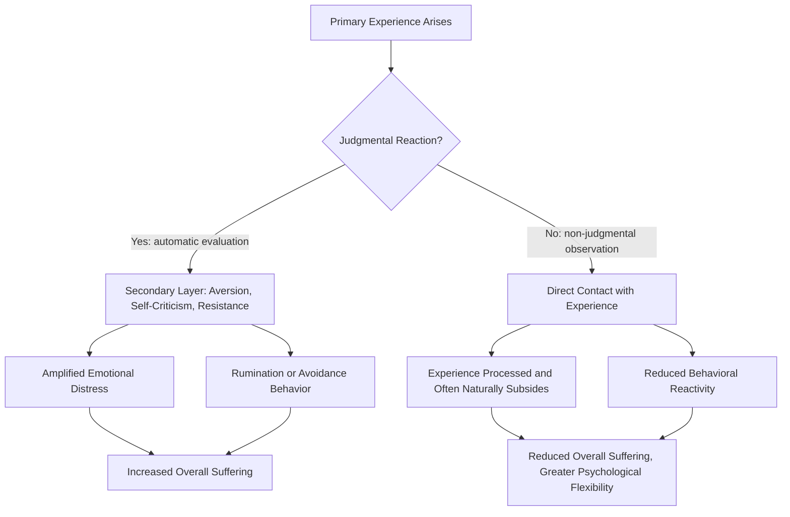

## Non-Judgmental Awareness and Present-Moment Focus

### Definition and Conceptual Overview

Non-judgmental awareness and present-moment focus represent two foundational, interdependent processes that underlie mindfulness, self-compassion, and acceptance-based approaches within positive psychology. While earlier topics in this chapter examined mindfulness, self-compassion, and Acceptance and Commitment Therapy as integrated frameworks, this topic isolates and examines these two specific component processes in greater depth, as they function as the shared mechanistic core running through all three frameworks.

**Key Points**

- **Present-moment focus** refers to the deployment of attention toward current experience — bodily sensations, perceptions, thoughts, and emotions as they occur now — rather than toward rumination about the past or worry/planning about the future.
- **Non-judgmental awareness** refers to observing whatever arises in that present-moment attention without immediately categorizing it as good/bad, evaluating it against a standard, or reacting to suppress or cling to it.
- These two processes are theorized to be mutually reinforcing: sustained present-moment attention creates more opportunities to notice one's own evaluative reactions, while a non-judgmental stance makes it easier to remain attentionally present rather than being pulled away by aversion or craving triggered by evaluation.

### The Distinction Between Attention and Evaluation

A key conceptual clarification in this literature is that non-judgmental awareness does not mean the absence of discernment, values, or the capacity to distinguish helpful from harmful — rather, it refers specifically to a reduction in **automatic, reactive evaluative labeling** of momentary experience.

**Key Points**

- Judgment, in this technical sense, refers to rapid, often unconscious categorization of experience (e.g., "this sensation is bad," "this thought means something is wrong with me") that tends to trigger secondary emotional reactions layered on top of the primary experience itself.
- The theoretical claim is that much psychological suffering arises not purely from primary unpleasant experience itself, but from the secondary layer of resistance, aversion, or self-criticism generated by judging that experience — sometimes summarized in contemplative and clinical literature as the distinction between "pain" (primary, often unavoidable) and "suffering" (secondary, judgment-amplified).
- Reducing automatic judgment is theorized to reduce this secondary amplification layer, allowing primary experiences (including difficult ones) to be processed more directly and often to pass through awareness more quickly than when resisted or elaborated upon.

### Mechanism Diagram: Primary Experience vs. Judgment-Amplified Suffering

### Present-Moment Focus: Attentional Mechanisms

**Sustained Attention**

The capacity to maintain attentional focus on a chosen object (e.g., the breath, bodily sensation, or an ongoing task) without being repeatedly pulled away by unrelated thoughts.

**Attentional Redirection**

The capacity to notice when attention has wandered (often to past- or future-oriented thought) and to gently, without self-criticism, redirect it back to the present-moment object of focus. This redirection skill, rather than the absence of mind-wandering altogether, is generally emphasized in contemplative and clinical mindfulness training as the actual trainable skill — mind-wandering itself is treated as a normal, expected occurrence rather than a failure of practice.

**Key Points**

- Research using experience-sampling methodology (notably work by Killingsworth and Gilbert, "A Wandering Mind Is an Unhappy Mind," 2010) found that people report being on-task/present-focused less than half the time during typical daily activities, and that mind-wandering — regardless of whether its content was pleasant, neutral, or unpleasant — was associated with lower reported happiness than being focused on the current activity. [Inference: this finding is correlational within the sampled moments and does not by itself establish that mind-wandering directly *causes* lower happiness rather than co-occurring with it for other reasons, though the study's within-person sampling design was specifically structured to strengthen this causal inference relative to purely cross-sectional research.]
- This research is frequently cited in positive psychology as empirical support for present-moment focus as a wellbeing-relevant skill independent of its role within formal mindfulness or self-compassion programs specifically.

### Non-Judgmental Awareness: Distinguishing Related Stances

| Stance | Description | Key Distinction |
| --- | --- | --- |
| Non-judgmental awareness | Observing experience without automatic evaluative labeling | Neutral noticing; not suppression, not approval |
| Suppression | Actively pushing away or blocking awareness of an experience | Involves effortful avoidance, not open observation |
| Approval/positive reframing | Actively relabeling an experience as good or beneficial | Still an evaluative stance, just a positive one |
| Resignation/passive acceptance | Giving up on changing a situation, often with an undertone of defeat | Carries negative affective coloring; not neutral or open |
| Rumination | Repetitive, evaluative dwelling on an experience, typically negatively toned | High judgment and repetition; opposite of non-judgmental awareness |

**Key Points**

- Non-judgmental awareness is frequently misunderstood as either emotional flatness/indifference or as a form of passive resignation; contemplative and clinical sources generally clarify that it is instead an active, engaged form of clear observation that remains compatible with subsequently choosing deliberate, values-based action (as emphasized particularly in ACT's committed action process, discussed elsewhere in this chapter).
- This distinction matters clinically: a purely suppressive or falsely positive stance toward difficult experience is generally associated with poorer long-term emotional outcomes in the broader emotion-regulation literature, whereas non-judgmental awareness paired with acceptance is theorized to support healthier processing.

### Neuroscience and Cognitive Correlates

Research using neuroimaging and attention-task paradigms has associated present-moment, non-judgmental attentional training with:

- Reduced activation in regions associated with self-referential, narrative-style processing (particularly regions overlapping with the default mode network) during meditation and some mindfulness tasks, theorized to relate to reduced rumination.
- Improved performance on some sustained-attention and attentional-switching tasks following mindfulness training in several studies.
- Associations with reduced amygdala reactivity to negative emotional stimuli in some studies, theorized to relate to the emotion-regulation benefits associated with non-judgmental awareness training.

[Unverified: as with much contemplative neuroscience research, specific neural findings vary across studies in methodology, sample size, and the type/duration of training examined, and some findings await further replication before being considered fully established.]

### Illustration: The Present-Moment Attention Loop

<svg xmlns="http://www.w3.org/2000/svg" viewBox="0 0 640 320" font-family="Helvetica, Arial, sans-serif">
<text x="320" y="26" font-size="16" font-weight="bold" text-anchor="middle" fill="#1a1a2e">The Present-Moment Attention Loop (svg_diagram)</text>
<circle cx="320" cy="180" r="120" fill="none" stroke="#999" stroke-width="2" stroke-dasharray="5,4" />
<circle cx="320" cy="90" r="45" fill="#bbdefb" />
<text x="320" y="86" font-size="11" font-weight="bold" text-anchor="middle" fill="#0d47a1">Attention on</text>
<text x="320" y="100" font-size="11" font-weight="bold" text-anchor="middle" fill="#0d47a1">Present Object</text>
<circle cx="440" cy="230" r="45" fill="#ffe0b2" />
<text x="440" y="226" font-size="11" font-weight="bold" text-anchor="middle" fill="#e65100">Mind</text>
<text x="440" y="240" font-size="11" font-weight="bold" text-anchor="middle" fill="#e65100">Wanders</text>
<circle cx="200" cy="230" r="45" fill="#c8e6c9" />
<text x="200" y="220" font-size="10" font-weight="bold" text-anchor="middle" fill="#1b5e20">Notice Without</text>
<text x="200" y="234" font-size="10" font-weight="bold" text-anchor="middle" fill="#1b5e20">Self-Judgment</text>
<text x="200" y="248" font-size="10" font-weight="bold" text-anchor="middle" fill="#1b5e20">("mind wandered")</text>
<path d="M 360,120 Q 420,160 435,190" stroke="#555" stroke-width="2" fill="none" marker-end="url(#arrowB)" />
<path d="M 405,225 Q 320,260 240,225" stroke="#555" stroke-width="2" fill="none" marker-end="url(#arrowB)" />
<path d="M 220,195 Q 260,140 290,115" stroke="#555" stroke-width="2" fill="none" marker-end="url(#arrowB)" />
</svg>

### Practical Exercises

**Example: Labeling Practice**

A common introductory technique for building non-judgmental awareness involves silently noting the category of one's present experience with a brief, neutral label — "thinking," "feeling," "sensation," "sound" — as it arises during meditation, rather than engaging with its content or evaluating it. This creates a small attentional distance between the observer and the experience, supporting the "self-as-context" perspective discussed in ACT.

**Example: STOP Practice**

A brief, portable technique used in several mindfulness-based clinical protocols:

- **S**top what you are doing
- **T**ake a breath
- **O**bserve what is happening in your body, emotions, and thoughts, without judgment
- **P**roceed with awareness, choosing a deliberate next action

**Example: RAIN Practice**

A structured practice, associated with teachers including Tara Brach, often used for processing difficult emotions non-judgmentally:

- **R**ecognize what is happening
- **A**llow the experience to be present, without suppressing or fighting it
- **I**nvestigate with gentle curiosity (where is this felt in the body? what does it need?)
- **N**urture with self-compassion (or, in some formulations, "Non-identification" — recognizing the experience as not the totality of who one is)

### Relationship to Other Chapter Constructs

- **Mindfulness (general framework)**: non-judgmental awareness and present-moment focus are, definitionally, the two core components of the Bishop et al. two-component model of mindfulness discussed in this chapter's mindfulness topic; this topic provides a more granular examination of each component individually.
- **Self-compassion**: self-compassion's own "mindfulness" component (as distinct from its self-kindness and common humanity components) draws directly on non-judgmental, present-moment awareness applied specifically to one's own suffering, as discussed in the self-compassion topic.
- **ACT's acceptance and present-moment processes**: two of ACT's six hexaflex processes (acceptance, being present) map closely onto the constructs discussed here, illustrating this topic's role as a shared mechanistic foundation across the chapter's frameworks.

### Limitations and Considerations

- **Difficulty of true "non-evaluation"**: some cognitive scientists and philosophers have questioned whether fully non-evaluative perception is achievable given that human cognition appears to involve rapid, often automatic appraisal processes as a basic feature of perception; most contemplative and clinical accounts respond by framing non-judgmental awareness as a matter of degree and reduced reactivity, rather than the complete elimination of all evaluative processing. [Speculation: the precise theoretical and phenomenological limits of "non-judgment" as a fully achievable state, as opposed to a trainable relative reduction in reactive judgment, remain a matter of philosophical as well as empirical discussion.]
- **Measurement challenges**: because both present-moment focus and non-judgment are internal, subjective processes, most measurement relies on self-report (sometimes supplemented by experience-sampling or behavioral/neuroimaging proxies), introducing the general limitations of self-report methodology discussed elsewhere in this syllabus.
- **Context-appropriateness**: some practical guidance notes that certain contexts (e.g., situations requiring rapid safety-relevant judgment) are not appropriate targets for suspending evaluative processing, reinforcing that non-judgmental awareness is best understood as a trainable disposition for internal experience processing rather than a prescription to eliminate discernment and judgment universally in all contexts.

### Conclusion

Non-judgmental awareness and present-moment focus function as the shared mechanistic core underlying mindfulness, self-compassion, and Acceptance and Commitment Therapy within this chapter, each contributing a distinct but complementary capacity: present-moment focus keeps attention anchored in current experience rather than past rumination or future worry, while non-judgmental awareness reduces the secondary evaluative amplification that is theorized to transform ordinary, often unavoidable primary experience into more persistent psychological suffering. Empirical support, including experience-sampling research linking mind-wandering to reduced happiness, provides converging evidence for present-moment focus's wellbeing relevance independent of any single formal intervention program, positioning these two processes as foundational building blocks that generalize across the chapter's broader frameworks.

**Related Topics**

- Bishop et al.'s two-component model of mindfulness
- Killingsworth and Gilbert's mind-wandering and happiness research (2010)
- The pain-versus-suffering distinction in contemplative and clinical psychology
- RAIN and STOP practices for emotional processing
- Default mode network and self-referential processing in meditation research
- Self-as-context in Acceptance and Commitment Therapy
- Emotion regulation strategies: suppression versus acceptance-based approaches
- Attentional control and sustained-attention training research