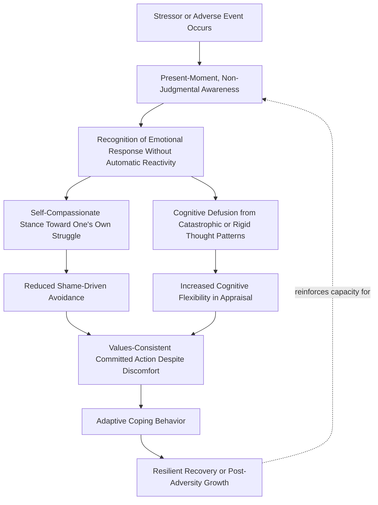

## Integrating Mindfulness with Resilience and Emotion Regulation Practice

### Definition and Conceptual Overview

This topic synthesizes the chapter's preceding constructs — mindfulness, self-compassion, and acceptance-based processes — into an integrated framework specifically oriented toward building resilience and effective emotion regulation. Rather than treating mindfulness as an isolated practice, this integration examines how present-moment, non-judgmental awareness functions as a foundational capacity that supports multiple emotion-regulation strategies and contributes to resilience under adversity.

**Key Points**

- **Resilience**, in this context, refers to the capacity to adapt effectively, recover functioning, and sometimes grow following exposure to adversity, stress, or significant life challenges, rather than the absence of struggle itself.
- **Emotion regulation** refers to the processes by which individuals influence which emotions they have, when they have them, and how they experience and express them — a broad category encompassing many specific strategies, of which mindfulness-based approaches represent one significant subset.
- The integration examined here treats mindfulness not as a single technique but as a **platform capacity** that supports several distinct, evidence-based emotion-regulation strategies, making it a common denominator across multiple resilience-building approaches.

### Mindfulness as a Foundational Capacity for Emotion Regulation

**Key Points**

- James Gross's influential process model of emotion regulation identifies several points in the emotion-generation process where regulation can occur, including situation selection, situation modification, attentional deployment, cognitive change, and response modulation.
- Mindfulness is theorized to intervene primarily at the **attentional deployment** and **cognitive change** stages: by training sustained, flexible attention and by changing one's relationship to thoughts (reducing automatic, literal fusion with them), mindfulness practice supports more deliberate rather than automatic-reactive engagement with the later stages of the emotional response.
- This positions mindfulness as an "upstream" regulatory capacity, distinct from but supportive of more specific "downstream" strategies such as cognitive reappraisal (changing the meaning assigned to a situation) or acceptance (changing one's stance toward an emotional response once it has arisen).

### Integrated Model: From Present-Moment Awareness to Resilient Adaptation

### Distinguishing Complementary Regulatory Strategies

| Strategy | Core Mechanism | Primary Source Framework | Relationship to Mindfulness |
| --- | --- | --- | --- |
| Present-moment attention | Anchoring attention in current experience | Mindfulness (Kabat-Zinn tradition) | Core mindfulness component |
| Cognitive reappraisal | Reinterpreting the meaning of a situation | Cognitive-behavioral emotion regulation research | Complementary; can be supported by mindful noticing of automatic appraisals |
| Cognitive defusion | Observing thoughts as mental events rather than literal truths | Acceptance and Commitment Therapy | Overlaps substantially with mindful observation of thought |
| Self-compassionate response | Kindness and common humanity toward one's own suffering | Self-compassion (Neff) | Incorporates mindfulness as one of its three components |
| Acceptance | Allowing difficult experience without suppression or avoidance | ACT; mindfulness-based approaches broadly | Shared core process across frameworks |
| Expressive suppression (contrast case) | Inhibiting outward emotional expression | General emotion regulation research | Generally considered less adaptive; distinct from mindful acceptance |

[Inference: this table synthesizes converging theoretical positions across several literatures; the precise degree of mechanistic overlap versus distinctiveness between these strategies is an active area of theoretical and empirical work rather than a fully settled taxonomy.]

### Resilience-Specific Applications

**Attentional Flexibility Under Stress**

Mindfulness training is theorized to support resilience partly by improving attentional flexibility — the capacity to disengage attention from threat-related or ruminative content when such engagement is not adaptive, while still maintaining the capacity to attend to genuinely relevant present information. Some research on attentional bias in anxiety and depression has found associations between mindfulness training and reduced attentional bias toward negative or threatening stimuli. [Inference: the specificity and durability of these attentional-bias changes vary across studies and populations.]

**Reduced Rumination and Worry**

Both present-moment focus (reducing engagement with past-oriented rumination) and cognitive defusion (reducing the perceived literal truth-value of worry-generating thoughts) are theorized to interrupt the ruminative and worry cycles that are well-documented risk factors for depression and anxiety, positioning mindfulness-integrated practice as a preventive resilience-building tool as well as a reactive coping strategy.

**Self-Compassion as a Buffer Against Self-Criticism-Driven Distress**

As discussed in the self-compassion topic, harsh self-criticism following setbacks is associated with amplified distress and reduced adaptive coping. Integrating self-compassionate responses into resilience practice is theorized to reduce this self-criticism-driven amplification, supporting more direct engagement with problem-solving and recovery behavior after setbacks.

**Values-Anchored Persistence (ACT Integration)**

Drawing on ACT's committed action process, resilience in this integrated framework is not conceptualized as the absence of continued distress, but as the capacity to continue moving in valued life directions even while difficult emotions persist — reframing resilience away from a purely affect-based definition ("bouncing back to feeling good") toward a behavior-based definition ("continuing to act meaningfully despite difficulty").

### Illustration: Layered Model of Integrated Practice

<svg xmlns="http://www.w3.org/2000/svg" viewBox="0 0 640 380" font-family="Helvetica, Arial, sans-serif">
<text x="320" y="26" font-size="16" font-weight="bold" text-anchor="middle" fill="#1a1a2e">Layered Model: From Awareness to Resilient Action (svg_diagram)</text>
<rect x="70" y="55" width="500" height="60" rx="8" fill="#bbdefb" opacity="0.85" />
<text x="320" y="80" font-size="13" font-weight="bold" text-anchor="middle" fill="#0d47a1">Layer 1: Present-Moment, Non-Judgmental Awareness</text>
<text x="320" y="100" font-size="10" text-anchor="middle" fill="#0d47a1">Foundational attentional and observational capacity</text>
<rect x="70" y="130" width="500" height="60" rx="8" fill="#c8e6c9" opacity="0.85" />
<text x="320" y="155" font-size="13" font-weight="bold" text-anchor="middle" fill="#1b5e20">Layer 2: Self-Compassionate, Defused Relationship to Difficulty</text>
<text x="320" y="175" font-size="10" text-anchor="middle" fill="#1b5e20">Kindness toward self; thoughts held as mental events, not commands</text>
<rect x="70" y="205" width="500" height="60" rx="8" fill="#ffe0b2" opacity="0.85" />
<text x="320" y="230" font-size="13" font-weight="bold" text-anchor="middle" fill="#e65100">Layer 3: Cognitive and Emotional Flexibility</text>
<text x="320" y="250" font-size="10" text-anchor="middle" fill="#e65100">Adaptive appraisal; reduced rumination and reactive avoidance</text>
<rect x="70" y="280" width="500" height="60" rx="8" fill="#f8bbd0" opacity="0.85" />
<text x="320" y="305" font-size="13" font-weight="bold" text-anchor="middle" fill="#880e4f">Layer 4: Values-Consistent Committed Action</text>
<text x="320" y="325" font-size="10" text-anchor="middle" fill="#880e4f">Resilient behavior despite ongoing discomfort</text>
</svg>

### Empirical Support for Integrated Approaches

**Key Points**

- Mindfulness-Based Cognitive Therapy (MBCT), discussed in this chapter's mindfulness topic, exemplifies formal integration, combining mindfulness training directly with cognitive-therapy elements to target the rumination patterns implicated in depressive relapse.
- Some resilience-training programs (used in military, first-responder, healthcare, and general workplace contexts) explicitly combine mindfulness training, self-compassion elements, and cognitive-flexibility exercises into multi-component curricula, based on the theoretical rationale that these processes are complementary rather than redundant. [Inference: the comparative effectiveness of integrated multi-component programs versus single-component interventions (mindfulness alone, self-compassion alone) has not been extensively isolated in head-to-head trial designs, so the added value of integration itself, versus any one component delivered thoroughly, remains only partially established empirically.]
- Longitudinal research on post-traumatic growth has found some associations between mindfulness/acceptance-related coping styles and the capacity to find meaning and growth following significant adversity, though [Speculation: causal mechanisms connecting specific mindfulness-integrated practices to long-term post-traumatic growth outcomes, as opposed to correlational co-occurrence with generally adaptive coping styles, remain an area requiring further longitudinal and experimental clarification].

### Practical Integration Example

**Example: A Combined Response Sequence**

Consider an individual who receives unexpected critical feedback at work. An integrated mindfulness-resilience response might proceed as follows:

1. **Present-moment awareness**: noticing the immediate physical tightness and emotional sting of the feedback as it arises, rather than immediately reacting or suppressing it.
2. **Non-judgmental observation**: recognizing "I am having a strong reaction" as a factual observation, rather than immediately concluding "I am incompetent" as a literal truth.
3. **Cognitive defusion**: holding the thought "I always mess things up" as "I am having the thought that I always mess things up" — creating distance from its literal content.
4. **Self-compassion**: acknowledging that receiving critical feedback is a universally difficult, common human experience, and offering oneself understanding rather than harsh self-judgment.
5. **Values-connection and committed action**: identifying that one's underlying value is professional growth and contribution, and choosing a concrete next step (e.g., asking a clarifying follow-up question, revising the work) rather than either defensive dismissal or avoidant withdrawal.

This sequence illustrates how the chapter's separate constructs function jointly, in practice, as a single integrated resilience-supporting response chain rather than as isolated techniques applied independently.

### Limitations and Considerations

- **Risk of technique proliferation without depth**: some clinical and applied commentators caution that combining many techniques (mindfulness, self-compassion, defusion, values work) into brief programs risks superficial exposure to each without sufficient depth of practice in any single component, potentially diluting effectiveness compared to more focused, deeper training in fewer techniques. [Speculation: the optimal balance between breadth of integration and depth of practice in any given component has not been definitively established and likely varies by population, context, and available training time.]
- **Individual variation in component responsiveness**: not all individuals respond equally well to all components; some may find certain elements (e.g., self-compassion language) less resonant or even initially uncomfortable, while responding well to others (e.g., values clarification), suggesting integrated programs may benefit from some degree of individualized emphasis rather than uniform delivery. [Inference: this is a reasonable extrapolation from general individual-differences findings across the mindfulness, self-compassion, and ACT literatures reviewed separately in this chapter, though direct research on optimal individualized component-weighting within integrated resilience programs is limited.]
- **Distinguishing genuine integration from generic wellness branding**: as multi-component mindfulness/resilience programs have proliferated commercially, particularly in workplace wellness contexts, the rigor and evidence base of specific branded programs vary considerably, and not all programs marketed as "integrating mindfulness and resilience" have been subjected to controlled evaluation comparable to the more established research-derived protocols (MBSR, MBCT, MSC, ACT) discussed throughout this chapter.

### Conclusion

Integrating mindfulness with resilience and emotion regulation practice treats present-moment, non-judgmental awareness not as an isolated technique but as a foundational platform capacity that supports and amplifies complementary processes: self-compassionate response to setbacks, cognitive defusion from rigid or catastrophic thinking, and values-anchored committed action even amid ongoing discomfort. This integrated framing reflects a broader definitional shift in resilience research away from viewing resilience purely as the absence or quick resolution of distress, toward viewing it as the sustained capacity for adaptive, meaningful action in the presence of difficulty — a synthesis that draws together this chapter's mindfulness, self-compassion, and acceptance-based frameworks into a coherent, mutually reinforcing model of psychological adaptation.

**Related Topics**

- James Gross's process model of emotion regulation
- Attentional bias modification research in anxiety and depression
- Post-traumatic growth and its relationship to acceptance-based coping
- Multi-component resilience training programs (military, healthcare, workplace contexts)
- Rumination and worry as transdiagnostic risk factors
- Cognitive reappraisal as a complementary emotion-regulation strategy
- Mindfulness-Based Cognitive Therapy as a formal integration model
- Behavioral versus affect-based definitions of resilience