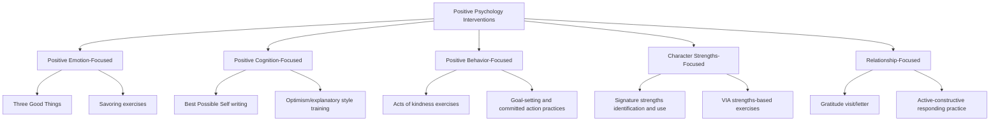

## Defining and Classifying Positive Psychology Interventions

### Definition and Conceptual Overview

Positive Psychology Interventions (PPIs) are a formally defined category of structured activities, exercises, or programs designed to cultivate positive feelings, positive cognitions, or positive behaviors, with the explicit goal of increasing wellbeing rather than primarily treating psychopathology. The term and its formal definition are most closely associated with Sonja Lyubomirsky and Kennon Sheldon, and with subsequent systematizing work by researchers including Nancy Sin, Acacia Parks, and Stephen Schueller.

**Key Points**

- A widely cited definition (Sin and Lyubomirsky, 2009) characterizes PPIs as treatment methods or intentional activities aimed at cultivating positive feelings, behaviors, or cognitions, distinguishing them from broader "positive psychology" as a research field by their specific, actionable, and typically manualized structure.
- PPIs are distinguished from general psychotherapy by their **targeted, often brief, and replicable structure**: most PPIs are designed to be delivered as discrete, standardized exercises (e.g., a specific written or behavioral task) rather than as an extended, individualized therapeutic relationship.
- Many PPIs discussed elsewhere in this syllabus — including gratitude journaling, the Three Good Things exercise, the gratitude visit, Best Possible Self writing, and savoring exercises — are formally classified as PPIs within this taxonomy.

### Distinguishing PPIs from Related Categories

| Category | Core Focus | Key Distinction from PPIs |
| --- | --- | --- |
| Positive Psychology Interventions (PPIs) | Structured exercises targeting positive feelings/cognitions/behaviors | Explicitly wellbeing-building focus; typically brief and manualized |
| Traditional psychotherapy (e.g., CBT for depression) | Symptom reduction and treatment of diagnosed disorder | Primarily deficit/pathology-focused, though not exclusively |
| General self-help practices | Broad, often non-empirically-validated wellbeing advice | PPIs specifically require empirical testing to qualify under the formal definition |
| Positive psychology (the field) | The broader scientific study of flourishing, strengths, and wellbeing | PPIs are a specific, applied subset within this broader field |
| Wellness/lifestyle interventions (e.g., general exercise programs) | Broad physical/lifestyle health promotion | PPIs specifically target psychological/cognitive/emotional mechanisms |

**Key Points**

- Not all wellbeing-related activities qualify as PPIs under the formal research definition; the term specifically implies a testable, often randomized-controlled-trial-validated intervention with a defined protocol, rather than any generally positive lifestyle habit.
- Some PPIs have clinical applications (e.g., as adjuncts within positive psychotherapy protocols for depression), while others are designed and studied purely for wellbeing enhancement in non-clinical populations — this dual applicability is itself a notable classificatory feature of the category.

### Classification Framework: Target Mechanism

One common classificatory approach organizes PPIs according to which psychological mechanism or "target" they are primarily designed to influence:

**Key Points**

- This target-mechanism classification is descriptive rather than mutually exclusive: many PPIs plausibly influence more than one target simultaneously (for example, gratitude journaling arguably involves both positive emotion and positive cognition components).
- [Inference: while this classification is widely used for organizational and pedagogical purposes across the literature, different researchers have proposed somewhat different category boundaries and labels, so this framework should be understood as one common organizing schema rather than a single universally standardized taxonomy.]

### Classification Framework: Delivery Format

A second common classificatory dimension concerns how PPIs are delivered:

| Delivery Format | Description | Example |
| --- | --- | --- |
| Self-administered/self-help | Completed independently, often via written instructions or an app | Solo gratitude journaling |
| Group-based | Delivered to multiple participants simultaneously, often with facilitator guidance | MBSR-style 8-week group programs |
| Individually coached/therapist-delivered | Delivered one-on-one, often within positive psychotherapy or coaching | Individualized strengths-based coaching sessions |
| Digital/app-based | Delivered via smartphone application or online platform | Commercial gratitude or wellbeing tracking apps |
| Organizational/institutional | Embedded into workplace, school, or community program structures | Workplace gratitude or recognition programs |

[Inference: delivery format and evidentiary rigor are not strictly correlated — some digital/app-based PPIs have been subjected to controlled trials, while others have not, so delivery format alone should not be used as a proxy for empirical validation status.]

### Classification Framework: Duration and Dosage

**Key Points**

- **Single-administration PPIs**: completed once, typically producing an immediate but sometimes less durable effect (e.g., the gratitude visit, discussed in the Gratitude chapter, is a prototypical example).
- **Short-term repeated PPIs**: completed over a bounded period, typically one to several weeks (e.g., a week of nightly Three Good Things entries, as in the original validation study).
- **Ongoing/habitual PPIs**: intended for indefinite, sustained practice as an integrated life habit (e.g., long-term gratitude journaling, ongoing mindfulness meditation practice).

This dosage dimension is theoretically significant because, as discussed in earlier chapter topics, single-administration interventions and repeated-practice interventions appear to show different patterns of immediate effect size versus durability, making duration/dosage a practically important classificatory variable alongside target mechanism and delivery format.

### The Person-Activity Fit Model

A particularly influential integrative framework, proposed by Sonja Lyubomirsky and Kennon Sheldon, argues that a PPI's effectiveness for a given individual depends substantially on **person-activity fit** — the degree of match between the specific intervention and the individual's personality, values, interests, motivation, and life circumstances, rather than any single PPI being uniformly optimal for all people.

**Key Points**

- This model helps explain heterogeneous effect sizes commonly found across PPI studies: an intervention that is highly effective for one subgroup (e.g., individuals who value verbal expression, for whom gratitude letter-writing might resonate strongly) may be less effective for another subgroup (e.g., individuals who might respond better to behavior-focused acts-of-kindness exercises).
- Proposed fit factors include: the degree to which the activity aligns with the person's natural interests and values; whether the person can sustain effort in delivering the intervention consistently; and cultural or social appropriateness of the specific activity for the individual's context.
- This model has practical implications for classification: rather than seeking a single "best" PPI, applied practice increasingly emphasizes matching specific PPI types to individual characteristics, an approach sometimes termed "personalized positive psychology" or "precision" wellbeing intervention.

### Illustration: The Person-Activity Fit Model

<svg xmlns="http://www.w3.org/2000/svg" viewBox="0 0 640 320" font-family="Helvetica, Arial, sans-serif">
<text x="320" y="26" font-size="16" font-weight="bold" text-anchor="middle" fill="#1a1a2e">Person-Activity Fit Model (svg_diagram)</text>
<circle cx="220" cy="180" r="110" fill="#bbdefb" opacity="0.6" />
<text x="220" y="150" font-size="13" font-weight="bold" text-anchor="middle" fill="#0d47a1">Person Characteristics</text>
<text x="220" y="170" font-size="10" text-anchor="middle" fill="#0d47a1">Personality, values,</text>
<text x="220" y="183" font-size="10" text-anchor="middle" fill="#0d47a1">interests, motivation,</text>
<text x="220" y="196" font-size="10" text-anchor="middle" fill="#0d47a1">life circumstances</text>
<circle cx="420" cy="180" r="110" fill="#c8e6c9" opacity="0.6" />
<text x="420" y="150" font-size="13" font-weight="bold" text-anchor="middle" fill="#1b5e20">Activity Characteristics</text>
<text x="420" y="170" font-size="10" text-anchor="middle" fill="#1b5e20">Target mechanism,</text>
<text x="420" y="183" font-size="10" text-anchor="middle" fill="#1b5e20">format, effort required,</text>
<text x="420" y="196" font-size="10" text-anchor="middle" fill="#1b5e20">social/cultural context</text>
<ellipse cx="320" cy="180" rx="55" ry="90" fill="#fff9c4" opacity="0.85" />
<text x="320" y="175" font-size="12" font-weight="bold" text-anchor="middle" fill="#795548">Optimal</text>
<text x="320" y="190" font-size="12" font-weight="bold" text-anchor="middle" fill="#795548">Fit Zone</text>
</svg>

### Empirical Meta-Analytic Findings on PPIs as a Category

**Key Points**

- Sin and Lyubomirsky's 2009 meta-analysis, one of the foundational quantitative reviews of PPIs as a category, found a small-to-moderate overall effect on increasing wellbeing and decreasing depressive symptoms across the studies reviewed.
- Subsequent, larger meta-analyses (e.g., Bolier and colleagues, 2013, and later updated reviews) have generally confirmed small-to-moderate overall effects, while also identifying substantial heterogeneity across individual studies attributable to intervention type, population, duration, and methodological quality.
- Moderator analyses across this meta-analytic literature have identified several factors associated with larger effects, including: individually delivered (versus purely self-help) formats in some analyses, longer intervention duration, and participant self-selection/motivation to engage in the specific exercise (consistent with the person-activity fit model).

[Inference: as with the individual intervention literatures reviewed elsewhere in this syllabus, meta-analytic effect size estimates for PPIs as a category are subject to standard methodological caveats, including publication bias and variable study quality, and should be interpreted as general directional evidence rather than precise, fixed population parameters.]

### Methodological Standards for Classifying a Practice as an Evidence-Based PPI

**Key Points**

- Researchers in this area generally emphasize several criteria before classifying an activity as an empirically validated PPI: a clearly defined, replicable protocol; testing against an appropriate control condition (not merely pre-post comparison without a comparator); and, ideally, replication across more than one independent study or research group.
- This has produced an important distinction in the field between **empirically validated PPIs** (meeting the above criteria, such as Three Good Things, the gratitude visit, and Best Possible Self writing) and the much larger universe of popular wellbeing practices marketed as "positive psychology" that have not been subjected to comparable controlled testing.
- [Inference: the boundary between rigorously validated and loosely evidence-informed practices is not always clearly communicated in popular and commercial wellbeing contexts, making this a practically important distinction for consumers and practitioners evaluating specific claims.]

### Limitations and Considerations

- **Category boundary ambiguity**: because the formal definition of a PPI (intentional activity to cultivate positive feelings, cognitions, or behaviors) is broad, there is some inherent ambiguity and disagreement in the literature about precisely which practices should or should not be classified under this umbrella, particularly at the boundaries with general psychotherapy, self-help, and lifestyle medicine.
- **Heterogeneity limiting broad generalizations**: the substantial heterogeneity found across PPI meta-analyses means that broad statements like "positive psychology interventions work" require significant qualification regarding which specific intervention, delivered to which population, for how long, and via what format.
- **Overrepresentation of certain populations in the evidence base**: as noted in earlier chapter topics regarding gratitude research specifically, the broader PPI evidence base shares a general overrepresentation of WEIRD (Western, educated, industrialized, rich, democratic) samples, limiting confidence in the universal cross-cultural applicability of specific classificatory and effectiveness claims.

### Conclusion

Positive Psychology Interventions constitute a formally defined, empirically testable category of structured activities aimed at cultivating positive feelings, cognitions, or behaviors, distinguished from broader self-help and general psychotherapy by their manualized, replicable structure and requirement for controlled empirical validation. Multiple complementary classification frameworks — by target mechanism, delivery format, and duration/dosage — help organize the diverse landscape of specific PPIs covered throughout this syllabus, while the person-activity fit model provides an important integrative lens explaining why intervention effectiveness varies meaningfully across individuals rather than following a uniform "one-size-fits-all" pattern. Meta-analytic evidence generally supports small-to-moderate overall benefits for this intervention category, tempered by substantial heterogeneity and the standard methodological caveats that apply broadly across positive psychology's intervention research.

**Related Topics**

- Sin and Lyubomirsky's (2009) foundational PPI meta-analysis
- The Person-Activity Fit Model (Lyubomirsky and Sheldon)
- Positive psychotherapy as a clinical application of PPIs
- Randomized controlled trial methodology in wellbeing intervention research
- Digital and app-based delivery of positive psychology interventions
- WEIRD sample limitations in positive psychology research
- Specific PPI protocols: Three Good Things, gratitude visit, Best Possible Self
- Precision/personalized approaches to wellbeing intervention design