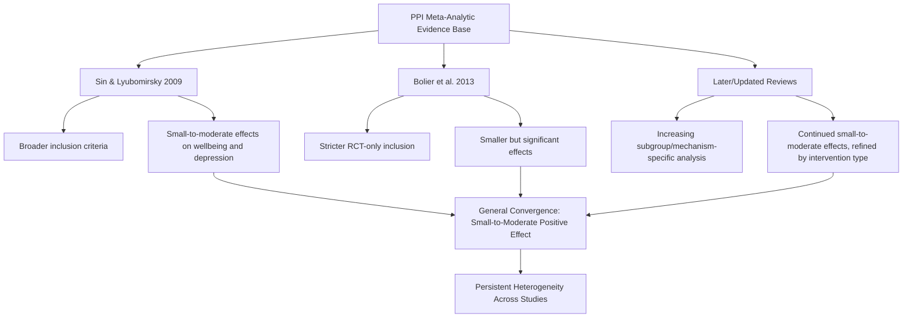

## The Evidence Base and Meta-Analyses of Intervention Effectiveness

### Definition and Conceptual Overview

This topic provides a systematic examination of the meta-analytic and systematic-review literature evaluating Positive Psychology Interventions (PPIs) as an aggregate category, extending the classification framework established in the preceding topic into a focused review of what the accumulated quantitative evidence actually shows, how that evidence has been synthesized, and what methodological considerations bear on interpreting it.

**Key Points**

- Meta-analysis is a statistical technique for combining results across multiple independent studies to produce a pooled estimate of effect size, along with an assessment of heterogeneity (the degree to which individual study results vary beyond what would be expected from sampling error alone).
- The PPI literature has been subject to several major meta-analyses spanning roughly 2009 to the present, allowing for some assessment of how the evidence base has evolved as the volume and methodological rigor of primary studies has grown.
- Meta-analytic effect sizes in this literature are most commonly reported using Cohen's d or Hedges' g (standardized mean difference measures), interpreted conventionally as small (~0.2), medium (~0.5), or large (~0.8), though these thresholds are heuristic conventions rather than fixed, universally agreed-upon boundaries.

### Foundational Meta-Analyses

**Sin and Lyubomirsky (2009)**

This is widely regarded as the foundational quantitative synthesis of the PPI literature, reviewing a broad set of intervention studies published up to that point. The analysis found:

- A small-to-moderate overall effect on enhancing wellbeing (weighted mean effect size in the small-to-moderate range)
- A small-to-moderate overall effect on reducing depressive symptoms
- Effects moderated by factors including participant age, self-selection into the intervention, and intervention duration, with longer interventions and self-selected (voluntary, motivated) participants generally showing stronger effects

**Bolier, Haverman, Westerhof, Riper, Smit, and Bohlmeijer (2013)**

A subsequent, methodologically expanded meta-analysis using stricter inclusion criteria (focusing specifically on randomized controlled trials) found:

- Small but statistically significant effects on subjective wellbeing, psychological wellbeing, and depression
- Effects that were generally more modest than some earlier, less methodologically restrictive reviews had suggested, reflecting the tightening effect of stricter inclusion criteria
- Continued substantial heterogeneity across included studies

**Subsequent and Updated Reviews**

Later systematic reviews and meta-analyses (including work examining specific PPI subtypes, digital delivery formats, and clinical versus non-clinical populations) have generally continued to find small-to-moderate effects, with increasing scholarly attention to disaggregating the broad PPI category into more specific, mechanism-defined subgroups rather than treating "PPIs" as a single homogeneous intervention class. [Inference: this disaggregation trend reflects a broader methodological maturation in the field, as researchers have increasingly recognized that pooling highly heterogeneous intervention types into a single aggregate effect size can obscure meaningful differences between, for example, gratitude-focused and strengths-focused interventions.]

### Effect Size Comparison Across Selected Meta-Analyses

### Key Moderators Identified Across the Meta-Analytic Literature

| Moderator | General Pattern Found | Theoretical Interpretation |
| --- | --- | --- |
| Intervention duration | Longer interventions generally show larger effects than very brief, single-session ones | Sustained practice may be needed to build durable habit and skill |
| Participant self-selection | Voluntary, motivated participants show larger effects than assigned/mandatory participants | Consistent with self-determination theory and person-activity fit |
| Delivery format | Individually delivered interventions sometimes show larger effects than pure self-help formats in some analyses | Possible role of accountability, personalization, or social support |
| Population (clinical vs. non-clinical) | Mixed findings; some studies show larger relative gains in clinical/distressed populations, others show ceiling effects limiting further gains | Baseline distress level may create more "room" for measurable improvement in some outcomes |
| Study design rigor | Effects generally smaller in more methodologically rigorous designs (e.g., active control conditions vs. no-treatment controls) | Consistent with the general pattern that more rigorous designs reduce inflated effect estimates |

[Inference: the direction and consistency of moderator effects vary somewhat across specific meta-analyses depending on inclusion criteria and analytic approach, so this table represents a general synthesis of commonly reported patterns rather than a single definitive, uncontested set of findings.]

### Methodological Considerations in Interpreting This Evidence Base

**Control Condition Quality**

A recurring methodological concern across this literature is the type of control condition used for comparison. Studies comparing a PPI against a no-treatment or waitlist control condition tend to show larger effects than studies comparing the same PPI against an active control condition (e.g., a neutral writing task matched for time and attention), because active controls account for non-specific factors like attention, expectation, and simply engaging in a structured activity.

**Publication Bias**

As is a general concern across most psychological intervention literatures, published PPI studies may disproportionately represent positive findings, since studies finding null or negative effects are statistically less likely to be published (a pattern termed publication bias or the "file drawer problem"). Meta-analytic techniques such as funnel plot analysis and trim-and-fill procedures attempt to detect and statistically correct for this bias, though such corrections cannot fully eliminate the underlying uncertainty this introduces. [Inference: the degree to which publication bias has meaningfully inflated the PPI literature's apparent effect sizes has been investigated in some analyses but is not fully and precisely quantifiable with complete confidence.]

**Outcome Measurement Heterogeneity**

Included studies use a wide range of specific outcome measures (different wellbeing scales, different depression inventories, different follow-up timepoints), which introduces measurement heterogeneity that complicates direct effect-size aggregation and comparison across studies, even within meta-analyses using standardized effect-size conversion procedures.

**Short Follow-Up Periods**

A substantial portion of the PPI literature includes relatively short follow-up periods (often weeks to a few months post-intervention), limiting confident conclusions about the long-term durability of intervention effects; longer-term follow-up studies are comparatively less numerous across this evidence base.

### Illustration: Sources of Effect Size Attenuation

<svg xmlns="http://www.w3.org/2000/svg" viewBox="0 0 640 340" font-family="Helvetica, Arial, sans-serif">
<text x="320" y="26" font-size="15" font-weight="bold" text-anchor="middle" fill="#1a1a2e">Sources of Effect Size Attenuation in Rigorous Designs (svg_diagram)</text>
<rect x="60" y="55" width="230" height="230" rx="8" fill="#ffcdd2" opacity="0.7" />
<text x="175" y="80" font-size="12" font-weight="bold" text-anchor="middle" fill="#b71c1c">Less Rigorous Design</text>
<text x="175" y="105" font-size="10" text-anchor="middle" fill="#b71c1c">No-treatment/waitlist control</text>
<text x="175" y="125" font-size="10" text-anchor="middle" fill="#b71c1c">Short follow-up only</text>
<text x="175" y="145" font-size="10" text-anchor="middle" fill="#b71c1c">Non-blinded self-report</text>
<text x="175" y="165" font-size="10" text-anchor="middle" fill="#b71c1c">Self-selected participants</text>
<rect x="90" y="190" width="170" height="70" fill="#b71c1c" opacity="0.85" rx="5" />
<text x="175" y="230" font-size="14" font-weight="bold" text-anchor="middle" fill="white">Larger Apparent Effect</text>
<rect x="350" y="55" width="230" height="230" rx="8" fill="#c8e6c9" opacity="0.7" />
<text x="465" y="80" font-size="12" font-weight="bold" text-anchor="middle" fill="#1b5e20">More Rigorous Design</text>
<text x="465" y="105" font-size="10" text-anchor="middle" fill="#1b5e20">Active/matched control condition</text>
<text x="465" y="125" font-size="10" text-anchor="middle" fill="#1b5e20">Longer follow-up included</text>
<text x="465" y="145" font-size="10" text-anchor="middle" fill="#1b5e20">Multiple outcome measures</text>
<text x="465" y="165" font-size="10" text-anchor="middle" fill="#1b5e20">Randomized assignment</text>
<rect x="380" y="190" width="170" height="70" fill="#1b5e20" opacity="0.85" rx="5" />
<text x="465" y="230" font-size="14" font-weight="bold" text-anchor="middle" fill="white">Smaller but More Reliable Effect</text>
</svg>

### Comparative Effectiveness Across PPI Subtypes

Some more recent meta-analytic and systematic-review work has attempted to disaggregate overall PPI effects by intervention subtype:

- Gratitude-focused interventions and strengths-based interventions (e.g., signature strengths use) have generally shown effect sizes broadly consistent with the aggregate PPI literature, though direct head-to-head comparative meta-analyses across subtypes are less numerous than within-subtype reviews.
- Multi-component interventions (combining several PPI elements, such as positive psychotherapy protocols) have in some reviews shown somewhat larger aggregate effects than single-component interventions, though this comparison is complicated by multi-component interventions typically also involving longer overall duration and more contact time. [Inference: it is difficult to fully disentangle whether larger effects for multi-component interventions reflect genuine synergy between components, or simply reflect the confound of greater overall dosage/duration.]
- Digital/app-based PPI delivery has been reviewed in several more recent meta-analyses, generally finding smaller effects than in-person or individually coached delivery formats, though evidence quality and specific app design vary considerably across this rapidly evolving delivery category. [Unverified: given the pace of change in digital wellbeing app design and delivery, meta-analytic findings on this specific delivery format risk becoming outdated more quickly than findings on more stable, traditional delivery formats.]

### Clinical vs. Non-Clinical Population Findings

**Key Points**

- In non-clinical (general community or student) populations, PPIs are most consistently studied and validated as wellbeing-enhancement tools, with effects generally interpreted relative to already-functioning baseline wellbeing.
- In clinical populations (e.g., individuals with diagnosed depression or anxiety), PPIs have most often been studied as **adjunctive** interventions alongside standard treatment (such as medication or established psychotherapy) rather than as standalone primary treatments, and meta-analyses in these populations generally support this adjunctive framing rather than establishing PPIs as substitutes for evidence-based clinical care. [Inference: this adjunctive-only framing reflects the current state of the evidence rather than a categorical claim that PPIs could never show standalone clinical efficacy; the evidence for standalone use in significant clinical populations is comparatively less developed than for adjunctive use.]

### Limitations and Considerations

- **Heterogeneity as an interpretive challenge**: the substantial and persistent heterogeneity found across nearly every major meta-analysis in this literature means that single pooled effect-size estimates, while useful for general orientation, can mask considerable variation in what actually works, for whom, and under what conditions — reinforcing the practical relevance of the person-activity fit model and mechanism-specific subgroup analyses discussed in this chapter.
- **Evolving methodological standards**: because meta-analytic inclusion criteria and statistical correction techniques have become more rigorous over time, direct comparison of effect sizes across meta-analyses published years apart requires care, as apparent declines in effect size across time may partly reflect improving methodological standards rather than a real decline in intervention effectiveness.
- **Cultural and demographic generalizability**: as with other topics in this syllabus, the PPI meta-analytic evidence base remains weighted toward WEIRD populations, and meta-analyses generally cannot fully compensate for this underlying sampling limitation in the primary literature they synthesize.

### Conclusion

The accumulated meta-analytic evidence base for Positive Psychology Interventions, spanning foundational work by Sin and Lyubomirsky through more methodologically stringent later reviews, generally converges on small-to-moderate positive effects on wellbeing and, to a somewhat lesser degree, depressive symptoms, with these pooled effects consistently qualified by substantial heterogeneity and sensitivity to methodological factors including control-condition quality, participant self-selection, and intervention duration. Rather than supporting a simple, uniform claim that "positive psychology interventions work," this evidence base is best interpreted as showing a real but modest and highly conditional average benefit — one whose practical significance depends heavily on matching specific, well-validated intervention types to appropriate populations, delivery formats, and durations, consistent with the person-activity fit and classification frameworks introduced earlier in this chapter.

**Related Topics**

- Sin and Lyubomirsky (2009) and Bolier et al. (2013) meta-analyses in detail
- Publication bias and the file-drawer problem in psychological research
- Active versus passive/waitlist control condition design
- Person-Activity Fit Model and individual-differences moderators
- Positive psychotherapy as a multi-component clinical PPI application
- Digital and app-based wellbeing intervention evaluation research
- Long-term follow-up study design in intervention research
- WEIRD sample limitations across positive psychology's evidence base